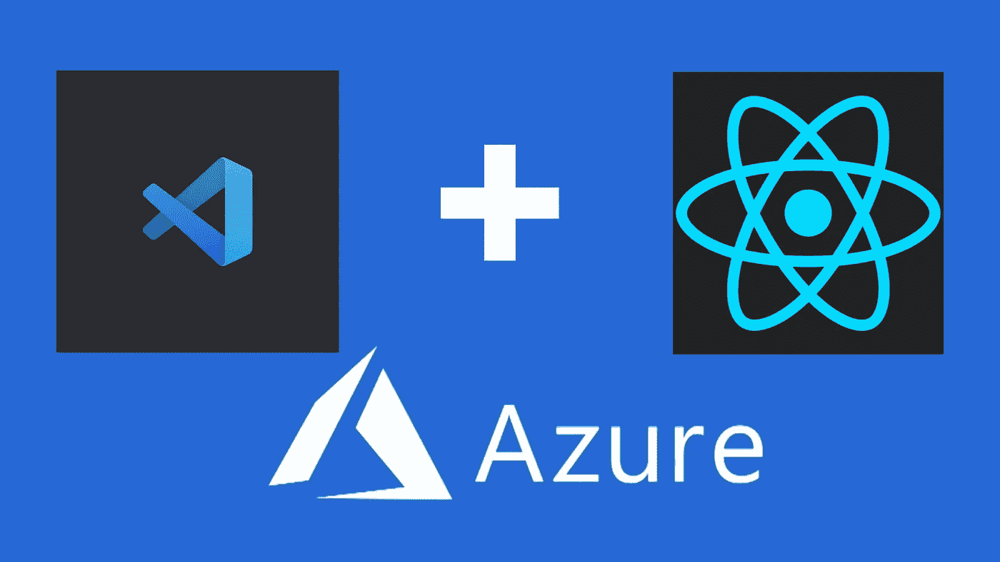

# 托管 React 应用的最简单方式(Azure + VS 代码)

> 原文：<https://medium.com/geekculture/easiest-way-to-host-your-react-app-azure-vs-code-8046f9f7fb0b?source=collection_archive---------0----------------------->

## 初学者一步一步来

这是获得 Azure 部署实践经验的最简单方法之一。通过阅读这篇文章，你可以学习使用 VS 代码在 Azure 上托管一个 React 网站。

> 如果你愿意支持我成为一名作家，考虑注册[成为一名媒体成员](https://freelancingcult.medium.com/membership)。这样我就可以花…