# 无需编码即可轻松跟踪摄像机

> 原文：<https://medium.com/geekculture/easy-camera-follow-without-coding-15b4adb8d519?source=collection_archive---------24----------------------->

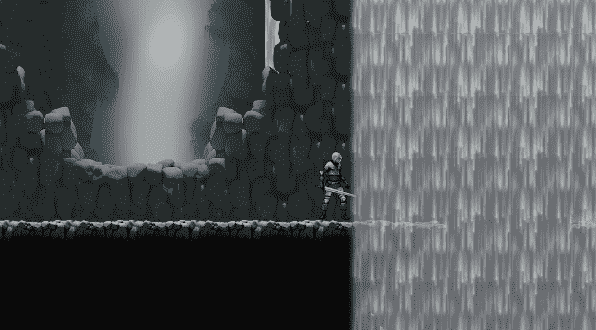

**目标**:使用虚拟摄像机轻松跟踪玩家

几周前，我发表了一篇关于**相机跟随**逻辑的教程，它应该类似于《超级马里奥》系列中的一个:不仅仅是简单的锁定目标，而是更复杂的行为，即只有当角色超过一些阈值时，相机才会跟随角色。

如果你对这种“低级”编码感兴趣，你可以在这里找到它**。**

**正如在研究一个主题时经常发生的那样，时间会让事情在你的脑海中沉淀和重新安排得更好:使用 **Cinemachine** 软件包也可以获得同样的结果。**

**让我们修改所有的步骤。首先，安装软件包。**

**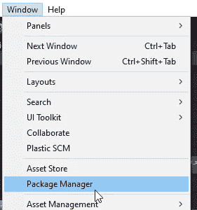****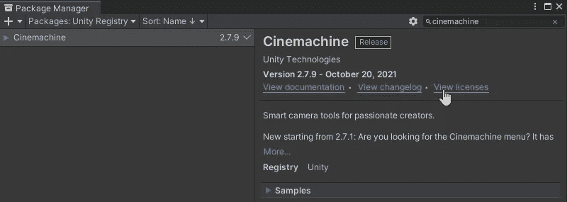**

**一旦完成，我们就可以创建 cinemachine 对象。让我们创建一个**虚拟**摄像机( **VC** )。**

**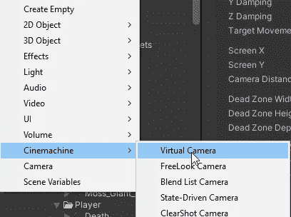**

**第一个虚拟摄像头的创建将为我们的主摄像头提供一个 **Cinemachine Brain** 组件:通过这种方式，它将遵循我们可以用 VCs 设置的复杂行为。**

**我们现在在 VC 中唯一需要的是 **Follow** 属性，我们将用 player transform 或任何其他我们想要跟随的对象填充它。**

**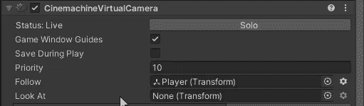**

**我们现在在跟随方面有许多可能性，但是为了创建与前一个教程相同的行为，我们必须在主体部分选择“**框架转置器**”。**

****

**这将打开一个有趣的部分，充满了选择。其中一些我们已经在其他教程中找到并讨论过:区域。**

**在继续之前，我们先来看看游戏视图。那些彩色区域是**区**。**

**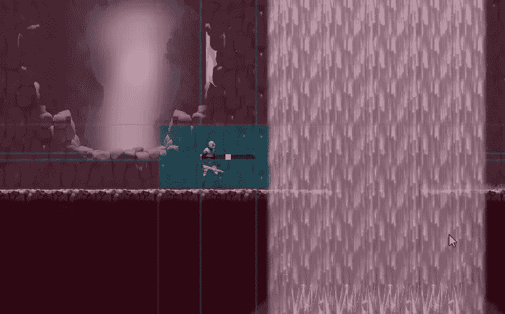**

## **死区**

****死区**是屏幕中间的无色区域，也就是黄色方块(目标)所在的位置。这是一个区域，如果您移动目标对象，相机将不会跟随它。我选择了一个相当窄的区域(这只是我的口味)，高度非常小。我还应用了一点 x 偏移来使角色不在正中央。**

**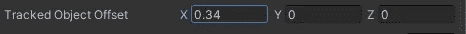****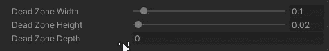**

**当黄色方块停留在死区时，不执行跟随。**

**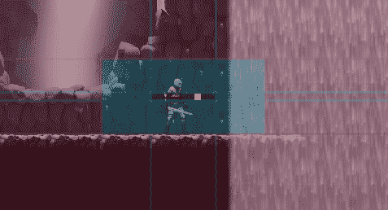**

## **软区**

****软区**是蓝色的。当被跟踪的对象到达它时，VC 开始平滑跟随，这意味着会有一种延迟，并且相机没有锁定目标:当你停止移动时，VC 会花时间将黄色方块再次带到死区。**

**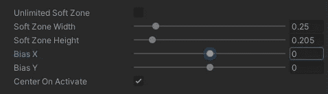****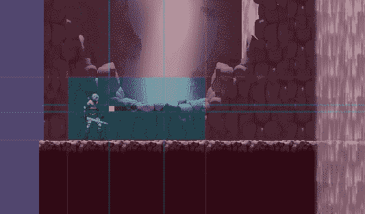**

**您甚至可以通过选中“无限软区”将软区扩展到整个屏幕。**

## **硬区(？)**

**这是红色的，我称之为**硬的**与软的相对，但是在检查器中没有它的名字:一旦你设置了死区和软区，硬的就会自动获得。当被跟踪的对象到达这个区域时，VC 会更快地跟踪它:事实上，不可能超出蓝色和红色之间的界限。**

**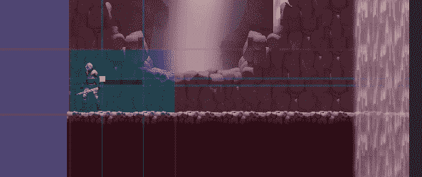**

**最后要提到的是**阻尼**部分。您可以沿每个轴设置值:值越低，相机跟踪越积极，响应越快，相机移动越快。**

**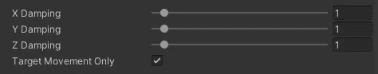**

**要让这些区域从游戏视图中消失，你只需要在层级视图中取消选择虚拟摄像机，然后享受结果！**

****

**如果你喜欢，就鼓掌吧！看看我的游戏或者给我买杯咖啡:感谢每一种支持！！**

********