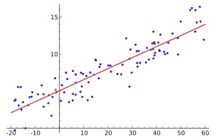
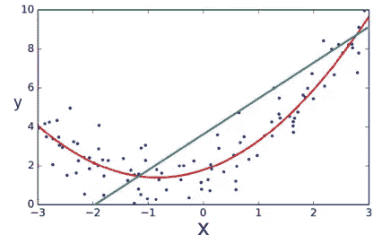
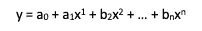
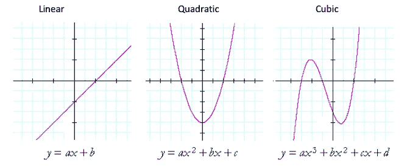
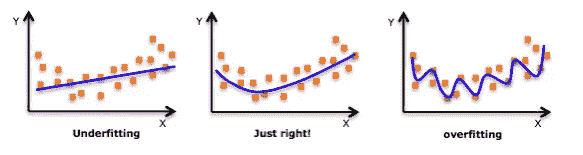
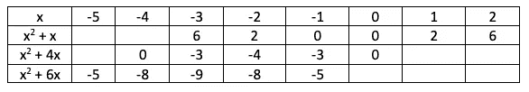
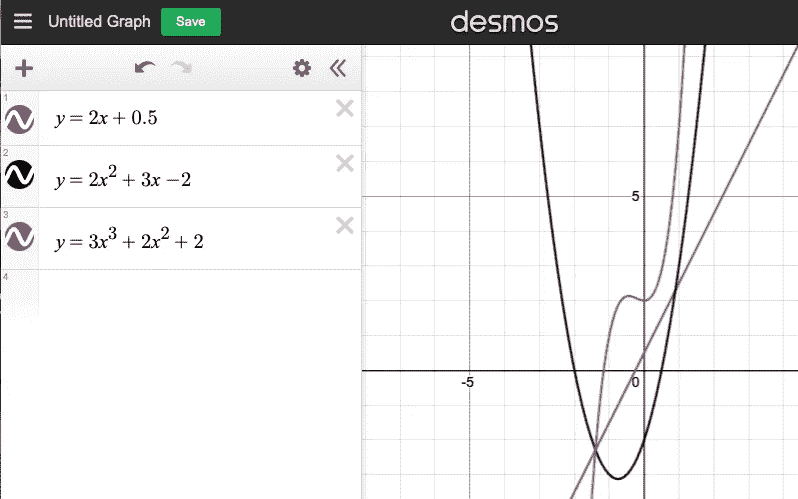

# 多项式入门(1/5)

> 原文：<https://medium.com/geekculture/easy-intro-to-polynomials-1-5-ee3afe843d82?source=collection_archive---------32----------------------->

需要简单易懂的多项式介绍吗？提前阅读或在 youtube 上观看本教程。

线性回归的问题是数据通常不是直线的。
如果我们看看下面的数据集，一个线性函数是完全有意义的。

但是，如果数据具有以下形式，这对我们没有帮助。正如你所看到的，绿色的直线在大多数情况下不会给我们一个好的预测。这就是多项式出现的地方，如红线所示。

多项式由以下公式定义:

## 多项式的次数(转折点)

多项式的形状取决于次数项的数量，我已经在下面解释过了，所以正如你所看到的，一旦你理解了多项式的形状，你就可以开始对哪个次数做出计算决定了。

# 过度拟合/欠拟合

因此，增加多项式的次数，可以让直线更好地拟合数据。但是，要小心，过高也会“过度拟合”数据，也不会给你一个准确的预测。

# 常数或指数变化的影响

现在让我们看看其他一些二次函数，看看当我们改变 x 的系数时会发生什么。我们将使用一个数值表来绘制图形，但我们将只填写那些靠近函数转折点的值。

您可以在表格的每一行中看到对称性，这表明我们已经将注意力集中在每个函数转折点周围的区域。我们现在可以使用这些值来绘制图表。

最后，你为什么不登录[www.desmos.com](http://www.desmos.com)，画出下面的多项式:

准备下一篇文章；-)
[https://Shaun-enslin . medium . com/factorizing-polynomics-made-easy-ff2ac 1039 b 33](https://shaun-enslin.medium.com/factorizing-polynomials-made-easy-ff2ac1039b33)