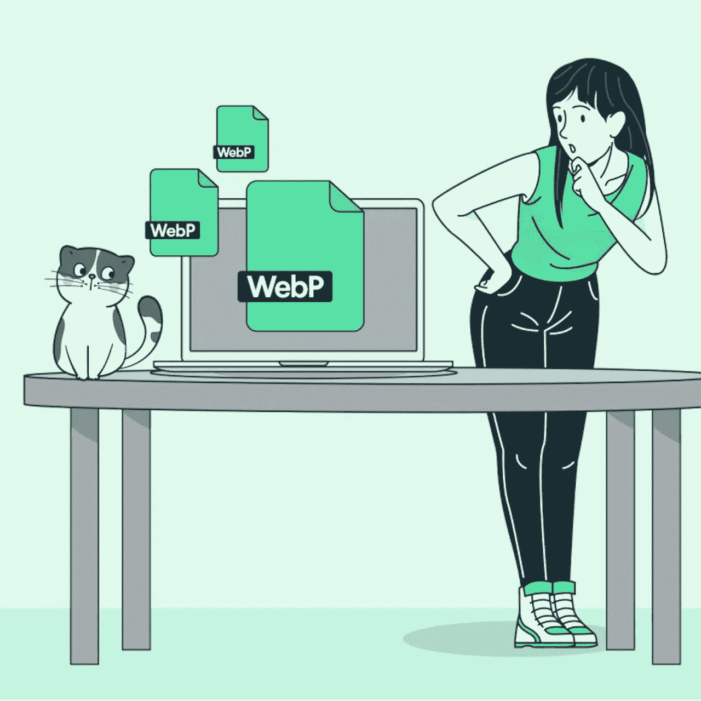
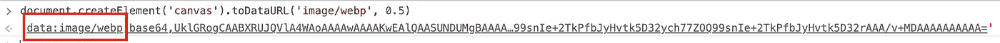
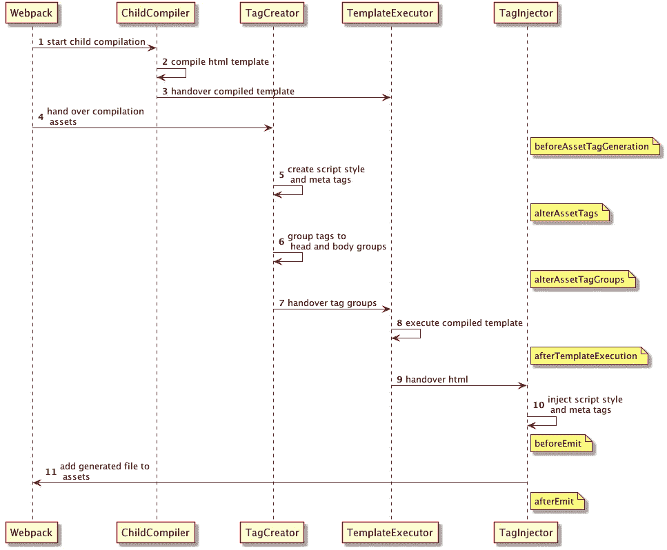

# 提供自适应图像格式的简单方法

> 原文：<https://medium.com/geekculture/easy-ways-to-deliver-adaptive-image-formats-4f461a66b136?source=collection_archive---------13----------------------->


与 JPEG 或 PNG 等传统图像格式相比，WebP 和 AVIF 等下一代图像格式使用高级无损和有损压缩算法来实现更高的压缩效率、更好的细节保留和更少的块效应。它极大地优化了图像传输的大小，并提高了大量图像网站的性能。通常建议网站在支持这些格式时使用它们。

虽然 WebP 和 AVIF 已经得到了大多数浏览器的最新版本的普遍支持，但它们仍然会引起对传统图像格式兼容性的担忧。本文向您展示了如何将这些优化的图像适应性地交付给最终用户。



# 标准方法

最常见和直接的方法是在提供 WebP 格式的图片之前检查浏览器的兼容性。有几种方法可以提供 HTML、JS 和 CSS 格式的 WebP 图片。

## 超文本标记语言

使用`<picture>`标签语法进行 WebP 格式的自适应加载，同时使用常规格式作为备份。

```
<picture> 
  <source srcSet="https://images.example.com/resouces/hero.jpg~aptx-4869.webp" type="image/web" /> 
  
</picture>
```

## 射流研究…

我们可以用 JS 来检测浏览器是否支持 WebP。如果支持，使用 WebP 格式，否则使用 JPEG/PNG。

有两种简单的方法可以做到:

1.  使用`Canvas` `toDataURL()`

`HTMLCanvasElement.toDataURL()`方法返回一个[数据 URL](https://developer.mozilla.org/en-US/docs/Web/HTTP/Basics_of_HTTP/Data_URLs) ，其中包含一个由`type`参数指定格式的图像表示。对于支持编码分辨率元数据的文件格式，创建的图像数据将具有 96dpi 的分辨率。

当将参数`image/webp`传递给方法，但返回值以`data:image/png`开头时，则表明不支持 WebP。



Chrome 108 supports WebP


Safari 15.6.1 on macOS 10.15 Catalina doesn’t support WebP

因此，我们可以定义一个函数，并使用它来检测 WebP 支持。

```
var isSupportWebp = function () {
  try {
    return document.createElement('canvas').toDataURL('image/webp', 0.5).indexOf('data:image/webp') === 0;
  } catch(err) {
    return false;
  }
}

isSupportWebp()
```

2.通过加载 WebP 映像来检查兼容性

这个方法可以在[谷歌的 WebP 官方 FAQ](https://developers.google.com/speed/webp/faq) 中找到。它试图加载一个 WebP 图像并检查该图像的高度和重量。如果身高和体重都不能返回，那么浏览器不支持 WebP。

```
// check_webp_feature:
//   'feature' can be one of 'lossy', 'lossless', 'alpha' or 'animation'.
//   'callback(feature, result)' will be passed back the detection result (in an asynchronous way!)
function check_webp_feature(feature, callback) {
    var kTestImages = {
        lossy: "UklGRiIAAABXRUJQVlA4IBYAAAAwAQCdASoBAAEADsD+JaQAA3AAAAAA",
        lossless: "UklGRhoAAABXRUJQVlA4TA0AAAAvAAAAEAcQERGIiP4HAA==",
        alpha: "UklGRkoAAABXRUJQVlA4WAoAAAAQAAAAAAAAAAAAQUxQSAwAAAARBxAR/Q9ERP8DAABWUDggGAAAABQBAJ0BKgEAAQAAAP4AAA3AAP7mtQAAAA==",
        animation: "UklGRlIAAABXRUJQVlA4WAoAAAASAAAAAAAAAAAAQU5JTQYAAAD/////AABBTk1GJgAAAAAAAAAAAAAAAAAAAGQAAABWUDhMDQAAAC8AAAAQBxAREYiI/gcA"
    };
    var img = new Image();
    img.onload = function () {
        var result = (img.width > 0) && (img.height > 0);
        callback(feature, result);
    };
    img.onerror = function () {
        callback(feature, false);
    };
    img.src = "data:image/webp;base64," + kTestImages[feature];
}
```

## 半铸钢ˌ钢性铸铁(Cast Semi-Steel)

为了用 CSS 自适应地加载 WebP 格式，我们首先需要检测支持度。如果浏览器支持 WebP，那么我们将`WebP`添加到`classList`:

```
document.documentElement.classList.add('webp')
```

然后，我们可以使用选择器的优先级规则来实现自适应图像格式交付。在 CSS 中代码可以改变如下。

```
.img { background-image: url('https://images.example.com/resouces/hero.jpg~aptx-4869.jpeg') }

.webp .img { background-image: url('https://images.example.com/resouces/hero.jpg~aptx-4869.webp') }
```

# 自动批处理解决方案

对于拥有大量图像并不断添加所需图像的生产站点，手动处理图像格式转换和交付是不可行的。

考虑到大多数前端项目都与 Webpack 捆绑在一起，开发一个 Webpack 插件(或使用现有的插件)将图像转换为 WebP 并自适应地提供服务是有意义的。在本地完成所有格式转换通常很耗时，找到一个可靠的云解决方案可以帮助减少处理时间。

批处理通常包括三个步骤:

1.  **上传图片并转换。**现有的开源工具如[文件加载器](https://github.com/webpack-contrib/file-loader)是可用的。
2.  **为资产注入 WebP 标签。**许多阶段依赖于浏览器对 WebP 的支持。拥有一个全局标签很有帮助，这样我们可以在页面呈现之前检测兼容性。
    我们可以使用像 [html-webpack-plugin](https://github.com/jantimon/html-webpack-plugin) 这样的工具来帮助构建带有 webpack 包的 html 文件。这个插件提供的钩子可以用来在`alterAssetTagGroup`阶段添加检测代码。



flow of html-webpack-plugin

3.**替换图片网址。**基于全局标签，我们可以用 WebP 或 JPEG/PNG 版本替换图像 URL。这可以在 JS 或 CSS 中完成。

# 更全面的解决方案

如你所见，整个过程可以用定制或开源工具来 DIY。然而，如果你的网站上有大量的图片，你可能也需要 CDN 来获得更好的图片和网站的整体性能。如果是这样，为什么不让你的 CDN 提供商为你做兼容性检测、图像格式转换和自适应交付呢？

很多 CDN 提供商都有自己的镜像解决方案。比如 Akamai 提供[图像&视频管理器](https://www.akamai.com/products/image-and-video-manager)，Cloudflare 有 [Cloudflare 图像](https://www.cloudflare.com/products/cloudflare-images/)。这些解决方案不仅帮助您通过边缘服务器从 CDN 端提供自适应图像格式，还具有图像缩放、优化等附加功能，最重要的是，减轻了图像资产管理的痛苦。