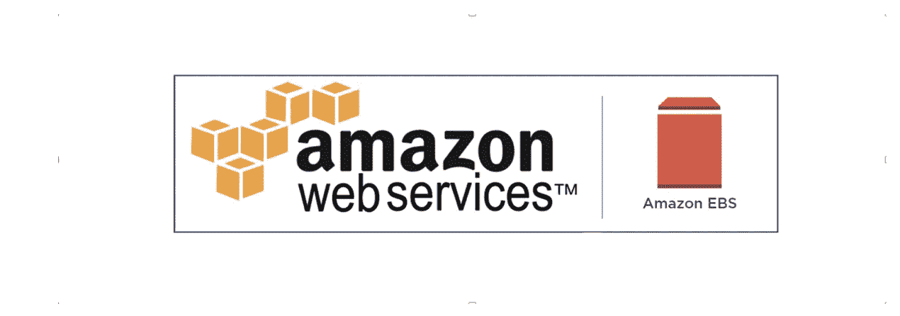

# EC2 存储— EBS、EFS 和实例存储基础

> 原文：<https://medium.com/geekculture/ebs-efs-and-instance-store-aws-solutions-architect-associate-87dc0ac6d1ae?source=collection_archive---------19----------------------->

## 第 6 章:AWS 解决方案架构师助理认证的 EBS、EFS 和实例商店基础知识

AWS EBS Chapter.

在课程的 EC2 部分，我们已经看到了它在一般级别[如何工作](https://plazagonzalo.medium.com/ec2-aws-solutions-architect-associate-complete-course-eaf3b641ebb9)以及它如何通过[负载平衡器](https://plazagonzalo.medium.com/elastic-load-balancers-342c1a14d69a)和[自动扩展组](/codex/auto-scaling-groups-aws-solutions-architect-associate-complete-course-4d056e79ac4c)进行扩展，但是我们仍然需要知道它是如何……