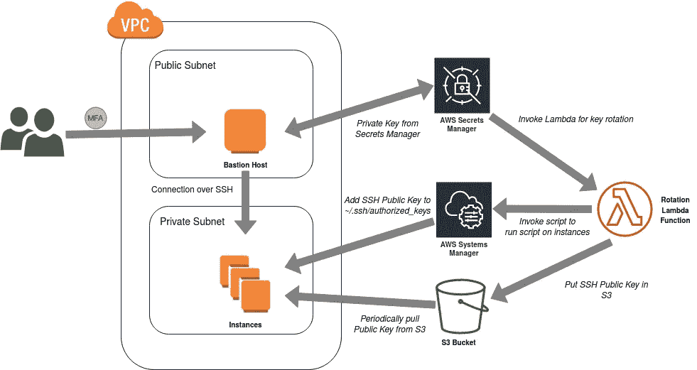

# 使用 MFA 和 SSH 密钥轮换保护 AWS EC2 实例

> 原文：<https://medium.com/geekculture/ec2-mfa-ssh-key-rotation-fddc807f9318?source=collection_archive---------0----------------------->

## 整体架构:

Overall Architecture

**想法**:

这个架构背后的主要思想是通过 SSH 安全地访问 EC2 实例。这包括两个部分:

*   使用 MFA 保护对 Bastion 主机的 SSH 访问。这个过程在 [AWS 博客](https://aws.amazon.com/blogs/startups/securing-ssh-to-amazon-ec2-linux-hosts/)中有解释。
*   访问 EC2 的公共和私有 SSH 密钥…