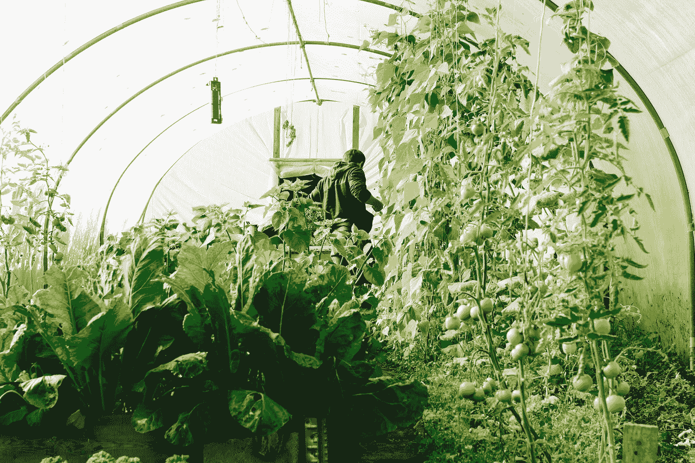

# 生态加密采矿和计算机作为加热系统的使用

> 原文：<https://medium.com/geekculture/eco-crypto-mining-and-computer-usage-as-heating-system-9e53acdeba4d?source=collection_archive---------10----------------------->

幻想还是怪异的可持续性？

Credit Pexels

> “……无法想象一个事物各不相同的世界，只是缺乏想象力的证明，而不是不可能改变……”鲁特格·布雷格曼