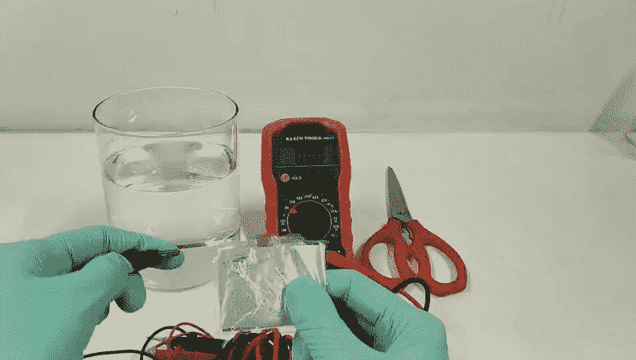

# 环保凝胶电池:它们是未来吗？

> 原文：<https://medium.com/geekculture/eco-friendly-gel-batteries-are-they-the-future-1376944e69d2?source=collection_archive---------56----------------------->

## 这种水基电池是锂离子技术的安全和经济的替代品。

No “corners were cut” when designing this innovative aqueous battery: it is safe (it does not short-circuit nor catch on fire) and maintains its voltage even when damaged. ([Source](https://www.nature.com/articles/s41467-021-23209-6). Distributed under a [Creative Commons Attribution 4.0 International License](http://creativecommons.org/licenses/by/4.0/). Original video sped up by author)

可靠的可充电电池对于加速全面采用可再生能源至关重要。多价离子电池(MIB)是锂离子电池的一种经济有效的替代品，因为多价金属(如…