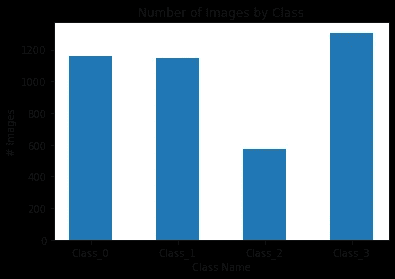
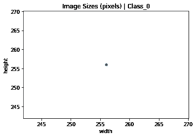
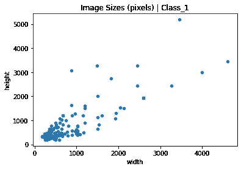
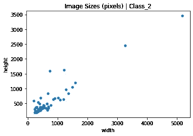
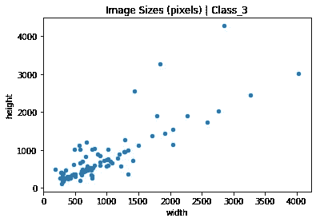
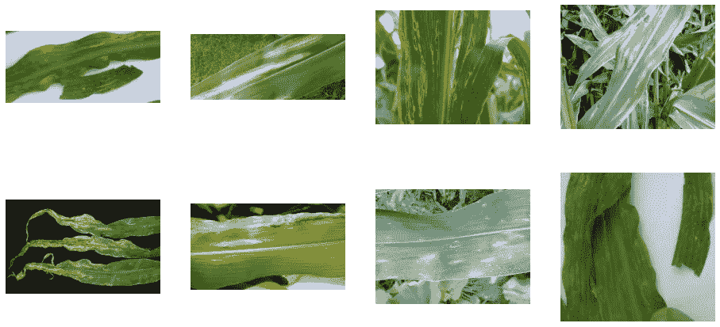

# 用于图像分类的 EDA

> 原文：<https://medium.com/geekculture/eda-for-image-classification-dcada9f2567a?source=collection_archive---------1----------------------->


Photo by [Corina Rainer](https://unsplash.com/@corinarainer?utm_source=medium&utm_medium=referral) on [Unsplash](https://unsplash.com?utm_source=medium&utm_medium=referral)

在我从事数据科学项目期间，图像分类一直是我最喜欢的项目，但 EDA 不像其他模型那样简单。我和我的同伴发现自己在谷歌上搜索想法，阅读博客文章，不知道如何前进。我们应该如何分析成千上万的图像来寻找模式或学习…好吧，关于数据集的任何我们不知道的东西？

这需要回到基础。把我们学过的有趣的、时髦的 EDA 放在一边，而是把注意力放在会影响整个模型的东西上。我们需要知道什么来确保我们的 CNN 尽可能好地运行？作为数据科学家，为了更好地理解模型本身，我们需要了解哪些数据？

**识别阶级不平衡**

识别阶级不平衡是简单的第一步。我们将找到分配给每个类别的图像数量，并将其绘制在条形图中，以便轻松识别任何不平衡。CNN 中的不平衡可能导致代表性较低的类的较差性能，从而影响整体性能。

* *以下代码假设您已经根据类别将图像拆分到文件夹中，并为每个目录创建了变量。

首先，我们需要创建一个字典，以类名作为键，以图片数量作为值。下面我们从存储图片的文件夹中直接提取一些图片。

```
number_classes = {'Class_0': len(os.listdir(healthy_dir)),'Class_1': len(os.listdir(blight_dir)),'Class_2': len(os.listdir(gray_dir)),'Class_3': len(os.listdir(rust_dir))}
```

接下来，使用轴的键和值绘制一个简单的条形图。

```
plt.bar(number_classes.keys(), number_classes.values(), width = .5);plt.title("Number of Images by Class");plt.xlabel('Class Name');plt.ylabel('# Images');
```



A simple bar chart to quickly identify class imbalance.

**标绘图像尺寸**

一致的图像大小对深度学习至关重要，不匹配的矩阵会让你的项目快速停止。可视化原始图像大小还可以帮助您更好地理解数据集。所以让我们开始吧！

我们将创建另一个简单的字典—您可以创建一个字典用于上面的图表和下面的图表，但我想展示一个不同的选项，它不需要每个文件夹目录都有变量。我们还将设置一个返回图像尺寸的函数。

```
directories = {'Class_0': 'data/Class_0/','Class_1': 'data/Class_1/','Class_2': 'data/Class_2/','Class_3': 'data/Class_3/'} def get_dims(file):'''Returns dimenstions for an RBG image'''im = Image.open(file)arr = np.array(im)h,w,d = arr.shapereturn h,w
```

下一步将创建一个循环，该循环将遍历字典中的文件夹，并返回每个图像的尺寸，这些尺寸将被添加到数据帧中以供绘制。

```
for n,d in directories.items():filepath = dfilelist = [filepath + f for f in os.listdir(filepath)]dims = bag.from_sequence(filelist).map(get_dims)with diagnostics.ProgressBar():dims = dims.compute() dim_df = pd.DataFrame(dims, columns=['height', 'width'])sizes = dim_df.groupby(['height', 'width']).size().reset_index().rename(columns={0:'count'})sizes.plot.scatter(x='width', y='height');plt.title('Image Sizes (pixels) | {}'.format(n))
```



**查看图像样本**

最后，让我们来看看每个班级的一些图片。尽管这对模型本身并不重要，但它将帮助您熟悉数据。您对数据越熟悉，您就越能理解模型输出，从而允许智能迭代，并最终得到更智能的模型。

我想说的是，我的一个了不起的同事写了下面的代码，看看她的中间页面[这里](https://diane-tunnicliffe.medium.com/)😊

设置将迭代文件夹中图像的变量。需要为每个类创建一个变量。

```
# Show images displayed 4x4nrows = 4ncols = 4# Index for iterating over imagespic_index = 0pic_index += 8next_blight_pix = [os.path.join(blight_dir, fname)for fname in train_blight_names[pic_index-8:pic_index]]
```

并设置一个函数，创建一个情节来查看我们的图像。

```
def show_image_sample(pic_directory):
'''display 4x4 images'''fig = plt.gcf()fig.set_size_inches(ncols * 4, nrows * 4)for i, img_path in enumerate(pic_directory):sp = plt.subplot(nrows, ncols, i + 1)sp.axis('Off')img = mpimg.imread(img_path)plt.imshow(img)plt.show()show_image_sample(Class_0)
```



A sampling of images for each class can teach us a lot! This particular project was to identify disease in corn leaves.

正如我们上面看到的，单个类的小样本可以教会我们很多关于数据集的东西。我们可以看到图像有不同的大小和形状，我们也可以看到在这个类中有相当多的变化。背景、亮度、方向等的变化会导致深度学习中的几个问题，我们可以通过查看数据集的这个样本来做好准备。

希望这已经给了你一个图像分类 EDA 的良好开端。感谢阅读，祝你好运！