# 使用 SQL 的 EDA(MySQL)

> 原文：<https://medium.com/geekculture/eda-with-sql-mysql-4ac1ea1d977b?source=collection_archive---------2----------------------->

## 勘探数据分析

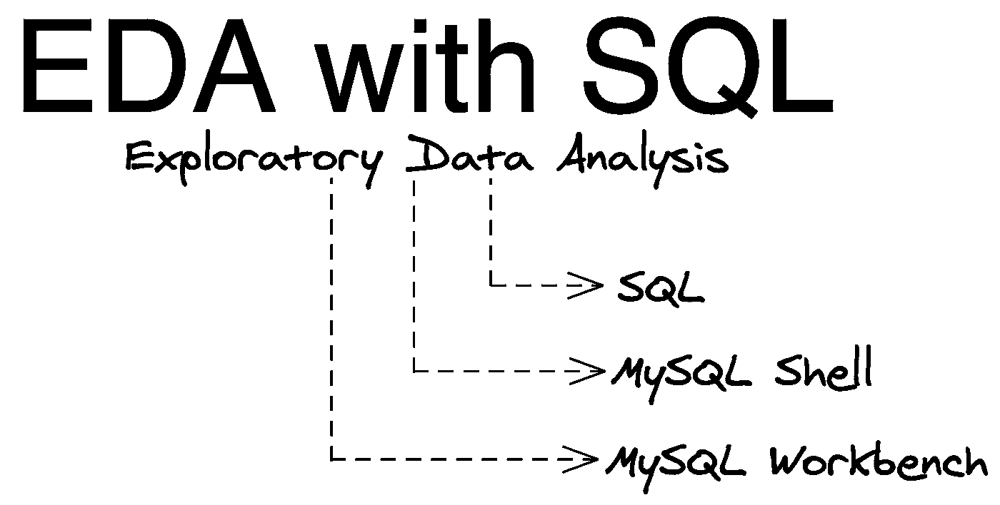

Tools (Shell or Workbench) and Language (SQL) with MySQL RDBMS

> **E** 探索性 **D** ata **A** 分析(又名 EDA)是描述性数据分析的过程，有助于根据给定的历史数据了解发生了什么。

这是数据分析(也称为 DA)的初始描述性分析部分，包括为下一步的 DA 清理和转换数据，下一步可以是数据建模(确定和定义表之间的关系)。

> **EDA 为什么做？**

掌握组织的数据资产，并从其历史模式中提取有意义的信息，进一步帮助业务团队执行所需的行动，以满足业务目标或增强 KPI(关键绩效指标-衡量任务/目标的绩效)。

在这里，我考虑了 FIFA 上的体育数据集，以在 EDA 中执行常见和基本的数据任务，特别是如果您开始分析数据，无论 DA 是使用 MySQL、Python 还是 r 执行，这些都是基本步骤。其他关系数据库的语法可能会有细微的变化。

简而言之，DA 有助于从给定的数据集中提取有价值的信息。

**数据集** : 可从 Tableau 网站获得的样本数据集，位于 [FIFA 18](https://public.tableau.com/en-us/s/resources) 下，然后点击顶部的“样本数据”，向下滚动至“下载”按钮。xlsx 或者。csv 格式-[https://public.tableau.com/en-us/s/resources](https://public.tableau.com/en-us/s/resources)

> **工具&语言** : **MySQL Workbench** (用于 MySQL 关系数据库管理系统的 GUI，又名 RDBMS)以表格形式可视化数据，以及**MySQL Shell**(CMD/终端工具，即非 GUI)编写&执行 SQL 语句以从数据集获取必要的信息，这些信息可以是 CSV、Excel、JSON 或任何其他格式。

使用关系数据库——我们可以在数字字段/列上使用聚集函数(如 min()、max()、avg()、sum()、stddev()来计算描述性统计数据。如果您熟悉 Python 的数据分析，这类似于使用 Pandas 的 describe()函数。

**EDA** 需要准备报告和数据可视化(数据可视化),以呈现有关分析的故事，从而回答业务团队的问题，但是 DA 的风格分为 5 类，如描述性、诊断性、预测性、规定性和认知分析(这些是参考性的),每一类都基于需求和您正在处理的应用程序来执行。在这里，我们正在进行描述性分析…

> **这里 EDA 里有什么:**

探索性数据分析，在多个场景中完成。例如:分析公司的数据资产或用于建立机器学习预测模型。EDA 在几乎所有业务类型中执行，用于分析 KPI 和采用数据驱动决策的公司。

如果您是数据分析的初学者，或者处于探索数据的初级阶段，下面是我用 SQL 语句和代码片段解释的步骤/语句。

**注意**:在你开始写&执行 SQL 语句之前，无论是在 **MySQL Shell** 还是 **Workbench** 中，记得保持数据库服务器开启，有时这一步可能会错过，我就发生过这种情况！所以作为一个提示，服务器打开…

在文章 [**与 MySQL 数据库进行交互**](https://ramya-n.medium.com/to-interact-with-mysql-database-4f7e75e764d5) **，**中，您可以找到连接 MySQL 服务器的方法，在这里，我解释了 Shell 和 Workbench 工具以及基本 CRUD 操作的用例，并详细介绍了 MySQL 服务器版本。

> **1** 。使用 **MySQL 工作台**:

打开数据库服务器后，您可以打开 GUI 工具，即**工作台**，如下图所示。

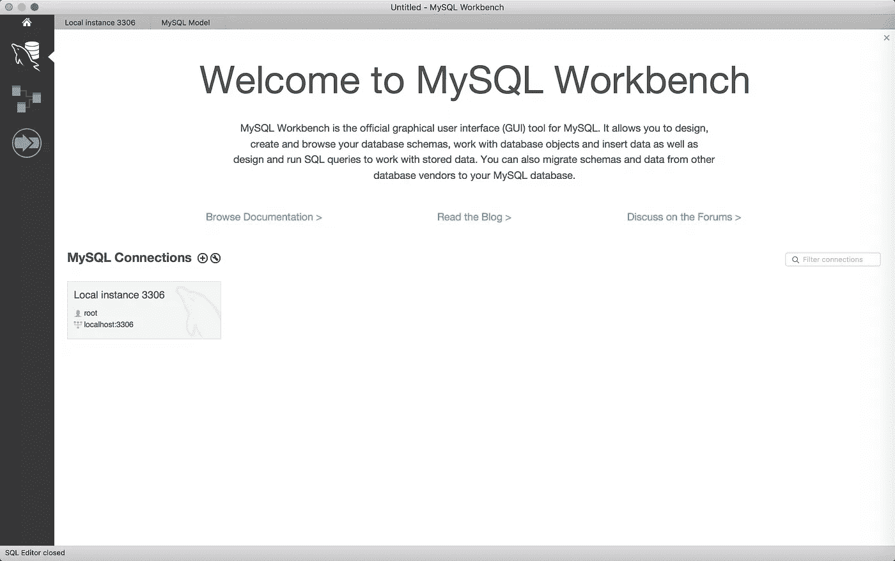

**Image-1**: This is landing screen once you open Workbench, next click on ‘Local instance 3306' to connect to local server instance and follow the on-screen instruction to enter password, if you have provided it during installation of MySQL server.

带有 **tech_blogs** 数据库中 **fifa_sport** 表的 **MySQL Workbench** 工具概述:

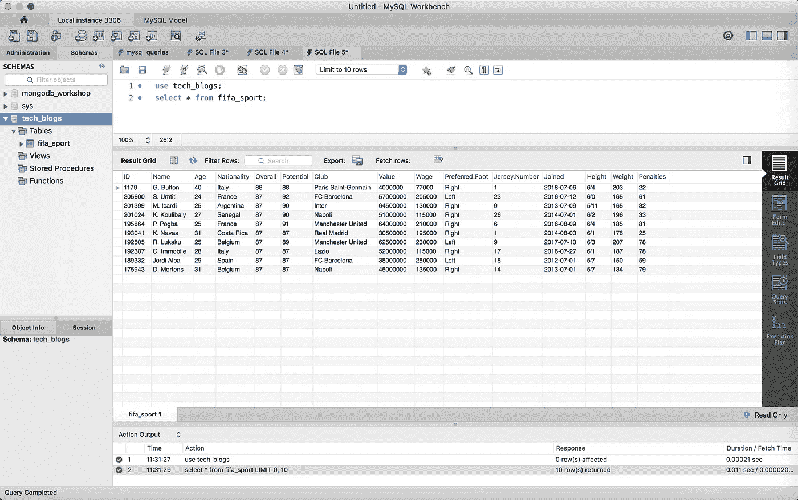

**Image-2**:MySQL Workbench (GUI) to visualize the data in SQL tables form.

要激活所需的数据库，请执行 Workbench 中的语句，如上面第 1 行所示或下面的视频所示。

在下面的视频中，我已经介绍了两个内容——(I)通过 **MySQL Workbench** 将 CSV 文件上传到 MySQL 数据库，以及(ii)以表格形式查看数据。

**Video-1**: Upload CSV file to database as a table in MySQL Workbench and view the data in SQL table.

以下是可以在 **Shell** 或**工作台**中执行的语句。根据您的喜好，您可以使用这些工具中的任何一个。

**提示**:MySQL 中的注释以连续的双连字符(-)为前缀，如下所示。

```
-- Below statement to fetch the rows/records from tech_blogs table:mysql> select * from tech_blogs;
```

> **2** 。用 **MySQL 外壳**:

**激活 MySQL 外壳**:如果您在安装 MySQL 服务器时提供了密码，请输入密码。接下来，它输出如下所示的 **mysql >** ，这表明您可以开始编写和执行 sql 语句了。

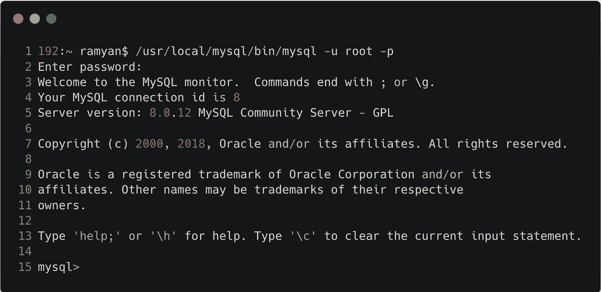

**Image-3:** To activate the MySQL Shell

> **激活外壳后，我要做的初始检查是**:

I .在连接的实例中检查现有/创建的数据库。

```
mysql> show databases;
```

二。激活特定/必需的数据库。

```
mysql> use tech_blogs;
```

三。知道激活的数据库中的表列表。

```
mysql> show tables;
-- OR
mysql> show full tables;
```

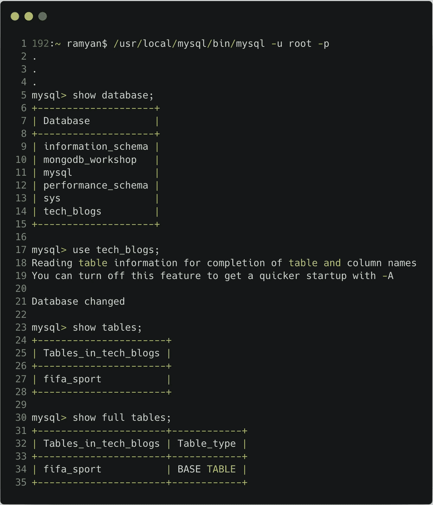

**Image-4:** SQL statements for initial checks.

> 在**图像-2** 和**视频-1** 中，解释了在**工作台**中编写和执行 SQL 语句。
> 
> EDA SQL 语句可以在这两个工具中的任何一个中编写和执行。下面显示的代码片段来自于 **MySQL Shell** 。

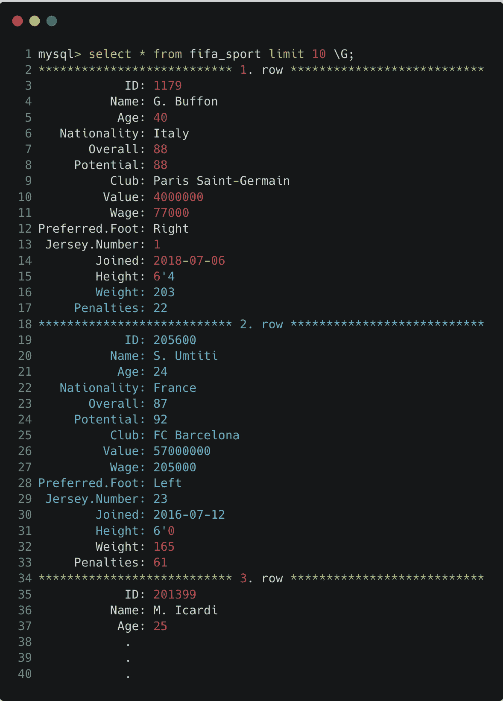

**Image-5 & Option-1**: To display the content in Shell, shows all columns with * operator in SELECT statement.

查看带有特定字段的 Shell 中的内容的另一个选项:

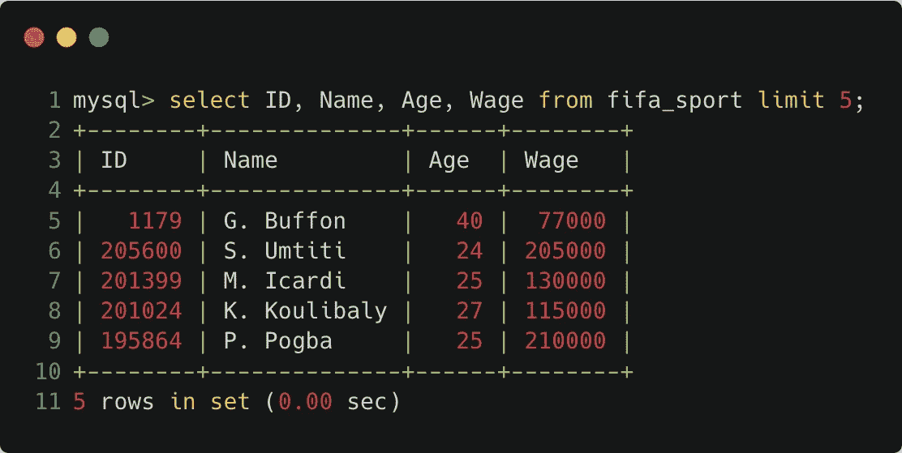

**Image-6 & Option-2**: To display the contents in Shell which is similar to table form, however with the selected columns - ID, Name, Age and Wage.

下面是了解记录/行数、获取记录和唯一值、表的结构/模式(列、数据类型等)等指标的语句。

因此，不再拖延，让我们开始下一步。

EDA 可帮助您了解分析所需的特征(字段)，是否存在任何异常值、任何缺失值、唯一值、描述性统计数据(平均值、最大值和最小值、标准偏差)，这当然取决于场景——(I)如果您使用 EDA 来构建预测模型(机器学习应用程序)或(ii)提取数据驱动决策所需的信息，具体取决于组织的要求，这里我将针对场景(ii)解释 EDA，即数据驱动决策！

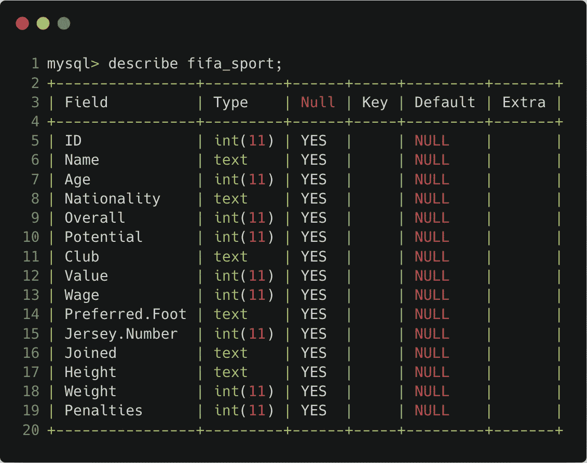

**Image-7**: Structure/schema - Displaying fields name, their data type, nullable or not, default value and so on.

下面是一些问题，可以从这些 SQL 语句中找到答案。现在你知道了，我们在这里使用的是 **MySQL** (RDBMS)和 **SQL** (语言)。

**Q1** :国际足联组织中有多少足球运动员？

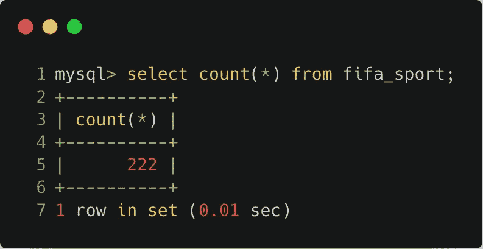

**Image-8**: count(*) displays number of rows > so 222 players are stored in the dataset. One player per row so we will get the number of players.

Q2:有多少个民族？

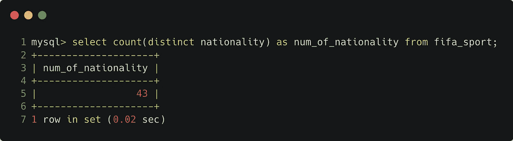

**Image-9**: Number of nationalities are 43 - ‘distinct’ keyword helps to know unique values.

**Q3** :每个国家有多少球员——即国籍频率？


**Image-10**: 31 players from Spain, 25 players from Brazil, 25 players from France and so on.

上述陈述还提供了哪个国家拥有更多球员的信息，即最多的球员来自西班牙。

因此，玩家人数最多的前五个国家可以使用“限制”关键字按降序排列:

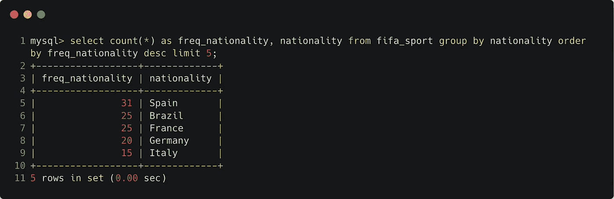

**Image-11**: Fetching top-5 countries with more number of players in descending order.

**Q4** :球员工资最高多少？

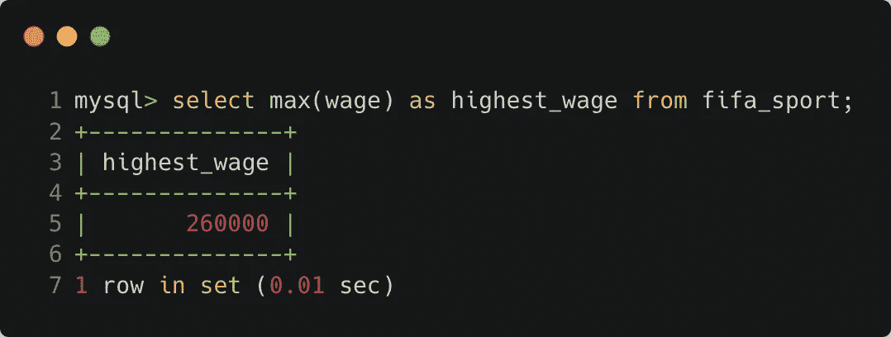

**Image-12**: Using max() function to fetch highest wage from wage column.

哪位球员的薪水最高，来自哪个国家？

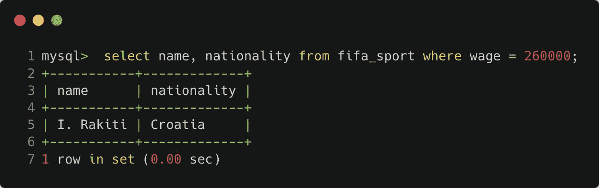

**Image-13**: Player name and their country with highest paid.

**提示**:为了获得最高工资，子查询可以用‘where’子句传递给外部查询以获得所需答案，而不是在两个不同的语句中执行以优化脚本。

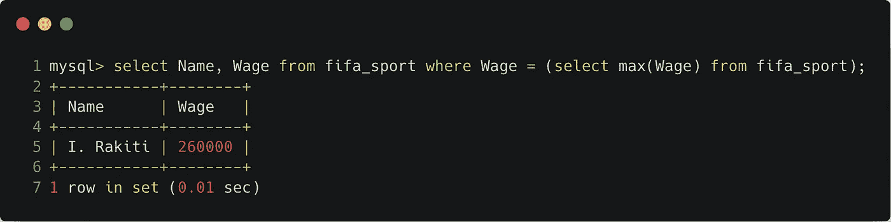

**Image-14**: One statement provides both answers as from Image-12 (Q4) & Image-13 (Q5).

**Q6** :最低工资是多少？

这类似于 max()函数，但使用 min()函数，如下所示:

```
mysql> select min(wage) as minimum_wage from fifa_sport;-- Output
+--------------+
| minimum_wage |
+--------------+
|         1000 |
+--------------+
```

哪位球员获得了最高的综合评分，来自哪个俱乐部？

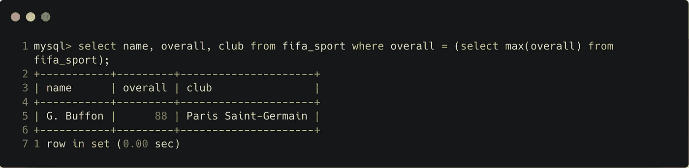

**Image-15**: Player G.Buffon with overall highest rating 88 from the club ‘Paris Saint-Germain’.

**Q8** :综合评分排名前三的俱乐部是哪些？

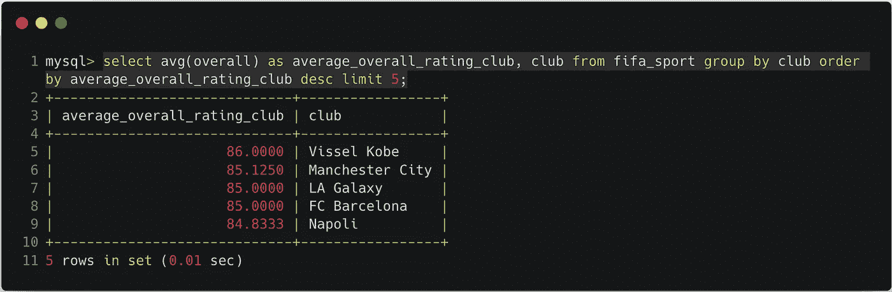

**Image-16**: Top-3 clubs are ‘Vissel Kobe’, ‘Manchester City’ & ‘LA Galaxy’. Interestingly ‘FC Barcelona’ also has similar rating to ‘LA Galaxy’.

**Q9** :每个国家有多少名左脚或右脚球员，并显示出前 10 名的记录？

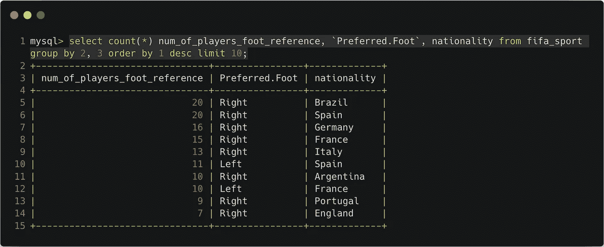

**Image-17**: 20 players are right-foot preferred from Brazil, 20 are right-foot preferred from Spain, 16 are right-foot preferred from Germany and so on.

当列以点(.)在短语之间，然后有两种执行它的可能性。要么用反勾号(`)将这些名称括起来，要么重命名这些字段名称。在这里我附上了首选的。带反勾的脚字段。

**Q10** :巴黎圣日耳曼俱乐部注册的球员是谁？

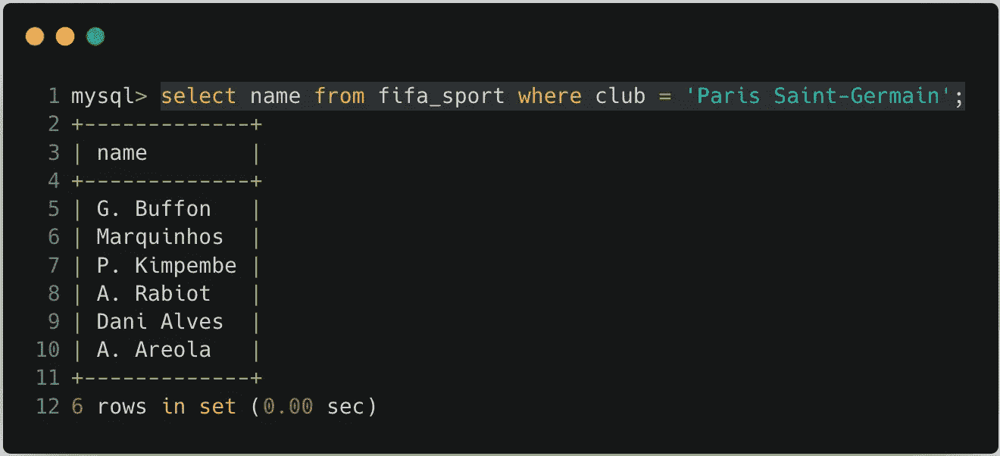

**Image-18**: Above statement fetches the list of players from club ‘Paris Saint-Germain’. Players are G. Buffon, Marquinhos, P. Kimpembe, A. Rabiot, Dani Alves and A. Areola

**Q11**:2018 年，有多少球员在哪个日期加入了哪个俱乐部？

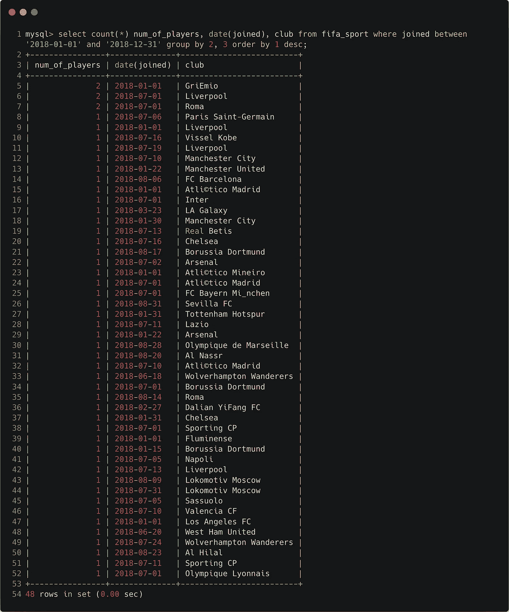

**Image-19**: 2 players on 2018–01–01 joined GriEmio, 2 players on 2018–07–01 joined Liverpool and so on. If no players have joined, then those dates are not displayed.

**注意**:对于“group by”子句，您可以传入字段名或字段名的序号。在这里，我对两个字段 **date(joined)** 即 2 和 **club** 即 3 进行了“分组”。和' **date()** 函数一起使用，以消除时间戳。

**Q12** :另一个从商业角度的统计——2008-2018 年每年有多少玩家加入？

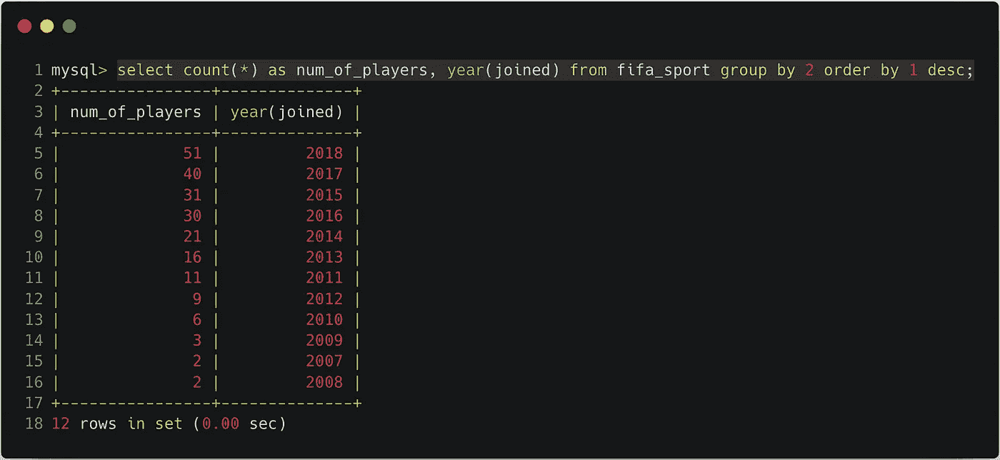

**Image-20**: 51 players joined in 2018, 40 players joined in 2017, 31 players joined in 2015 and so on.

> **提示**:关键字和子句在 SQL 语句中要按顺序书写。例如“Select”、“from”、“where”、“group by”、“order by”、“limit”等。默认情况下，记录将以升序显示。
> 
> **总结**:因此，根据问题，我们可以分析给定的数据集，从而可以将它与报告&要求的信息一起呈现给各个团队。为了在图形可视化中表示数据，您可以使用 Tableau 或 Python 以及 Seaborn/Matplotlib 库或 R 语言来增强报告和演示。
> 
> 希望你喜欢这篇文章，深入了解描述性分析的初始层次，回答上述类型的问题。

谢谢你…！