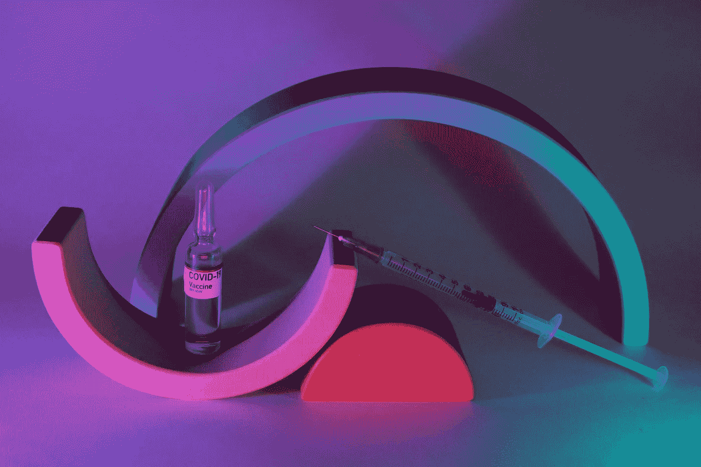

# 医疗保健行业的 5 个边缘计算用例。

> 原文：<https://medium.com/geekculture/edge-computing-use-cases-in-the-healthcare-b6bf1c0387be?source=collection_archive---------31----------------------->

## 边缘计算是一个热门话题。但是到底是什么意思呢？它对医疗保健行业有什么影响？

Edge computing on IoT and mobile devices has transformed the way healthcare was, and it is now. — Photo by [Alena Shekhovtcova](https://www.pexels.com/@alena-shekhovtcova?utm_content=attributionCopyText&utm_medium=referral&utm_source=pexels) from [Pexels](https://www.pexels.com/photo/vaccine-for-covid-19-near-syringe-with-needle-6075003/?utm_content=attributionCopyText&utm_medium=referral&utm_source=pexels)

边缘计算是指在产生 T3 的源处或附近处理数据 ***，而不是将所有数据传输回中央枢纽进行处理。***