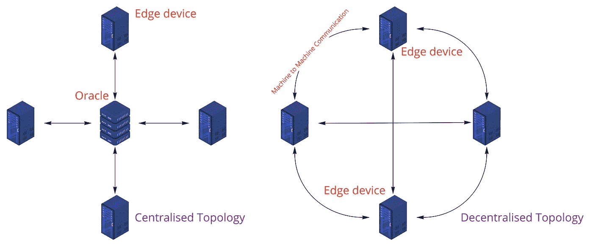
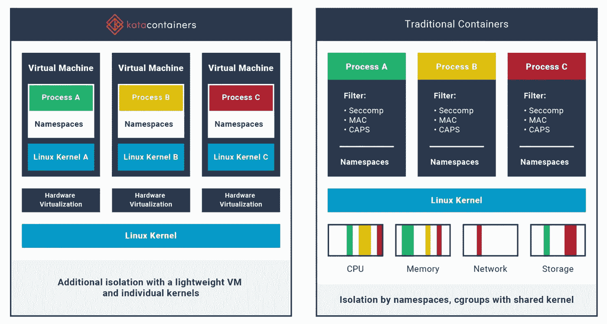

# 边缘智能:云智能的未来挑战者

> 原文：<https://medium.com/geekculture/edge-intelligence-the-upcoming-challenger-to-cloud-intelligence-34610f99414c?source=collection_archive---------15----------------------->

云服务和各种人工智能 API 产品推动了多个行业的数字化转型。在过去几年中，物联网(IoT)概念已经产生了数百万个传感器数据，这些数据被发送到公共云和私有云上的基础架构并使用这些基础架构进行分析。使用案例包括测量几个家庭的用电量和动态定价电费，以及整理来自视觉反馈的信息，告诉我们特定的人是否已经进入大楼(监控*等*)。在第一种情况下，时间序列始终从基于边缘的电表发送到云数据分析服务。相比之下，在第二个用例中，图像抓取是通过云上的深度学习模型进行处理的，使用了人员检测、跟踪和重新识别模块。在这两种情况下，边缘设备只是一个将信息传输到云的管道。

# 为什么我们需要边缘智能？

Figure 1 Two main topologies behind edge deployments — one with an oracle (at the fog or cloud) and another without (decentralised and distributed).

必须在更靠近最终用户的地方运行的传感器网络为他们提供了更短的延迟，节省了带宽，在将数据传递到更大的云计算基础设施之前在设备上预处理了数据，并保证了所收集和推断的数据的隐私性。这些构成了边缘智能的一些核心要求。这些边缘设备或计算水平较低的传感器弹性地创建了一个网络(网状)，其中这些边缘设备——亚马逊 Echo、dashcam、你的智能手机、温度传感器等。—间歇性地加入网络以收集、计算和共享信息。

在过去，我指的是物联网世界，这些传感器感知世界，并忠实地将信号传输到母舰(公共云或私有云)。但是考虑一下，如果两个或更多的边缘设备不仅可以共享它们的输入，还可以共享有限的车载计算来实现一个目标:我们有许多不可靠的边缘设备，它们可以被集合在网状网络下，以解决例如资产跟踪问题、估计车辆拥堵等。不严格地说，用例可以从自主设备(无人机、机器人、自主车辆等)开始。)、[沉浸式体验](https://biswasengupta.medium.com/parallel-futures-and-the-blackhole-of-metaverse-4f4054f6ce4c) (AR/VR、可穿戴设备等。)到物联网分析(工业和家用传感器等)。)，还有其他。

# 边缘的人工智能

基本上有两种方法可以在 edge 上操作机器学习——使用集中式联邦学习工具的集中式拓扑，以及分散和分布式(无 oracle)联邦学习算法的数学迟钝领域。联合学习(图 1)依赖于在计算能力较低的设备中训练机器学习模型，并将本地学习的权重/模型传输到 oracle 进行进一步处理。作为第一步，云训练模型(来自 oracle)被发送到各个边缘设备；然后用本地数据对该模型进行微调，将模型发送给 oracle，以便 oracle 的模型可以更新。这里的通信模式可以是同步的，也可以是异步的。

类似 SimFL 的具体化可以使边缘设备能够相互发送消息(损失函数的梯度),从而减少发送本地模型的通信负载。第二种方式的分散联邦学习通常是部署机器学习模型的更好方式。信息在设备之间传播，而不是在一个点上传播，从而减少了任何网络安全攻击的攻击面。分散形式主义的沟通模式可以通过图表、分布式分类帐或简单的点对点(如 SimFL)方式。

总之，实际的边缘智能在于这种分散的拓扑结构，这将产生新一代的芯片公司，它们不仅专注于计算(最优 TFLOPS/Watt)，还专注于协同设计计算以与通信紧密结合，即****网状拓扑结构(点对点、分布式分类帐、图表等)。)**。**

# **计算与通信**

**关于集中式拓扑，Oracle 成为云上的基础设施，而边缘设备是计算能力较低的传感器。我们可以更进一步，让 Oracle 位于靠近边缘设备的位置(对于 CCTV 摄像机，它可能是位于内部的 Nvidia Xavier 套件； **11 TFLOPS (fp16)，最高 30W** ) —我们现在有了雾计算的出现，稍微稀释的硬件功能部署在非常靠近边缘设备的地方(稍微大一点的外形规格可以在雾上容纳一个 A6000 oracles 刀片— **39 TFLOPS (fp16)，最高 300W** ，而不是云上的数百个 A100 Oracle—**78 TFLOPS，最高 400W** )。让我们把我们的推理向前推进一步；我们现在移除了 oracle，并拥有许多功能较弱的处理器(现在想想单个 Jetson Nano — **470 GFLOPS (fp16)，功耗高达 10W** )。希望我们能够认识到机器学习模型的边缘部署是**处理能力、功率包络和形状因子**之间的微妙平衡。**

**经常有人问 Edge AI 是否需要 5G。绝对不行。许多边缘应用可以利用当前的技术，如 4G-LTE-M(长期演进类别 M1)、NB-IoT(窄带物联网)和 CBRS(公民宽带无线服务)，要考虑的关键指标是**接近度、延迟和移动性**。闭路电视被拴在墙上，而移动电话或自动驾驶汽车是移动的。类似地，以 80 公里/小时的速度行驶的汽车需要其人工智能比语音代理更快的响应时间，语音代理可以等待几秒钟的响应。从接近度的概念来看，与无人机的用例相比，靠近采摘机器人的边缘数据中心(oracle)可能是必需的。通过构建，无人机的运动可以优化，以接近电信网络提供商的接入边缘或区域边缘。因此，特定的用例以及这三个指标可以让我们快速了解在边缘部署产品的必要性。**

# **在边缘部署模型**

**edge 上模型的部署(计算机工程方面，而不是产品背后的计算机科学)是最容易实现的，因为人们可以将许多容器部署策略提升并转移到 fog/edge。**可以管理部署到设备的容器的容器引擎**和可以跨计算节点分配任务的容器编排器对于边缘计算来说是必不可少的。另一项值得关注的重要虚拟化技术是**的单核技术**。这些软件通过在内核模式下运行来避免上下文切换，从而节省内存。由于这些图像仅包括必要的内核函数，因此图像大小大大减小。它们还通过构造缩小了攻击面和资源足迹，确保了安全部署。**

**类似地， **Kata 容器**将安全容器运行时与轻量级虚拟机结合起来。它们使用硬件虚拟化技术来提供更大的工作负载隔离。如果没有这样的部署策略，大多数下游任务都会变成理论上的构想。复制/粘贴 Kubernetes 模型以部署到微控制器单元、移动电话或 CCTV 摄像机等资源受限的设备可能并不容易。库伯内特人也应该进化。**

****

**Figure 2 The speed of containers, the security of VMs. [Source](https://katacontainers.io/learn/)**

# **走向边缘智能**

**网络边缘是一个多变的环境，拓扑和设备不断变化。存在用于在云中动态调度有效负载的编排算法。尽管如此，对于边缘设备，这仍然面临着规模(数百万个设备)、更多异构功率包络和各种设备的计算能力的问题。数据收集和模型越来越分散，其中每个设备拥有整个数据的一定百分比(而不是访问整个数据集)。越来越多的边缘设备变得小型化、低功耗且计算能力有限。因此，未来的工作应该集中在分散的算法、动态变化的通信模式的联合、具有最佳 TOPS 的小尺寸芯片，最重要的是，使计算与通信交织在一起。**