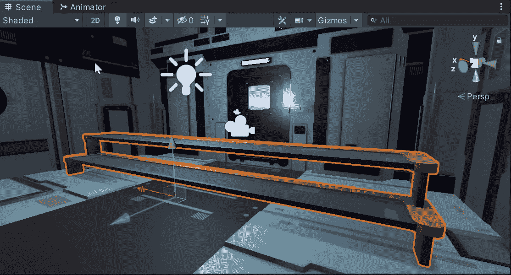

# 编辑 FBX 文件

> 原文：<https://medium.com/geekculture/editing-fbx-files-a7a86f588f5?source=collection_archive---------1----------------------->

有时当使用*资源包*构建场景时，您可能想要更改预先存在的 3D 对象以更好地满足您的需求。让我们来谈谈在你最喜欢的 3D 软件中打开一个现存的 FBX 文件并编辑它。
为了本文的目的，我将使用*搅拌机*。

我从 *GameDevHQ* 的*文件库*中获得了这个楼梯案例资产，它由四个楼梯组成。让我们把这个切成两半…