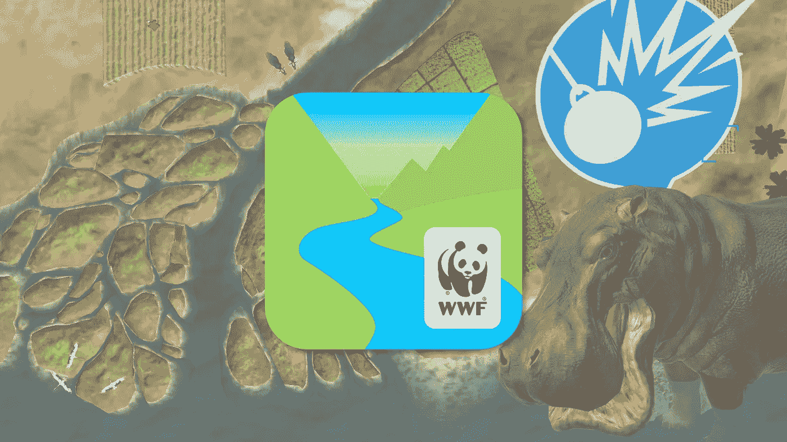
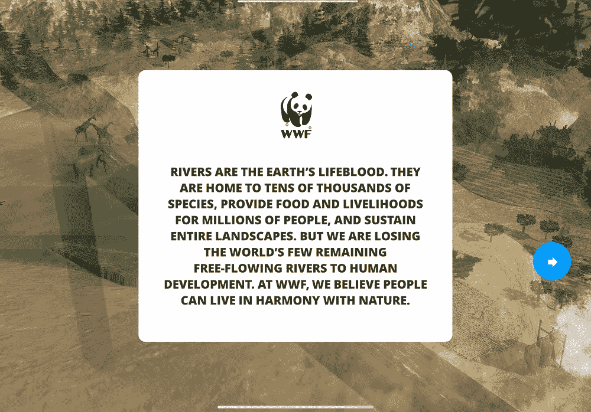
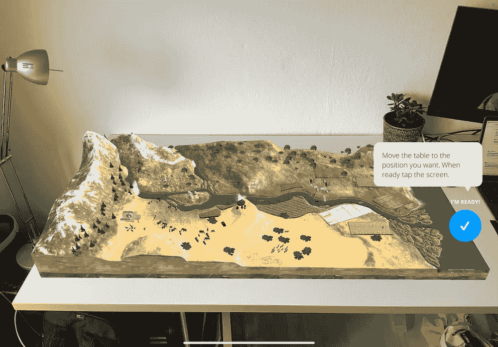
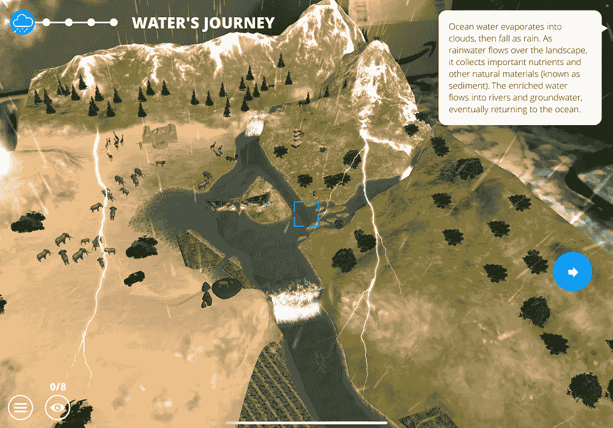
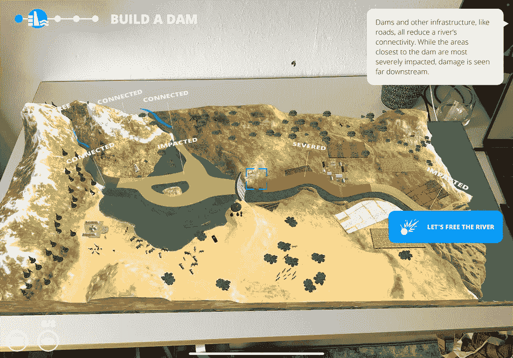
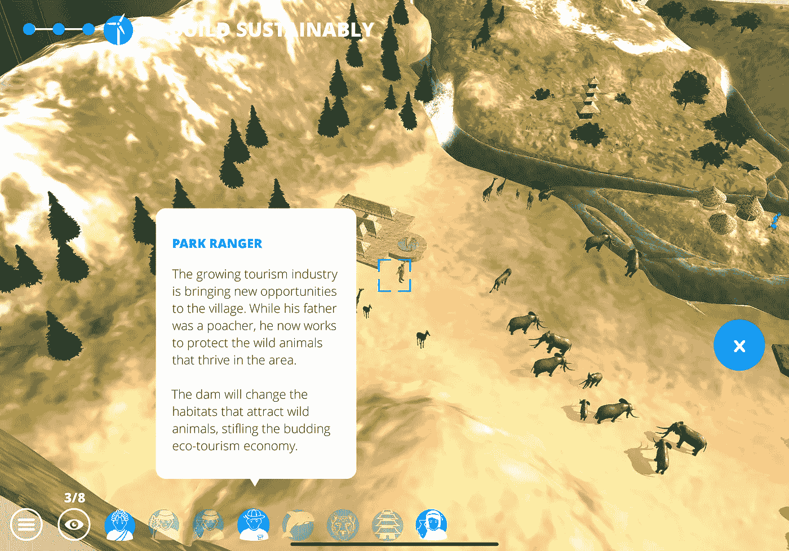
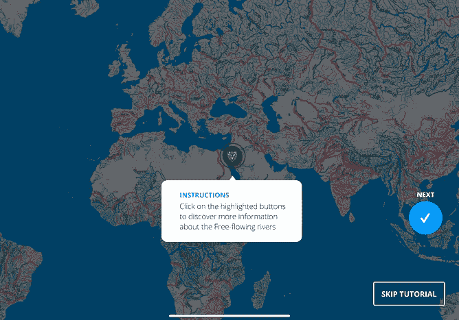
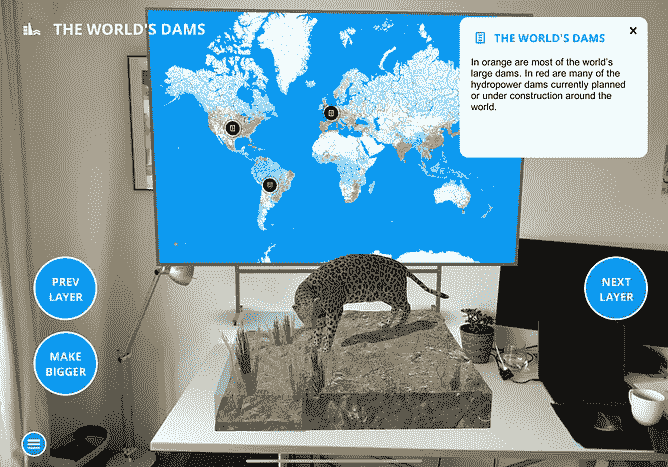
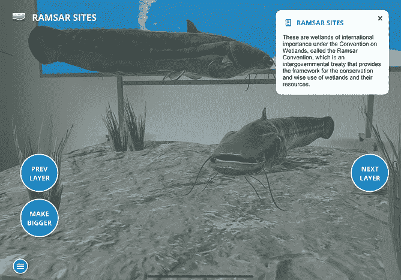

# 教育 AR 处于最佳状态

> 原文：<https://medium.com/geekculture/educational-ar-at-its-best-108ca44ba3d9?source=collection_archive---------80----------------------->

## 深入体验世界自然基金会的免费河流

Collage by author, picture from the WWF free rivers Experience

当解释增强现实和游戏对于教育来说是惊人的时候，很少有好的例子。

但有一个免费的应用程序，由加泰罗尼亚公司 OneBigRobot 为世界自然基金会美国淡水项目设计和开发，它以一种很好的方式展示了质量:世界自然基金会免费河流应用程序。

游戏化体验的目的是“(……)*帮助人们理解自由流动的河流的重要性，基础设施如何影响人类和野生动物，以及可持续发展在世界各地的河流流域会是什么样子。”**

让我带你深入了解是什么让[世界自然基金会的自由河流](https://www.worldwildlife.org/pages/explore-wwf-free-rivers-a-new-augmented-reality-app) AR 体验成为一次**伟大的体验，以及我们可以从中学到什么，用于未来的教育体验。**

# 1.使用

你可以在任何平板电脑和手机上玩它。例如，我在 Ipad Pro 和 iPhone XS 上使用了这个应用程序。在这两款设备上，它都运行良好，没有任何问题。

你从一个加载屏幕开始，向你解释这个应用程序是什么。作为应用程序中最多的文本，它确实有画外音。

之后，它开始扫描你的周围，寻找一个平坦的表面来放置方形景观。我用了一个一米长的免费桌面。你可以用指尖改变大小和位置，然后确认。

一个图标出现在风景中，你必须用你的设备靠近它。一旦选定，场景就会改变，画外音会解释正在发生的事情。

风景的变化制作精美，非常细致。慢慢来，享受闪电、动物或流经你的世界的河流。

画外音的解释由显示更复杂的连接和区域的插入来完成。此外，你可以在左上方的语音结束文本阅读。

当一个片段完成后，你可以看到一个按钮，给你一个任务，改变右手边的景观。通过接近景观，你可以看到生活在那里的人们，以及河流对他们的影响。

最后，一次小小的漂流体验等待着你，你驾着船穿过河流，并试图收集住在那里的人们的所有点。

On the left the loading screen, explaining what the app is about; on the right, the placing of the landscape.

On the left, details of flashes of lightning and a falcon; on the right overlaying inserts.

# 2.讲故事和内容

这个故事分为四个更大的部分:*水的影响，建立大坝，拆除大坝，建立可持续性和新的机遇。*

**影响和后果之间总是有变化的。**首先，说明水对动植物的影响。然后你建一个大坝，你会看到它对河流、风景、人和动物的影响。

你可以通过摧毁大坝来扭转这一局面，并在建造风力涡轮机的同时学习可持续的能源生产方式。这种体验也能让你在一条更小的河流上再建一座大坝。因此，它不排除大坝作为一种能源资源，而是试图沟通人类对能源的需求和对自然的影响之间的健康平衡。

五个部分的最后一部分，*新机遇，*打破了影响和后果的概念。你驾驶一艘小木筏穿过河流，收集蓝点。这些点代表侧边任务。

附带任务是收集 8 个兴趣点，描述生活在河边并受其影响的人和动物的生活。

Side-quest with example. The side quests do not have a voice-over

整个过程花费你大约 15 分钟，最后，你可能会重复你在学校已经学过的东西。这意味着内容不广泛。然而，你可能会比以前更好地理解能量采集和河流的背景。

**让这种体验优于同一主题的教科书的是你采取的行动。**你创造了变革，这带来了问题，你可以看到后果。感觉你是有责任的。

**这不是学习的问题；这是理解的问题。**

该应用程序为您提供了世界地图的第二种体验，例如，显示大型水坝或保护区。同样，它给你一个动物的动画。

left the instructions, in the middle the map with animal and on the right a close-up with animal

# 3.目标受众和机会

我认为动画和内容本身的体验对孩子和他们的父母来说是完美的。是要一起发现的东西。我可能错了，但我没有看到普通成年人下载这个应用程序来了解河流。

对于对自然和可持续发展有更深兴趣的人，以及与世界自然基金会有一些积极联系的人，这可能是不同的东西，他们会尝试一下。在这种情况下，WWF 的品牌得到了积极的暗示，也许用户下次更有可能向 WWF 捐款。

**已经创造出来的世界可以成为更广泛内容的伟大基地。不仅仅是关于河流，而是关于天气或农业的例子。在这样的环境下，有很多内容可以解释得很好。**

想一个地理课本的补充。大多数学生都有智能手机，他们可以亲身体验人类活动或天气的影响和后果。他们可以在自己的时间里探索，而不是阅读。

在下面的印象视频中，您可以看到影响和后果之间的变化，以便理解应用程序。

Impression Video of the building and removing of a dam

# 4.结论

我认为这个应用程序有一个 XR 教育内容需要的最重要的东西:它是经过深思熟虑的和完整的。

比广泛的内容和广阔的世界更重要的是展示机会的制作精良的内容。这种体验让探索和学习充满乐趣。

有机会扩展这样的项目，但它肯定需要合适的客户来分发。对于世界自然基金会来说，这并不有趣，但我希望在未来能看到更多这样的经历。

* WWF 自由河流应用程序中的关于页面