# B2B SaaS 公司的有效客户流失预测

> 原文：<https://medium.com/geekculture/effective-customer-churn-prediction-for-a-b2b-saas-company-85a1ec33584?source=collection_archive---------15----------------------->

## 今天，大多数服务都是数字化的，数据越来越可用。公司已经能够存储和处理大量数据，同时意识到以客户为中心正成为从竞争中脱颖而出的主要要求。客户流失预测对于基于订阅的业务非常重要。他们必须专注于客户保持和流失管理，以成为或保持领先地位。他们还需要了解哪些客户取消了他们的订阅以及原因。

# 介绍

获得一个新客户的成本可能比留住一个客户的成本高 700%，而仅仅提高客户保持率 5%就可以增加 25%到 95%的利润。

在本文中，我们将在 Graphite 中执行流失分析和预测，而无需编写任何代码。

# 什么是客户流失？

客户流失发生在软件即服务行业，类似于电信行业等基于订阅的行业。但是很多时候，公司对导致客户流失的因素缺乏了解。他们必须实施客户流失预测模型，以便及时应对客户流失。

# 客户流失模型理念

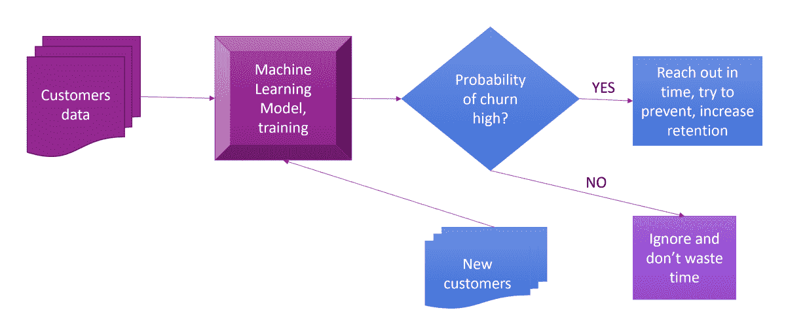

Image by the author — customer churn model idea

机器学习的主要特征是能够构建能够发现数据中的模式并从中学习的系统——而无需显式编程规则。在客户流失预测模型中，该模型将观察降低客户使用公司服务/产品满意度的行为特征和其他特征。

首先，在训练阶段，机器学习算法将揭示那些已经离开公司的客户的一些共享行为模式。

然后，一旦经过训练，算法可以对照这些模式检查未来客户的行为，并指出潜在的搅动者。

有了这些知识，公司就可以积极主动地与这些客户接触，了解他们的痛点，并在流失发生之前防止流失。

# 客户流失预测数据集

那么，我们如何开始预测客户流失率呢？需要哪些数据？

对于本教程，我们使用来自 Kaggle 的[电信客户流失](https://www.kaggle.com/blastchar/telco-customer-churn)数据集，这是一个非常流行的客户流失建模工具。

每行代表一个客户，每列包含客户的属性。

数据集包含以下信息:

*   离开的客户——该列称为“流失”,这将是我们模型中的目标列(我们想要预测的东西)
*   每位客户已注册的服务—电话、多条线路、互联网、在线安全、在线备份、设备保护、技术支持以及流媒体电视和电影
*   客户账户信息——他们成为客户的时间、合同、支付方式、无纸化账单、每月费用和总费用
*   客户的人口统计信息—性别、年龄，以及他们是否有伴侣和家属

# 导入数据集

让我们导入并解析之前从 Kaggle 下载的 CSV 文件。

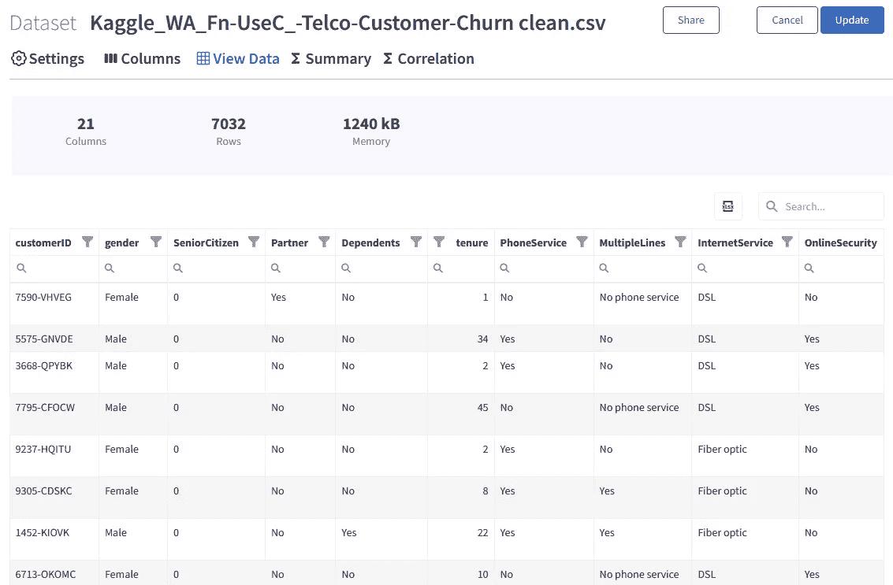

Image by the author: churn training dataset in Graphite

我们可以在“查看数据”选项卡上浏览数据集行、过滤或搜索。

我们有 21 列和 7032 行。

Graphite 中每个上传的数据集都有一个实用的摘要选项卡。它可以让您一目了然地检查数字列的分布、空值的数量以及不同的统计度量。

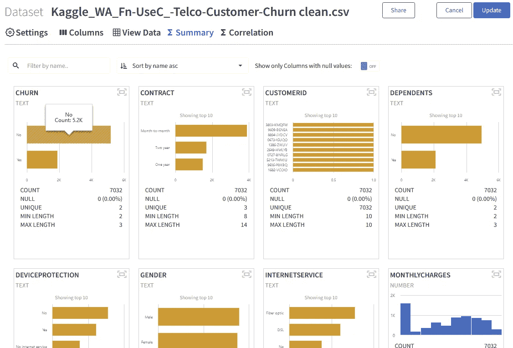

Image by the author: customer churn training dataset summary in Graphite

我们可以快速检查我们的目标列“客户流失”，解释客户是否离开，不是很不平衡。这意味着我们有足够的“是”和“否”信号来训练模型。

有趣的是看到了一些栏目的分布，比如“月费”。我们的大多数客户每月收费高达 28 美元。另一个客户群以 80 美元/月左右为中心。

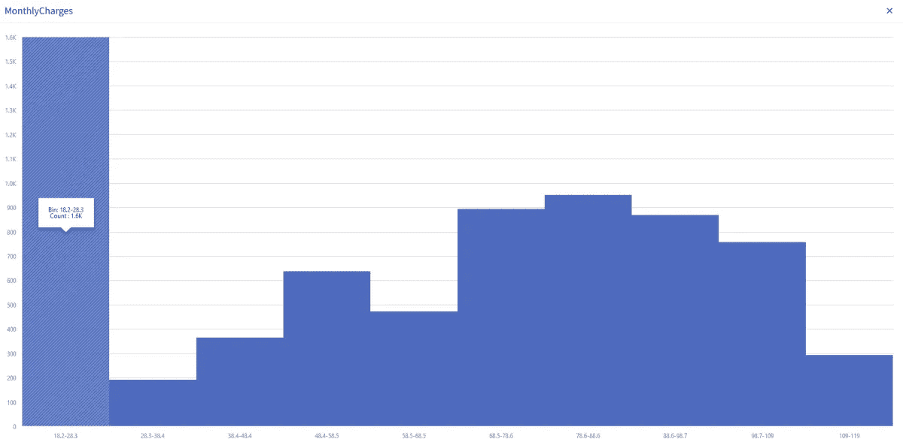

Image by the author: monthly charges distribution

# 数据集分类模型

预测客户流失是二进制机器学习分类的一个很好的用例。

原因是因为我们的目标变量，“搅动”只能有两种状态-

# 运行无代码分类机器学习模型

现在我们已经上传了数据集。一切都是为了在 Graphite 中创建一个无代码的机器学习模型。我们选择了**二元分类模型**。

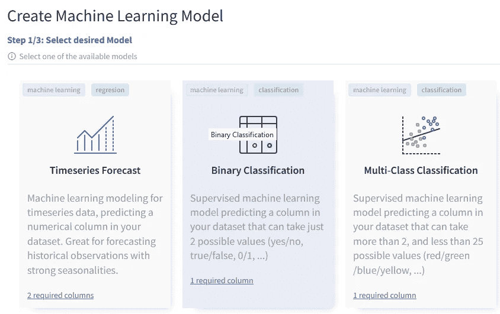

Image by the author: a Model selection in Graphite

在 Graphite 中，要构建二进制分类模型，您需要

*   一个二元目标列(我们预测的是什么，只有两个不同的状态？对我们来说，这是一个栏目“流失”)
*   一组特征(数据集中对目标列有影响的其他列)

只需点击几下鼠标，我们将在 Graphite 中定义一个模型场景。

我们从数据集中选择我们的**目标列**:

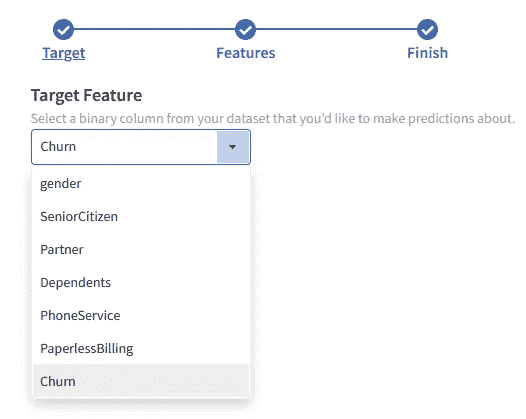

Image by the author: target column selection in Graphite

我们选择了所有其他列作为特征。

# 机器学习模型结果

我们将默认保留所有其他选项，并运行此场景。

Graphite 将负责几个预处理步骤以达到最佳效果，所以您不必考虑它们。如果你对技术感兴趣，所有这些预处理步骤都会自动发生:

*   空值处理
*   缺少值
*   一个热编码
*   修复不平衡
*   正常化
*   常数
*   基数

Graphite 将从我们的数据中抽取 80% (5625 行)的样本，训练**几个机器学习模型**。

然后，它将在剩余的 20% (1407 行)上测试这些模型，并计算相关的模型分数。根据分数，它将为数据集选择性能最佳的模型。

大约 20 秒的训练后，最佳模型拟合、结果和预测可在*结果*选项卡上获得。

在我们的案例中，基于 F1 值得分的最佳模型是**逻辑回归**。下面列出了其他模型的培训指标。

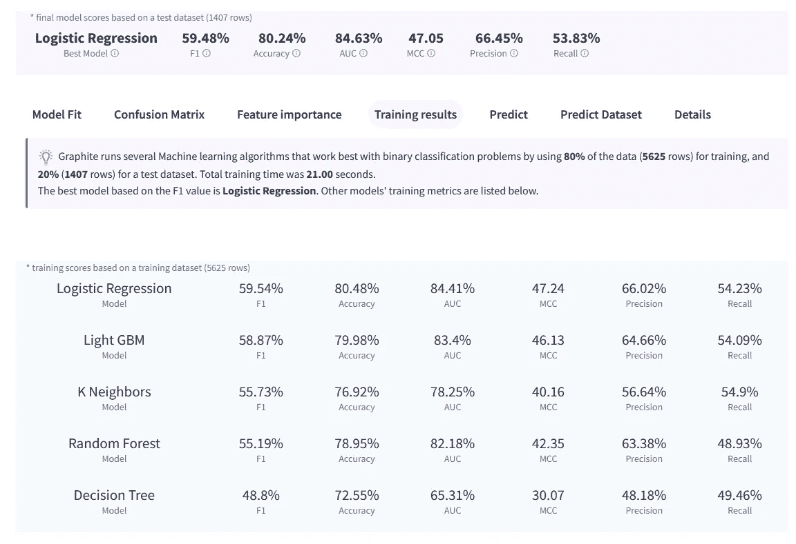

Image by the author: customer churn training results in Graphite

# 混淆矩阵

混淆矩阵很容易看出模型是否混淆了两个类(在我们的例子中是和不是)。对于每个类别，它总结了正确和错误预测的数量。该模型预测了 1407 行测试数据集的列“变动”,并将预测结果与历史结果进行了比较。

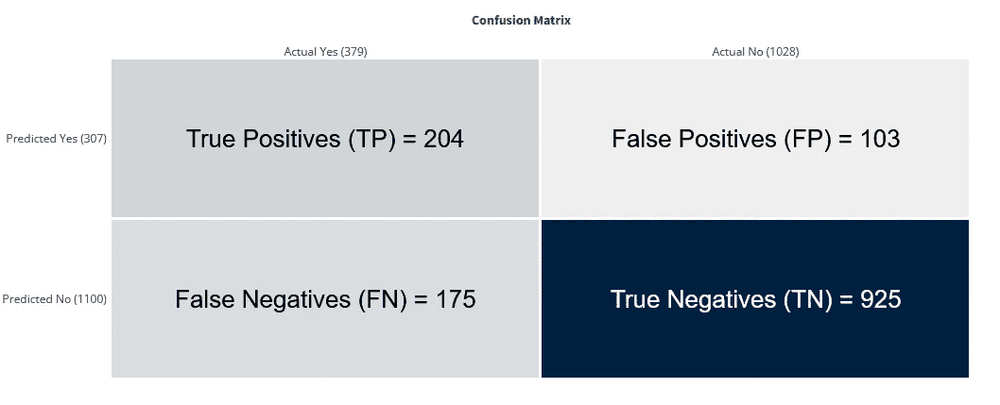

Image by the author: customer churn confusion matrix in Graphite

**正确预测**

1407 行测试中共有 1129 行。这就是定义模型准确度= 80.24%

真阳性(TP) = 204:一行是 Yes，模型预测它的类是 Yes。

真负数(TN) = 925:一行是 No，模型预测它没有类。

**错误**

1407 行测试中共有 278 行，占 19.76%

误报(FP) = 103:一行是 No，而模型预测它是 Yes 类。

假阴性(FN) = 175:一行是 Yes，而模型预测它没有类。

**其他型号分数**

请注意，我们将预测值描述为正和负，将实际值描述为真和假。

*精度*，(TP + TN) /合计。

从所有的类(正类和负类)来看，80.24%我们都预测对了。
精度要尽可能高。

*精度*，TP / (TP + FP)。

从所有我们预测为正的类中，实际上有 66.45%是正的。
精度应尽可能高。

*回忆*，TP / (TP + FN)。

在所有的积极类中，53.83%我们预测正确。
召回率要尽可能高。

*F1 得分*，2 *(精度*召回)/(精度+召回)。

f1-得分为 **59.48%** 。它有助于同时测量查全率和查准率。

# 特征重要性

特征重要性是指该模型在多大程度上依赖于每一列(特征)来做出准确的预测。模型越依赖某一列(特征)来进行预测，它对整个模型就越重要。Graphite 使用**排列特征重要性**进行计算。

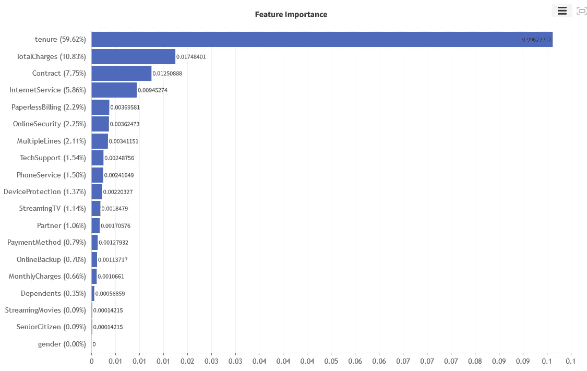

Image by the author: customer churn feature importance in Graphite

最重要的特征是列

*   “任期”(客户在公司工作的月数)，然后
*   "总费用"，
*   “合同”，
*   “互联网服务”等等。

例如，“性别”和客户是否是“老年人”对流失没有任何影响。

在 Graphite 中，很容易检查与我们的目标色谱柱相关的任何特性(“搅动”)。

图例:

*   绿色——搅动的顾客
*   蓝色—仍与我们合作的客户

请注意，大多数流失发生在任期 0-5 个月，然后是任期 50-55 个月。已经为客户成功团队提供了一些有价值的信息。

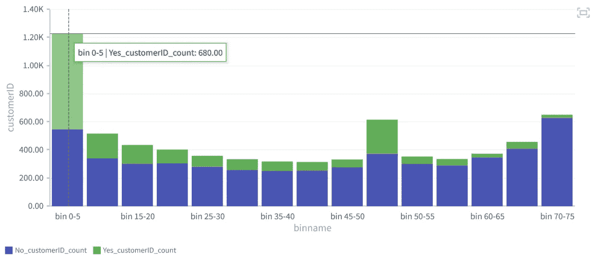

Image by the author: tenure and customer churn

下一个观点是，大多数流失可以在“逐月”合同中看到:

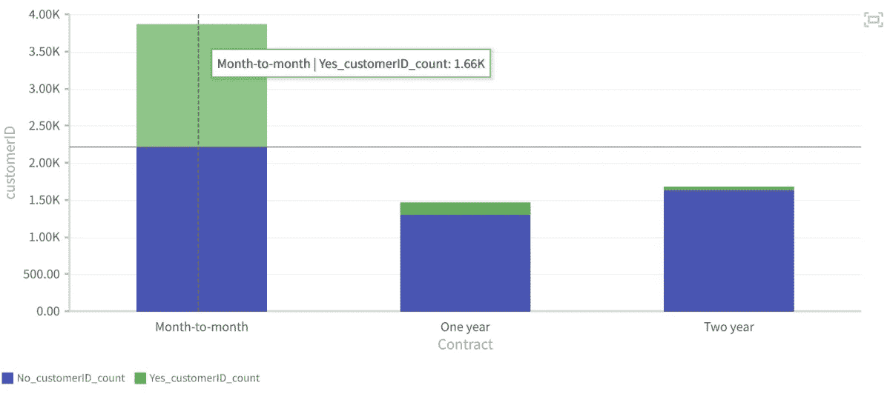

Image by the author: contract and customer churn

关于互联网服务——如果客户使用“光纤”,他们流失的可能性会更大。

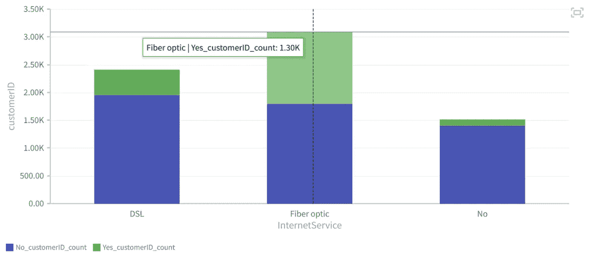

Image by the author: internet service and customer churn

# 最后—对新客户的预测！

重要的是说 Graphite 自动部署训练好的模型。

这意味着，很容易预测新的、看不见的客户流失数据。我们可以得到诸如“谁将是下一个客户流失者”等问题的答案。“这种结果的可能性有多大”？

在您使用 Graphite 训练客户流失模型之后，您的团队会向您提供新客户的信息。

你可以很容易地检查客户是否会流失，以及流失的可能性。

增加你记忆的有力工具。

让我们检查一个新客户的流失预测:

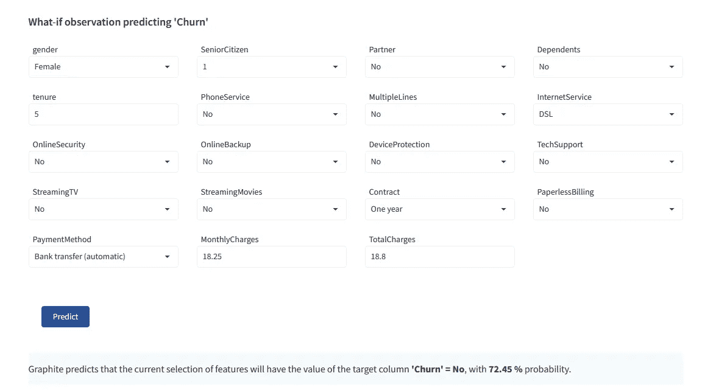

Image by the author: predicting churn in Graphite

> 基于历史数据的训练模型声称，这一次不会发生变化，概率为 72%。他不是客户成功团队的目标。与目前有流失风险的客户相比，她更适合追加销售或参与案例研究。

对于另一个新客户，模型预测她**将**流失:

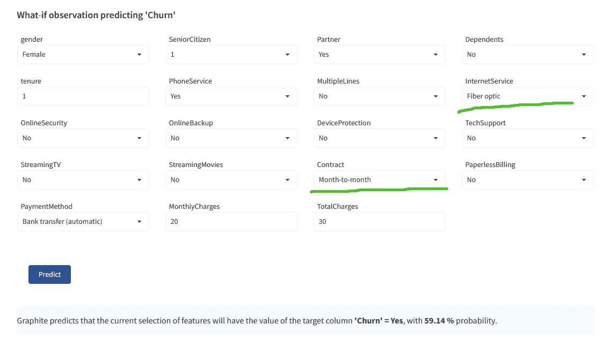

Image by the author: predicting churn in Graphite

如果你还记得的话，主要的驱动因素是任期、合同和互联网服务——这位客户有一份*按月*的合同和*光纤*，这表明她可能会流失。

# 结论

客户流失是基于订阅的公司的一个自然健康指标。识别对提供的解决方案不满意的客户，使企业能够了解运营问题、产品或定价计划的弱点以及客户偏好，从而主动减少客户流失的原因。
此外，定义数据源以全面了解客户互动历史也很重要。数据集的质量越高，预测就越精确。

我希望这能帮助你理解在像 [Graphite](https://graphite-note.com) 这样的无代码机器学习软件中训练模型是多么容易。只需点击几下鼠标，我们就可以训练 ML 模型并进行预测。

您可以在此探索所有其他石墨[型号。](https://graphite-note.com/machine-learning-automl-models)随意在任何数据集上训练您的机器学习模型，同样容易；或者[如果您需要任何帮助或有任何问题，请安排演示](https://graphite-note.com/no-code-machine-learning-demo)。

我希望你喜欢它！

*原载于 2022 年 4 月 6 日*[*https://graphite-note.com*](https://graphite-note.com/effective-customer-churn-prediction)*。*