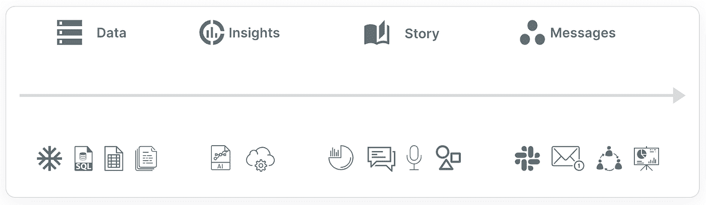
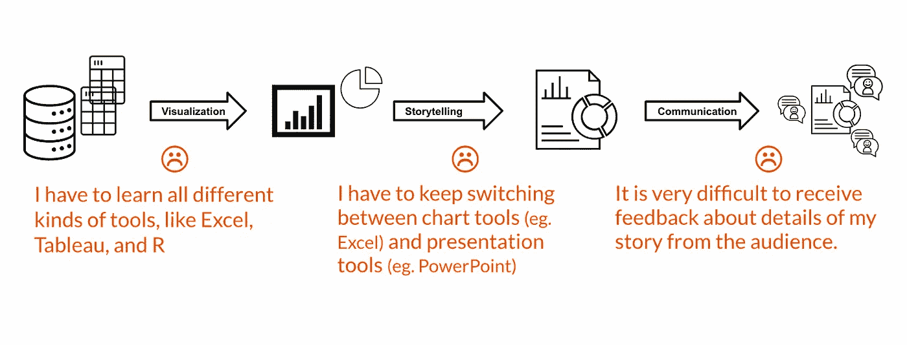

# 有效的数据洞察沟通是什么样的？

> 原文：<https://medium.com/geekculture/effective-data-communication-961ce0a040fe?source=collection_archive---------13----------------------->

## 价值的速度，受众的速度

Photo by [Jason Rosewell](https://unsplash.com/@jasonrosewell?utm_source=medium&utm_medium=referral) on [Unsplash](https://unsplash.com?utm_source=medium&utm_medium=referral)

数据无处不在，价值就藏在那里。

今天，许多人和我们一样，忙着挖掘数据，试图从中找到意义，最重要的是与我们的观众及时沟通。事情变化很快，我们关心我们在数据洞察沟通方面的有效性。

# 数据洞察交流

数据洞察沟通是使用数据传达信息。这是一项如此日常的活动，几乎我们每个人都在重复进行，无论我们为经理在纸上写下销售数字，还是在会议上用图表幻灯片进行演示，它们都是数据洞察交流。数据洞察交流帮助我们更容易地理解世界，因为我们的大脑更好地理解一个简单的事实，并以数据支持它。

# 四大支柱

数据洞察沟通是一个过程，我们通过 4 个关键步骤来进行数据洞察沟通:

1.  数据
2.  洞察力
3.  讲故事
4.  沟通

顾名思义，我们需要从**数据**开始，如今数据在数量和维度上都呈爆炸式增长，其规模超出了传统的处理方式，现代数据堆栈将云数据仓库作为其核心，我们预计随着时间的推移，它将稳步增长，越来越多的企业将因其简单性而使用它。

从数据到**洞察**，这是我们如何从海量数据中挖掘价值并以全面的可视化格式呈现的过程，这通常意味着图表呈现分析结果。数据分析是一项技术性工作，你不仅要选择正确的维度和度量标准，还要知道如何使用旋转和切片来获取有价值的信息。在人工智能的帮助下，数据分析可能会成为一项超级简单的半自动工作。我们预计，越来越多的分析工具将利用更多的人工智能来改进分析建议，并自动检测有趣的数据点。

**讲故事**对于向你的观众提供准确的理解是如此重要，不幸的是，它在今天的大多数分析工具中是缺失的。有多少次你看着图表，想知道它的意思？好吧，一个图表可以讲述数百个不同的故事，但应该只有一个是你想让你的观众得到的，所以不要忽视它。它更重要也更有效。讲故事就是要发挥讲故事人的创造力，设计出一个晶莹剔透的数据信息。

最后但同样重要的是，**沟通**是流程的最后一个支柱，事实上，它是目的地，也是 data insights 沟通流程的最终目标。很多时候，我们认为沟通是单向的，比如你发一封电子邮件，你制作和共享一个仪表板，那些在快节奏的动态环境中变得越来越没用，现在，我们更可能想要

*   双向通信
*   观众的早期参与
*   快速迭代
*   协作和交流

让我们总结一下数据洞察沟通的四大支柱:

4 pillars in data insights communication

# 支离破碎的过程

今天，当人们进行数据洞察交流时，他们最终会寻求许多不同的工具来完成工作，例如，您使用工程工具来处理数据(如 SQL)，使用可视化工具来获得图表(如 Tableau)，使用演示工具来讲述故事(如 PowerPoint)，以及使用电子邮件工具来共享内容。

Fragmented process of data insights communication

我们都感受到了学习许多不同工具和支付不同服务的乏味过程中的痛苦。因此，我们高度相信，真正帮助人们进行有效的数据洞察交流的一站式商店是这样一种需求，它将使我们的生活更轻松、更快乐。

# 理想世界

在一个理想的世界中，我可以想象一个顺畅的数据洞察交流过程:

登录到工作区，我可以**连接**我关心的任何类型的数据，我可能需要查看一些电子表格，我可能需要从数据仓库中提取大量数据，或者我甚至可能对一些实时数据感兴趣，以了解现在正在发生的事情。当我说“连接”时，我的意思是只需点击几个按钮来建立连接，系统会给我一些可视化的**建议**，我可以开始使用，在最好的情况下，我不需要任何修改，它会挖掘我想要分享的内容。我有易于使用的**设计**工具，嗯，也许像 Figma 和我在几分钟内制作我的美丽故事，就在现场，我可以让我的一些朋友/队友检查我有什么，我们可以在适当的地方自由讨论，并在适当的地方快速更新。最后，我只需点击一个按钮就可以**发布**我的作品，并通过 Slack、已发布的网页或嵌入式视图更广泛地分享。

整个过程没有摩擦，我真的很喜欢，最重要的是，我只用了几分钟就完成了整个过程。

# 结论

在这篇短文中，我们讨论了有效的数据洞察沟通的趋势需求的背景，然后我们讨论了有效的数据洞察沟通的框架，以及它的 4 个支柱在做什么。

我们讨论了有效的 data insights 沟通对我们每个人的重要性，以及理想场景对我们工作生活的益处！

我希望您喜欢这次讨论，在专栏中，我们正在努力构建理想的一站式商店，我们希望您能加入我们的行列，让 data insights 的交流每天都更好！

如果你觉得这个话题很有趣，可以看看这个[短视频](https://www.loom.com/share/af15e6169d8c422db503e42f5c1edf2b)如何只用 5 分钟就发布了这样一个漂亮的数据故事:[在枪击事件中丧生的人](https://columns.ai/visual/view/dKZoNqrGcVWUcg)。