# 借助 Power BI 实现高效报告

> 原文：<https://medium.com/geekculture/effective-reporting-with-power-bi-e1309f8c304a?source=collection_archive---------7----------------------->

## 更好可视化的提示和技巧

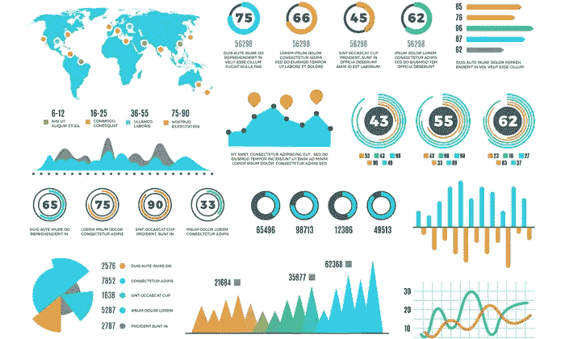

Photo by [Neil Patel](https://neilpatel.com/blog/data-visualization/#:~:text=Data%20visualization%20can%20help%20you,find%20it%20interesting%20and%20engaging.)

大家好，

日复一日，Power Bi 在业务分析师和其他技术人员中迅速变得更受欢迎。

在本文中，我们将深入探讨 Power-Bi 及其功能和特性。

# 目录:

1.  🕵️‍♀️视觉分析公司
2.  颜色变化🔵
3.  导入单词云☁
4.  进口 325 种视觉➕
5.  合并图像🎴
6.  PowerBI 中的模板📋
7.  ✨表演
8.  需要遵循简单的实践🤓

# 1.添加可视化分析

在某些视觉效果上，您可以在可视化效果下添加趋势线、平均线、常数线等分析。

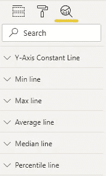

Photo by [Author](https://harshkothari21.medium.com/)

*   例如:假设我想在下面显示的面积图上添加一些分析。这张图表显示了学生每学期的表现。

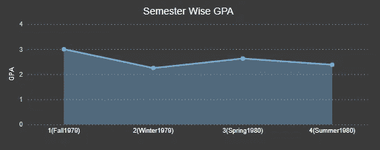

Image by [Author](https://harshkothari21.medium.com/)

> 你能给这张图表添加什么使它看起来更有效？

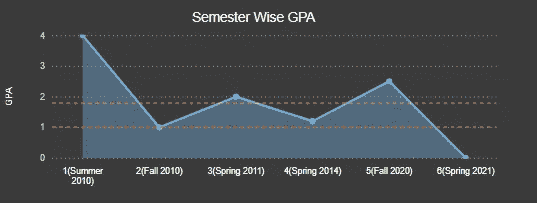

Image by [Author](https://harshkothari21.medium.com/)

*   恒定线(红色)—如图所示，恒定线(作为阈值线)表示需要保持的最小截止值。
*   平均线(黄色)—平均线表示学生的平均 GPA 分数。平均线落在门槛线以上说明学生学习成绩好。

# 2.颜色变化

有时候，用一个颜色过滤器来表示卡片上的值是很好的。您可以在可以指定规则的数据标签部分找到它。

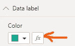

让我们在毕业分数上应用一个颜色规则。

如果该值接近 100%，它显示绿色，当该值接近 0%时，它显示红色。绿色代表学生足够安全可以毕业，而红色代表*危险*。

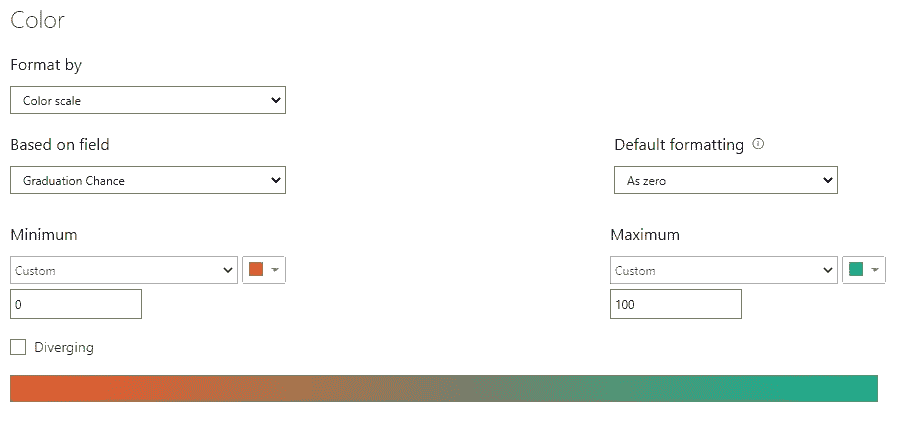

Photo by [Author](https://harshkothari21.medium.com/)

# 3.导入 Word Cloud 和其他视觉效果

想把你的数据在 word cloud 上表现成这样？👇

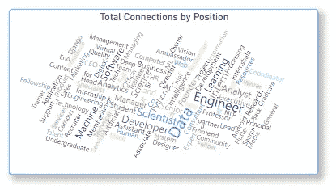

Photo by [Author](https://harshkothari21.medium.com/)

“可视化”选项卡中没有可用的单词云。要导入视频，您需要从 Microsoft store 下载视频。这是下载视频的链接([点击这里](https://appsource.microsoft.com/en-us/product/power-bi-visuals/wa104380752?tab=overview))。

下载后，您可以通过点击可视化选项卡下的 3 个点将可视化导入仪表板。

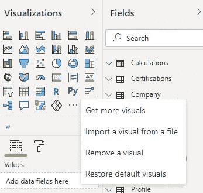

Photo by [Author](https://harshkothari21.medium.com/)

此外，还有许多其他可用的视觉效果，如:

*   百分表
*   龙卷风图表
*   弦
*   旭日
*   项目符号图

> 商店里总共有 325 种视觉效果。([点击这里](https://appsource.microsoft.com/en-us/marketplace/apps?page=1&product=power-bi-visuals))

# 5.合并图像

人类处理图像的速度往往快于文本。您可以为卡片类型或切片器添加图像。让我给你看一些例子👇

Photo by [Author](https://harshkothari21.medium.com/)

如上所示，这很容易解释，因为我已经在每个卡片类型的视觉效果上添加了图像。

Photo by [Author](https://harshkothari21.medium.com/)

如上所示，一组图像被用作筛选报告页面的切片器

图像也可以用作按钮或切片器。因此，我们可以使用图像类型的切片器，而不是下拉切片器或列表类型的切片器，单击图像可以过滤出可视化效果，或者可以是导航到另一个报告页面的按钮。

# 6.模板

模板基本上可以分为三类:

1.  简单模板
2.  主题模板
3.  又名模板

## 简单模板

它基本上是一个 powerBI 文件，包含报告的所有元数据，但不包含数据本身。

每当您将文件另存为”。pbix "报告中加载的数据也会被保存。将报告另存为”。pbit "它只保存表模式，不保存实际数据。

> *如何创建模板文件？🤔*

保存 powerbi 文件时，单击另存为→模板文件。它会将文件保存为“example.pbit”。

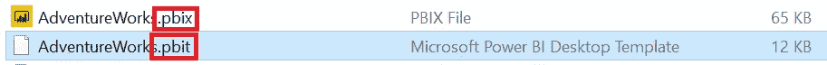

Photo by [Author](https://harshkothari21.medium.com/)

> "注意上图中的文件扩展名和文件大小"

因此，下次您打开模板文件时，它会要求数据源连接到报告。如果您没有选择任何要连接的数据源，它将显示一个空白报告。

*使用该模板的优点是:*

*   每当用户打开模板文件时，都会要求提供数据源的凭据以连接到报表。因此，共享一个 PowerBI 模板文件将导致数据安全，其中没有私有数据被共享。
*   文件大小要小得多，因为它不存储数据。

## 主题模板

在 Power BI 中使用模板的一个完全不同的概念是将颜色主题应用到您的报告中。Power BI 社区门户包含一整套主题，您可以通过以下链接访问:

 [## 主题库

### 展示令人惊叹的报告主题。

community.powerbi.com](http://community.powerbi.com/t5/Themes-Gallery/bd-p/ThemesGallery) 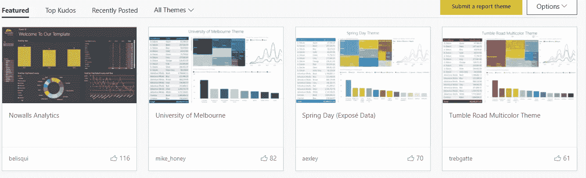

Photo by [Author](https://harshkothari21.medium.com/)

从图库中选择任意主题并下载“json”文件。当您在 PowerBI desktop 上构建报告时，您可以简单地导入主题文件。

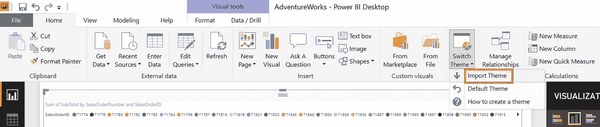

Photo by [Author](https://harshkothari21.medium.com/)

*主题模板的优势:*

*   这是 Power BI 的一个非常强大的功能:通过选择主题，您可以快速、轻松地使 Power BI 报告适应您公司的颜色。

## 又名模板

当您开始创建一个新报告时，您可能希望通过查看由有经验的 PowerBI 用户创建的其他报告来寻找灵感。

因此，模板对于快速创建新报告非常有用。

在这种情况下，数据故事库可能会有所帮助。环👇

 [## 数据故事库

### 一个展示数据故事的展示。

community.powerbi.com](https://community.powerbi.com/t5/Data-Stories-Gallery/bd-p/DataStoriesGallery) 

假设您想要构建一个销售分析仪表板，那么查看其他类似的仪表板，向您的头脑提供想法，同时揭示项目代码的瓶颈。

Photo by [Author](https://harshkothari21.medium.com/)

# 7.表演

当你有 50K 以上的记录时，性能就成了一个大问题，而且它还在不断增加。

> 如何衡量业绩？

因此，有许多工具可以用来分析报表性能和数据模型性能。我在这里提到了其中一些👇

*   [**DAX 工作室**](https://daxstudio.org/)
*   [**ALM 工具包**](http://alm-toolkit.com/)
*   [**表格编辑器**](https://tabulareditor.com/)
*   [**power bi 桌面中的性能分析器**](https://docs.microsoft.com/en-in/power-bi/create-reports/desktop-performance-analyzer)
*   微软文档 中提到了更多

> 有什么提高性能的技巧吗？

MOST IMP —在将数据加载到模型中时，选择您计划在其上报告的列。**不要加载不必要的数据，不要拉不需要的列。**

# 8.要遵循的日常惯例

*   简单:不要太注重视觉效果，遵循传达信息的想法。
*   交互性和**交叉过滤**功能是 powerbi 最优秀的特性
*   意义:考虑信息而不是图形
*   有效利用诸如层次结构、书签、选择窗格、空白按钮、过滤器等功能。(也许另一篇文章讨论高级主题)

# 参考

1.  想从一开始就学习 PowerBI 模板，这里有一个指南链接:

[https://www . powerbitutorial . org/tutorials/Power-bi-templates/#:~:text = Power % 20 bi % 20 templates % 20 are % 20a，t % 20 包含% 20 数据% 20 本身](https://www.powerbitutorial.org/tutorials/power-bi-templates/#:~:text=Power%20BI%20Templates%20are%20a,t%20contain%20the%20data%20itself)。

2.了解更多关于 power-bi 的技巧和窍门的最佳 Youtube 频道

[https://www.youtube.com/c/GuyinaCube](https://www.youtube.com/c/GuyinaCube)

👉感谢你阅读这个故事，❤