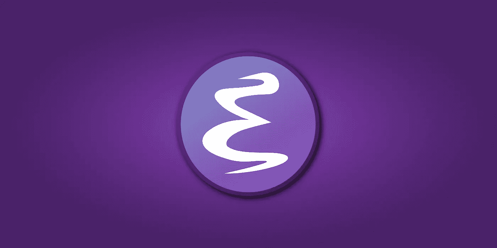

# Emacs 优于当前文本编辑器的八大理由

> 原文：<https://medium.com/geekculture/eight-reasons-why-emacs-is-better-than-your-current-text-editor-7ae0d4e03f02?source=collection_archive---------11----------------------->

如果你正在阅读这篇文章，[很可能](https://insights.stackoverflow.com/survey/2016#technology-development-environments)你经常使用记事本、Visual Studio 或 Sublime 来编写代码和编辑文本。以下是您应该使用 Emacs 的原因。

Image by Author

Emacs 是一个命令行文本编辑器，您可以使用它来完成几乎任何与开发相关的任务。如果您还不熟悉命令行编辑器，它们是…