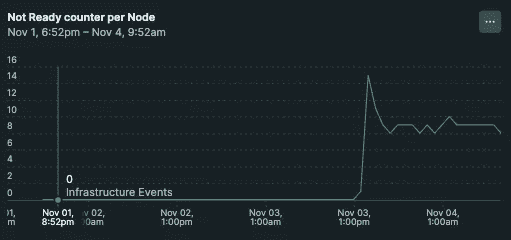
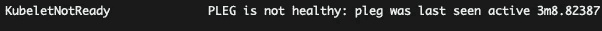
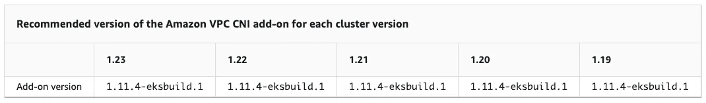
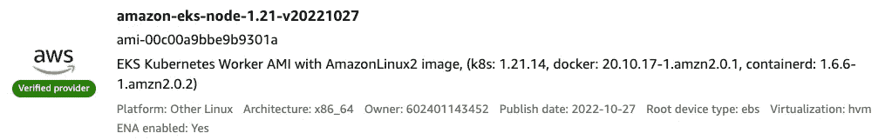
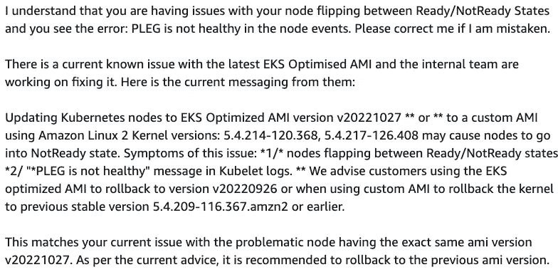

# EKS —库贝内特斯—未就绪节点

> 原文：<https://medium.com/geekculture/eks-kubernetes-not-ready-nodes-dafb300ed299?source=collection_archive---------3----------------------->


Photo by [dominik hofbauer](https://unsplash.com/@dominikhofbauer?utm_source=medium&utm_medium=referral) on [Unsplash](https://unsplash.com?utm_source=medium&utm_medium=referral)

今天我要谈谈几天前我在开发 EKS 1.21 时遇到的一个问题。
*如果你喜欢这个故事记得鼓掌并希望订阅，我真的很感激！*

我经常在 Kubernetes 工作，昨天晚上我看到几个 Kubernetes 节点在各种状态之间摆动。



Number of NotReady Events for a specific node

告诉我某些东西工作不正常的症状有:

*   Pod 处于`containerCreating`状态超过 2 分钟
*   更慢的`gitlab-runner`创作时间，由于上面的要点
*   Pod 在`Terminating`中超过 5 分钟，没有 pdb/奇怪的优雅终止
*   一些节点在`Ready/NotReady`状态之间翻转的警报

所以我决定去看看是怎么回事。

```
kubectl describe <NODE-NAME>
```

在条件部分，我看到了错误:



```
KubeletNotReady  PLEG is not healthy: pleg was last seen active xx
```

这是前所未见的，所以我开始寻求谷歌搜索的帮助。

第一篇文章已经:[https://developers . red hat . com/blog/2019/11/13/pod-life cycle-event-generator-understanding-the-pleg-is-not-healthy-issue-in-kubernetes](https://developers.redhat.com/blog/2019/11/13/pod-lifecycle-event-generator-understanding-the-pleg-is-not-healthy-issue-in-kubernetes)

这篇文章技术性很强，阅读和理解起来很酷，它解释了什么是 PLEG 及其背后的源代码。多亏了它，你可能明白为什么下面的问题会带来`PLEG is not healty.`

所以更好地搜索，我在 GitHub/Reddit 上看到了不止一两个问题:

*   CNI/网络问题—旧版本—缺少 IP
*   由于特定的工作负载/自动扩展，在同一节点中调度的大量 pod 经常`created/terminated`
*   docker 守护程序/容器的重新启动—版本不匹配…
*   已装入卷的问题
*   其他原因一如既往..

因此，我使用以下代码查看了 EKS 是否有新版本的 CNI:



Ref: [https://docs.aws.amazon.com/eks/latest/userguide/managing-vpc-cni.html](https://docs.aws.amazon.com/eks/latest/userguide/managing-vpc-cni.html)

我使用的正是这里提到的版本。
与此同时，我试图查看工作节点日志、EC2 实例状态/监控、VPC 配置以及我能想到的一切。


Photo by [Hello I'm Nik](https://unsplash.com/@helloimnik?utm_source=medium&utm_medium=referral) on [Unsplash](https://unsplash.com?utm_source=medium&utm_medium=referral)

在某种程度上，我决定尝试一种不同的方法来比较一个`Healthy/NotHealhty`节点。
该问题发生在两个完全不同的集群中，很明显，该问题仅在`cluster-autoscaler.`要求的`new worker nodes`给出

所以我决定更仔细地看看`NodeGroup`和节点的系统信息:

```
kubectl describe node <NODE_NAME> | grep -A 10 "System Info"System Info:   
Machine ID:                 xxx   
System UUID:                xxx   
Boot ID:                    xxx   
Kernel Version:             5.4.217-126.408.amzn2.x86_64   
OS Image:                   Amazon Linux 2   
Operating System:           linux   
Architecture:               amd64   
Container Runtime Version:  docker://20.10.17   
Kubelet Version:            v1.21.14-eks-ba74326   Kube-Proxy Version:         v1.21.14-eks-ba74326
```

一个`Healthy/NotHealhty`节点之间的一切都是一样的。

在某种程度上，我想到了工作节点中使用的 AMI。
AWS 经常为 EKS 工作节点发布新的 AMI，最近一次发布 AMI 是在 27/10/22。



仔细观察，我发现遇到这个问题的两个工作节点使用的是同一个 AMI。

```
Name: amazon-eks-node-1.21-v20221027
ID: ami-00c00a9bbe9b9301a
```

那怎么办呢？

1.  回滚到以前的工作版本
2.  筹集 AWS 的门票

几个小时后，我从 AWS 支持中心回来了:



所以这个问题就是 AMI。

# 看了这个回复我的感觉很不好…

为什么没有人就这样的问题发送通知？

*“如果一棵树倒在森林里，没有人听到，它会发出声音吗？
贝克莱认为物体只有在被感知时才存在。因此，如果一棵树在森林里倒下，没有人听到，它不会发出任何声音。‘*

好好看我发现破版已经
`[RECALLED] AMI Release v20221027`

..而且 Github 上还有一个官方问题:[*https://github.com/awslabs/amazon-eks-ami/issues/1071*](https://github.com/awslabs/amazon-eks-ami/issues/1071)


[https://github.com/awslabs/amazon-eks-ami/releases](https://github.com/awslabs/amazon-eks-ami/releases)

我希望有人能从这篇博文中得到一些帮助，支持我的你可以**c*lap****&****subscribe****在接下来的几周得到更多*！**

**

> *[关注我](https://pie-r.medium.com/)和[订阅](https://pie-r.medium.com/subscribe)来获取这个系列和下一个系列的更新！*