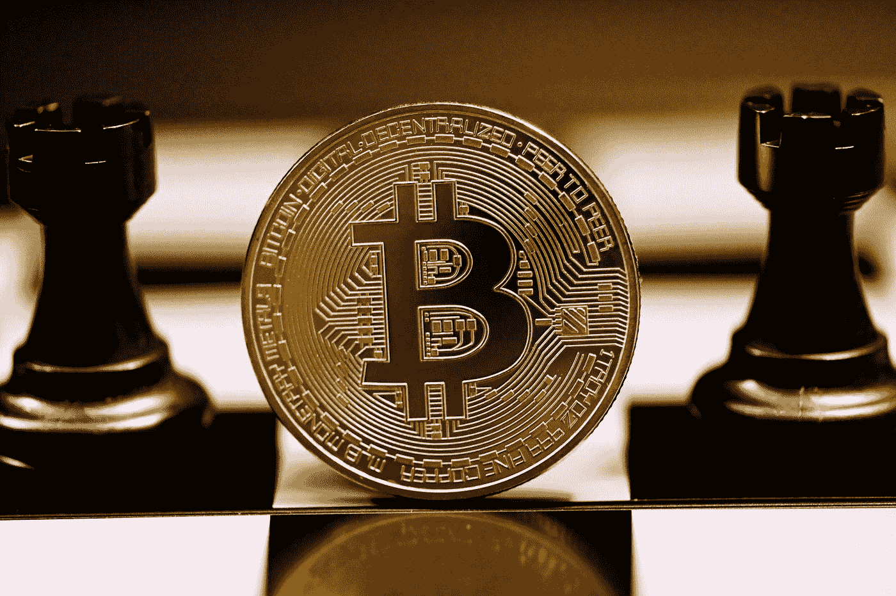

# 萨尔瓦多使比特币成为合法货币

> 原文：<https://medium.com/geekculture/el-salvador-makes-bitcoin-legal-tender-137e5cd651a8?source=collection_archive---------23----------------------->

Photo by [Executium](https://unsplash.com/@executium?utm_source=medium&utm_medium=referral) on [Unsplash](https://unsplash.com?utm_source=medium&utm_medium=referral)

自 9 月 7 日起，比特币将成为萨尔瓦多的法定货币。萨尔瓦多是第一个完全开放使用比特币的国家。已经迈出了第一步。

萨尔瓦多是中美洲的一个发展中国家，与洪都拉斯和危地马拉接壤。与其他发展中国家相比，萨尔瓦多的国内生产总值增长相对较低。22.8%的人口生活在…