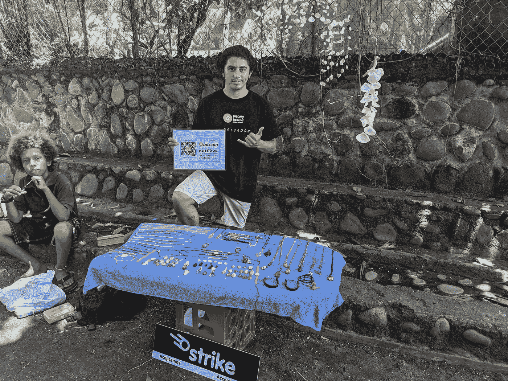

# 萨尔瓦多加速进入未知领域

> 原文：<https://medium.com/geekculture/el-salvador-speeds-into-the-unknown-27c213ffbad5?source=collection_archive---------17----------------------->

**比特币国家诞生之初的第一印象**

再过八天，萨尔瓦多将成为世界上第一个承认比特币为法定货币的国家，但你绝对不会从四处走走和当地人聊天中猜到这一点。

一周前，我抵达首都圣萨尔瓦多，期待着一些与我所见不同的东西。我是比特币的长期拥护者，并且…