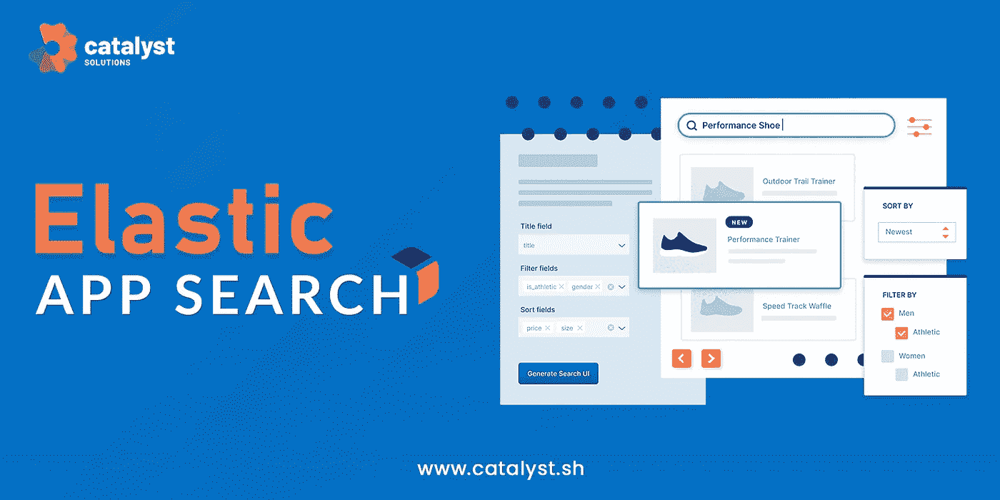
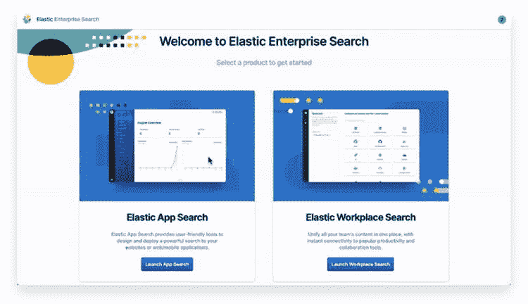
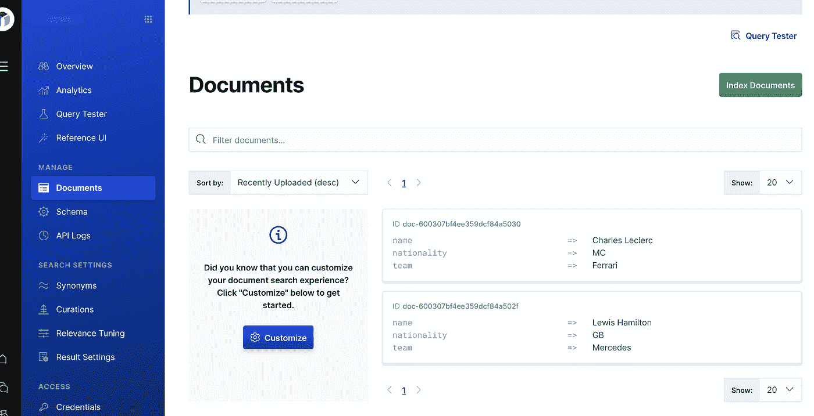
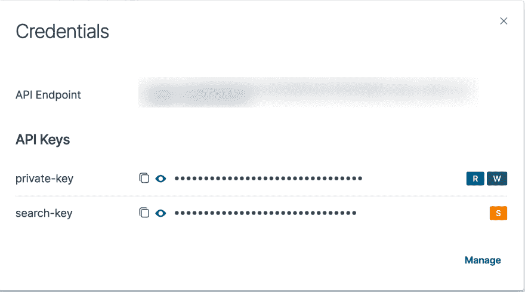
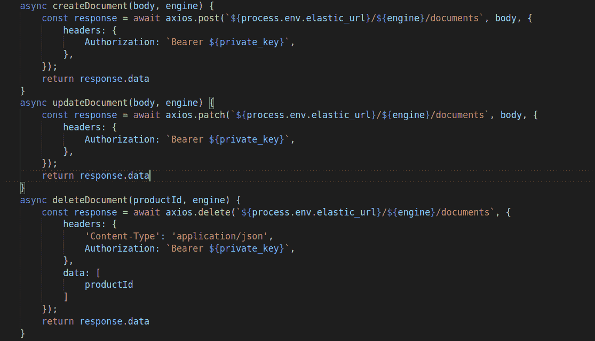

# 弹性应用搜索

> 原文：<https://medium.com/geekculture/elastic-app-search-fabeb3bb6ae8?source=collection_archive---------5----------------------->



Elastic App Search

Elastic App search 是在 Elasticsearch 之上提供 ***强大的搜索、聚合和分析功能*** 的产品

它通过一套完善的 API 和直观的仪表板，将 Elasticsearch 的强大功能带到您的公司网站、电子商务网站或应用程序中。获得无缝的可扩展性、可调的相关性控制、全面的文档、维护良好的客户端和强大的分析，为您的客户构建领先的搜索体验。

Elastic App Search 与 Workplace Search 打包成一个名为[**Elastic Enterprise Search**](https://www.elastic.co/guide/en/enterprise-search/7.14/index.html)的解决方案。

弹性企业搜索可以部署在弹性云上，也可以在内部运行解决方案

**安装**

**先决条件**

*   下载并安装一个[支持的 JDK](https://www.elastic.co/support/matrix#matrix_jvm)用于企业搜索。
*   您需要启动并运行 Elasticsearch，同时启用安全功能

**设置弹性企业搜索**

1.  下载当前版本的 Elastic Enterprise Search，并导航到未压缩的目录。
2.  locate config/enterprise-search . yml 并添加以下配置:elastic search . username:ELASTIC
    ELASTIC search . PASSWORD:`ELASTIC_USER_PASSWORD allow_es_settings_modification: true`
    用 ELASTIC 用户密码替换 ELASTIC_USER_PASSWORD。
3.  您还必须在 same config/enterprise-search . yml 配置文件中将至少一个加密密钥设置为数组:secret _ management . ENCRYPTION _ keys:[*ENCRYPTION _ KEY _ 1，ENCRYPTION_KEY_2，…* ]
4.  通过指定默认 enterprise_search 用户的密码来启动企业搜索:
    `$ ENT_SEARCH_DEFAULT_PASSWORD=passwordexample bin/enterprise-search`
    这是重要的一步。环境变量`ENT_SEARCH_DEFAULT_PASSWORD`只被 Enterprise Search 使用一次，以便在产品首次启动时提供默认的 enterprise_search 用户密码。
5.  在`[http://localhost:3002](http://localhost:3002/)`使用 enterprise_search 用户名和之前在开始时指定的密码登录到弹性企业搜索体验。
6.  在弹性企业搜索主页区域，从以下选项中选择最符合您使用情形的产品体验:



Elastic Enterprise SearchHome area

**特性**

App Search 为客户简化了搜索用例，在 Elasticsearch 之上提供了抽象，提供了精炼的 API 和仪表板。下面你可以简单地看到应用程序的搜索功能。

*   **引擎**:App 搜索中的引擎类似于 Elasticsearch 中的索引。它是一个文档集合，包含可定制的模式、相关性、结果设置、同义词和策略。它可以作为您索引的文档、数据集级别的配置(如权重和提升)以及应用搜索在用户对该索引中的内容执行搜索时自动收集的搜索分析的容器。



collection of documents

*   **索引**:一旦你创建了一个引擎，你会得到一个索引文档的选项
    有三种方式发送文档到你的引擎进行索引。您可以粘贴原始的 json，上传一个. JSON 文件，或者发布到 [Documents API 端点。](https://www.elastic.co/guide/en/app-search/current/api-reference.html)

要使用第三种方法，您必须从 credentials 选项卡中获取 API 凭证。



API credentials

*   **Search** : App Search 为用户提供文档搜索，支持轻松配置分组、聚合、过滤、相关性和结果字段调整。默认情况下，会提供前缀和二元搜索等文本匹配选项。
*   **相关性调整**:应用内搜索，客户可以调整他们查询的相关性。相关性调优可以在引擎或查询级别执行，并帮助我们利用开箱即用的错别字容差、二元语法、词干分析等功能
*   **同义词** : App Search 为我们提供了一个设置同义词的选项，以便将查询联系在一起。应用搜索中的同义词与 Elasticsearch 略有不同，后者有助于提供强大的搜索结果
*   **管理**:用户可以使用权重、提升和同义词来使搜索体验对您的应用程序来说是独一无二的，并管理搜索结果，以推广或隐藏特定查询关键词的文档。
*   **查询建议** : App 搜索可以对不完整的查询提供查询建议。
*   **分析**:它提供 API 和仪表板来获取和监控搜索结果分析。如果您正在为任何企业实施此服务，分析将发挥非常重要的作用，因为它可以让您了解用户需求


Analytics dashboard

*   **UI 支持** : App Search 为您提供了创建参考的功能，因此您可以测试搜索在您的应用程序中的外观。可以配置自定义搜索 ui，并将其导出为 React 应用程序
*   **语言优化引擎**:我们可以实现专门针对各种不同语言的搜索。
*   健壮的 API:正如我们在上面看到的，我们可以使用强大的、适应性强的、直观的 API 来索引、搜索、管理我们的搜索引擎等等
*   除了 REST API，App Search 还为以下编程语言提供了[官方客户端](https://www.elastic.co/guide/en/enterprise-search/7.14/programming-language-clients.html):

1.  Java Script 语言
2.  节点. js
3.  服务器端编程语言（Professional Hypertext Preprocessor 的缩写）
4.  计算机编程语言
5.  红宝石

**Node.js 实现**

有两种方法可以做到

1. **App 搜索 Node.js 客户端**

弹性应用搜索 Node.js 客户端使用应用搜索 API 扩展 Node.js。这可以直接从他们提供的 GitHub [链接](https://github.com/elastic/app-search-node)中使用。

2.**直接使用 elastic app REST APIs】:**



**REST APIs implementations**

**从此处复制代码**

```
async createEngine(name) {
        const response = await axios.post(elastic_url, {
            "name": name
        }, {
            headers: {
                Authorization: `Bearer ${private_key}`,
            },
        });
        return response.data
}
async deleteEngine(ENGINE_NAME) {
        try {
            const data = await axios.delete(`${elastic_url}/${ENGINE_NAME}`, body, {
                headers: {
                    Authorization: `Bearer ${private_key}`,
                }
            });
            return data
        } catch (error) {
            console.log(error);
            return error
        }
}
async getEngineList() {
        const response = await axios.get(elastic_url, {
            headers: {
                Authorization: `Bearer ${private_key}`,
            }
        });
        return response.data.results
}
async createDocument(body, engine) {
        const response = await axios.post(`${elastic_url}/${engine}/documents`, body, {
            headers: {
                Authorization: `Bearer ${private_key}`,
            },
        });
        return response.data
}
async updateDocument(body, engine) {
        const response = await axios.patch(`${elastic_url}/${engine}/documents`, body, {
            headers: {
                Authorization: `Bearer ${private_key}`,
            },
        });
        return response.data
}
async deleteDocument(productId, engine) {
        const response = await axios.delete(`${elastic_url}/${engine}/documents`, {
            headers: {
                'Content-Type': 'application/json',
                Authorization: `Bearer ${private_key}`,
            },
            data: [
                productId
            ]
        });
        return response.data
}
```

> *总之，如果您在您的应用中使用搜索，并且您希望专注于应用构建而不是搜索引擎处理，您肯定应该利用 elastic app search 提供的所有功能，它易于集成、实施和维护，使我们能够利用这些优势，同时仍然为我们的用户创造更好的交钥匙体验。*

通过[***insta gram***](https://www.instagram.com/ctsolutions.sh/)*[***Twitter***](https://twitter.com/catalyst_sh)*[***LinkedIn***](https://www.linkedin.com/company/13707239/admin/)联系我们**

**或者给我们发电子邮件✉️到 **admin@catalyst.sh.****

**点击查看我们的其他博客[。](/@alka.jha_87549)**

**[](https://levelup.gitconnected.com/flutter-2-going-beyond-mobile-app-development-9b688718b1b) [## 颤振 2:超越移动应用程序开发

### 随着来自社区的不断增加的支持，今天有超过 15000 个包可用于 flutter…

levelup.gitconnected.com](https://levelup.gitconnected.com/flutter-2-going-beyond-mobile-app-development-9b688718b1b) [](/geekculture/linux-customization-going-beyond-themes-and-icon-packs-with-shell-scripting-d33f2f96c7c4) [## Linux 定制:用 Shell 脚本超越主题和图标包

### 将您的 Linux 定制提升到另一个层次，超越您的日常桌面体验，成为个性化的东西，如…

medium.com](/geekculture/linux-customization-going-beyond-themes-and-icon-packs-with-shell-scripting-d33f2f96c7c4) [](/swlh/a-perfect-linux-distribution-ca80fe8e443d) [## 完美的 Linux 发行版

### 与 Windows 和 macOS 不同，Linux 发行版不是在单一组织下构建的。

medium.com](/swlh/a-perfect-linux-distribution-ca80fe8e443d)**