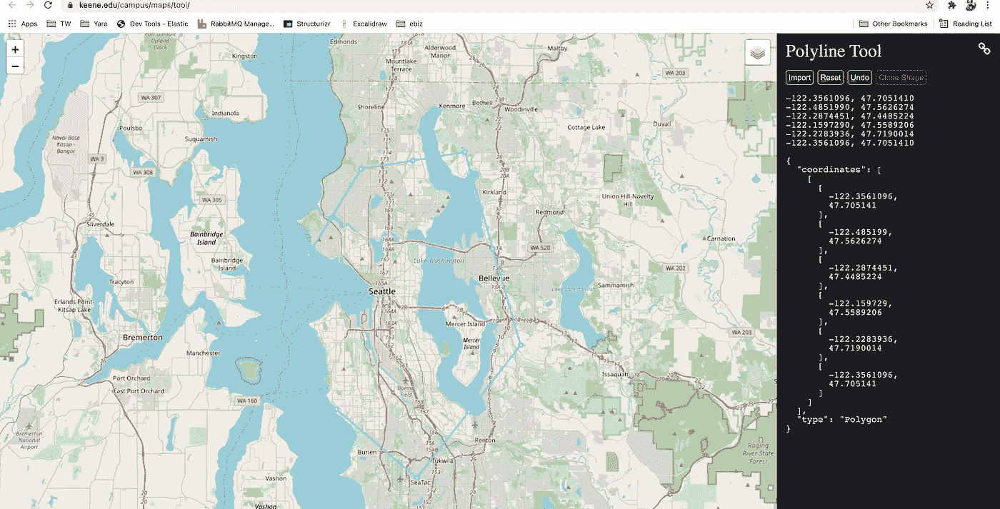
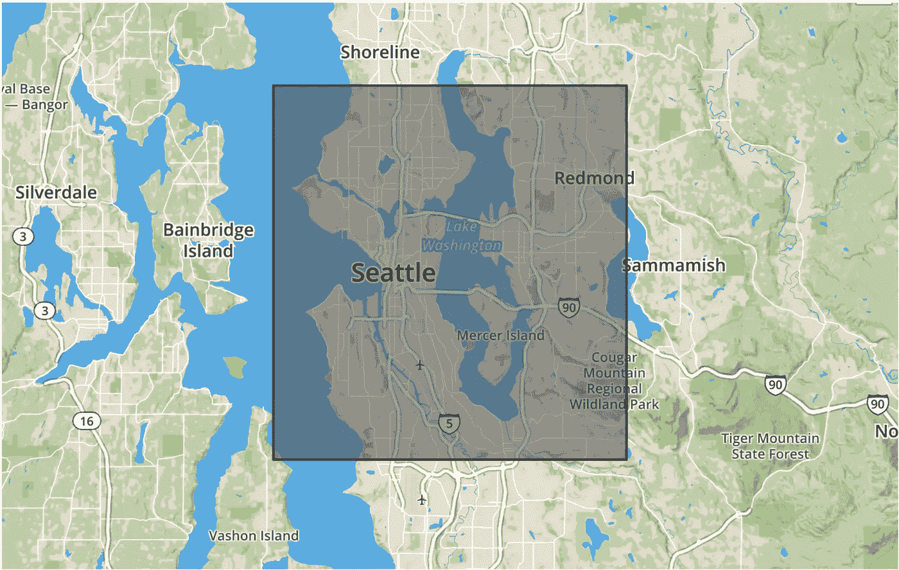

# 解释了弹性搜索地理点和地理形状查询

> 原文：<https://medium.com/geekculture/elastic-search-geo-point-and-geo-shape-queries-explained-df69ec157527?source=collection_archive---------1----------------------->

本文主要关注地理空间数据操作，类似于 PostgreSQL、Mongo DB 和 Redis 的 Postgis 扩展。在本文中，我们将了解 Elasticsearch 的地理查询，如何设置映射和索引，并提供一些如何查询数据的示例。


# 弹性搜索中的地理数据

Elasticsearch 允许您以两种方式表示地理数据， ***geo_shape，*** 和 ***geo_point。***

[***Geo Point***](https://www.elastic.co/guide/en/elasticsearch/reference/current/geo-point.html)允许您将数据存储为经纬度坐标对。当您要根据点之间的距离过滤数据、在边界框内搜索或使用聚合时，请使用此字段类型。有许多您可以指定的特性和选项超出了本文的范围。我们将在这里讨论几个，但是您可以在 Elasticsearch 的文档中查看*地理边界框*、*地理距离*和*地理聚合*的选项。

当您有表示形状的地理数据时，或者当您想要查询形状内的点时，请使用[***Geo-Shape***](https://www.elastic.co/guide/en/elasticsearch/guide/2.x/geo-shapes.html)。`geo_shape`数据必须以 GeoJSON 格式编码，该格式被转换成代表 [Geohash](https://www.elastic.co/guide/en/elasticsearch/guide/2.x/geohashes.html) 单元网格上的经度/纬度坐标对的字符串。由于 Elasticsearch 将形状作为术语进行索引，因此它可以很容易地确定形状之间的关系，可以使用`intersects`、`disjoint`、`contains`或`within`查询空间关系运算符进行查询。

不幸的是，*地理点*和*地理形状*不能一起查询。例如，如果您想要获取指定多边形内的所有城市，您不能使用通过*地理点*索引的城市。它们必须使用 GeoJSON 中的`"type": "Point"`进行索引，并且索引为`geo-shape`。

# 地理点字段类型

类型为`geo_point`的字段接受纬度-经度对，可以使用

*   在[边界框](https://www.elastic.co/guide/en/elasticsearch/reference/current/query-dsl-geo-bounding-box-query.html)内，在中心点的某个[距离](https://www.elastic.co/guide/en/elasticsearch/reference/current/query-dsl-geo-distance-query.html)内，或者在[多边形](https://www.elastic.co/guide/en/elasticsearch/reference/current/query-dsl-geo-polygon-query.html)内，或者在`[geo_shape](https://www.elastic.co/guide/en/elasticsearch/reference/current/query-dsl-geo-shape-query.html)` [查询](https://www.elastic.co/guide/en/elasticsearch/reference/current/query-dsl-geo-shape-query.html)内寻找地理点。
*   按地理位置或距中心点[距离](https://www.elastic.co/guide/en/elasticsearch/reference/current/search-aggregations-bucket-geodistance-aggregation.html)聚集文档[。](https://www.elastic.co/guide/en/elasticsearch/reference/current/search-aggregations-bucket-geohashgrid-aggregation.html)
*   将距离整合到文档的[相关性分数](https://www.elastic.co/guide/en/elasticsearch/reference/current/query-dsl-function-score-query.html)中。
*   按距离对文件进行分类。

我们可以用五种不同的方式存储地理点

**绘制地理点**

```
PUT location_index
{
  "mappings": {
    "properties": {
      "text" : {
        "type" : "text"
      },
      "location": {
        "type": "geo_point"
      }
    }
  }
}
```

***Geo 点为对象:*** *一个对象可以用属性为*`*lat*`*`*lon*`*的。**

```
*PUT location_index/_doc/1
{
  "text": "Geopoint as an object",
  **"location": { 
    "lat": 41.12,
    "lon": -71.34
  }**
}*
```

****Geo Point as String:***普通字符串可以用“，”分隔，格式为`lat, lon`。*

```
*PUT location_index/_doc/1
{
  "text": "Geopoint as a string",
  **"location": "41.12,-71.34"** 
}*
```

****Geo Point 为***[***Geo Hash***](https://en.wikipedia.org/wiki/Geohash')***:***一个 Hash 值用来表示`lat`和`lon`。有一个在线[网站](https://www.movable-type.co.uk/scripts/geohash.html)可以这么做。*

```
*PUT location_index/_doc/3
{
  "text": "Geopoint as a geohash",
  **"location": "drm3btev3e86"** 
}*
```

****Geo 点为数组:*** 坐标可以用数组`[lon, lat]`的形式表示，取值为`double`。*

```
*PUT location_index/_doc/4
{
  "text": "Geopoint as an array",
  **"location": [ -71.34, 41.12 ]** 
}*
```

****Geo 点为***[***WKT***](https://en.wikipedia.org/wiki/Well-known_text_representation_of_geometry)***点:*** 坐标可以用函数的形式表示`POINT(lon lat)`。*

```
*PUT location_index/_doc/5
{
  "text": "Geopoint as a WKT POINT primitive",
  **"location" : "POINT (-71.34 41.12)"** 
}*
```

> *无论地理点以何种格式保存，我们也可以查询其他格式。但是要注意正确定义格式。不要用`lat`和`lon`值替换。可以给出前所未有的价值。*

# *地理形状字段类型*

*`geo_shape`数据类型便于索引和搜索任意地理形状，如矩形和多边形。当被索引的数据或被执行的查询包含形状而不仅仅是点时，应该使用它。*

*您可以使用`[geo_shape](https://www.elastic.co/guide/en/elasticsearch/reference/current/query-dsl-geo-shape-query.html)` [查询](https://www.elastic.co/guide/en/elasticsearch/reference/current/query-dsl-geo-shape-query.html)使用这种类型查询文档。*

***映射文件***

```
*PUT /example
{
  "mappings": {
    "properties": {
      "location": {
        "type": "geo_shape"
      }
    }
  }
}*
```

****Geo Json 类型点:*** 单个地理坐标。注意:Elasticsearch 仅使用 WGS-84 坐标。*

```
*POST /example/_doc
{
  "location" : {
    "type" : "point",
    "coordinates" : [-77.03653, 38.897676]
  }
}*
```

****Geo Json Type LINESTRING***:给定两点或多点的任意直线。*

```
*POST /example/_doc
{
  "location" : {
    "type" : "linestring",
    "coordinates" : [[-77.03653, 38.897676], [-77.009051, 38.889939]]
  }
}*
```

****Geo Json 类型多边形:*** 一个*闭合的*多边形，其第一个点和最后一个点必须匹配，因此需要`n + 1`顶点创建一个`n`边的多边形和最少`4`个顶点。*

```
*POST /example/_doc
{
  "location" : {
    "type" : "polygon",
    "coordinates" : [
      [ [-77.03653, 38.897676], [-77.03653, 37.897676], [-76.03653, 38.897676], [-77.03653, 38.997676], [-77.03653, 38.897676] ]
    ]
  }
}*
```

****Geo Json 类型多多边形:*** 单独多边形的数组。*

```
*POST /example/_doc
{
  "location" : {
    "type" : "multipolygon",
    "coordinates" : [
      [ [[-80.0, 40.0], [-79.0, 40.0], [-79.0, 39.0], [-80.0, 39.0], [-80.0, 40]] ],
      [ [ [-78.0, 38.0], [-79.0, 38.0], [-79.0, 39.0], [-78.0, 39.0], [-78.0, 38.0] ],
      [ [-78.2, 38.2], [-78.8, 38.2], [-78.2, 38.8], [-78.8, 38.8], [-78.2, 38.2] ] ]
    ]
  }
}*
```

****Geo Json 类型多点:*** 不相连但可能相关的点的数组。*

```
*POST /example/_doc
{
  "location" : {
    "type" : "multipoint",
    "coordinates" : [
      [-78.0, 38.0], [-79.0, 38.0]
    ]
  }
}*
```

***Geo Json 类型多行字符串:**单独行字符串的数组。*

```
*POST /example/_doc
{
  "location" : {
    "type" : "multilinestring",
    "coordinates" : [
      [ [-77.03, 38.89], [-78.03, 38.89], [-78.03, 39.89], [-78.03, 39.89] ],
      [ [-76.03, 36.89], [-77.03, 36.89], [-77.03, 37.89], [-76.03, 37.89] ],
      [ [-76.23, 36.69], [-76.03, 36.89], [-76.23, 36.89], [-76.23, 36.09] ]
    ]
  }
}*
```

****Geo Json 类型 geometry collection:***Geo Json 形状类似于`multi*`形状，只是多种类型可以共存(例如，点和线串)。*

```
*POST /example/_doc
{
  "location" : {
    "type": "geometrycollection",
    "geometries": [
      {
        "type": "point",
        "coordinates" : [-77.03653, 38.897676]
      },
      {
        "type": "linestring",
        "coordinates" : [[-77.03653, 38.897676], [-77.009051, 38.889939]]
      }
    ]
  }
}*
```

****Geo Json Type BBOX(弹性搜索中的信封):*** 一个边框，或信封，通过只指定左上角和右下角的点来指定。*

```
*POST /example/_doc
{
  "location" : {
    "type" : "envelope",
    "coordinates" : [ [-77.03653, 38.897676], [-76.03653, 37.897676] ]
  }
}*
```

> *通过使用`geo_point`或`geo_shape`，Elasticsearch 会自动找到坐标，根据需要的格式验证它们，并索引它们。*

# *将数据加载到弹性搜索*

*我们将在本演练中使用的数据来自[华盛顿州运输部(WSDOT)](http://www.wsdot.wa.gov/mapsdata/geodatacatalog/default.htm#admin) 地理数据目录。下载“城市点”和“WSDOT 区域 24k”的形状文件。City Points 将为我们提供华盛顿的城市，而 WSDOT Regions 将为我们提供由 WSDOT 指定的区域。您可以点击下载链接旁边的**查看**在下载前查看数据。我已经将 shapefiles 转换为 ***GeoJSON*** 格式。*

*我创建了一个 node js 应用程序来创建索引和加载数据。请按照 [Github](https://github.com/ereshzealous/node_playground/tree/master/elastic-geo-spatial) 链接中的步骤，并按照自述文件加载数据。*

# *地理点查询*

*Elasticsearch 使用术语查询和过滤器。查询依赖于“评分”，或者文档是否与查询匹配以及匹配程度如何。另一方面，过滤是“不计分的”,并且确定文档是否匹配查询。根据 Elasticsearch 的研究，从 2.x 开始，查询和过滤已经成为同义词，因为你可以同时拥有评分和非评分查询。使用评分或非评分查询有各种性能优势和缺点，但经验法则是当相关性分数很重要时使用评分查询，而对于其他所有情况使用非评分查询。*

> *因为我们的索引中有一些数据，所以是时候开始查询了。我们将查看一些可以用于`geo_point`和`geo_shape`的基本查询。*

***与地理点的距离***

*为了获得任意两点之间的距离，我们的数据必须使用`geo_point`类型存储。[文档](https://www.elastic.co/guide/en/elasticsearch/reference/current/query-dsl-geo-distance-query.html)提供了各种数据格式作为示例。匹配地理点给定距离内的`[geo_point](https://www.elastic.co/guide/en/elasticsearch/reference/current/geo-point.html)`和`[geo_shape](https://www.elastic.co/guide/en/elasticsearch/reference/current/geo-shape.html)`值。以下查询列出了距离 *10 英里的位置。**

```
*GET geo_cities_point/_search
{
  "query": {
    "bool": {
      "must": {
        "match_all": {}
      },
      "filter": {
        "geo_distance": {
          "distance": "10mi",
          "location": [
            -122.3375,
            47.6112
          ]
        }
      }
    }
  }
}*
```

## *地理距离范围查询*

> *`geo_distance_range`查询已被删除。相反，根据您的需要，使用带分页的[地理距离查询](https://www.elastic.co/guide/en/elasticsearch/reference/6.8/query-dsl-geo-distance-query.html)或[地理距离聚合](https://www.elastic.co/guide/en/elasticsearch/reference/6.8/search-aggregations-bucket-geodistance-aggregation.html)。*

## ***地理距离聚合***

> *对`geo_point`字段起作用的多桶聚合，在概念上与[范围](https://www.elastic.co/guide/en/elasticsearch/reference/6.8/search-aggregations-bucket-range-aggregation.html)聚合非常相似。用户可以定义一个原点和一组距离范围桶。聚合计算每个文档值与原点的距离，并根据范围确定其所属的存储桶(如果文档与原点之间的距离在存储桶的距离范围内，则该文档属于该存储桶)。*

*有时我们需要知道一个范围内的坐标数。这是一个聚合函数，用于列出结果。现在我们将尝试从`50 MI to 100 MI`和`from 100 MI`中找到坐标`till 10 MI`、`from 10 MI to 50 MI`。这将返回该范围内匹配的文档数量。*

```
*GET geo_cities_point/_search?size=0
{
    "aggs" : {
        "data_around_city" : {
            "geo_distance" : {
                "unit": "mi", 
                "field" : "location",
                "origin" : "47.6112, -122.3375",
                **"ranges" : [
                    { "to" : 10 },
                    {"from" : 10, "to" : 50},
                    {"from" : 50, "to" : 100},
                    {"from" : 100}
                ]**
            }
        }
    }
}*
```

***答案应该是***

```
*{
"aggregations" : {
    "rings_around_amsterdam" : {
      "buckets" : [
        {
          "key" : "*-10.0",
          "from" : 0.0,
          "to" : 10.0,
         ** *"doc_count" : 12***
        },
        {
          "key" : "10.0-50.0",
          "from" : 10.0,
          "to" : 50.0,
          ***"doc_count" : 77***
        },
        {
          "key" : "50.0-100.0",
          "from" : 50.0,
          "to" : 100.0,
          ***"doc_count" : 57***
        },
        {
          "key" : "100.0-*",
          "from" : 100.0,
          ***"doc_count" : 135***
        }
      ]
    }
  }
}*
```

***带地理点的地理多边形***

*返回仅落在多边形点内的命中结果的查询。*

```
*GET geo_cities_point/_search
{
  "query": {
    "bool": {
      "must": {
        "match_all": {}
      },
      "filter": {
        "***geo_polygon***": {
          "location": {
            "points": [
              [
                -122.35610961914062,
                47.70514099299205
              ],
              [
                -122.48519897460936,
                47.5626274374099
              ],
              [
                -122.28744506835938,
                47.44852243794931
              ],
              [
                -122.15972900390624,
                47.558920607496525
              ],
              [
                -122.2283935546875,
                47.719001413201916
              ],
              [
                -122.35610961914062,
                47.70514099299205
              ]
            ]
          }
        }
      }
    }
  }
}*
```

**

***带有地理点的地理边界框***

*匹配与边界框相交的`[geo_point](https://www.elastic.co/guide/en/elasticsearch/reference/current/geo-point.html)`和`[geo_shape](https://www.elastic.co/guide/en/elasticsearch/reference/current/geo-shape.html)`值。当 GeoHashes 用于指定边界框边缘的边界时，GeoHashes 被视为矩形。边界框的定义方式是，其左上角对应于在`top_left`参数中指定的 GeoHash 的左上角，其右下角定义为在`bottom_right`参数中指定的 GeoHash 的右下角。*

> *地理点的精度有限，并且在索引时总是向下舍入。在查询期间，边界框的上边界被向下舍入，而下边界被向上舍入。因此，由于舍入误差，下边界(边界框的底部和左侧边缘)上的点可能不会进入边界框。同时，沿着上边界(顶部和右侧边缘)的点可能被查询选择，即使它们位于边缘的稍外侧。舍入误差在纬度上应小于 4.20e-8 度，在经度上应小于 8.39e-8 度，这意味着即使在赤道上误差也小于 1 厘米。*

```
*GET geo_cities_point/_search
{
  "query": {
    "bool": {
      "must": {
        "match_all": {}
      },
      "filter": {
        "geo_bounding_box": {
          "location": {
            "top_left": {
              "lat": 47.7328,
              "lon": -122.448
            },
            "bottom_right": {
              "lat": 47.468,
              "lon": -122.0924
            }
          }
        }
      }
    }
  }
}*
```

**

# *地理形状查询*

*所有的 *geo-shape* 查询都需要使用`geo_shape`映射来映射您的数据。使用*地理形状*我们可以找到与查询形状相交的文档。*

***地理形状查询***

*过滤使用`geo_shape`或`geo_point`类型索引的文档。需要`[geo_shape](https://www.elastic.co/guide/en/elasticsearch/reference/current/geo-shape.html)`映射[或者](https://www.elastic.co/guide/en/elasticsearch/reference/current/geo-shape.html)`[geo_point](https://www.elastic.co/guide/en/elasticsearch/reference/current/geo-point.html)`映射[映射](https://www.elastic.co/guide/en/elasticsearch/reference/current/geo-point.html)。*

*`geo_shape`查询使用与`geo_shape`映射相同的网格正方形表示来查找具有与查询形状相交的形状的文档。它还将使用为字段映射定义的相同前缀树配置。该查询支持两种定义查询形状的方法，一种是提供完整的形状定义，另一种是引用另一个索引中预索引的形状的名称。这两种格式都在下面用例子进行了定义。*

## *空间关系*

*[geo_shape 策略](https://www.elastic.co/guide/en/elasticsearch/reference/current/geo-shape.html#spatial-strategy)映射参数决定了在搜索时可以使用哪些空间关系运算符。*

*以下是搜索 geo 字段时可用的空间关系运算符的完整列表:*

*   *`INTERSECTS` -(默认)返回其`geo_shape`或`geo_point`字段与查询几何相交的所有文档。*
*   *`DISJOINT` -返回其`geo_shape`或`geo_point`字段与查询几何没有任何共同之处的所有文档。*
*   *`WITHIN` -返回其`geo_shape`或`geo_point`字段在查询几何内的所有文档。不支持线几何。*
*   *`CONTAINS` -返回其`geo_shape`或`geo_point`字段包含查询几何的所有文档。*

```
*GET geo_cities_shapes/_search
{
  "query": {
    "bool": {
      "must": {
        "match_all": {}
      },
      "filter": {
        "geo_shape": {
          "location": {
            "shape": {
              "type": "envelope",
              "coordinates": [ [ -122.35610961914062, 47.70514099299205 ], [ -122.2283935546875, 47.019001413201916 ] ]
            },
            "relation": "disjoint"
          }
        }
      }
    }
  }
}*
```

# *预索引形状*

*该查询还支持使用已经在另一个索引中编入索引的形状。当您有一个预定义的形状列表，并且您想使用一个逻辑名称(例如*新西兰*)来引用该列表，而不是每次都必须提供坐标时，这尤其有用。在这种情况下，只需提供:*

*   *`id` -包含预索引形状的文档的 ID。*
*   *`index` -索引前形状所在的索引的名称。默认为*形状*。*
*   *`path` -该字段被指定为包含预索引形状的路径。默认为*形状*。*
*   *`routing` -如有需要，形状文件的传送。*

```
*PUT shapes
{
  "mappings": {
    "properties": {
      "geometry": {
        "type": "geo_shape"
      }
    }
  }
}PUT shapes/_doc/test
{
  "location": {
    "type": "envelope",
    "coordinates" : [[ -122.35610961914062, 47.70514099299205 ], [ -122.2283935546875, 47.019001413201916 ]]
  }
}GET geo_cities_shapes/_search
{
  "query": {
    "bool": {
      "filter": {
        "geo_shape": {
          "location": {
            "indexed_shape": {
              "index": "shapes",
              "id": "test",
              "path": "location"
            }
          }
        }
      }
    }
  }
}*
```