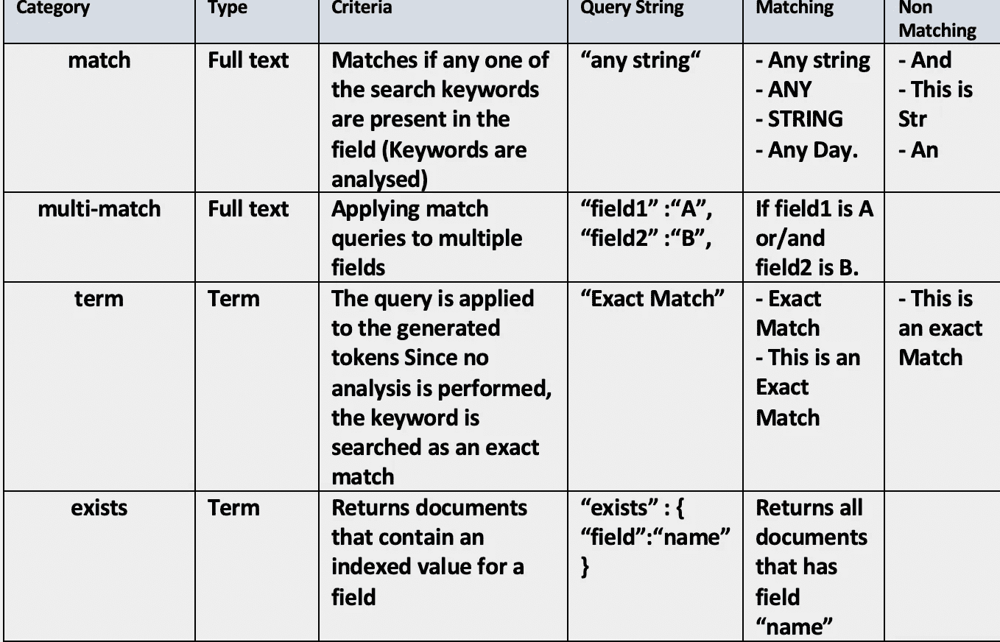
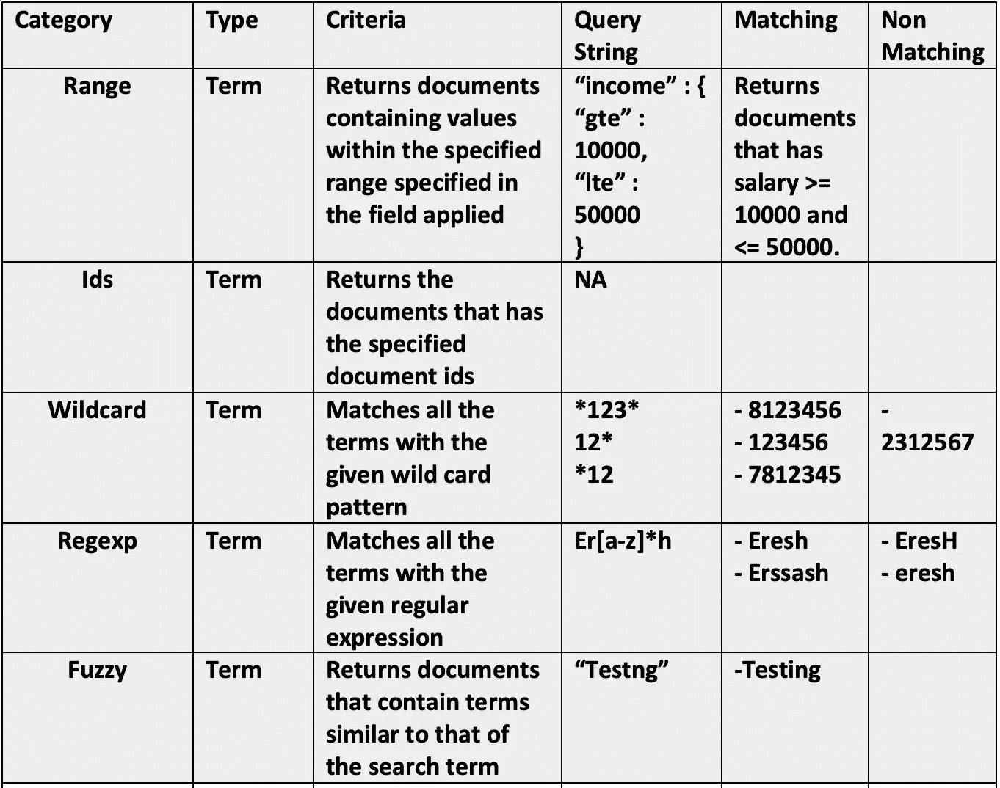
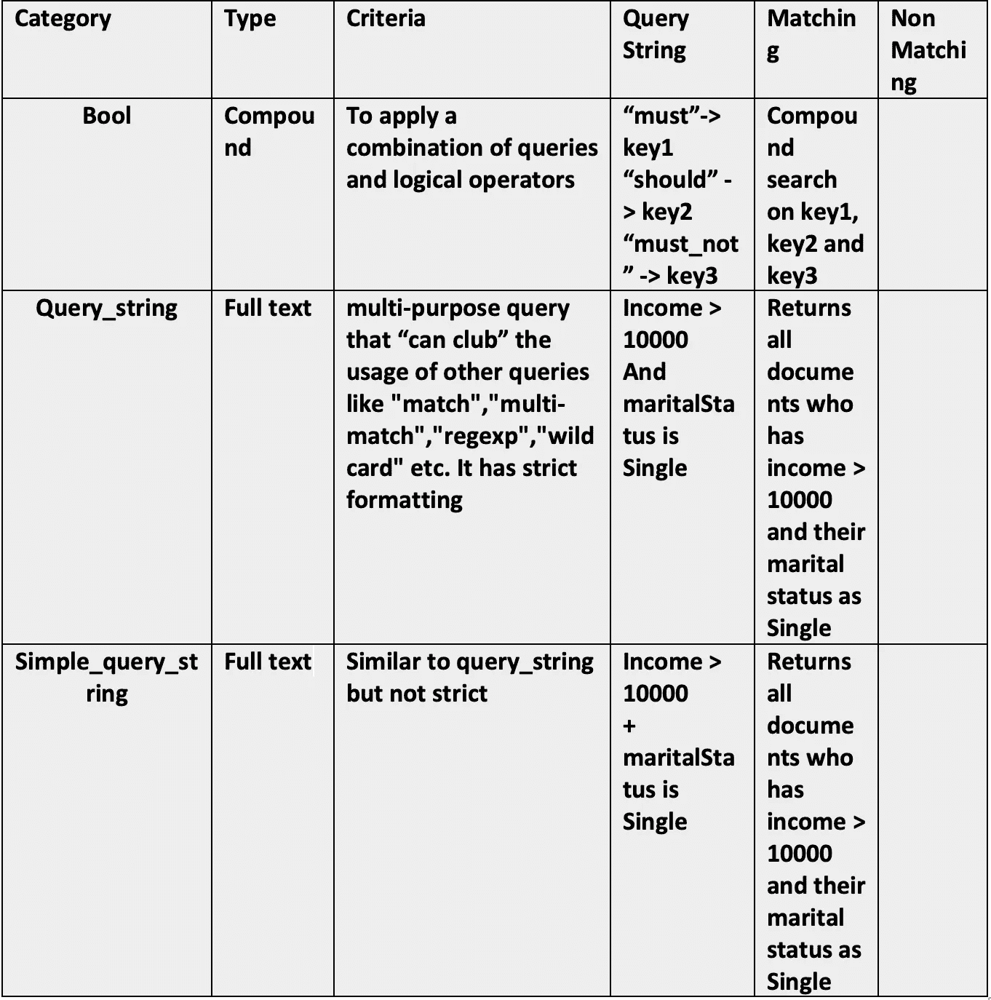
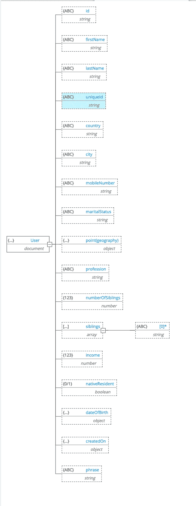
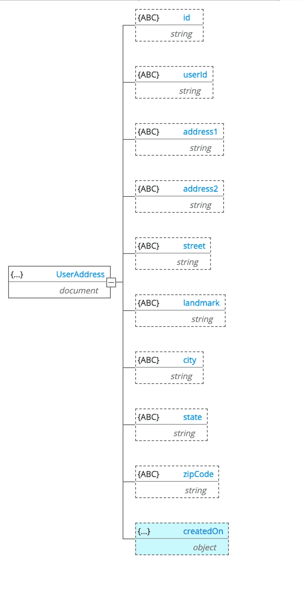

# 使用 Spring Boot 和基巴纳开发控制台的弹性搜索查询实践示例

> 原文：<https://medium.com/geekculture/elastic-search-queries-hands-on-examples-fe5b2bc10c0e?source=collection_archive---------0----------------------->

这个故事着重于弹性搜索的不同类型的查询，如匹配、术语、多匹配、正则表达式、通配符、范围、几何、多索引搜索。最后，我们将看到使用弹性搜索的高级 Rest 客户端的 spring boot 代码。

> **我在这个演示中使用了 Elastic Search 7.3.0 版本。**


下面是本教程中使用的不同类型的查询的快照



我已经设置了一个 spring boot 应用程序，将数据加载到弹性搜索中，数据有各种类型的搜索过滤器。在我的本地弹性搜索集群中，这两个指数都有大约 300 万个数据。

> 在查询和加载数据之前，建议从 Kibana 查询控制台创建索引

# 数据模型

我创建了一个简单的 spring boot 应用程序来加载数据。请访问 [GitHub](https://github.com/ereshzealous/spring-cloud-stream-examples/tree/main/elastic-demo) 链接，从 docker 设置加载弹性搜索和 Kibana 控制台，并将数据加载到弹性搜索中。

在这个动手练习中，我定义了两个索引`user`和`user_address`。

## 用户索引

检查用户索引映射文件是[这里是](https://github.com/ereshzealous/spring-cloud-stream-examples/blob/main/elastic-demo/src/main/resources/es/user_index.json)。



## 用户地址索引

从[这里](https://github.com/ereshzealous/spring-cloud-stream-examples/blob/main/elastic-demo/src/main/resources/es/user_address_index.json)检查用户地址索引映射文件。



# 一些共同特征

> `text`数据类型和`keyword`数据类型之间的主要区别是`text`字段在索引时被分析，而`keyword`字段不被分析。这意味着，`text`字段在索引时被分解成它们各自的术语，以允许部分匹配，而`keyword`字段按原样被索引。

# 匹配查询

“匹配”查询是 Elasticsearch 中最基本和最常用的查询之一，其功能相当于全文查询。我们可以使用这个查询来搜索文本、数字或布尔值。

匹配查询接受文本/数字/日期，分析它们，并构造一个查询。匹配查询属于布尔类型。这意味着对所提供的文本进行分析，并且分析过程从所提供的文本中构造一个布尔查询。运算符标志可以设置为 or 和，以控制布尔子句(默认为 or)。要匹配的可选 should 子句的最小数量可以使用 minimum_should_match 参数来设置。

```
GET user/_search
{
  "query": {
    "match": {
      "phrase": {
        **"query": "kL5fP"**
      }
    }
  },
  **"highlight": {
    "fields": {
      "phrase": {}
    }
  }**
}
----------------------------------------------------------------
***There are 19 results, but minified to show only 1.***{
  "took" : 3,
  "timed_out" : false,
  "_shards" : {
    "total" : 2,
    "successful" : 2,
    "skipped" : 0,
    "failed" : 0
  },
  "hits" : {
    "total" : {
      "value" : 19,
      "relation" : "eq"
    },
    "max_score" : 11.733445,
    "hits" : [
      {
        "_index" : "user",
        "_type" : "_doc",
        "_id" : "e9a6dbf4-c6a6-46ce-9049-729f4bb64407",
        "_score" : 11.733445,
        "_source" : {
          "_class" : "com.elastic.demo.entity.User",
          "id" : "e9a6dbf4-c6a6-46ce-9049-729f4bb64407",
          "firstName" : "URuMyV",
          "lastName" : "XbonCWM",
          "uniqueId" : "ALHNQSOVOJWFN0I1",
          "country" : "India",
          "city" : "Hyderabad",
          "mobileNumber" : "61623020652",
          "point" : [
            77.27123,
            16.5898
          ],
          "maritalStatus" : "Divorced",
          "numberOfSiblings" : 2,
          "siblings" : [
            "itsZzh kMBKlT",
            "RNrFfJ oBZGSEcd"
          ],
          "profession" : "Banker",
          "income" : 411516,
          "phrase" : "oGRUxB yr72CdCt yZqQb kL5fP",
          "nativeResident" : true,
          "dateOfBirth" : 103573800000,
          "createdOn" : 1570885284000
        },
        **"highlight" : {
          "phrase" : [
            "oGRUxB yr72CdCt yZqQb <em>kL5fP</em>"
          ]
        }**
      }
   ]
}
```

# 多匹配查询

multi_match 查询建立在 match 查询的基础上，允许多字段查询。

***多匹配查询的类型***
多匹配查询在内部执行的方式取决于 type 参数，可以设置为:

***best_fields:*** (默认)查找匹配任何字段的文档，但使用最佳字段的 _score。参见 best_fields。
best _ fields 类型在搜索同一个字段中的多个最佳单词时最有用。例如，一块地里的“棕色狐狸”比一块地里的“棕色”和另一块地里的“狐狸”更有意义。

***most_fields:*** 查找匹配任何字段的文档，并组合每个字段的 _score。查看 most_fields。
当查询包含以不同方式分析的相同文本的多个字段时，most_fields 类型最有用。例如，主字段可能包含同义词、词干和不带发音符号的术语。第二个字段可能包含原始术语，第三个字段可能包含术语。通过组合所有三个字段的分数，我们可以将尽可能多的文档与主字段匹配，但使用第二个和第三个字段将最相似的结果推到列表的顶部。

***cross _ fields:***用相同的分析器将字段视为一个大字段。在任何字段中查找每个单词。请参见交叉字段。
cross _ fields 类型对于多个字段应该匹配的结构化文档特别有用。例如，当查询“威尔·史密斯”的“名字”和“姓氏”字段时，最佳匹配可能是一个字段中有“Will ”,另一个字段中有“Smith”。

***短语:*** 对每个字段运行 *match_phrase* 查询，并使用来自最佳字段的 *_score* 。参见短语和*短语 _ 前缀*。
*短语*和*短语前缀*类型的行为就像*最佳字段*，但是它们使用*匹配短语*或*匹配短语前缀*查询，而不是匹配查询。

**默认行为:** *在 mobileNumber、firstName、lastName 和 uniqueId 上搜索最佳匹配(全文搜索)。*

```
GET user/_search
{
  "query": {
    "multi_match": {
      "query": "HyWHrsVr",
      "fields": ["mobileNumber", "firstName", "lastName", "uniqueId"]
    }
  }
}
```

**Phase_prefix:** *在 *mobileNumber、firstName、lastName 和 uniqueId 上搜索前缀匹配(* ***hywh* *** )。*

```
GET user/_search
{
  "query": {
    "multi_match": {
      "query": "hywh",
      "type": "phrase_prefix", 
      "fields": ["mobileNumber", "firstName", "lastName", "uniqueId"]
    }
  }
}
```

# 术语查询/术语查询

有时，我们对结构化搜索更感兴趣，在这种搜索中，我们希望找到精确的匹配并返回结果。术语和术语查询在这里对我们有帮助。在下面的例子中，我们在索引中搜索职业为`Singer`的所有用户。返回在提供的字段中包含精确术语的文档。您可以使用术语查询根据精确的值(如价格、产品 ID 或用户名)来查找文档。

> 注意:
> 避免对文本字段使用术语查询。默认情况下，作为分析的一部分，Elasticsearch 会更改文本字段的值。这使得查找文本字段值的精确匹配变得困难。
> 要搜索文本字段值，请使用匹配查询。

```
GET user/_search
{
  "query": {
    "term": {
      "profession.keyword": "Singer"
    }
  }
}
------- 
Will return results
```

> 我们在这里使用`Keyword`的原因是为了搜索一个精确的单词。如果不使用`keyword`，我们必须搜索`search criteria in lower case`。

```
GET user/_search
{
  "query": {
    "term": {
      "profession": "Singer"
    }
  }
}
**Will not return results
-------------------------------------------------------------** GET user/_search
{
  "query": {
    "term": {
      "profession": "singer".
    }
  }
}
**Will return results.**
```

我们还可以借助 ***术语，通过多个查询字符串进行搜索。*** 我们将提炼上述职业为`Singer`和`Farmer`的查询。

```
GET user/_search
{
  "query": {
    "terms": {
      "profession.keyword": ["Singer", "Farmer"]
    }
  }
}
```

# 布尔查询

AND/OR/NOT 运算符可用于微调我们的搜索查询，以便提供更相关或更具体的结果。这在搜索 API 中作为 bool 查询实现。bool 查询接受一个 must 参数(相当于 AND)、一个 must_not 参数(相当于 not)和一个 should 参数(相当于 OR)。

匹配与其他查询的布尔组合相匹配的文档的查询。bool 查询映射到 Lucene BooleanQuery。它是使用一个或多个布尔子句构建的，每个子句都有一个类型化的出现。事件类型有

**必须:** *该子句(查询)必须出现在匹配的文档中，并且将有助于得分。*

**筛选:** *该子句(查询)必须出现在匹配的单据中。然而，与* `*must*` *不同的是，查询的分数会被忽略。筛选子句在筛选上下文中执行，这意味着评分被忽略，子句被考虑用于缓存。*

**应该:**该子句(查询)应该出现在匹配的文档中。如果 bool 查询在查询上下文中，并且有一个 must 或 filter 子句，那么一个文档将匹配 bool 查询，即使没有一个 should 查询匹配。在这种情况下，这些子句仅用于影响分数。如果 bool 查询在一个过滤器上下文中，或者既没有 must 也没有 filter，那么至少应该有一个 should 查询匹配一个文档才能匹配 bool 查询？这种行为可以通过设置 minimum_should_match 参数来明确控制。

**must_not:** *该子句(查询)不能出现在匹配的单据中。子句在过滤器上下文中执行，这意味着评分被忽略，子句被考虑用于缓存。因为评分被忽略，所以所有文档都返回 0 分。*

> 例如:如果我想搜索用户的职业是`Athelete`，婚姻状况是`married`，手机号码与`12360`匹配。**必须作为 and 操作符**

```
GET user/_search
{
  "query": {
    "bool": {
      "must": [
        {
          "match": {
            "profession": "Athlete"
          }
        },
        {
          "wildcard": {
            "mobileNumber.keyword": "*12360*"
          }
        },
        {
          "match": {
            "maritalStatus": "Married"
          }
        }
      ]
    }
  }
}
```

# **通配符**

返回包含匹配通配符模式的术语的文档。通配符运算符是匹配一个或多个字符的占位符。例如，*通配符运算符匹配零个或多个字符。您可以将通配符运算符与其他字符组合起来创建通配符模式。

> 在 7.10.0 中添加了不区分大小写的[7 . 10 . 0]。
> (可选，布尔值)设置为 true 时，允许模式与索引字段值不区分大小写的匹配。默认值为 false，这意味着匹配是否区分大小写取决于基础字段的映射。

如果我们想通过名字匹配`abc`或姓氏匹配`abc`或唯一 ID 匹配`abc`来搜索用户。它是由 OR 运算符进行的逻辑分组。

> 对于 7.10.0 以下版本，不要使用不区分大小写的关键字，也不要在索引创建期间进行规范化。

```
GET user/_search
{
  "query": {
    "bool": {
      "should": [
        {
          "wildcard": {
            "firstName": "*abc*"
          }
        },
        {
          "wildcard": {
            "lastName": "*abc*"

          }
        },
        {
          "wildcard": {
            "uniqueId": "*abc*"
          }
        }
      ]
    }
  }
}
```

# 正则表达式查询

返回包含匹配正则表达式的术语的文档。

正则表达式是一种使用占位符(称为运算符)来匹配数据模式的方法。有关 regexp 查询支持的运算符列表，请参见[正则表达式语法](https://www.elastic.co/guide/en/elasticsearch/reference/current/regexp-syntax.html)。

让我们查询用户索引，以获得其兄弟具有正则表达式`e[a-z]*h`的用户列表。

```
GET user/_search
{
  "query": {
    "regexp": {
      "siblings": "e[a-z]*h"
    }
  },
  "_source": ["siblings", "id"],
    "highlight": {
        "fields" : {
            "siblings": {}
        }
    }
}
----------------------------------------------------
Just one result for understanding, This query resulted around 5k documents.
{
        "_index" : "user",
        "_type" : "_doc",
        "_id" : "00159cc8-313c-4492-a5b9-ebaf884ca0e2",
        "_score" : 1.0,
        "_source" : {
          "siblings" : [
            "hcbKUQCki juVLjF",
            "KYSuPQM jTraY",
            "eMDTLh gGgSY"
          ],
          "id" : "00159cc8-313c-4492-a5b9-ebaf884ca0e2"
        },
        "highlight" : {
          "siblings" : [
            "<em>eMDTLh</em> gGgSY"
          ]
        }
      }
```

# 查询字符串

使用语法严格的解析器，根据提供的查询字符串返回文档。该查询使用语法根据运算符(如 and 或 NOT)解析和拆分提供的查询字符串。然后，在返回匹配的文档之前，查询会独立分析每个拆分的文本。

您可以使用 query_string 查询创建包含通配符的复杂搜索、跨多个字段的搜索等等。虽然该查询是通用的，但它是严格的，如果查询字符串包含任何无效语法，它将返回一个错误。

> 查询中~的用法表示模糊查询的用法

```
GET user/_search
{
  "query": {
    "query_string": {
      "query": "saad~1 or zojmi~1", -- Skips one word during search.
      "fields": ["lastName", "firstName"]
    }
  },
  "highlight": {
        "fields" : {
            "maritalStatus": {}
        }
    }
}
------------------------------
{
        "_index" : "user",
        "_type" : "_doc",
        "_id" : "0e167d85-281a-4b6a-ab0b-8fc9f496245a",
        "_score" : 10.263874,
        "_source" : {
          "_class" : "com.elastic.demo.entity.User",
          "id" : "0e167d85-281a-4b6a-ab0b-8fc9f496245a",
          "firstName" : "ZOjLi",
          "lastName" : "ROmwpwGE"
        },
        **"highlight" : {
          "firstName" : [
            "<em>ZOjLi</em>" - Here m is replaced by i. still search is successful becuase of fuzzy logic.
          ]
        }**
      }
```

# 简单查询字符串

simple_query_string 查询是 query_string 查询的一个版本，它更适合在向用户公开的单个搜索框中使用，因为它分别用+/|/-替换了和/或/NOT，并且它会丢弃查询的无效部分，而不是在用户出错时引发异常。

```
GET user/_search
{
  "query": {
    "query_string": {
      "query": "saad~1 | zojmi~1", -- Skips one word during search.
      "fields": ["lastName", "firstName"]
    }
  },
  "highlight": {
        "fields" : {
            "maritalStatus": {}
        }
    }
}
```

# **范围查询**

Elasticsearch 世界中另一个最常用的查询是范围查询。范围查询允许我们获取包含指定范围内的术语的文档。范围查询是术语级别的查询(意味着使用来查询结构化数据)，可用于数字字段、日期字段等。

***数值字段:*** 查询收入≥ 100000 且≤ 500000 的用户。

```
GET user/_search
{
  "query": {
    "range": {
      "income": {
        "gte": 100000,
        "lte": 500000
      }
    }
  }
}
```

***关于日期字段:*** 日期字段，可以多种格式存储。请访问此处的[了解更多详情](https://www.elastic.co/guide/en/elasticsearch/reference/current/date.html)。默认情况下，它是纪元毫秒。我用过同样的格式。即使它是以纪元格式存储的，我们也可以用支持的日期/日期时间格式查询数据。

```
GET user/_search
{
  "query": {
        "range" : {
            "dateOfBirth": {
                "gte": "2001-08-01",
                "lte": "2001-12-31"
            }
        }
    }
}
```

# 地理字段查询

在用户索引中，字段点被创建为 geo_point。地理字段还有许多其他选项。我将在这个领域创建一个更详细的博客。目前，我们已将 Geo_point 创建为[lon，lat]。我们将查询特定位置半径 1 公里以内的位置。

```
GET user/_search
{
  "query": {
    "bool": {
      "must": {
        "match_all": {}
      },
      "filter": {
        "geo_distance": {
          "distance": "1km",
          "point": [79.7397, 15.684453142518711]

        }
      }
    }
```

# 多索引搜索

多重搜索 API 允许在同一个 API 中执行多个搜索请求。它的终点是`_msearch`。

> 用例:我们有两个索引，`user`和`user_address`。在传统的 RDBMS 中，user 和 user_address 表通过外键约束进行链接。我们必须连接两个表来查找用户及其相关地址。我们如何在弹性搜索中实现这一点

```
GET default/_msearch
{"index" : "user"}
{"query": {"bool": {"must": [{"match": {"id.keyword": "e25b9ecf-b6fa-4ef4-a5df-2fc7dd62691d"}}]}}}
{"index" : "user_address"}
{"query": {"bool": {"must": [{"match": {"userId.keyword": "e25b9ecf-b6fa-4ef4-a5df-2fc7dd62691d"}}]}}}
---------------------------------------------------------------
{
  "took" : 22,
  "responses" : [
    {
      "took" : 22,
      "timed_out" : false,
      "_shards" : {
        "total" : 2,
        "successful" : 2,
        "skipped" : 0,
        "failed" : 0
      },
      "hits" : {
        "total" : {
          "value" : 1,
          "relation" : "eq"
        },
        "max_score" : 12.832057,
        "hits" : [
          {
            "_index" : "user",
            "_type" : "_doc",
            "_id" : "e25b9ecf-b6fa-4ef4-a5df-2fc7dd62691d",
            "_score" : 12.832057,
            "_source" : {
              "_class" : "com.elastic.demo.entity.User",
              "id" : "e25b9ecf-b6fa-4ef4-a5df-2fc7dd62691d",
              "firstName" : "iUWvggrjb",
              "lastName" : "PwZSA",
              "uniqueId" : "YQWRQH2NVROOTC3R",
              "country" : "India",
              "city" : "Hyderabad",
              "mobileNumber" : "73642600218",
              "point" : [
                76.49461,
                16.46887
              ],
              "maritalStatus" : "Widowed",
              "numberOfSiblings" : 1,
              "siblings" : [
                "pqHpPibr KKcXioB"
              ],
              "profession" : "Actor",
              "income" : 209060,
              "phrase" : "6q0y1uOgDZD VG6bWkUGT uGlRAJ RICgp",
              "nativeResident" : false,
              "dateOfBirth" : -110525400000,
              "createdOn" : 1563241250000
            }
          }
        ]
      },
      "status" : 200
    },
    {
      "took" : 22,
      "timed_out" : false,
      "_shards" : {
        "total" : 2,
        "successful" : 2,
        "skipped" : 0,
        "failed" : 0
      },
      "hits" : {
        "total" : {
          "value" : 2,
          "relation" : "eq"
        },
        "max_score" : 13.525113,
        "hits" : [
          {
            "_index" : "user_address",
            "_type" : "_doc",
            "_id" : "a4dd76f1-7003-4ab7-876a-a87646101f4d",
            "_score" : 13.525113,
            "_source" : {
              "_class" : "com.elastic.demo.entity.UserAddress",
              "id" : "a4dd76f1-7003-4ab7-876a-a87646101f4d",
              "userId" : "e25b9ecf-b6fa-4ef4-a5df-2fc7dd62691d",
              "address1" : "LcjcBGazLfGHAzNMxcnskeSaP",
              "address2" : "xeDrDTPhNDDYZJR",
              "street" : "iVmGEclcCBLoTdfzQdhK",
              "landmark" : "dyHKqajaFaGJSsa",
              "city" : "Hyderabad",
              "state" : "Telangana",
              "zipCode" : "271066",
              "createdOn" : 1571685580000
            }
          },
          {
            "_index" : "user_address",
            "_type" : "_doc",
            "_id" : "455634b6-0996-4a1c-8e9d-3a9172eae01f",
            "_score" : 13.523252,
            "_source" : {
              "_class" : "com.elastic.demo.entity.UserAddress",
              "id" : "455634b6-0996-4a1c-8e9d-3a9172eae01f",
              "userId" : "e25b9ecf-b6fa-4ef4-a5df-2fc7dd62691d",
              "address1" : "qBcBGHtnYmsCZSYINqFMHJpfB",
              "address2" : "khTLQUhsipHzGRy",
              "street" : "xcnTmHhyzJCNVqUPYSoo",
              "landmark" : "YxgEMZHGAxPDKly",
              "city" : "Hyderabad",
              "state" : "Telangana",
              "zipCode" : "054947",
              "createdOn" : 1565102726000
            }
          }
        ]
      },
      "status" : 200
    }
  ]
}
```

# Spring Boot 的弹性搜索

到目前为止，我们已经看到了如何使用 dev 控制台从弹性搜索中查询数据。现在我们将看看如何使用 Spring Boot 来实现它。

你可以从 [GitHub](https://github.com/ereshzealous/spring-cloud-stream-examples/tree/main/elastic-demo) 找到完整的源代码。

我们可以使用弹性搜索***HighLevelRestClient***编写查询并从弹性搜索中获取结果。我们也可以直接使用来自 Elastic Search 的 API，但是使用 SDK 始终是首选。

**包含依赖关系**

```
plugins {
    id 'org.springframework.boot' version '2.5.4'
    id 'io.spring.dependency-management' version '1.0.11.RELEASE'
    id 'java'
}

group = 'com.elastic.demo'
version = '0.0.1-SNAPSHOT'
sourceCompatibility = '11'

configurations {
    compileOnly {
        extendsFrom annotationProcessor
    }
}

repositories {
    mavenCentral()
}

dependencies {
    implementation 'org.springframework.boot:spring-boot-starter-data-elasticsearch'
    implementation group: 'org.elasticsearch.client', name: 'elasticsearch-rest-high-level-client', version: '7.3.0'
    implementation group: 'org.springdoc', name: 'springdoc-openapi-ui', version: '1.5.10'
    implementation group: 'org.elasticsearch', name: 'elasticsearch', version: '7.3.0'
    implementation group: 'org.apache.commons', name: 'commons-lang3', version: '3.11'
    implementation 'org.springframework.boot:spring-boot-starter-web'
    compileOnly 'org.projectlombok:lombok'
    annotationProcessor 'org.projectlombok:lombok'
    testImplementation 'org.springframework.boot:spring-boot-starter-test'
}

test {
    useJUnitPlatform()
}
```

**配置弹性搜索**

```
@Configuration
@Slf4j
public class ElasticSearchConfiguration {

   @Bean(name = "highLevelClient", destroyMethod = "close")
   public RestHighLevelClient client(){
      RestClientBuilder builder = RestClient.*builder*(new HttpHost("localhost", 9200, "http"));
      builder.setRequestConfigCallback(requestConfigBuilder -> requestConfigBuilder.setConnectTimeout(600 * 1000).setSocketTimeout(600 * 1000)
                                                                                   .setConnectionRequestTimeout(-1));

      RestHighLevelClient client = new RestHighLevelClient(builder);
      return client;
   }
}
```

**弹性搜索连接代理**

```
@Service
@Slf4j
@RequiredArgsConstructor
public class HighLevelRestClient {

   private final RestHighLevelClient restHighLevelClient;

   @SneakyThrows
   public SearchResponse postSearchQueries(SearchRequest searchRequest) {
      *log*.info("Search JSON query: {}", searchRequest.source().toString());
      return restHighLevelClient.search(searchRequest, RequestOptions.*DEFAULT*);
   }

   @SneakyThrows
   public MultiSearchResponse postMSearch(MultiSearchRequest multiSearchRequest) {
      *log*.info("Search JSON query: {}", multiSearchRequest.requests().toString());
      return restHighLevelClient.msearch(multiSearchRequest, RequestOptions.*DEFAULT*);
   }
}
```

**查询数据的示例服务方法**

```
public WSUsersResponse searchDateRange(String fromDate, String toDate, Integer offset, Integer limit) {
   SearchRequest searchRequest = new SearchRequest();
   searchRequest.indices("user");
   SearchSourceBuilder sourceBuilder = new SearchSourceBuilder();
   sourceBuilder.from(offset);
   sourceBuilder.size(limit);
   sourceBuilder.query(QueryBuilders.*rangeQuery*("dateOfBirth").gte(fromDate).lte(toDate));
   searchRequest.source(sourceBuilder);
   SearchResponse searchResponse = highLevelRestClient.postSearchQueries(searchRequest);
   *log*.info("Search JSON query: {}", searchRequest.source().toString());
   return extractUserResponse(searchResponse);
}
```

类似地，还有 npm 模块、go 模块也可用于从弹性搜索中查询数据。它们非常简单。典型的部分是弄清楚如何从弹性搜索中查询数据，使用任何语言或框架的实际实现都非常简单。