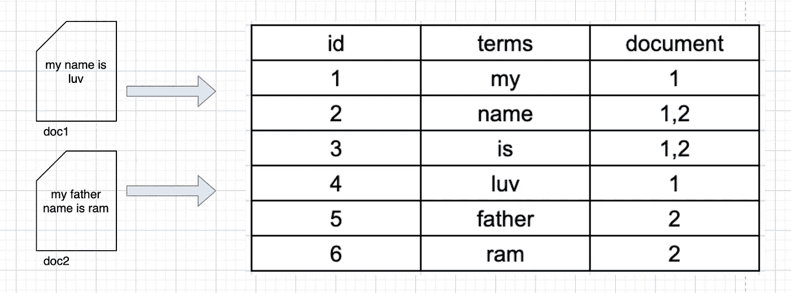
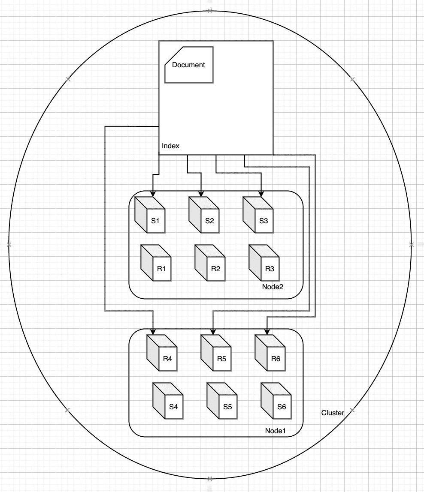

# 弹性搜索

> 原文：<https://medium.com/geekculture/elasticsearch-aeb867a1f805?source=collection_archive---------20----------------------->

## **什么是 ElasticSearch？**

**Elasticsearch** 是一个分布式、免费和开放的搜索和分析引擎，适用于所有类型的数据，包括文本、数字、地理空间、结构化和非结构化数据。

**为什么选择 ElasticSearch？**

**Elasticsearch** 允许你快速、近乎实时地存储、搜索和分析海量数据，并在几毫秒内给出答案。它能够实现快速搜索响应，因为它不是直接搜索文本，而是搜索索引。

# 索引

Elasticsearch 能够实现快速搜索响应，因为它不是直接搜索文本，而是搜索索引。

这就像通过扫描书后面的索引来检索书中与关键字相关的页面，而不是搜索书的每一页的每个单词。

这种类型的索引被称为**倒排索引**，因为它将以页面为中心的数据结构(page- > words)转换为以关键字为中心的数据结构(word- > pages)。

Elasticsearch 使用 Apache Lucene 来创建和管理这个倒排索引。

对于索引文档，ElasticSearch 使用一个分析器。


Indexing Process

**分析器**是记号化器**和过滤器**的组合，可应用于弹性研究中的任何分析领域。Elasticsearch 中已经有内置的分析器可用。您也可以创建自己的定制分析器。这里 可以阅读内置分析器 [**。**](https://www.elastic.co/guide/en/elasticsearch/reference/current/analysis-analyzers.html)

**文件 1**

```
{
 "name" : "my name in luv"
}
```

文件 2

```
{
 "name": "my father name is ram"
}
```

在标准分析器之后，文档中的术语如下

**文件 1**

字段术语

```
"name": "my","name","is","luv"
```

**文件二**

字段术语

```
"name" : "my","father","name","is","ram"
```

现在，让我们将上面两个“名称”字段术语表合并成一个，如下所示:



Visual Representation of an Inverted Index

现在上面的表被称为字段“name”的倒排索引。使用倒排索引的优点是，可以在“terms”列中查找搜索术语，然后，如果有匹配，查找搜索术语所在的文档是在相应列中查找的非常简单的工作。

您可以检查哪个分析器应用于索引中的任何字段，如下所示

```
GET <index>/_analyze
{
  "text": "software engineer blr",
  "field": "<ur_field>"
}
```

**弹性搜索基本储物概念**

**文档**是存储在弹性搜索索引中的 JSON 对象，被认为是存储的基本单元。

一份文件的例子:

```
{
   "_id": 3,
   “_index”: [“your index name”],
   "_source":{
   "age": 28,
   "name": ["daniel”],
   "year":1989,
}
```

**映射**它为特定类型的文档定义了*字段*——数据类型(如关键字、文本和 long)以及这些字段应该如何在 Elasticsearch 中进行索引和存储。

```
{
  "mappings": {
      "properties": {
        "name": {
          "type": "keyword"
        },
        "age": {
          "type": "long"
        },
        "year": {          "type": "long"
        }
      }
    }
}
```

**索引**索引是 Elasticsearch 中最大的数据单位，是文档的逻辑分区，可以比作关系数据库世界中的一个数据库。

**碎片**简单地说，碎片是一个单一的 Lucene 索引。它们是 Elasticsearch 的组成部分，也是促进其可扩展性的因素。

```
curl -XPUT localhost:9200/example -d '{
  "settings" : {
    "index" : {
      "number_of_shards" : 3, 
      "number_of_replicas" : 1 
    }
  }
}'
```

**副本**是主分片的副本，防止硬件故障时数据丢失。默认情况下，Elastisearch 中的每个索引分配有 5 个主碎片和 1 个副本，这意味着如果集群中至少有两个节点，那么索引将有 5 个主碎片和另外 5 个副本碎片(1 个完整副本)，每个索引总共有 10 个碎片。

**节点**任何时候启动一个 Elasticsearch 实例，都是在启动一个*节点*。更多阅读请参考 [**和**](https://www.elastic.co/guide/en/elasticsearch/reference/current/analysis-analyzers.html) 。

**集群**连接节点的集合称为 [**集群**](https://www.elastic.co/guide/en/elasticsearch/reference/current/analysis-analyzers.html) 。



Typical Elastic CLuser

**查询示例**对于每个示例，我们将创建一个新的索引，其中包含根据需要定制的数据。我使用 Kibana 是因为它们易于配置，并且有非常直观的用户界面。

我们将对所有三个查询“术语”、“文本”、“嵌套”使用相同的索引。

```
PUT /test-indexPUT /test-index/_mapping
{
  "properties": {
    "firstname": {
      "type": "keyword"
    },
    "lastname": {
      "type": "keyword"
    },
    "fullname": {
      "type": "text"
    },
    "age": {
      "type": "long"
    },
    "friends": {
      "type": "nested"
    }
  }
}POST /test-index/_doc
{
  "firstname": "Jay",
  "lastname": "Prakash",
  "fullname": "Jay Prakash",
  "age": 30,
  "friends":[{"friendname": "Adarsh"}, {"friendname": "Jaismin"}
    ]
}POST /test-index/_doc
{
  "firstname": "Viral",
  "lastname": "Prasad",
  "fullname": "Viral Prasad",
  "age": 30,
  "friends":[{"friendname": "Lovenish"}, {"friendname": "Sandeep"}, {"friendname": "Shashank"}
    ]
}POST /test-index/_doc
{
  "firstname": "Sandeep",
  "lastname": "Dash",
  "fullname": "Viral Prasad",
  "age": 30,
  "friends":[{"friendname": "Jaismin"}, {"friendname": "Adarsh"}, {"friendname": "Shashank"}
    ]
}
```

[**术语查询**](https://www.elastic.co/guide/en/elasticsearch/reference/current/query-dsl-term-query.html) 返回在提供的字段中包含**精确**术语的文档。这主要用于“**关键字**”类型字段。

1.  获取名字为 Jay 的用户

```
GET /test-index/_search
{
  "query": {
    "bool": {
      "must": [
        {"term": {
          "firstname": {
            "value": "Jay"
          }
        }}
      ]
    }
  }
}
```

结果

```
{
  "took" : 4,
  "timed_out" : false,
  "_shards" : {
    "total" : 5,
    "successful" : 5,
    "skipped" : 0,
    "failed" : 0
  },
  "hits" : {
    "total" : {
      "value" : 1,
      "relation" : "eq"
    },
    "max_score" : 0.2876821,
    "hits" : [
      {
        "_index" : "test-index",
        "_type" : "_doc",
        "_id" : "lSUVtHgBw7rVVucQG7xH",
        "_score" : 0.2876821,
        "_source" : {
          "firstname" : "Jay",
          "lastname" : "Prakash",
          "fullname" : "Jay Prakash",
          "age" : 30,
          "friends" : [
            {
              "friendname" : "Adarsh"
            },
            {
              "friendname" : "Jaismin"
            }
          ]
        }
      }
    ]
  }
}
```

**对名字和姓氏的查询也将区分大小写。因为关键词是按原样存储在 ElasticSearch 索引中的。**

```
GET /test-index/_search
{
  "query": {
    "bool": {
      "must": [
        {"term": {
          "firstname": {
            "value": "Jay"
          }
        }}
      ]
    }
  }
}
```

上面的查询不会给你任何结果。

2.在同一个字段上查询多个值。

```
GET /test-index/_search
{
  "query": {
    "bool": {"must": [
      {"terms": {
        "firstname": [
          "Jay",
          "Viral"
        ]
      }}
    ]}
  }
}
```

结果

```
{
  "took" : 171,
  "timed_out" : false,
  "_shards" : {
    "total" : 5,
    "successful" : 5,
    "skipped" : 0,
    "failed" : 0
  },
  "hits" : {
    "total" : {
      "value" : 2,
      "relation" : "eq"
    },
    "max_score" : 1.0,
    "hits" : [
      {
        "_index" : "test-index",
        "_type" : "_doc",
        "_id" : "lSUVtHgBw7rVVucQG7xH",
        "_score" : 1.0,
        "_source" : {
          "firstname" : "Jay",
          "lastname" : "Prakash",
          "fullname" : "Jay Prakash",
          "age" : 30,
          "friends" : [
            {
              "friendname" : "Adarsh"
            },
            {
              "friendname" : "Jaismin"
            }
          ]
        }
      },
      {
        "_index" : "test-index",
        "_type" : "_doc",
        "_id" : "y04VtHgBBK0Ei3S1KHhq",
        "_score" : 1.0,
        "_source" : {
          "firstname" : "Viral",
          "lastname" : "Prasad",
          "fullname" : "Viral Prasad",
          "age" : 30,
          "friends" : [
            {
              "friendname" : "Lovenish"
            },
            {
              "friendname" : "Sandeep"
            },
            {
              "friendname" : "Shashank"
            }
          ]
        }
      }
    ]
  }
}
```

[**全文查询**](https://www.elastic.co/guide/en/elasticsearch/reference/current/full-text-queries.html) 全文查询使您能够搜索[已分析的文本字段](https://www.elastic.co/guide/en/elasticsearch/reference/current/analysis.html)，例如电子邮件的正文。使用在索引期间应用于字段的同一分析器来处理查询字符串。

下面的所有查询都将给出输入，因为“全名”在用标准分析器分析后存储在索引中。如果没有指定，默认情况下，ElasticSearch 对文本字段使用模糊匹配。

```
GET /test-index/_search
{
  "query": {"bool": {
    "must": [
      {
        "match": {
          "fullname": "jay"
        }
      }
    ]
  }}
}GET /test-index/_search
{
  "query": {"bool": {
    "must": [
      {
        "match": {
          "fullname": "JAy"
        }
      }
    ]
  }}
}GET /test-index/_search
{
  "query": {"bool": {
    "must": [
      {
        "match": {
          "fullname": "prakash"
        }
      }
    ]
  }}
}
```

结果

```
{
  "took" : 5,
  "timed_out" : false,
  "_shards" : {
    "total" : 5,
    "successful" : 5,
    "skipped" : 0,
    "failed" : 0
  },
  "hits" : {
    "total" : {
      "value" : 1,
      "relation" : "eq"
    },
    "max_score" : 0.2876821,
    "hits" : [
      {
        "_index" : "test-index",
        "_type" : "_doc",
        "_id" : "lSUVtHgBw7rVVucQG7xH",
        "_score" : 0.2876821,
        "_source" : {
          "firstname" : "Jay",
          "lastname" : "Prakash",
          "fullname" : "Jay Prakash",
          "age" : 30,
          "friends" : [
            {
              "friendname" : "Adarsh"
            },
            {
              "friendname" : "Jaismin"
            }
          ]
        }
      }
    ]
  }
}
```

[**嵌套查询**](https://www.elastic.co/guide/en/elasticsearch/reference/current/query-dsl-nested-query.html) 包装另一个查询来搜索[嵌套的](https://www.elastic.co/guide/en/elasticsearch/reference/current/nested.html)字段。

获取所有和贾西敏是朋友的用户

```
GET /test-index/_search
{
  "query": {"bool": {
    "must": [
      {
        "nested": {
          "path": "friends",
          "query": {
            "term": {
              "friends.friendname.keyword": {
                "value": "Jaismin"
              }
            }
          }
        }
      }
    ]
  }}
}
```

结果

```
{
  "took" : 1023,
  "timed_out" : false,
  "_shards" : {
    "total" : 5,
    "successful" : 5,
    "skipped" : 0,
    "failed" : 0
  },
  "hits" : {
    "total" : {
      "value" : 2,
      "relation" : "eq"
    },
    "max_score" : 0.9808291,
    "hits" : [
      {
        "_index" : "test-index",
        "_type" : "_doc",
        "_id" : "604rtHgBBK0Ei3S1aXjk",
        "_score" : 0.9808291,
        "_source" : {
          "firstname" : "Sandeep",
          "lastname" : "Dash",
          "fullname" : "Viral Prasad",
          "age" : 30,
          "friends" : [
            {
              "friendname" : "Jaismin"
            },
            {
              "friendname" : "Adarsh"
            },
            {
              "friendname" : "Shashank"
            }
          ]
        }
      },
      {
        "_index" : "test-index",
        "_type" : "_doc",
        "_id" : "lSUVtHgBw7rVVucQG7xH",
        "_score" : 0.6931471,
        "_source" : {
          "firstname" : "Jay",
          "lastname" : "Prakash",
          "fullname" : "Jay Prakash",
          "age" : 30,
          "friends" : [
            {
              "friendname" : "Adarsh"
            },
            {
              "friendname" : "Jaismin"
            }
          ]
        }
      }
    ]
  }
}
```

**Suggester** 使用 Suggester 根据提供的文本建议相似的术语。如果你看到 ElasticSearch 文档，你会看到这样的文字“建议功能的部分仍在开发中。”但是从 6.4 开始，我已经经历了多次 ElasticSearch 的变更日志，但是除了错误修复之外，我没有看到任何东西，所以我相信它使用起来相当稳定。

三种类型的建议者

1.  完成
2.  学期
3.  短语

**完工建议者**

1.  提供自动完成功能
2.  仅基于前缀工作
3.  将数据存储在名为[的特殊数据结构中，有限状态传感器](https://en.wikipedia.org/wiki/Finite-state_transducer)用于检测速度。这存储在内存中

我们将创建一个带有两个字段标题和建议的索引“`test-completion`”，如下所示。

```
PUT /test-completion
PUT /test-completion/_mapping
{
  "properties" :{
    "title":{
      "type": "keyword"
    },
    "suggest": {
      "type": "completion"
    }
  }
}
```

让我们在索引中插入四个文档

```
POST /test-completion/_doc
{
  "title": "Software Developer",
  "suggest": ["Software", "Developer"]
}POST /test-completion/_doc
{
  "title": "Software Engineer",
  "suggest": ["Software", "Engineer"]
}POST /test-completion/_doc
{
  "title": "Software",
  "suggest": ["Software"]
}POST /test-completion/_doc
{
  "title": "Abs",
  "suggest": ["Abs is aabsolute system"]
}
```

我们可以通过搜索所有内容来查看结果

```
GET /test-completion/_search{}
```

您将会看到类似这样的输出。

```
{
  "took" : 3,
  "timed_out" : false,
  "_shards" : {
    "total" : 5,
    "successful" : 5,
    "skipped" : 0,
    "failed" : 0
  },
  "hits" : {
    "total" : {
      "value" : 4,
      "relation" : "eq"
    },
    "max_score" : 1.0,
    "hits" : [
      {
        "_index" : "test-completion",
        "_type" : "_doc",
        "_id" : "c6aFs3gBlUt7Kuo2Rfuc",
        "_score" : 1.0,
        "_source" : {
          "title" : "Software Engineer",
          "suggest" : [
            "Software",
            "Engineer"
          ]
        }
      },
      {
        "_index" : "test-completion",
        "_type" : "_doc",
        "_id" : "fE6Ks3gBBK0Ei3S1NXjA",
        "_score" : 1.0,
        "_source" : {
          "title" : "Abs",
          "suggest" : [
            "Abs is aabsolute system"
          ]
        }
      },
      {
        "_index" : "test-completion",
        "_type" : "_doc",
        "_id" : "baaEs3gBlUt7Kuo2Bfuk",
        "_score" : 1.0,
        "_source" : {
          "title" : "Software Developer",
          "suggest" : [
            "Software",
            "Developer"
          ]
        }
      },
      {
        "_index" : "test-completion",
        "_type" : "_doc",
        "_id" : "a06Es3gBBK0Ei3S1MXiI",
        "_score" : 1.0,
        "_source" : {
          "title" : "Software",
          "suggest" : [
            "Software"
          ]
        }
      }
    ]
  }
}
```

1.  带软前缀的自动完成

```
GET /test-completion/_search
{
  "suggest": {
    "autocoplete": {
      "prefix":"soft",
      "completion":{
        "field": "suggest",
        "skip_duplicates": true
      }
    }
  }
}
```

结果

```
{
  "took" : 5,
  "timed_out" : false,
  "_shards" : {
    "total" : 5,
    "successful" : 5,
    "skipped" : 0,
    "failed" : 0
  },
  "hits" : {
    "total" : {
      "value" : 0,
      "relation" : "eq"
    },
    "max_score" : null,
    "hits" : [ ]
  },
  "suggest" : {
    "autocoplete" : [
      {
        "text" : "soft",
        "offset" : 0,
        "length" : 4,
        "options" : [
          {
            "text" : "Software",
            "_index" : "test-completion",
            "_type" : "_doc",
            "_id" : "c6aFs3gBlUt7Kuo2Rfuc",
            "_score" : 1.0,
            "_source" : {
              "title" : "Software Engineer",
              "suggest" : [
                "Software",
                "Engineer"
              ]
            }
          }
        ]
      }
    ]
  }
}
```

2.使用前缀 Abs 自动完成

```
GET /test-completion/_search
{
  "_source": false,
  "suggest": {
    "autocoplete": {
      "prefix":"abs",
      "completion":{
        "field": "suggest",
        "skip_duplicates": true
      }
    }
  }
}
```

结果

```
{
  "took" : 3,
  "timed_out" : false,
  "_shards" : {
    "total" : 5,
    "successful" : 5,
    "skipped" : 0,
    "failed" : 0
  },
  "hits" : {
    "total" : {
      "value" : 0,
      "relation" : "eq"
    },
    "max_score" : null,
    "hits" : [ ]
  },
  "suggest" : {
    "autocoplete" : [
      {
        "text" : "abs",
        "offset" : 0,
        "length" : 3,
        "options" : [
          {
            "text" : "Abs is aabsolute system",
            "_index" : "test-completion",
            "_type" : "_doc",
            "_id" : "fE6Ks3gBBK0Ei3S1NXjA",
            "_score" : 1.0
          }
        ]
      }
    ]
  }
}
```

**自动完成也支持模糊性。这在打字错误的情况下很有帮助。**

3.键入时自动完成

```
GET /test-completion/_search
{
  "_source": false,
  "suggest": {
    "autocoplete": {
      "prefix":"dve",
      "completion":{
        "field": "suggest",
        "skip_duplicates": true,
        "fuzzy":{
          "fuzziness": "auto"
        }
      }
    }
  }
}
```

结果

```
{
  "took" : 7,
  "timed_out" : false,
  "_shards" : {
    "total" : 5,
    "successful" : 5,
    "skipped" : 0,
    "failed" : 0
  },
  "hits" : {
    "total" : {
      "value" : 0,
      "relation" : "eq"
    },
    "max_score" : null,
    "hits" : [ ]
  },
  "suggest" : {
    "autocoplete" : [
      {
        "text" : "dve",
        "offset" : 0,
        "length" : 3,
        "options" : [
          {
            "text" : "Developer",
            "_index" : "test-completion",
            "_type" : "_doc",
            "_id" : "baaEs3gBlUt7Kuo2Bfuk",
            "_score" : 1.0
          }
        ]
      }
    ]
  }
}
```

**如果您密切关注，您会注意到最后两个结果没有 _source 字段。当您对大型数据集进行自动完成时，这是一个很好的技术。**

**术语建议者**

1.  用于纠正用户的拼写
2.  基于编辑距离。(编辑距离基本上就是需要改变多少个字符来匹配术语。比如“softwwere”就是离软件一个距离。)

创建一个索引"`test-term`"并为其创建映射。

```
PUT /test-termPUT /test-term/_mapping
{
  "properties":{
    "title": {
      "type": "text"
    }
  }
}
```

在里面插入一些文件。

```
POST /test-term/_doc
{
  "title": "Senior Software Engineer"
}POST /test-term/_doc
{
  "title": "Senior Software Engineer Test"
}POST /test-term/_doc
{
  "title": "Senior Software Anlyst Test"
}
```

查看其中的所有文档。

```
GET /test-term/_search {}{
  "took" : 353,
  "timed_out" : false,
  "_shards" : {
    "total" : 5,
    "successful" : 5,
    "skipped" : 0,
    "failed" : 0
  },
  "hits" : {
    "total" : {
      "value" : 3,
      "relation" : "eq"
    },
    "max_score" : 1.0,
    "hits" : [
      {
        "_index" : "test-term",
        "_type" : "_doc",
        "_id" : "kaams3gBlUt7Kuo2YPtl",
        "_score" : 1.0,
        "_source" : {
          "title" : "Senior Software Anlyst Test"
        }
      },
      {
        "_index" : "test-term",
        "_type" : "_doc",
        "_id" : "iU6ms3gBBK0Ei3S1U3gQ",
        "_score" : 1.0,
        "_source" : {
          "title" : "Senior Software Engineer Test"
        }
      },
      {
        "_index" : "test-term",
        "_type" : "_doc",
        "_id" : "kKams3gBlUt7Kuo2Rvv4",
        "_score" : 1.0,
        "_source" : {
          "title" : "Senior Software Engineer"
        }
      }
    ]
  }
}
```

这里我们将忽略术语的错误拼写，看看 ElasticSearch 给出了什么建议。

```
GET /test-term/_search
{
  "suggest": {
    "spellcheck": {
      "text": "softewre",
      "term": {
        "field": "title"
      }
    }
  }
}
```

结果

```
{
  "took" : 326,
  "timed_out" : false,
  "_shards" : {
    "total" : 5,
    "successful" : 5,
    "skipped" : 0,
    "failed" : 0
  },
  "hits" : {
    "total" : {
      "value" : 0,
      "relation" : "eq"
    },
    "max_score" : null,
    "hits" : [ ]
  },
  "suggest" : {
    "spellcheck" : [
      {
        "text" : "softewre",
        "offset" : 0,
        "length" : 8,
        "options" : [
          {
            "text" : "software",
            "score" : 0.75,
            "freq" : 3
          }
        ]
      }
    ]
  }
}
```

如果仔细观察结果，您会发现“freq ”,这基本上是这个术语在我们的数据集中出现的次数。借助于此，我们建议最接近的正确术语。

**短语提示器**

1.  类似于术语建议者。
2.  基于 n 元模型

N-gram 模型是对字符串进行标记化的一种方式。有些人把带状疱疹叫做克氏病，而不是克氏病。

例子

1.  索引字符串“域”的 gram 大小为 2，则每两个连续的字符将是一个术语，如“do”、“om”、“ma”、“ai”、“in”。
2.  最小克数为 2、最大克数为 3 的“快速棕色狐狸”将成为“快速棕色”、“棕色狐狸”、“快速棕色狐狸”。

对于短语建议者，我们需要按照我们的要求创建一个自定义分析器。我们将创建一个索引，并通过自定义的“分析器”传递设置。

```
PUT /test-phrase
{
  "settings": {
    "analysis": {
      "analyzer": {
        "trigram": {
          "type": "custom",
          "tokenizer": "standard",
          "filter": [
            "shingle", "lowercase"
          ]
        }
      },
      "filter": {
        "shingle": {
          "type": "shingle",
          "min_shingle_size": 2,
          "max_shingle_size": 3
        }
      }
    }
  },
  "mappings": {
    "properties":{
      "title":{
        "type": "text",
        "fields":{
          "trigram": {
            "type": "text",
            "analyzer": "trigram"
          }
        }
      }
    }
  }
}
```

让我们在索引中插入一些文档。

```
POST /test-phrase/_doc
{
  "title": "Domain Driven Design"
}POST /test-phrase/_doc
{
  "title": "Domain Driven Design by Jay"
}
```

1.  只是想建议正确的短语

```
GET /test-phrase/_search
{
  "suggest": {
    "phrase-fix": {
      "text": "domian driven design",
      "phrase": {
        "field": "title.trigram"
      }
    }
  }
}
```

结果

```
{
  "took" : 15,
  "timed_out" : false,
  "_shards" : {
    "total" : 5,
    "successful" : 5,
    "skipped" : 0,
    "failed" : 0
  },
  "hits" : {
    "total" : {
      "value" : 0,
      "relation" : "eq"
    },
    "max_score" : null,
    "hits" : [ ]
  },
  "suggest" : {
    "phrase-fix" : [
      {
        "text" : "domian driven design",
        "offset" : 0,
        "length" : 20,
        "options" : [
          {
            "text" : "domain driven design",
            "score" : 0.40580386
          }
        ]
      }
    ]
  }
}
```

短语提示器有多种有趣的功能。

1.  想要突出显示更正短语—“突出显示”
2.  想要将返回建议与索引中的文档进行匹配—“根据返回的建议与查询进行比较”
3.  区分索引中匹配和不匹配的建议—使用“修剪”

```
GET /test-phrase/_search
{
  "suggest": {
    "phrase-fix": {
      "text": "domian driven design",
      "phrase": {
        "field": "title.trigram",
        "confidence": 0,
        "collate":{
          "query": {
            "source":{
              "match_phrase":{
                "{{field_name}}" : "{{suggestion}}"
              }
            }
          },
          "params": {"field_name" : "title"},
          "prune": true
        },
        "highlight":{
          "pre_tag": "<em>",
          "post_tag": "</em>"
        }
      }
    }
  }
}
```

结果

```
{
  "took" : 16,
  "timed_out" : false,
  "_shards" : {
    "total" : 5,
    "successful" : 5,
    "skipped" : 0,
    "failed" : 0
  },
  "hits" : {
    "total" : {
      "value" : 0,
      "relation" : "eq"
    },
    "max_score" : null,
    "hits" : [ ]
  },
  "suggest" : {
    "phrase-fix" : [
      {
        "text" : "domian driven design",
        "offset" : 0,
        "length" : 20,
        "options" : [
          {
            "text" : "domain driven design",
            "highlighted" : "<em>domain</em> driven design",
            "score" : 0.40580386,
            "collate_match" : true
          },
          {
            "text" : "domian driven design",
            "highlighted" : "domian driven design",
            "score" : 0.065872006,
            "collate_match" : false
          }
        ]
      }
    ]
  }
}
```

关于 suggester 的进一步阅读，请参考本 [**页**](https://www.elastic.co/guide/en/elasticsearch/reference/current/search-suggesters.html)