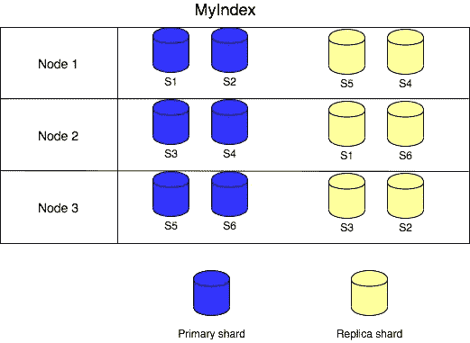
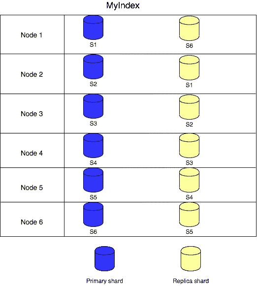
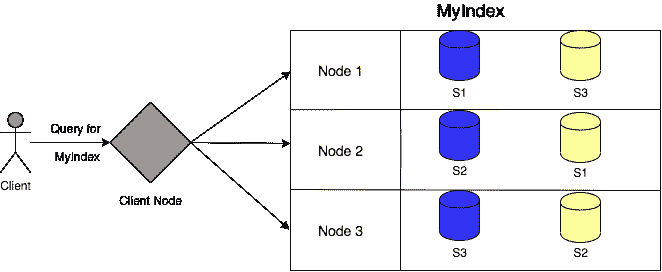
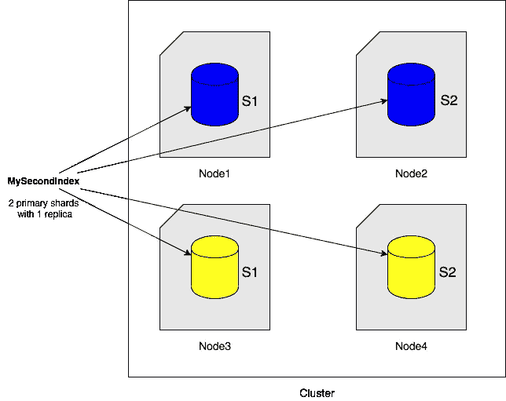
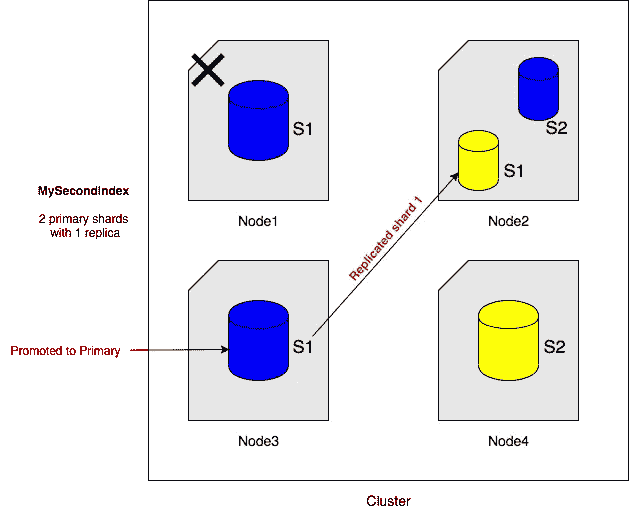

# 弹性搜索及其内部工作

> 原文：<https://medium.com/geekculture/elasticsearch-internals-4c4c9ec077fa?source=collection_archive---------0----------------------->

Elasticsearch 的关键是一个倒排索引，这使得它比现有的其他传统数据库系统更好。核心的倒排索引是 Elasticsearch 与其他 NoSQL 商店(如 MongoDB、Cassandra 等)的不同之处。Elasticsearch 中的所有数据都作为倒排索引内部存储在 [Apache Lucene](https://lucene.apache.org/core/) 中。尽管数据存储在 Apache Lucene 中，但正是 Elasticsearch 使数据得以分布，并提供了易于使用的 API。

**基本术语:**

1.  **字段:**字段是弹性搜索中最小的数据单位。例如标题、作者、日期、摘要、团队、分数等。
2.  **Documents:** Documents 是存储在 Elasticsearch 索引中的 JSON 对象，被认为是基本的存储单元。在关系数据库的世界中，文档可以比作表中的一行。
3.  **Mappings:** 在 Elasticsearch 的最新版本(即 7.x)中已被弃用。这就像关系数据库世界中的一个模式。
4.  **索引:**这些是弹性搜索中最大的数据单位。它们可以与关系数据库中的数据库进行类比。它们可以被假定为文档的逻辑分区。
5.  **碎片:**这些是 Lucene 索引。这是帮助伸缩弹性搜索的关键。在这里，我们可以将一个索引分成多个分区，每个分区可以驻留在一个节点上，以获得更好的可用性和可伸缩性。
6.  **段:**一个分片进一步分为多个段。每个段都是存储实际数据的倒排索引。一个段**是不可变的**。在一段固定的时间之后，这些相同大小的段被编辑在一起以形成更大的段，从而进行有效的搜索。这整个过程对用户完全透明，由 Elasticsearch 自动处理。
7.  **副本:**副本，顾名思义，是弹性搜索的防故障机制，基本上是索引碎片的副本。这是一个有用的备份系统，以备不时之需，或者换句话说，当一个节点崩溃时。副本还服务于读取请求，因此添加副本有助于提高搜索性能。
8.  **分析器:**它们也与优化索引和高效搜索相关。它在索引文档时使用，将短语分解成它们的组成术语。 ***标准分析器*** 是 Elasticsearch 使用的默认分析器，它包含基于语法的标记器，可以删除常见的英语单词和文章。
9.  **节点:**elastic search 的每个实例都成为一个节点。如果一个服务器有 2 个 Elasticsearch 实例，那么就会有 2 个 Elasticsearch 节点。它的关键任务是存储和索引数据。Elasticsearch 中有不同种类的节点:

a) **数据节点**——存储数据并执行数据相关操作，如搜索和聚合。

b) **主节点**——负责集群范围的管理和配置操作，例如添加和删除节点。

c) **客户端节点**——向主节点转发集群请求，向数据节点转发数据相关请求。

d) **摄取节点** -用于在步进前进行预处理。 **Logstash** 可以被实例化为一个摄取节点。每个节点由其名称(或 id)唯一标识，并且默认情况下能够成为**主**节点。

10.**集群:**集群由一个或多个弹性搜索节点组成。每个集群都有一个唯一的标识符，每个节点(希望成为集群的一部分)都必须使用该标识符。

11. **Translog:** Lucene 提交的开销太大，无法对每一个单独的更改都执行，所以每个分片拷贝也将操作写入其事务日志，称为 Translog。translog 中的数据只能通过 Lucene commit 保存在磁盘上。在 JVM 失败或碎片崩溃的情况下，自上次 translog 提交以来写入的任何数据都将丢失。

a)**index . trans log . sync _ interval-**无论写操作如何，多长时间将 trans log`fsync`写入磁盘并提交一次。默认为`5s`。不允许小于`100ms`的值。

b)**index . translog . duration-**是否在每次索引、删除、更新或批量请求后提交`fsync`和 trans log。此设置接受以下参数:(I)请求(ii)异步

c)**index . trans log _ flush _ threshold-**默认为 512mb。

12. **Flush:** 这个过程将事务日志从内存提交到磁盘。

## **让我们来谈谈节点、索引和分片之间的关系。**

让我们用 **3** 个节点(或实例)创建一个 Elasticsearch 集群。假设索引是“MyIndex ”,带有 **6** 个碎片和 **1** 个副本。

An Index is distributed into 3 nodes with 6 shards and 1 replica

让我们向群集中再添加 3 个节点。现在，每个节点将只有一个主碎片和一个副本，这种重新平衡对用户完全透明，由 Elasticsearch 处理。

The Index is distributed into 6 nodes

现在，如果我们在集群中增加 6 个节点，每个节点将只有一个碎片，要么是主节点，要么是副本节点。

## **分布式搜索**

Elasticsearch 执行并行搜索，因为它将数据分布在给定索引的多个分片中。客户机节点对索引的每个碎片发出并行请求，并编译结果返回给客户机。这种分布式搜索功能使得 Elasticsearch 的速度非常快，其数据存储中有数十亿条记录。

Parallel requests on multiple shards of an index

【Elasticsearch 如何处理失败？

假设一个 Elasticsearch 集群中有 4 个节点。使用 2 个碎片和 1 个副本创建了一个索引**‘我的索引’**。每个节点将有一个主碎片或一个副本碎片，如下图所示:

MySecondIndex has 2 primary shards with 1 replica each

现在，假设 Node1 因为某个硬件故障而关闭。Elasticsearch 将节点 3 上的副本碎片 S1 提升为主碎片，并在节点 2 或节点 4 上创建一个新的副本碎片。 ***如果主节点本身出现故障，主节点所在的节点会向主节点发送一条消息。索引操作将等待(默认情况下最多 1 分钟)主服务器将其中一个副本服务器提升为主服务器。*** Elasticsearch 在主节点的帮助下完成所有这些步骤。完成此过程后，群集将如下所示:

The replica is promoted to primary shard on Node3 and S1 is re-replicated on Node2

## 写入路径

**在索引级别:**

1.  使用路由逻辑(基于目标文档的哈希值)的复制组被识别，然后主碎片在结果复制组中被识别。
2.  写操作被转发到主碎片，主碎片做很多事情来索引文档 E-2-E
3.  主碎片验证文档的内容和结构。
4.  在本地执行操作。
5.  将操作转发到当前同步副本集中的每个副本。如果有多个副本，这是并行完成的。
6.  一旦所有复制副本成功执行操作并响应主副本，主副本就会向客户端确认请求成功完成。 ***注意:有一个配置是 wait_for_active_shards，它可以有任意正值，最大值为副本+主 shards(或全部)的总数。默认值为 1。***

**在分片级别:**

1.  文档被添加到 shard 的 translog 中，如果在请求中传递了 async，客户端将获得成功的确认。
2.  5s 后，translog 被提交到磁盘，并在碎片中创建新的不可变段。
3.  每个段都是一个倒排索引。它就像一个映射，将术语作为一个键，将术语出现的文档列表作为值。为文档编制索引涉及多个步骤。分析仪在这一过程中起着至关重要的作用。
4.  文档被分割成令牌。
5.  所有的令牌都是小写的。('**守'**变'**守'**，'**泰姬陵**'变'**泰姬陵**'等)
6.  所有停用词都被删除。(例如:删除关键字，如“ **a** ”、“ **the** ”、“ **to** ”等)
7.  然后，令牌规范化完成。(即英文词干和同义词 process——'**降雨**'变成'**下雨'**，'**跳了**'变成'**跳了**'，'**书**变成'**书**'，**周末**和**周日**是一个意思)。
8.  如果我们只是将文档 id 列表存储为每个团队的值，我们将无法精确地提供短语搜索(即图书库)。为此，Elasticsearch 将术语 location 与文档 Id 一起存储在文档中。

## 读取路径

1.  如果是文档搜索，则识别使用路由逻辑(基于目标文档的哈希值)的复制组。
2.  检查事务日志，如果它还没有提交到磁盘，就从那里返回。
3.  任何碎片(主碎片或副本碎片)都可以为客户端的请求提供服务，这使得它成为最快的搜索数据存储。可以添加更多的副本碎片来提高服务效率。
4.  并行搜索索引的所有碎片，它们的结果存储在大小为 **N(默认为 10)的优先级队列中。**这是一种数据结构，用于保存所有分片结果中最匹配的文档。文档的优先级(或相关性)通过 T.F .(术语频率)* I.D.F(逆文档频率)来计算。
5.  一旦整个搜索完成，优先级队列中的文档就被返回给客户机。

## **在生产中使用 Elasticsearch 时需要记住的一些要点:**

1.  它提供乐观并发控制。在更新任何文档时，可以在请求中传递一个版本。它不会在更新时锁定任何碎片或文档。
2.  所有文档都是不可变的，不能更改，更新删除现有文档(软删除，稍后在后台删除)。因此，我们必须始终确保我们最多使用机器中一半的可用容量。
3.  始终保持比可用实例(或节点)更多的碎片，以便索引可以通过添加更多的节点来增加负载。请记住，索引的#shards 一旦创建就不能修改。建议每个节点的碎片数为 **2:1。**
4.  Elasticsearch 在批量操作中表现更好。如果可能的话，试着批量索引或搜索你的文档。
5.  如果需要精确的字段搜索，请使用过滤器而不是查询，因为过滤器比查询更有效。过滤结果也可以被缓存。
6.  3 主节点集群是首选。
7.  禁用索引中的 **_all** 字段，使用 copy_to 选项复制需要复制到 **_all** 字段的字段。默认情况下，每个字段的数据都存储在 **_all** 字段。这个过程被称为黑名单方法。建议使用白名单方法来建立有效的索引。节省了很多空间。

感谢阅读！