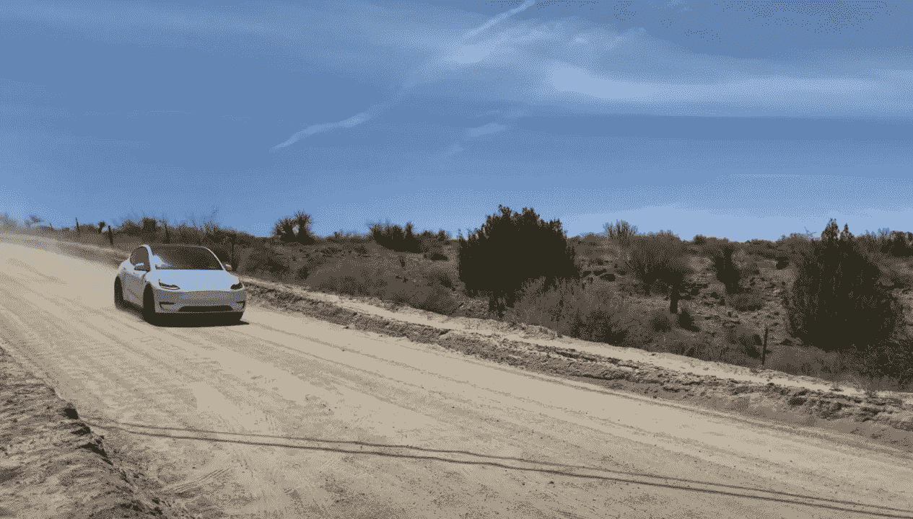
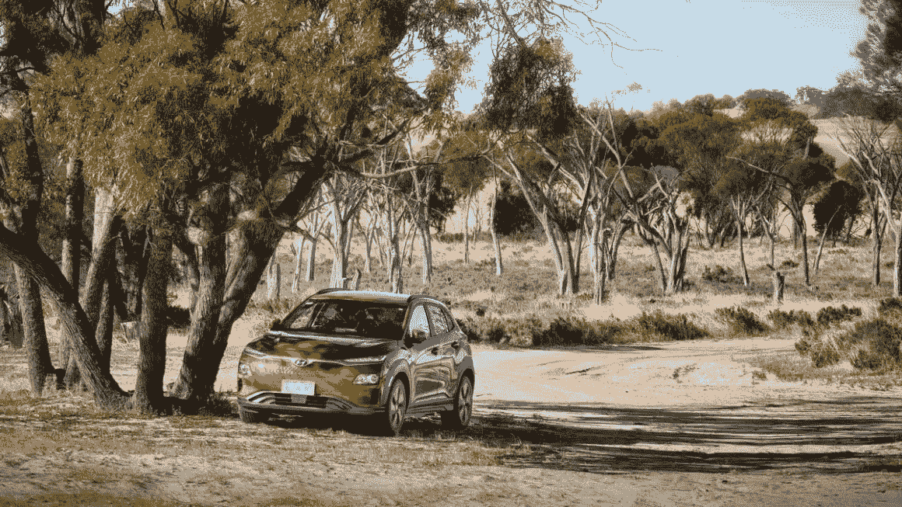
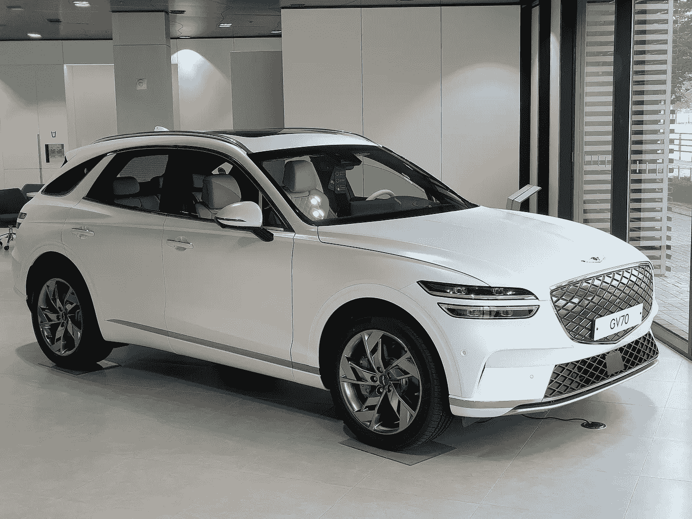
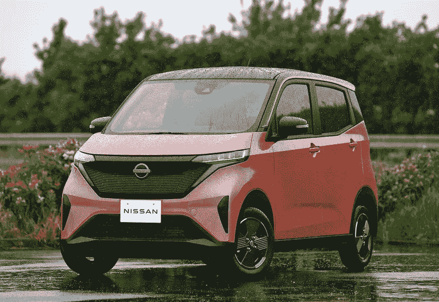

# 电动汽车确实流行起来了

> 原文：<https://medium.com/geekculture/electric-vehicles-did-catch-on-bfe14c0e888e?source=collection_archive---------11----------------------->

根据不完全数据，一个非常粗略的估计是，上个季度全球售出的汽车和轻型卡车中，约有 10%是纯电动汽车。

Tesla Model Y. Photo taken in California. Credit: [Juan Carlos LTO](https://www.youtube.com/watch?v=TuHqgHt9l0w)

2019 年，澳大利亚总理斯科特·莫里森宣称，他的政治对手想要“结束周末”。

这是在选举前不久，在对手的电动汽车政策背景下说的。

莫里森强调了澳大利亚人对四轮驱动汽车和 SUV 的热爱，并表示他的对手如何想剥夺澳大利亚人购买这种汽车的可能性，并让他们购买电动汽车，而入门级电动汽车“不会拖你的拖车[……]不会拖你的船[……]不会带你和家人去你最喜欢的野营地”。

“比尔·肖特*(当时的反对党领袖)*想在周末结束时谈谈他对电动汽车的政策，澳大利亚人喜欢开着他们的四轮驱动车出去。当谈到澳大利亚人的选择时，他想对 SUV 说再见。”

顺便说一句，莫里森的政党赢得了那些选举。

**现在的情况**

好吧，现在是 2022 年，把 SUV 和电动车当成两个不重叠的王国就困难多了。*尤其是当特斯拉 Model Y(一款 SUV……至少名义上),有望成为今年全球最畅销的电动汽车的时候。*

而说到皮卡(澳洲术语是 *utes* )，通常比 SUV 更有越野基因——Rivian 和福特，不仅仅是他们，已经开始出货全电动的了。

此外，越来越难以将电动汽车视为某种可能会流行起来的新奇想法。

如果上个季度电池电动汽车(bev)在轻型汽车中的全球市场份额真的在 **10%** 左右(*这不包括插电式混合动力车，插电式混合动力车通常包含在电动汽车的统计数据中*，那么我们已经过了分析师曾预测为 5%的所谓“电动汽车临界点”。

电动汽车将会普及的未来？我们已经生活在其中了。

**不只是为了粉丝**

关于“毁了周末”(这似乎是更受欢迎的版本)的流行语，讽刺地使用，显然成为澳大利亚 EV 粉丝的最爱。

引用 driven.io 上一篇关于一个脸书组织的文章，标题是(当然)*我毁了这个周末*:

Photo: [Sam Blight](https://thedriven.io/2021/12/23/i-ruined-the-weekend-electric-cars-owners-share-their-stories-about-ev-road-trips/)

萨姆·布莱特漫不经心地开着他的科纳电动车，浪费了整整一个下午:“下午去延宁宁湖，今年下了一场好雨，湖水就满了。”

这个团队的创始人 Ant Day 进行了一次 1500 公里(930 英里)的埃斯佩兰斯之旅，破坏了为期三天的周末，参观了海湾边缘音乐节，沿途被一些可爱的野花吓坏了，然后参观了一些非常漂亮的海滩。

自 2019 年以来，情况发生了很大变化，当时寻找电动汽车的澳大利亚买家没有太多选择。Y 型现在相当受欢迎(不管你选择哪个国家，这种型号出现在几乎所有排名中是不是很无聊？)，挑战马自达 CX 5 和丰田 RAV4。

重要的是，电动汽车不再仅仅是那些特别想要电动汽车的人的选择。对于轿车或 SUV 的购买者来说，这是一个很有吸引力的选择。英国《Top Gear》杂志在评论梅甘娜 E-Tech 时用的那个表达是什么？*传统上可取的。*买电动车不一定要成为电动车迷。

市场份额如何？嗯，在 2022 年第三季度，澳大利亚出售的所有车辆中约有 4.4%是全电动的。如果你想挑挑拣拣，9 月份对全电动汽车来说是一个特别好的月份，市场份额为 7.7%。这些销售中的绝大多数是特斯拉。

然而，澳大利亚市场缺乏全电动小卡车仍然是个问题。另一个表明澳大利亚在电动汽车新车型首次亮相时排在最后的例子是大众 ID.4:在欧洲或美国算不上新车型，但在澳大利亚尚未上市。

**悄然电**

现在有很多国家的饮料市场正在蓬勃发展。中国正在推动全球数字上升:从 7 月到 9 月，中国超过 21%的乘用车销售是全电动的。

但是我要写的是韩国市场和某个韩国品牌。

今年 9 月，韩国纯电动汽车的销量首次超过了混合动力车。考虑到韩国是电动汽车及其电池的生产大国，这个时刻来得出奇的晚。但是很多韩国制造的电动汽车都是出口的。*起亚 EV6 和 ion IQ 5——尤其是 ion IQ 5——对欧洲的出口仍然跟不上需求。*

现代起亚的一大卖点是一个电池组，只需 18 分钟就能从 10%充电到 80%；它已经被用在欧洲和北美销售的汽车上。但到目前为止，使用该技术的某款 SUV 一直是为韩国市场保留的。

Genesis Electrified GV70\. Photo: [Damian B Oh](https://commons.wikimedia.org/wiki/File:Genesis_Electrified_GV70_JK1_EV_Matterhorn_White_(3).jpg)

还记得韩国轿车和 SUV 便宜的时候吗？我知道(我还记得德国汽车媒体是如何为此憎恨他们的)。今天，提供负担得起的汽车被认为是一个可怕的错误，一个越来越多的制造商试图避免的错误。创世纪电气化 GV70 不便宜。这款 SUV 以现代起亚(Hyundai-Kia)的高端品牌销售，没有以更廉价品牌销售的双车型。

到目前为止，它只在韩国销售——但这种情况很快就会改变。欧洲的交付预计现在就开始。此外，阿拉巴马州的一家工厂预计将开始向美国市场交付车辆。

电气化的 GV70 看起来与内燃机车没有太大区别。创世纪电动 G80 也是如此，这是一款招摇的、看起来像总统的轿车。

与特斯拉不同，这些车辆显然淡化了它们的全电动性质。它们是豪华汽车，只是碰巧是电动的。

**日本的微型电动车**

事情可能正在改变——缓慢地——即使是在日本，一个以全电动汽车市场份额低而闻名的国家(尽管普通混合动力车非常受欢迎)。

今年推出的日产樱花是一款配备 20 千瓦时电池的电动车。肯定不是远程电动车。

Photo: Hideyuki Nakano, [response.jp](https://response.jp/article/2022/05/20/357388.html)

但是尼桑的车在日本很受欢迎。加上三菱 eK X EV twin，上个季度销量超过 13，000 辆，市场份额为 1.6%。*这还不是饮料市场的份额；这是整个乘用车市场的份额。*

总体而言，全电动汽车仅占日本乘用车市场的 2 %- 3 %,因此日产/三菱的微型电动汽车肯定占了这些销售的大部分。

对于电动汽车来说，这是相当实惠的。当然，它在欧洲是没有的。它可能会卖得太好。

***数字***

*中国:1，215，155 辆*
欧盟、欧洲自由贸易区和英国:355，000 辆*
美国:205，682 辆
韩国:49，631 辆**
日本:21，100 辆*
印度:13，054 辆**
澳大利亚:12，047 辆**
*不包括轻型商用车
**可能包括重型商用车【T17*

*全球轻型车(各种动力总成)市场预计为 1927.4 万辆。所有数据均为 2022 年第三季度的数据。*

*来源:中国*[*1*](http://www.cpcaauto.com/newslist.php?types=csjd&id=2894)*】*[*2*](http://www.cpcaauto.com/newslist.php?types=csjd&id=2891)*[*3*](http://www.cpcaauto.com/newslist.php?types=csjd&id=2863)*】*[*4*](http://www.cpcaauto.com/newslist.php?types=csjd&id=2861)*[*5*](http://www.cpcaauto.com/newslist.php?types=csjd&id=2834)*[*6 *EFTA 和英国[**](http://www.cpcaauto.com/newslist.php?types=csjd&id=2833)*[*7*](https://cleantechnica.com/2022/10/25/europe-electric-car-sales-16-fully-electric-24-have-a-plug/)*][*[*8*](https://cleantechnica.com/2022/08/24/11-of-new-car-sales-in-europe-electric-19-plugins-2/)*][*[*9*](https://cleantechnica.com/2022/09/29/13-of-new-car-sales-in-europe-electric-21-plugins-2/)*][*[*10*](https://www.acea.auto/pc-registrations/passenger-car-registrations-9-9-nine-months-into-2022-9-6-in-september/)*][*[*11*](https://www.acea.auto/cv-registrations/commercial-vehicle-registrations-17-6-nine-months-into-2022-6-6-in-september/) **日本[*[*15*](https://www.eco-revo.blog/energy/202207_evsales)*][*[*16*](https://www.eco-revo.blog/energy/202208_evsales)*][*[*17*](https://www.eco-revo.blog/energy/202209_evsales)*]，印度[*[*18*](https://evreporter.com/indias-electric-vehicle-sales-trend-september-2022/)*]，澳大利亚[* [*19*](https://www.drive.com.au/news/electric-car-sales-australia-july-2022/)*****

*文章原载于*[*【brunelist.com】*](https://www.brunelist.com/2022/11/02/electric-vehicles-did-catch-on/)*。*