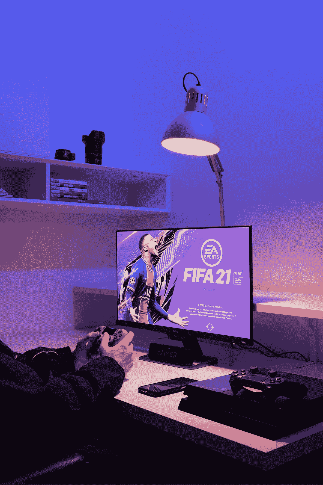

# 电子艺界将不再产生国际足联

> 原文：<https://medium.com/geekculture/electronic-arts-will-no-longer-produce-fifa-a1e3db72c659?source=collection_archive---------18----------------------->

## 国际足联将与其他开发商合作推出新的足球游戏

Photo by [Guglielmo Basile](https://unsplash.com/es/@guglielmobasile?utm_source=medium&utm_medium=referral) on [Unsplash](https://unsplash.com?utm_source=medium&utm_medium=referral)

EA 离开国际足联的消息今天在视频游戏行业(和足球世界)引起了轩然大波。正如之前报道的那样，艺电将取消 FIFA 标志，取而代之的是“艺电体育俱乐部”。它被宣传为“未来的…