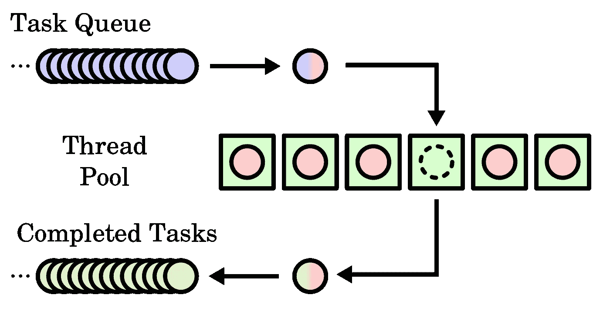
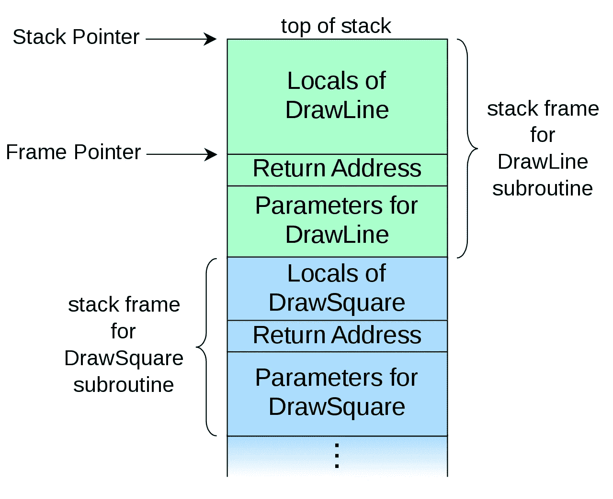
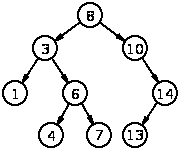
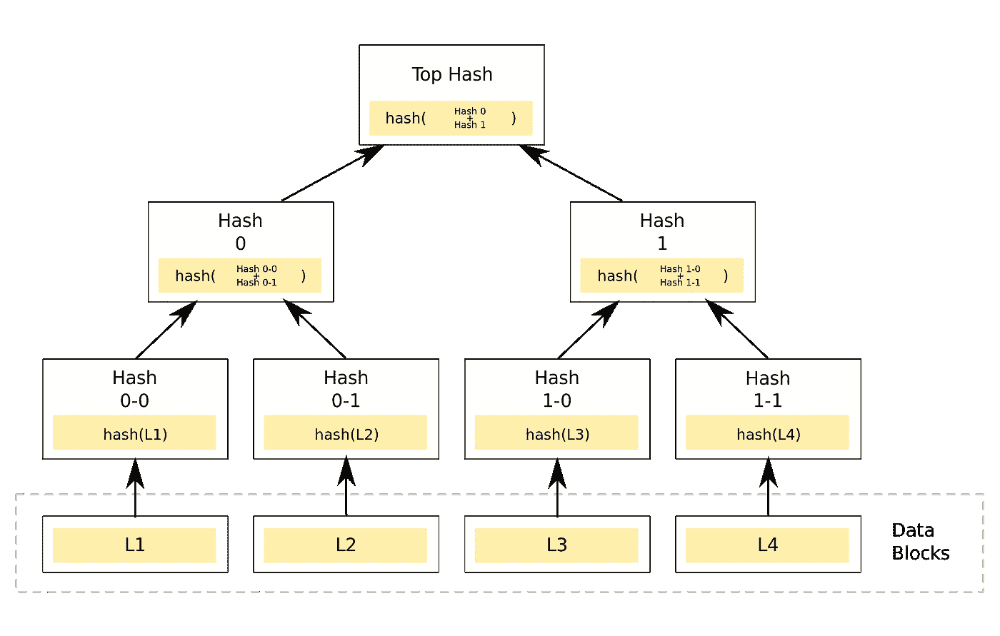
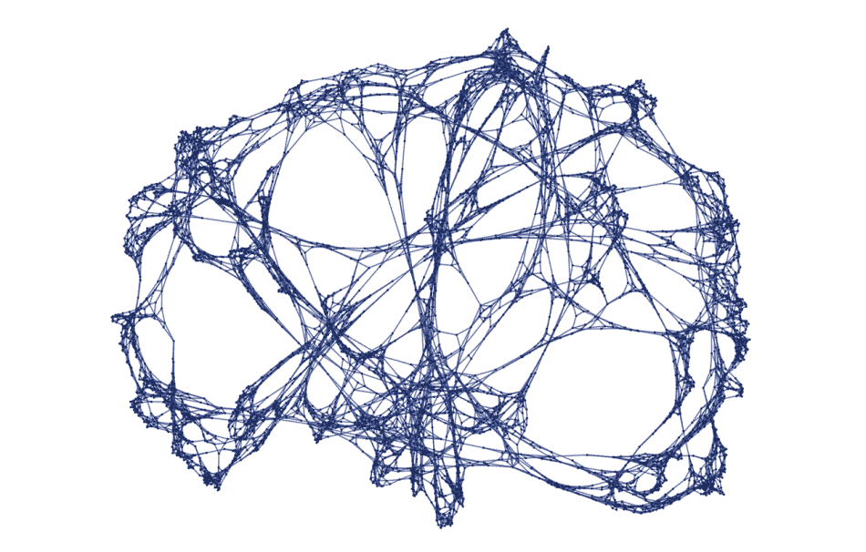

# 编程元素:基本数据结构

> 原文：<https://medium.com/geekculture/elements-of-programming-fundamental-data-structures-882a6e57245f?source=collection_archive---------15----------------------->

数据结构是我们在计算机科学中所做的一切的基础:理解它们对于编写严谨的软件和有效的算法是至关重要的。

Photo by [Alina Grubnyak](https://unsplash.com/@alinnnaaaa?utm_source=medium&utm_medium=referral) on [Unsplash](https://unsplash.com?utm_source=medium&utm_medium=referral)

有两种看待数据结构的一般方法:概念和实现。理想情况下，它们应该帮助您为给定的问题选择有效的数据结构。基本的数据结构在大多数情况下自然地表现出来。问题通常需要某种数据结构，而其他的可以用不同的方式表示。一个有效的数据结构应该可以简化这个问题。但这只是故事的一半，因为数据结构还必须确保计算效率。我们可以通过从概念上寻找一个合适的数据结构来简化问题，同时通过研究实现来获得性能优势。

现在，我们已经熟悉了在选择数据结构时从两个角度看问题的本质，我应该正式向您介绍这些特征了。我们可以从抽象和实现的角度来看待数据结构——从现在开始我们称之为抽象数据类型。

抽象数据类型(ADT)应该描述给定数据结构中的一组功能——它们是以声明的方式编写的。它接近于数学中的一种代数结构，概括了特定上下文中的规则和运算[1]。来自数学的灵感建立在一个类中，这个类包含了一系列的值和行为，这些值和行为支持我们在一个结构中可以做的操作。这样的抽象模型隐藏了实现逻辑。ADT 是语言无关的，因为它只描述数据结构的原型。

Example of ADT in List.

在用抽象模型(ADT)编程数据结构时，一个好的实践是在包含 ADT 和实现细节的模块之间建立[松耦合](https://en.wikipedia.org/wiki/Loose_coupling)。目的是维护编程逻辑和功能之间的概念图，从而提高系统的可维护性。

下面是一个在 C++语言中实现 ADT 的例子，因为标准模板库(STL)被认为是成熟和先进的，它是阅读一个好软件的好参考。然而，由于它的细微差别和技术复杂性，我们将只讨论 STL 的核心概念之一:容器。

将它保存在一个单独的模块中可以提高可维护性，并在开发人员实现特定于该功能的逻辑之前澄清他们的意图。不要担心新词*单链表*，因为我们不会在这里谈论它。现在，关注我们如何编写 ADT 来描述数据结构的操作——在本例中是一个列表。

Expressing ADT in C++

同时，实现细节包含了确保 ADT 中所描述的操作的特殊之处和技巧。从这个角度来看，了解你的语言的特点以了解确保安全和效率的技术是很重要的，比如像 C/C++这样的语言中的引用和内存管理。就此而言，实现 ADT 中定义的概念与语言密切相关；程序员必须精通这门语言的技术。

在实践中，这两个镜头通过首先建立清晰度，然后建立规格来协同工作。

# 基本数据结构

Euclid in Raphael’s [*School of Athens*](http://commons.wikimedia.org/wiki/File%3ARaphael_School_of_Athens.jpg)(Wikimedia Commons).

> 就像欧几里得几何对世界的抽象和实际的相似性一样，ADT 和它的实现以一种方式对应，前者是纯粹理想的，而后者更接近现实。

在本节中，我们简要介绍基本的数据结构，并引用一些它们的用例。我们将介绍以下数据结构。

*   目录
*   双端队列
*   树
*   一组
*   地图
*   图表

在我们深入研究之前，我们应该记住数据结构的基本功能。每个结构的基线必须支持以下操作:它应该能够搜索一个项目，排序，插入，更新和删除项目。

*   **搜索**——算法到**T5 找到** 数据结构中的一项。
*   **排序**—算法到 ***按一定顺序组织*** 项。
*   **插入**—算法到 ***在一个数据结构中插入*** 项。
*   **更新**——算法到 ***更新*** 一个数据结构中的现有项。
*   **删除**—算法到 ***从数据结构中删除*** 一个现有项目。

base functionality

## 目录

list 是一种抽象数据类型，表示可计数的有序值，其中相同的值可能出现多次。列表可以线性或非线性排序。非线性列表可以以树、图或地图的形式实现。然而，我们在它们各自的类别中对它们进行了区分，因为它们本身有它们自己的细微差别。在这个上下文中，列表属于线性列表族。

当获得顺序的概念时，一个值允许有重复项时，以及当我们想要对数据集进行排序和搜索时，列表数据结构是有用的。List ADT 是在 C++ STL 中的[序列容器](https://www.cplusplus.com/reference/stl/)类中实现的。它包括以下内容:数组、向量、队列、forwad_list 和 list。

从概念上讲，所有其他的数据结构都可以用列表来实现[2],然而，我们想根据它们所代表的结构来对它们进行分类，这对我们遇到的问题很有用。(这与我在这里列出的算法分类有关:[理解算法:一般观点](/swlh/making-sense-of-algorithms-general-perspective-c3ba626577ae)。)

当我们谈论一个列表时，一个常见的结构叫做链表(在 STL 中实现为一个列表)。它被应用在许多用例中，比如派生其他结构、您在 web 浏览器中访问的链接或者音乐播放列表。

Photo by [Filip Havlik](https://unsplash.com/@fhavlik?utm_source=medium&utm_medium=referral) on [Unsplash](https://unsplash.com?utm_source=medium&utm_medium=referral)

## 双端队列

Deque 是队列和堆栈的组合，因为这些数据结构之间的区别在于它们的排序，而队列保持 FIFO 顺序，堆栈保持 LIFO 顺序。因此，deque 支持列表的 FIFO 和 LIFO 排序。

FIFO 的意思是先进先出的排序。最常见的例子是在超市排队。有时我们称之为队列，其中建立的策略是先来先服务。

Photo by [Julius Vincent](https://unsplash.com/@123juli?utm_source=medium&utm_medium=referral) on [Unsplash](https://unsplash.com?utm_source=medium&utm_medium=referral)

另一方面，LIFO 代表后进先出排序。想象一下从一堆书中取出一本书。你必须反复移除最上面的书，直到你找到你想读的书。

Photo by [Annie Spratt](https://unsplash.com/@anniespratt?utm_source=medium&utm_medium=referral) on [Unsplash](https://unsplash.com?utm_source=medium&utm_medium=referral)

队列用于在处理请求时保持后进先出的优先顺序。一个很好的例子是调度系统:处理是基于*先来先服务*的基础上完成的。CPU 调度系统利用队列的 LIFO 特性[3]。

A sample [thread pool](https://en.wikipedia.org/wiki/Thread_pool) (green boxes) with a queue (FIFO) of waiting for tasks (blue) and a queue of completed tasks (yellow). Image source: [https://commons.wikimedia.org](https://commons.wikimedia.org)

栈的常见用例在语言中产生共鸣，例如调用栈，其中栈数据结构存储关于计算机程序的活动子例程的信息。

Call stack. Source: [https://commons.wikimedia.org](https://commons.wikimedia.org)

ADT of Deque container.

> 转移到更专门化的数据结构，因为它们依赖于以前的数据结构。这就是令人兴奋的地方！

## 树

树形数据结构用于表示层级或非线性排序。我们通常用类似于家谱的东西给它们命名。我们将讨论一些常用术语，但请记住，这些术语并不详尽。

*   根-根节点是树结构的起点。它没有父节点。
*   父节点—父节点是节点的直接前任。
*   子节点—子节点是父节点的后续节点
*   叶子-叶子位于树的末端。它没有任何子代。

Binary Search Tree. From [Wikimedia Commons](https://en.wikipedia.org/wiki/Binary_search_tree#/media/File:Binary_search_tree.svg).

树有很多种版本，它们可以用不同的方式实现。值得注意的是，尽管 C++ STL 没有树容器，但它将集合实现为一个[二叉查找树](https://bityl.co/6Mhm)。

二叉查找树(BST)是一种特殊类型的树，它保持了每个父节点只允许两个子节点的属性，其中左边的子节点总是小于父节点，而右边的子节点总是大于父节点[4]。

另一种在密码学中广泛使用的树被称为 Merkle 树，其中每个[叶节点](https://en.wikipedia.org/wiki/Leaf_node)用数据块的[密码哈希](https://en.wikipedia.org/wiki/Cryptographic_hash_function)标记，每个非叶节点用其子节点标签的密码哈希标记[5]。

An example of a binary hash tree (Merkle Tree). [From Wikimedia Commons.](https://en.wikipedia.org/wiki/Merkle_tree#/media/File:Hash_Tree.svg)

编译器和解释器[6]利用了树的层次结构和顺序。解析树是计算机可以理解的语言的形式表示。

## 一组

正如我们前面提到的，集合被实现为树。集合对于在给定的列表中保存唯一的元素非常有用，更不用说它们是数学的基础——我们从[集合论](https://plato.stanford.edu/entries/set-theory/)中知道这一点。由此可见，高级数学概念是在集合的结构中实现的。

ADT of Set container.

## 地图

map 是一种键值对数据结构，Python 等其他语言称之为字典。键是一个索引，您可以用它来调用其相应的值。

计算机科学家 Brian Kernighan 认为它们是最有用的数据结构。

Essentials: Brian Kernighan on Associative Arrays — Computerphile

地图最显著的应用是在数据库系统中。

Map container ADT.

## 图表

最后，最广泛的数据结构类别在这里。

Hypergraph of the universe. Source: [https://bityl.co/6Mnj](https://bityl.co/6Mnj)

图是树的概括。数学和计算机科学的一个领域致力于探索图形的世界。我个人最喜欢的是自动定理证明中的图论实现和物理学中的一些理论基础，如在史蒂夫·沃尔夫勒姆的项目中发现的。

图无处不在，我们可以用图来表示几乎所有的问题，因为树是图的特例，链表是树的特例。

# 外卖食品

既然我们已经讨论了基本的数据结构和它们的用例，我们知道我们可以用各种形式的数据结构来表示问题。我们还讨论了这种数据结构最重要的应用领域。我们为实现这些数据结构设计了抽象模型。探索计算机科学这一领域的一个有趣的方法是尝试自己实现它们。

如果你想和我一起讨论这个话题，我将很快发布一系列关于实现这些数据结构的古怪细节，敬请关注！

## 参考

1.  戴尔，内尔；亨利·沃克(1996 年)。*抽象数据类型:规范、实现和应用*。琼斯&巴特利特学习。[ISBN](https://en.wikipedia.org/wiki/ISBN_(identifier))[978–0–66940000–7](https://en.wikipedia.org/wiki/Special:BookSources/978-0-66940000-7)。
2.  斯蒂芬斯河(2019)。基本算法:使用 Python 和 C 语言实现计算机算法的实用方法。约翰·威利的儿子们。
3.  GeekforGeeks (2018)。队列数据结构的应用。[https://www . geeksforgeeks . org/applications-of-queue-data-structure/](https://www.geeksforgeeks.org/applications-of-queue-data-structure/)
4.  维基百科贡献者。(2021 年 3 月 31 日)。二叉查找树。在*维基百科，免费百科*。检索到 2021 年 4 月 13 日 08:24，来自[https://en.wikipedia.org/w/index.php?title = Binary _ search _ tree&oldid = 1015282423](https://en.wikipedia.org/w/index.php?title=Binary_search_tree&oldid=1015282423)
5.  乔治·贝克尔。[“Merkle 签名方案、Merkle 树及其密码分析”](http://www.emsec.rub.de/media/crypto/attachments/files/2011/04/becker_1.pdf) (PDF)。波鸿鲁尔大学。第 16 页。
6.  纽约州斯特伦市(2018 年)。制作口译员。[*https://crafting interpters。*](https://craftinginterpreters.) *com/[2。8.【2020】。*