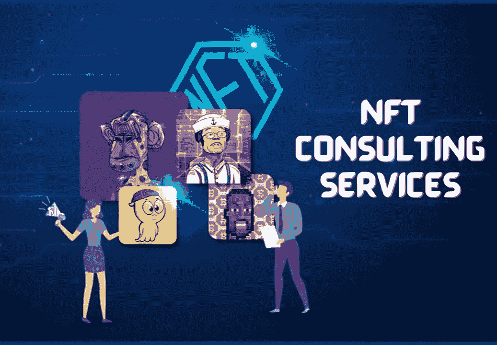
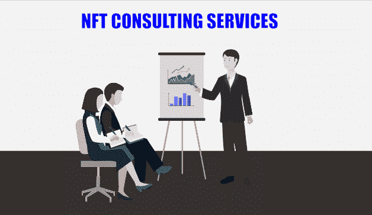

# 通过 NFT 咨询服务公司发起的活动提升您的 Web3 业务！

> 原文：<https://medium.com/geekculture/elevate-your-web3-business-with-campaigns-fuelled-by-nft-consulting-services-75b8e080334?source=collection_archive---------21----------------------->

由于其有趣的功能和世界各地人们对密码的采用，FTs 正在全球市场蓬勃发展。最近的研究表明，NFT 市场的规模在 2021 年为 43.6 亿美元，预计在未来几年将以 23.9 CAGR 的速度快速增长，到 2029 年将达到 200 亿美元的巨大市场。NFT 的这种增长为越来越多基于这些虚拟代币的企业铺平了道路。因此， [**NFT 咨询服务**](https://bit.ly/3UDYLXR) 对于 NFT 的企业和初创公司来说，在加密领域留下印记是必不可少的。NFT 公司可以通过定制的客户特定的 NFT 咨询服务将其企业提升到一个新的水平。

> **让我们进一步了解 NFT 咨询公司以及它如何帮助您的企业。**

## **您为什么需要 NFT 咨询服务**？

**👉市场研究:**NFT 市场是一个不断发展的市场；NFT 咨询服务可以通过对市场进行全面的研究和分析，指导您选择最适合您企业的产品。

👉**商业咨询:**通过市场专家，NFT 咨询公司可以预测市场动向，并根据您的业务为您提供准确的预测，以获得最佳结果。

👉**功能检查:**咨询机构分析你的创业平台，根据生存能力解决问题和冲突。

👉**非功能性需求:**咨询机构事后分析工作特性，以确保平台运行速度良好，没有任何 bug 和错误。

👉**架构设计:**咨询服务一丝不苟地在你的 Web3 业务的组件之间画出链接，以确保所有的组件都工作良好。

👉**技术堆栈:**NFT 咨询机构的技术专家会根据您的范围和需求，帮助您选择适合您平台的第三方堆栈。

**NFT Consulting Services**

## **NFT 咨询服务**

⏭ **NFT 创作咨询:** NFT 咨询服务为您提供新的想法，并通过定制的营销策略围绕您的 NFTs 进行宣传，从而与更广泛的 **Web3 社区建立联系。**

⏭ **NFT 造币咨询:** NFT 专家指导 NFT 造币，以及你应该为你的项目造币的 NFT 数量。它们还能帮助您做出关于白名单流程和销售价格的决策。

⏭**智能合同策略:**咨询服务可以为您的 NFT 提供现代用例指导，这些用例可以写在智能合同上，以吸引不断增长的 Web3 社区。

⏭**战略合作伙伴和销售:**你可以与领先的 NFT 公司、网络 3 影响者和媒体机构结盟，在 NFT 咨询机构的帮助下将你的项目推向新的高度。

⏭**代币产品:**您可以根据相关法律法规添加与投资型证券产品相关的功能。

⏭**影响者营销:** NFT 咨询机构，凭借其与数字领域 [**顶级影响者的联系**](https://bit.ly/3R7gELK) **，**可以帮助您的项目有效地触及更广泛的受众。

⏭**社交媒体营销:**社交媒体可能是在短时间内扩大影响的最佳工具。咨询服务有助于有效利用社交媒体帖子、页面、渠道和群组，吸引观众参与您的项目。

⏭**社区建设:**借助专业的社区管理团队，您可以在不同平台上为您的 NFT 项目建设和管理大型商业社区。

## **NFT 咨询服务覆盖的 NFT 用例**

✪艺术品

✪体育收藏品

✪游戏内资产

✪音乐

✪照片

✪活动门票

✪专利

## NFT 咨询机构能帮你什么？

一家专业的 NFT 咨询机构对 Web3 领域有着深刻的认识和理解。因此，它可以提供定制的 NFT 咨询和营销服务

与当前趋势一致。如果你是 NFT 的企业家或创业者，那么[**NFT 咨询服务**](https://bit.ly/3UDYLXR) 可以拯救你，因为在没有专业帮助的情况下，在 NFT 生存可能会很有挑战性。既然**“晚一天就是晚一美元”，**现在就雇佣一家 NFT 咨询服务机构，将你的 NFT 事业提升到新的高度。