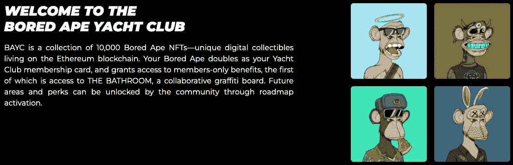
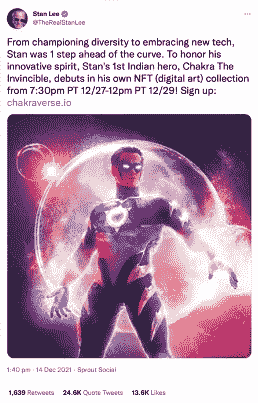
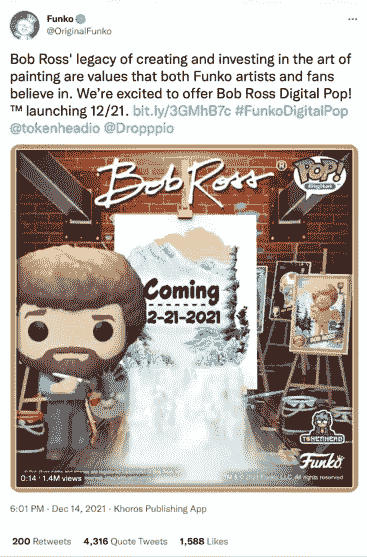
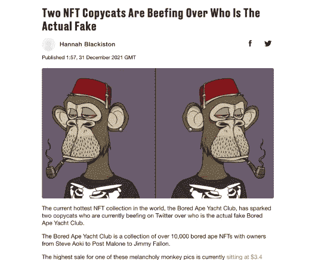
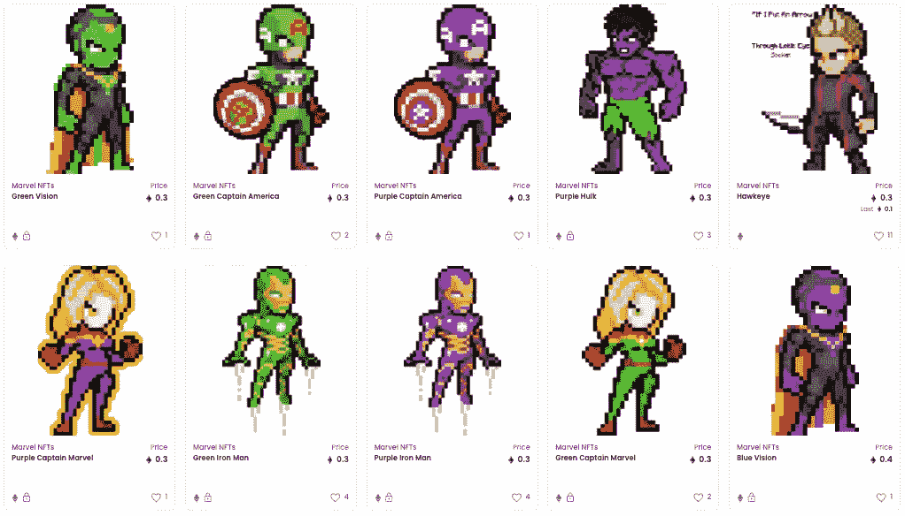

# ELI5: - NFTs，好的和坏的！

> 原文：<https://medium.com/geekculture/eli5-nfts-the-good-and-the-bad-f3eed6445dc4?source=collection_archive---------15----------------------->

*如果你用过你的免费故事，你可以在这里阅读***。**

*NFTs 接管潮流的方式至今让我难以置信。一条 5 个字的推文如何卖到 290 万美元，一张时髦的猿图片如何从 20 万美元起价。我读了所有的书，并试着把 NFT 分类，好的和坏的。*

## *什么是 NFT？*

*因此，交易通常以数字或物理方式进行。你花钱，买东西。最近，购买行为发生了变化，通过数字平台进行的交易也发生了变化。现在，你在你最喜欢的游戏中购买了一个看起来很酷的皮肤(数字商品),这带来了购买性质的改变。*

*现在，假设你是一名艺术家，想出售你在画布上画的一幅风景画。这幅画被盗版的机会很小，许多不同的方法可以很容易地识别出真迹。但是如果一个数字艺术家制作了同样的艺术品，将其导出为 JPEG 格式，并上传到互联网上出售。盗版就像右键点击一样简单，而检查实际艺术品的真实性几乎是不可能的。NFT 试图通过创造由创造者拥有的“所有权象征”来改变这一点。所以，当你买卖非功能性食物时，你基本上是在买卖该产品的所有权。*

*NFT 代表不可替代的代币。当某种东西是可替代的，这意味着它是可以互换的，就像现金一样。NFT 使用区块链技术，就像加密货币一样，这有助于他们验证数字产品背后的原始创作者。*

# *优势*

*NFT 也带来了各种有益的机会，*

## *收益*

*NFT 带来了一种新的赚钱方式，让支持者支持创作者，让他们购买自己作品的一部分，而不仅仅是通过贝宝或任何其他服务进行捐赠。*

**

*Screen Grab: I’m a Puzzle*

## *智能合同*

*NFTs 通过使契约更容易和简化来帮助契约，以便 creator 可以利用和制定访问其资产的规则。不再有冗长难读的合同。*

*艺术家可以这样做，每当一幅画获得利润，艺术家就从利润中获得某种形式的佣金。*

## *收藏品*

*收藏家们肯定喜欢一样东西，那就是产品的稀有性。对于收藏者来说，NFT 给收藏者带来了肾上腺素的冲击，因为他们知道自己可以拥有一些稀有的东西，而这些东西太真实了，这要归功于区块链的防呆系统。*

*以这张 Charizard pokemon 卡为例，它卖 22 万美元不是因为它的战斗能力，而是因为它有多稀有。*

**

*Image Credit: Mr.WhosetheBoss*

## *投资*

*NFT 不仅允许创作者，也允许投资者从数字内容中获利，因为 NFT 可以交易，它具有市场价值。就像这个最初花了不到 30 美元买的隐朋克 NFT，但最终卖了 1180 万美元*

**

***CryptoPunk** #7523*

## *社区*

*不管你在哪里，你都想有归属感，对吗？NFTs 通过让你觉得你属于一个你感兴趣的团体来做到这一点。以这个无聊的猿类游艇俱乐部为例，拥有这些 NFT 的人是俱乐部的一部分，他们以此作为一种自豪感。*

**

*Image Credit: [BAYC](https://boredapeyachtclub.com/#/home)*

# *不足之处*

*尽管我很珍惜新技术及其带来的好处，但它也有一些缺点，比如，*

## *低努力内容*

*虽然 NFTs 的主要目的是在不损害数字艺术家资产的情况下支持他们，但商业人士借此机会通过随机创建一堆 JPEGs 文件并稍加调整来赚钱，并且已经准备好了。*

*以“懒惰的狮子”为例，这是另一个由 1 万个“独特的”、昂贵的化身组成的集合，就像“无聊的猿”一样可笑，但却是狮子的形式。看到“无聊的类人猿”如此热销，有人创造了 50 个左右独特的特征，然后使用一段代码，简单地挑选这 50 个输入，随机组合它们，并创建 10，000 个随机输出。没有创意，没有思考过程，只是一种从趋势中获益的方式。*

**

*Image Credit: Lazy Lions*

## *贪婪*

*人们把自己套现的程度简直可笑。有一个名为“下一个地球”的项目，它绘制了整个地球的地图，并允许用户以一定的价格购买数字土地。我敢肯定，创作者一定会想，“既然每个人都对数字内容感兴趣，那我们就出售数字土地吧。”但是物质土地是有目的的。人们可能想住在那里，把它租出去，做农活，等等。除了吹嘘之外，你还能做什么呢？没有人愿意听到有人吹嘘自己。*

**

*V. Taj Mahal — Image Credit: Next Earth*

*还有，谁给了这些“下一个地球”的创造者权利来出售已经有人拥有的土地？这只是我所说的一个平台。还有其他平台，如[地球 2](https://earth2.io/) 、[超级世界](https://www.superworldapp.com/)，所以即使有人试图在这些平台中的一个上购买泰姬陵，这甚至不是你拥有什么稀有的东西，因为那块土地可以在这些平台中的任何一个上买到。*

## *名人*

*事情变得如此糟糕，以至于人们开始利用已故的人进行非功能性思维。漫威漫画的创作者斯坦·李被用来宣传 NFT 的超级英雄系列。我很确定这不是他想要的，向他的粉丝要钱买一些 JPEGs 图片。*

**

*Image Credit: Stan Lee’s Tweet*

*另一个是鲍勃·罗斯的 NFT,《华盛顿邮报》谈到了他创造和投资绘画艺术的遗产，这是错误的。他想让人们购买颜料，制作艺术品。他说，他不希望自己的名字被用于任何不合理的营销策略或利润中，但他的名字的商誉正被用于可以赚到的每一块钱。*

**

*Image Credit: Funko’s Tweet*

*他也是一个环境和自然爱好者，NFT 在这方面也帮不上忙。*

## *环境*

*每一笔购买或出售 NFT 的交易都是由以太坊驱动的，这对环境有害，它使用一种称为工作证明的安全机制，这种机制非常彻底，是 NFT 防欺诈的重要原因，但问题是这种安全需要世界各地的许多计算机为这个网络提供能量，这需要大量能源。*

## *非法活动*

*人们复制有版权的东西，稍加处理，然后贴上他们自己的，然后他们厚颜无耻地争论哪个是真的。*

**

*Image Credit: TheVerge*

*有人创造了一个漫威人物的作品集，除了漫威没有任何这方面的情报，这不是漫威的官方列表，漫威也没有授权给他们。*

**

*Image Credit: Open Seas*

*如果你从这样的包装中购买任何 NFT，你不仅把钱花在了不合法的东西上，而且通过购买有版权的东西也犯了罪。*

*我相信一个人应该只投资由合法的创造者创造的 NFTs，即使市场来了，甚至崩溃了，你也会对你的购买感到满意。*

*话虽如此，还是到此为止吧！如果你喜欢读这个故事，可以考虑关注我。和平*

**如果你愿意支持我，你可以在这里做***。非常感谢！！***

****更多故事****

** [## ELI5:在 CSS 中定位

### 让 CSS 定位变得简单。

medium.com](/codex/eli5-positioning-in-css-305d2d19fb2)  [## 让我们深入了解一下

### 所以，我最近看到很多人，主要是刚开始学 HTML 的人，询问这个 meta 标签，charset 属性是…

medium.com](/geekculture/what-is-meta-charset-utf-8-and-why-do-we-use-it-4eee7456fa1c)  [## 在智能手机和笔记本电脑之间无线传输数据的 5 种最佳方式。

### 以下是如何通过使用这 5 种方法传输数据来提高您的工作效率。我打赌你不知道所有的…

medium.com](/geekculture/5-best-ways-to-transfer-data-from-an-android-smartphone-to-laptop-bda94d080304)**