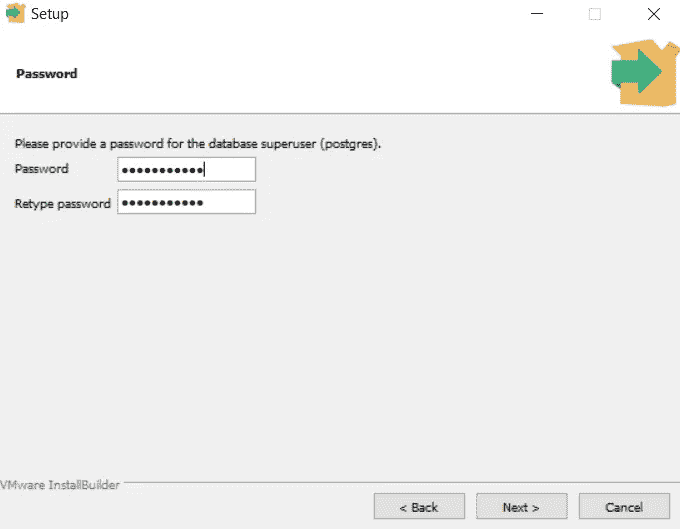
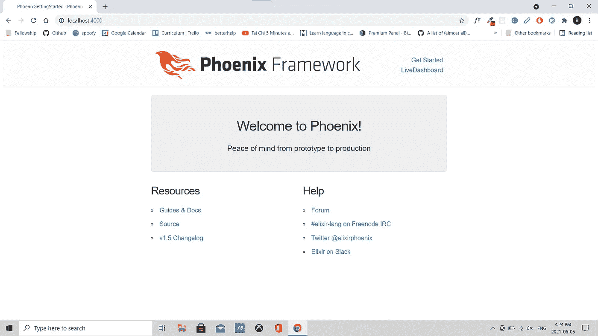
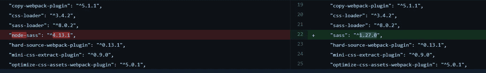
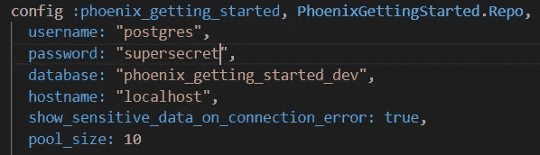

# elixir & Phoenix v 1 . 5 . 9 Windows 10 入门。

> 原文：<https://medium.com/geekculture/elixir-phoenix-v1-5-9-getting-started-on-windows-10-77761e4a53d8?source=collection_archive---------9----------------------->

# 先决条件

要在 Windows 10 机器上运行 Phoenix 项目，您应该安装:

*   节点 js
*   仙丹&二郎
*   十六进制
*   菲尼克斯应用程序生成器
*   一种数据库系统

## 安装节点

如果你正在做其他项目，你可能已经有了 node，但是如果没有，你可以下载一个用于 Windows 10 的 Node 安装程序。

*   下载用于 Windows 的[节点安装程序](https://nodejs.org/en/download/)

## 安装药剂和 Erlang

您可以通过下载安装程序或使用 chocolatey(windows 的软件包管理器)来安装 Elixir 和 Erlang

*   使用[药剂安装器](https://github.com/elixir-lang/elixir-windows-setup/releases/download/v2.1/elixir-websetup.exe)
*   或者安装 [Chocolatey](https://chocolatey.org/install#individual) 并在你的 PowerShell 中运行:

```
cinst elixir
```

## 安装六角

*   在 PowerShell 运行中:

```
mix local.hex
```

## 安装 Phoenix 应用生成器

*   在 PowerShell 运行中:

```
mix archive.install hex phx_new 1.5.9
```

## 安装 PostgreSQL

PostgreSQL 是一个数据库管理工具。稍后，您将使用 Phoenix 中的 Ecto 对其进行配置，以运行您项目的数据库。

*   [下载 PostgreSQL](https://www.postgresql.org/download/windows/)

确保记住您为 PostgreSQL 超级用户选择的密码。稍后您将使用此密码来配置 phoenix dev.exs 文件。



安装 PostgreSQL 后，可能会提示您使用 Stack Application Builder 安装其他附加软件。对于 phoenix 项目，您不需要任何其他包，可以跳过这个对话。

安装 PostgreSQL 后，您可能需要重新启动计算机。

# 开始一个新的凤凰计划。

现在您已经安装了必备组件，您可以生成并配置一个新的 phoenix 项目。完成这一部分后，您将有一个新创建的 Phoenix 项目在 localhost:4000 上运行



## 生成新的 Phoenix 项目

*   在 PowerShell 运行中:

```
mix phx.new project_name
```

您可以将 project_name 替换为您希望的新项目名称。Phoenix 只允许项目名包含小写字母、数字和下划线。

## 安装模块

*   在 PowerShell 的/assets 文件夹中，运行:

```
npm install
```

这里我有一个错误。

```
Can't find Python executable "python", you can set the PYTHON env variable.
```

不过，我的电脑上确实有 python。我发现[其他开发者也有这个问题](https://elixirforum.com/t/npm-installation-for-fresh-phoenixliveview-project-failing-in-windows-10/37170)，并且发现 node-sass 库导致了这个问题。如果您有同样的问题，您可以用 sass 替换 node-sass 来解决这个问题

*   进入 assets/package.json，用 sass 替换 node-sass 包。



*   在 PowerShell 的/assets 文件夹中运行

```
npm install
```

## 运行 webpack

*   在 PowerShell 的/assets 文件夹中，运行:

```
node node_modules/webpack/bin/webpack.js --mode development
```

## 用 PostgreSQL 配置您的 Ecto 数据库

Ecto 为 Phoenix 项目处理数据验证和持久性。默认情况下，它内置了对 PostgreSQL 的集成。它还可以与 MySQL 和 MSSQL 等其他数据库工具配合使用。

*   在您的 dev.exs 文件中，更改密码和用户名以匹配您的 PostgreSQL 超级用户。为了这篇文章，我设置了自己的密码`supersecret`，PostgreSQL 的默认用户名是 postgres。



## 创建您的 Ecto 数据库

*   在 PowerShell 运行中:

```
mix ecto.create
```

希望这能成功运行。然而，如果您得到一个连接被拒绝的错误，您可能有一个 PostgreSQL 问题。可能是密码错误，或者 PostgreSQL 安装不正确。

## 启动服务器

*   在 PowerShell 运行中:

```
mix phx.server
```

## 在浏览器中打开项目

*   打开你喜欢的浏览器(我用谷歌浏览器)
*   转到本地主机:4000

您应该看到您的项目启动并运行了！


我希望这有助于您启动和运行您的 phoenix 项目！期待将来有更多关于凤凰和仙丹的文章，如果你喜欢这篇文章，我会感谢你的评论和掌声！

如果你对这篇文章有任何问题，请评论，我会尽我所能帮助你。