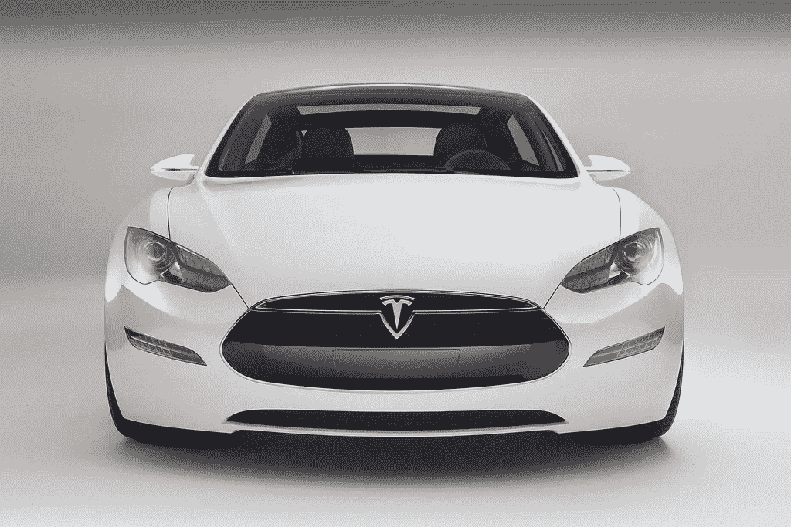

# 特斯拉是汽车行业的未来吗？

> 原文：<https://medium.com/geekculture/elon-musk-bca15eee1d7f?source=collection_archive---------11----------------------->

埃隆·马斯克。要么你爱他，要么你爱恨他。他被一些人誉为将带领人类走向星球的半神(因为如果我们需要一样东西的话，那就是更多的星球可以掠夺)，而被其他人诋毁为一个虚伪的硅谷黑客，因为他很富有(非常富有)。当一个人面对这种矛盾和二元的观点时，自然的直觉是后退一步，评估现有的证据。通常这会导致对主题的更细致入微的理解，经常会导致更少的二元对立，更连贯的叙述。通常情况下。

写一些关于马斯克的想法是爱德华·尼德梅尔的《荒唐:特斯拉汽车 T3 的真实故事》中扭曲现实冒险的结果。

让我们来看看基本情况。马斯克是一名硅谷企业家，他通过帮助创建 PayPal 发了财。利用这次风险投资获得的资本，他向特斯拉汽车公司投资了 3000 万美元，并在 2004 年成为[公司董事会主席。他最终也赶走了公司的创始人马丁·艾伯哈德和马克·塔彭宁。他目前是特斯拉公司(2017 年正式从特斯拉汽车公司更名为特斯拉)的首席执行官，并定期与人权冠军杰夫·贝索斯竞争“世界上最成功的资本囤积者”的迷人头衔。我不想在埃隆·马斯克的心理学上花太多时间，因为内森·罗宾逊在这方面已经](https://www.thestreet.com/technology/history-of-tesla-15088992)[做得很好了](https://www.currentaffairs.org/2021/04/surely-we-can-do-better-than-elon-musk)。相反，我想把重点放在特斯拉如何不是许多人认为的扰乱市场的公司。在这里，我将关注硅谷的软件驱动创新与汽车行业中存在的创新之间的不匹配。

乍一看，你不会想到汽车行业与硅谷相关的公司有任何共同之处。汽车行业是一个行动缓慢的庞然大物，既有成熟的参与者，也没有真正颠覆的空间。这不是因为缺乏尝试，而是因为游戏的本质:高进入壁垒和成品的低利润。进入的高壁垒来自于建立制造工厂的资本要求。机器、工程师、设计师以及一个合理的计划将所有这些放在一起的成本是天文数字。难怪在过去的 40 年里，尽管要求改变的社会和经济压力越来越大，但汽车制造业几乎没有受到破坏。

第二，[单个单元的利润率很小](https://marketrealist.com/2015/02/intense-competition-leads-low-profit-margins-automakers/)。即使权力下放程度越来越高，大规模组装一辆汽车也不是一件容易的事情。汽车制造商的高端和低端产品利润微薄，大部分利润来自于大量生产的中型车。这一过程的成功部分在于多种可用性:低端汽车上使用的零件可以廉价而快速地重新用于高端车型的类似功能。这再次降低了公司生产每台设备的成本，并通过提高效率提高了边际利润。该行业利润的主要来源是低端汽车，因为利润率低，关键是可扩展性和大批量生产汽车。

这就是汽车行业的现状，特斯拉和马斯克的目标是颠覆它。问题是，他们的颠覆方法是真正的硅谷根源，这使得它在这种低利润的环境下尤其注定失败。

正常的技术中断最初也涉及高成本，通常与专有软件的开发有关。然而，一旦软件被开发出来，这种投资就有很高的回报，而且扩大产品规模以使其为大众市场分销做好准备通常不会涉及很多额外的成本。一旦你有了一个成功的测试版本，将它扩展成一个可销售的产品通常是*而不是大部分成本所在。因此，在这种环境下，很高的初始投入成本是合理的。*

将这种方法应用到汽车行业意味着马斯克更愿意向特斯拉投入大量资金，希望(期望？)这一大笔投资最终会变成印钞机。为了实现这一目标，特斯拉必须制造出一种经济实惠、能吸引其精通技术的支持基础、并能大规模生产的汽车。

自然，马斯克对特斯拉的愿景是该公司创造一种负担得起的电动汽车。这是一个有价值的目标，鉴于上述汽车行业的性质，这是一种正确的方法。不幸的是，特斯拉对这一目标的追求彻底失败了。计划售价为 35 000 美元的 [Model 3](https://www.wired.com/story/tesla-mid-range-model-3-apple-iphone-xr/) (它从未完全达到这一价格)，本应是真正颠覆汽车行业运作方式的汽车。这意味着将迎来一个大规模生产零排放汽车的新时代。然而，它一直受到生产问题的困扰:从[电池制造问题到装配线故障](https://www.wired.com/story/elon-musk-tesla-life-inside-gigafactory/)。这导致特斯拉每天生产大约 3 辆[，这比他们每周 5 000 辆的目标](https://www.wired.com/story/elon-musk-tesla-life-inside-gigafactory/)少了一点(值得称赞的是，他们最终[达到了这个里程碑](https://www.vox.com/2018/7/2/17527400/tesla-model-3-elon-musk-5000-cars-production)，比计划晚了 6 个月，在 2018 年 7 月)。虽然这听起来令人印象深刻，但它远未扰乱传统市场，事实上可能很滑稽。例如，福特可以在 4 小时内生产 7 000 辆汽车。虽然将特斯拉与福特进行比较可能不公平，但在评估特斯拉是否真的处于颠覆行业的边缘时，值得记住这些巨大的产能差异。不过更具体地说，问题是特斯拉未能生产足够的产品，以及对其产品的足够需求，以使该公司成为化石燃料动力汽车的真正竞争对手。这不仅是特斯拉的问题，也是全世界的问题。

虽然特斯拉试图通过无线软件更新汽车(特别是特斯拉自动驾驶系统)将自己标榜为市场创新者，但这种方法也失败了。特斯拉汽车是出了名的不可靠:从马斯克坚持 Model X [有猎鹰翼门](https://jalopnik.com/teslas-model-x-falcon-door-mechanical-issues-are-now-le-1753929915)的问题，到运行 Model X 和 S 的触摸屏的电脑过热问题(仅这个问题就导致近 [135 000 辆汽车被召回](https://www.classaction.org/media/tesla-touchscreen-recall-notice.pdf))。因此，特斯拉并不是真正的市场破坏者，他们在汽车行业的硅谷做法并没有给他们带来任何好处。

虽然特斯拉和马斯克有他们的问题(见这里的[列表](https://en.wikipedia.org/wiki/List_of_lawsuits_involving_Tesla,_Inc.))，但我有一个更进一步的问题，超出了市场扰乱的说法。我的问题在于把特斯拉(和马斯克)描绘成气候灾难的救星。虽然不可否认特斯拉制造出了性能卓越的漂亮汽车，但真正的问题是，首先，这是否是应对我们即将到来的气候灾难的正确方法？

特斯拉的一个关键卖点是，电动汽车将提供零排放的交通工具，并减少人为的全球变暖。但是，为什么我们应该马上想到，全球解决方案在于创造更多私人拥有的豪华汽车？在美国这个公共交通基础设施相对较差的国家(例如，与欧洲和亚洲相比)，吸引私人汽车是有意义的。在过去的 100 年里，[美国公共交通系统的质量下降有很多原因，这可以解释该国高度的私人所有权。在世界其他地方，特别是欧洲和亚洲(T4 和非洲也有计划)，有发达的公共交通网络，所以这可能是交通的未来。就消费者、环境和社会成本而言，公共交通比拥有自己的汽车更有效(尽管不太方便)。](https://www.bloomberg.com/news/features/2018-08-31/why-is-american-mass-transit-so-bad-it-s-a-long-story)

此外，甚至像福特和通用这样的公司(都是美国公司)也表示他们有意创建无人驾驶的共乘车辆车队。这些汽车将是自动驾驶的，可以按需呼叫，为已经拥堵的市中心提供时间和燃油效率的运输。像这样的雄心，加上预计到 2030 年美国私人汽车拥有量将下降 80%的预测，使特斯拉追求私人拥有的汽车成为一个奇怪的选择，这不仅是出于环境原因，也是从纯粹的竞争角度来看。

也许所有这些狂妄自大的顶点是由无聊公司建造的[马斯克的拉斯维加斯环路巨型隧道。这个想法是为了减少地面交通，并拥有一个高速地铁系统，在这个系统中，乘客由自动特斯拉汽车运送。然而，我们必须再次问一个问题，为什么我们在这样的环境下想要或需要自动驾驶汽车？尽管有计划将这些汽车与单轨和公共巴士系统结合起来，但特斯拉对电动汽车的追求似乎再次表明，它并不真的是为了改变我们的出行方式和减少我们的碳足迹，而是试图通过出售一种想法来赚钱。不幸的是，我们需要的不仅仅是想法。](https://www.entrepreneur.com/article/364107)