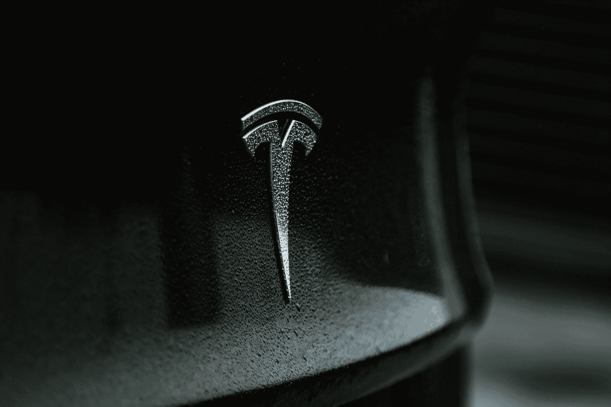

# 埃隆·马斯克:好人还是坏孩子？现代辩论

> 原文：<https://medium.com/geekculture/elon-musk-good-guy-or-bad-boy-a-modern-day-debate-b4b5220854d?source=collection_archive---------15----------------------->

Photo by [Austin Ramsey](https://unsplash.com/@austin__ramsey?utm_source=medium&utm_medium=referral) on [Unsplash](https://unsplash.com?utm_source=medium&utm_medium=referral)

## 人们如何看待埃隆·马斯克——他是个好人还是个坏孩子？

这个问题的答案取决于你问谁。一般来说，大多数人认为他是一个鼓舞人心的企业家，他的公司取得了令人难以置信的成就。他们钦佩他的雄心，相信他正在为世界做出积极的贡献…