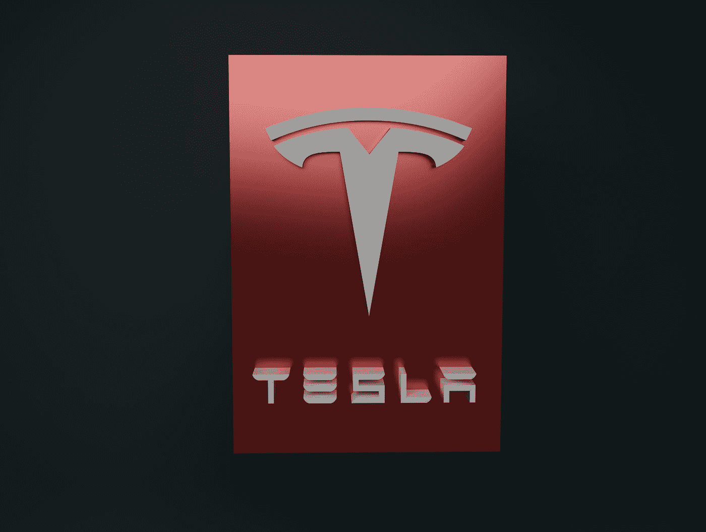

# 埃隆·马斯克正在建造地下死亡陷阱

> 原文：<https://medium.com/geekculture/elon-musk-is-constructing-underground-death-traps-d3f4261dd3df?source=collection_archive---------1----------------------->

## “拉斯维加斯环路”特斯拉驱动的隧道只不过是一场灾难。

Photo by [Grant S](https://unsplash.com/@grantscobby?utm_source=medium&utm_medium=referral) on [Unsplash](https://unsplash.com?utm_source=medium&utm_medium=referral)

啊，埃隆·马斯克。如果你以前没有听说过这个名字，他是电动汽车公司特斯拉的创始人，SpaceX 的首席执行官，多重商业投资者，父亲， [2021 年《时代》年度人物](https://time.com/person-of-the-year-2021-elon-musk/)和，亿万富翁。谁不知道埃隆·马斯克是谁？