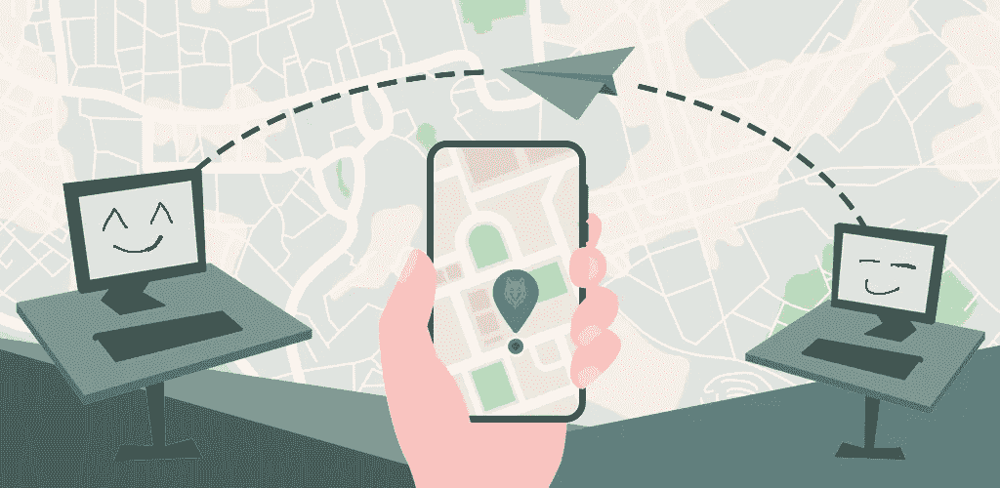

# 轻松跟踪电子邮件和文件

> 原文：<https://medium.com/geekculture/email-and-file-tracking-made-easy-274c200db4d?source=collection_archive---------0----------------------->

## 允许吗？你会用吗？它是如何工作的？

Email / File tracking explained — by [freepik](https://www.freepik.com/premium-vector/city-map-navigate-route_5653185.htm), [freepik](https://www.freepik.com/free-vector/coronavirus-tracking-location-app-concept_9851922.htm), [amahce](https://www.freepik.com/premium-vector/black-man-sitting-with-laptop-freelance-online-studying-remote-work-concept-flat-style_10381932.htm) and [dooder](https://www.freepik.com/free-vector/thief-stealing-information-from-computer_894497.htm)

如今，几乎所有东西都以某种方式被追踪。你在美好的天气里去跑步。你的手机会追踪你的行动。你在商店里花了一些辛苦赚来的钱。银行追踪你的资金流动。你在网飞看两到三个节目。网飞跟踪和记录你喜欢的，以提供更好的…