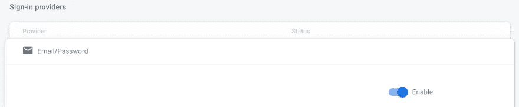
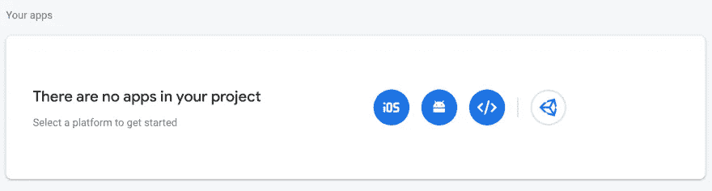
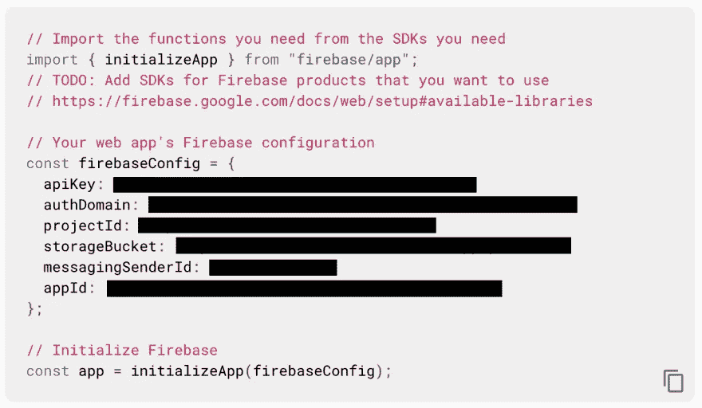

# 基于电子邮件和密码的 Expo 和 Firebase 认证第 1 部分:项目设置

> 原文：<https://medium.com/geekculture/email-and-password-based-authentication-with-expo-and-firebase-part-1-project-setup-fef4c6766cd5?source=collection_archive---------12----------------------->


> 这是使用 Expo 和 Firebase 展示基于电子邮件和密码的认证的系列博客文章的 1/3。
> 
> 第 1 部分:项目设置(您在这里)
> 
> [第二部分:注册、电子邮件验证和退出](/@diegocasmo/email-and-password-based-authentication-with-expo-and-firebase-part-2-sign-up-email-verification-60cc7d1f3ba6)
> 
> [第 3 部分:登录，忘记密码，更新密码](/@diegocasmo/email-and-password-based-authentication-with-expo-and-firebase-part-3-sign-in-forgot-password-93e9958792f3)

一段时间以来，我一直使用 Firebase 作为我的首选工具，在与 Expo 合作时快速设置基于电子邮件和密码的认证流程。虽然有很多其他的解决方案，但我还没有找到一个能像 Firebase 那样让我快速上手的。

这一系列博客文章的目标是提供一个简单的例子，说明如何使用基于电子邮件和密码的认证来设置 Expo 和 Firebase。完成后，这个应用程序将支持注册，登录，退出，电子邮件验证，忘记密码，更新密码。这一系列博客文章的所有代码都可以在 Github 库上找到。让我们直接开始吧。

# 创建新的世博会应用程序

如果还没有完成，运行`npm install --global expo-cli`安装 Expo CLI，这样就可以创建应用程序了。接下来，通过运行`expo init --npm`创建一个新的应用程序，并选择空白模板。现在可以使用`npm start`来提供应用程序，并在本地或您喜欢的设备/模拟器中打开。为了简单起见，我将通过 [React Native for web](https://docs.expo.dev/workflow/web/) 来运行它，它与 Expo SDK 一起开箱即用。为此，只需在运行 Expo CLI 的终端中按下`w`。


*Expo CLI options to open an app.*

假设一切顺利，新创建的世博会应用程序现在应该可以通过`http://localhost:19006/`的网络浏览器访问，在那里它应该显示一条熟悉的欢迎消息。

# 创建一个 Firebase 项目

导航到您的 Firebase 帐户并创建一个新项目。一旦项目被创建，点击侧边栏“认证”菜单项，并启用“电子邮件/密码”提供者。



*“Email/Password” Firebase authentication provider enabled.*

接下来，转到项目设置并为项目注册一个 web 应用程序。



*Select the web app platform to register the web app.*

最后，将 Firebase SDK 添加到 web 应用程序中(这个配置稍后将用于初始化 Expo 项目中的 Firebase 应用程序)。



*Firebase SDK configuration example.*

# 配置 Expo 和 Firebase

是时候使用 Expo app 中的 Firebase 项目配置了。为此，首先通过运行`expo install firebase`安装 Firebase SDK。另外，通过运行`npm install react-native-dotenv`安装 [react-native-dotenv](https://github.com/goatandsheep/react-native-dotenv) ，这样环境变量就可以通过`.env`文件导入到 app 中。接下来，将`module:react-native-dotenv`插件添加到默认的 Expo `babel.config.js`文件中。

```
module.exports = function(api) {
  api.cache(true);
  return {
    presets: ['babel-preset-expo'],
    plugins: [
      ['module:react-native-dotenv'], // Add this
    ],
  };
};
```

`*babel.config.js*` *配置文件。*

通过运行`touch .env`在项目的根目录下创建一个`.env`文件，并用正确的 Firebase SDK 配置细节填充它。我给它们加上了前缀`FIREBASE_`，这样它们的用途就很清楚了。

```
FIREBASE_API_KEY=
FIREBASE_AUTH_DOMAIN=
FIREBASE_PROJECT_ID=
FIREBASE_STORAGE_BUCKET=
FIREBASE_MESSAGING_SENDER_ID=
FIREBASE_APP_ID=
```

*一个* `*.env*` *文件的例子。用 Firebase SDK web app 项目配置填充它。*

通过运行`mkdir -p src/api`创建应用程序的 API 目录，并用`touch src/api/index.js`在其中创建一个索引文件。这是 Firebase 应用程序初始化的地方。为此，请使用环境变量。

```
import firebase from 'firebase';
import {
  FIREBASE_API_KEY,
  FIREBASE_AUTH_DOMAIN,
  FIREBASE_PROJECT_ID,
  FIREBASE_STORAGE_BUCKET,
  FIREBASE_MESSAGING_SENDER_ID,
  FIREBASE_APP_ID,
} from '@env'

const firebaseConfig = {
  apiKey: FIREBASE_API_KEY,
  authDomain: FIREBASE_AUTH_DOMAIN,
  projectId: FIREBASE_PROJECT_ID,
  storageBucket: FIREBASE_STORAGE_BUCKET,
  messagingSenderId: FIREBASE_MESSAGING_SENDER_ID,
  appId: FIREBASE_APP_ID,
};

firebase.initializeApp(firebaseConfig);
```

最后，将该文件导入到`App.js`(位于根目录下):

```
import './src/api'; // Import the Firebase API configuration file
import { StatusBar } from 'expo-status-bar';
import React from 'react';
import { StyleSheet, Text, View } from 'react-native';

// Rest of the file omitted...
```

# 应用程序结构和依赖关系

为了简化应用程序，我将使用下面的库(每个库下面都有安装说明)。请注意，这些库在技术上都不是必需的，但是它们将简化启动和运行。

*   [Native base](https://docs.nativebase.io/install-expo):React Native&Web 的移动优先、可访问组件。

```
npm install native-base styled-components styled-system
expo install react-native-svg
expo install react-native-safe-area-context
```

*   Formik :创建表单，管理并验证它们的状态。

```
npm install formik
```

*   [是](https://github.com/jquense/yup#install):用于值解析和验证的模式构建器([与 Formik](https://formik.org/docs/overview#complementary-packages) 完美集成)。

```
npm install yup
```

*   [React 导航](https://reactnavigation.org/docs/getting-started/#installation):Expo 和 React 原生应用的路由导航。

```
npm install @react-navigation/native
expo install react-native-screens react-native-safe-area-context
```

现在让我们创建“应用程序结构”。应用程序结构将使用“基于功能”的方法，其中每个功能(即注册、电子邮件验证等)将包含在一个目录中。

```
src/
  Root.js
  api/ # API-only methods (Firebase)
  components/ # Re-usable components (among many features)
  features/
    sign-up/
      components/ # Components used by the sign-up feature only
      screens/ # Container type component(s) which setup layout/structure and higher level logic
```

第一步是创建`Root.js`文件。为此，通过运行`cp App.js src/Root.js`复制`App.js`，然后移除`App.js` ( `rm App.js`，并更新`package.json`文件，使`main`指向`src/Root.js`:

```
"main": "src/Root.js"
```

接下来，替换`Root.js`的内容，以便它导入 Firebase API，设置`native-base`提供者，并注册根 Expo 组件。

```
import './api';
import { registerRootComponent } from 'expo';
import React from 'react';
import { StatusBar } from 'expo-status-bar';
import { NativeBaseProvider, Box } from 'native-base';

const Root = () => (
  <NativeBaseProvider>
    <Box>Hello world</Box>
    <StatusBar style="auto" />
  </NativeBaseProvider>
);

registerRootComponent(Root);
```

通过运行`npm start`再次启动世博服务器，确保“Hello world”消息正确显示。

# 重新封顶

在这篇博文中，我们回顾了 Expo 和 Firebase 的设置，目标是实现一个基于电子邮件和密码的认证系统。此外，安装和设置了一组公共库，以便更容易地实现应用程序需要的即将到来的功能。在下一篇博文中，我们将实现注册、电子邮件验证和注销功能。