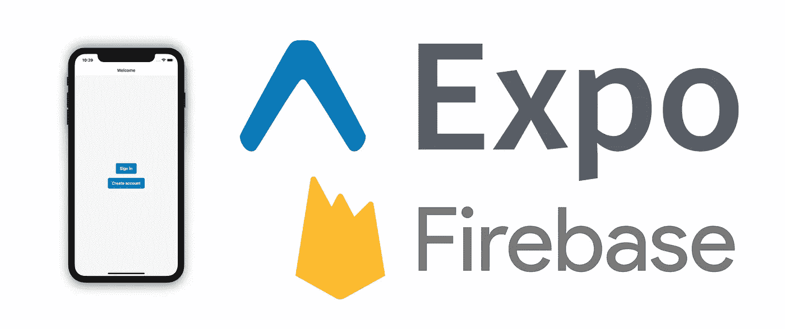

# Expo 和 Firebase 基于电子邮件和密码的身份验证第 2 部分:注册、电子邮件验证和注销

> 原文：<https://medium.com/geekculture/email-and-password-based-authentication-with-expo-and-firebase-part-2-sign-up-email-verification-60cc7d1f3ba6?source=collection_archive---------5----------------------->



> 这是使用 Expo 和 Firebase 展示基于电子邮件和密码的认证的系列博客文章的第 2/3 部分。
> 
> [第 1 部分:项目设置](/geekculture/email-and-password-based-authentication-with-expo-and-firebase-part-1-project-setup-fef4c6766cd5)
> 
> 第 2 部分:注册，电子邮件验证，并退出(你在这里)
> 
> [第 3 部分:登录，忘记密码，更新密码](/@diegocasmo/email-and-password-based-authentication-with-expo-and-firebase-part-3-sign-in-forgot-password-93e9958792f3)

本系列的前一部分介绍了如何设置 Expo 和 Firebase，目的是创建一个认证流。完成之后，是时候开始实现身份验证特性了。在这篇博文中，我将介绍如何创建注册、电子邮件验证和注销功能。

# 航行

应用程序导航将根据当前用户验证状态进行配置。这意味着将会有一个来宾的、未验证的和已验证的导航器。让我们从 guest navigator 开始，它将在用户未通过身份验证时呈现。

首先，通过运行`touch src/App.js`创建`App.js`文件，并更新`src/Root.js`,这样它就可以渲染它了。

```
const Root = () => (
  <NativeBaseProvider>
    <App /> {/* Render the <App/> component */}
    <StatusBar style="auto" />
  </NativeBaseProvider>
)
```

在创建访客导航器之前，需要安装一些`react-navigation`依赖项。运行以下命令来设置这些，并确保`Root.js`被`<NavigationContainer/>`组件包装。

```
npm install @react-navigation/stack
expo install react-native-gesture-handler
```

接下来，通过首先创建一个新目录`mkdir src/navigation`和访客导航器组件`touch src/navigation/GuestAppNavigator.js`来添加访客导航器。来宾导航器是一个堆栈导航器，现在，它将只呈现来宾欢迎屏幕。

```
export const GuestAppNavigator = () => (
  <Stack.Navigator>
    <Stack.Screen
      name="GuestWelcome"
      component={GuestWelcomeScreen}
      options={{ title: 'Welcome' }}
    />
  </Stack.Navigator>
)
```

最后，通过运行`mkdir -p src/features/guest-welcome/screens`和`touch src/features/guest-welcome/screens/GuestWelcomeScreen.js`创建来宾欢迎屏幕组件。来宾欢迎屏幕将呈现一个登录按钮和另一个注册按钮。这些按钮将引导用户进入适当的堆栈屏幕。

```
export const GuestWelcomeScreen = ({ navigation }) => {
  const handlePressOnSignIn = () => {
    navigation.navigate('SignIn') 
  } const handlePressOnSignUp = () => {
    navigation.navigate('SignUp')
  } return (
    <Center flex={1}>
      <VStack space={4} alignItems="center">
        <Center>
          <Button onPress={handlePressOnSignIn}>Sign in</Button>
        </Center>
        <Center>
          <Button onPress={handlePressOnSignUp}>Create account</Button>
        </Center>
      </VStack>
    </Center>
  )
}
```

# 签约雇用

注册功能允许用户通过输入电子邮件和密码来创建帐户。为此，让我们首先创建一个表单，要求用户输入电子邮件、密码和密码确认。密码确认是可选的，因为稍后将使用相同的表单来创建“登录”流，在这种情况下不需要它。

要使用，通过运行`mkdir -p src/components`和电子邮件和密码表单`touch src/components/EmailAndPasswordForm.js`创建`/components`目录。`<EmailAndPasswordForm/>`组件的完整代码可以在 [Github 库](https://github.com/diegocasmo/expo-firebase-authentication/blob/main/src/components/EmailAndPasswordForm.js)中找到，但是我将在这里强调一些重要的部分。

电子邮件和密码表单组件使用 [Formik](https://formik.org/) 和 [Yup](https://github.com/jquense/yup) 。该组件验证有效电子邮件和密码输入的存在。密码必须至少为 6 个字符，如果启用了密码确认选项，则`password`和`passwordConfirmation`输入必须匹配。

```
const buildValidationSchema = (withPasswordConfirmation) =>
  Yup.object({
    email: Yup.string().email().required(),
    password: Yup.string().required().min(6),
    // Optionally require password confirmation
    ...(withPasswordConfirmation && {
      passwordConfirmation: Yup.string()
        .oneOf([Yup.ref('password'), null])
        .required(),
    }),
  })
```

接下来，让我们创建注册屏幕，它将呈现表单。为注册特性`mkdir -p src/features/sign-up/screens`和屏幕组件`touch src/features/sign-up/screens/SignUpScreen.js`创建一个新目录。暂时为`onSubmit`和`isLoading`表单道具使用占位符。

```
export const SignUpScreen = () => {
  return (
    <Center flex={1}>
      <VStack space={4} alignItems="center" w="90%">
        <EmailAndPasswordForm
          onSubmit={() => {}} 
          isLoading={false}
          withPasswordConfirmation={true}
        />
      </VStack>
    </Center>
  )
}
```

既然已经定义了注册屏幕，就可以将它添加到 guest navigator 堆栈中了。

```
export const GuestAppNavigator = () => (
  <Stack.Navigator>
    {/* Guest welcome screen omitted for brevity */}
    <Stack.Screen
      name="SignUp"
      component={SignUpScreen}
      options={{ title: 'Create Account' }}
    />
  </Stack.Navigator>
)
```

现在是时候与 Firebase 交互并开始定义身份验证 API 了。首先，通过运行`touch src/api/user.js`创建一个用户 API 文件，并定义`signUp`方法。这个文件将封装所有必需的用户身份验证方法，这样组件就不会直接与 Firebase 交互。

```
export const signUp = async ({ email = '', password = '' }) => {
  return firebase.auth().createUserWithEmailAndPassword(email, password)
}
```

接下来，让我们在注册特性中创建一个挂钩，它公开了注册功能。在注册功能`mkdir src/features/sign-up/hooks`和`useSignUp()`挂钩`touch src/features/sign-up/hooks/use-sign-up.js`中创建一个`/hooks`目录。这个钩子封装了对用户 API 的访问，并公开了`isLoading`和`error`状态。

```
export const useSignUp = () => {
  const [state, setState] = useState({
    isLoading: false,
    error: null,
  }) const handleSignUp = async (values) => {
    setState({ isLoading: true, error: null }) try {
      await signUp(values)
      setState({ isLoading: false, error: null })
    } catch (error) {
      setState({ isLoading: false, error })
    }
  } return [handleSignUp, { ...state }]
}
```

最后，通过将`signUp`方法传递给表单`onSubmit` prop 和`isLoading`，使用注册屏幕中的`useSignUp()`钩子。

```
export const SignUpScreen = () => {
  const [signUp, { isLoading, error }] = useSignUp() return (
    <Center flex={1}>
      <VStack space={4} alignItems="center" w="90%">
        {error && (
          <Alert status="error">
            <Alert.Icon />
            <Alert.Title>{error.message}</Alert.Title>
          </Alert>
        )}
        <EmailAndPasswordForm
          onSubmit={signUp}
          isLoading={isLoading}
          withPasswordConfirmation={true}
        />
      </VStack>
    </Center>
  )
}
```

现在，您应该能够访问应用程序，导航到注册屏幕，创建一个有效的帐户，并在 Firebase 中验证帐户是否已创建。要验证用户帐户是否已创建，请导航到 Firebase 控制台，单击“Authentication”菜单项，并确认用户帐户是否显示在表中。

# 电子邮件验证

创建用户帐户后，将向用户显示另一个屏幕，要求他们验证电子邮件。为了跟踪当前的用户身份验证状态，让我们创建一个用户上下文。为此，我们将使用 Firebase 的 [onAuthStateChanged()](https://firebase.google.com/docs/reference/js/v8/firebase.auth.Auth#onauthstatechanged) 方法。

在用户 API 中，定义`onAuthStateChanged()`方法:

```
export const onAuthStateChanged = (args) => 
  firebase.auth().onAuthStateChanged(args)
```

接下来，通过运行`mkdir src/context`和用户上下文文件`touch src/context/UserContext.js`创建一个上下文目录。用户的上下文将使用`onAuthStateChanged()`监听器更新其内部状态，并相应地设置/取消设置 Firebase 用户。此外，它将定义一个 helper 方法，该方法允许“重新加载”当前用户。

```
export const UserContextProvider = ({
  children,
  initialState = { user: null, isLoading: true, error: null },
}) => {
  const [state, setState] = useState(initialState) // Listen to Firebase authentication state changes
  useEffect(() => {
    const unsubscribe = onAuthStateChanged((user) => {
      setState({ user, isLoading: false, error: null })
    }) return () => {
      unsubscribe()
    }
  }, []) const handleReload = async () => {
    try {
      await reload()
      const user = getUser()
      setState({ user, isLoading: false, error: null })
    } catch (error) {
      setState({ user: null, isLoading: false, error })
    }
  } const value = {
    ...state,
    reload: handleReload,
  } return <UserContext.Provider value={value}>{children}</UserContext.Provider>
}
```

最后，确保`<Root/>`组件被`<UserContextProvider/>`包装，并使用`<App/>`组件中的上下文，根据身份验证状态，可以有条件地呈现来宾或未验证的导航器。

```
export const App = () => {
  const { user, isLoading } = useUserContext() if (isLoading)
    return (
      <Center flex={1} accessibilityLabel="Loading user profile...">
        <Spinner />
      </Center>
    ) if (user) return <UnverifiedAppNavigator /> return <GuestAppNavigator />
}
```

未验证的导航器显示给已经验证的用户，但是还没有验证他们的电子邮件。要创建它，运行`touch src/navigation/UnverifiedAppNavigator.js`并定义一个名为“验证电子邮件”的新屏幕。

```
export const UnverifiedAppNavigator = () => (
  <Stack.Navigator>
    <Stack.Screen
      name="VerifyEmail"
      component={VerifyEmailScreen}
      options={{ title: 'Verify Email' }}
    />
  </Stack.Navigator>
)
```

“验证电子邮件”屏幕将允许用户执行三项操作:

1.  完成:重新加载当前用户(这是更新当前用户和确认他们的电子邮件是否已经过验证所必需的)。
2.  重新发送:再次发送验证邮件。
3.  取消:注销当前用户。

这些操作中的每一个都需要在用户 API 中定义一个新方法:

```
export const reload = () => firebase.auth().currentUser.reload()export const sendVerification = () =>
  firebase.auth().currentUser.sendEmailVerification()export const signOut = () => firebase.auth().signOut()
```

一旦定义了 API 方法，通过运行`mkdir -p src/features/email-verification/screens`和“验证电子邮件”屏幕`verification/screens/VerifyEmailScreen.js`为该特性创建一个文件夹。

除了“验证电子邮件”屏幕中的“完成”操作，所有操作都将遵循类似的模式:将为它创建一个钩子，钩子将调用用户 API 中的一个方法，并将状态和结果公开给消费者。为了简洁起见，我将只解释“重新发送”操作是如何工作的。其余的操作(即，“完成”— [useUserContext()](https://github.com/diegocasmo/expo-firebase-authentication/blob/main/src/context/UserContext.js) 和“取消”— [useSignOut()](https://github.com/diegocasmo/expo-firebase-authentication/blob/main/src/hooks/use-sign-out.js) )在 Github 存储库中可用。

首先创建一个`/hooks`目录`mkdir -p src/features/email-verification/hooks`和`useSendVerification()`挂钩`touch src/features/email-verification/hooks/use-send-verification.js`。`useSendVerification()`钩子使用相应的用户 API 方法再次发送验证邮件。

```
export const useSendVerification = () => {
  const [state, setState] = useState({
    isLoading: false,
    error: null,
  }) const handleSendVerification = async () => {
    setState({ isLoading: true, error: null }) try {
      await sendVerification()
      setState({ isLoading: false, error: null })
    } catch (error) {
      setState({ isLoading: false, error })
    }
  } return [handleSendVerification, { ...state }]
}
```

接下来，使用“验证电子邮件”屏幕中的挂钩，以便在按下“重新发送”按钮时再次发送电子邮件。

```
export const VerifyEmailScreen = () => {
  const [sendVerification, { isLoading }] = useReloadUser() return (
    <Center flex={1}>
      <VStack space={4} alignItems="center" w="90%">
        <Heading>Check your email</Heading>
        <Text>
          We sent you an email with instructions on how to verify your email
          address. Click on the link in the email to get started.
        </Text>
        {/* Other buttons omitted for brevity */}
        <Button onPress={sendVerification} isLoading={isLoading}>
          Resend
        </Button>
      </VStack>
    </Center>
  )
}
```

就是这样！当用户验证他们的电子邮件时，他们可以单击“完成”，这将更新他们的身份验证状态。或者，用户可以单击“重新发送”再次发送验证电子邮件，或者单击“取消”退出。

# 签名登记离开

现在，用户可以创建一个帐户并验证他们的电子邮件，是时候创建经过验证的导航器了。

首先更新`<App/>`组件，以便当用户通过身份验证和验证时，它可以呈现经过验证的导航器。

```
export const App = () => {
  const { user, isLoading } = useUserContext() if (isLoading)
    return (
      <Center flex={1} accessibilityLabel="Loading user profile...">
        <Spinner />
      </Center>
    )

  // User is authenticated and verified
  if (user && user.emailVerified) return <VerifiedAppNavigator /> // User is authenticated, but their email hasn't been verified
  if (user) return <UnverifiedAppNavigator /> return <GuestAppNavigator />
}
```

接下来，通过运行`touch src/navigation/VerifiedAppNavigator.js`创建经验证的导航器，并向其添加主屏幕。

```
export const VerifiedAppNavigator = () => (
  <Stack.Navigator>
    <Stack.Screen
      name="Home"
      component={HomeScreen}
      options={{ title: 'Home' }}
    />
  </Stack.Navigator>
)
```

最后，通过运行`mkdir -p src/features/home/screens`和`touch src/features/home/screens/HomeScreen.js`创建主屏幕。为了简单起见，主屏幕只显示一条欢迎消息，并允许用户退出。注意登出功能使用了 [useSignOut()](https://github.com/diegocasmo/expo-firebase-authentication/blob/main/src/hooks/use-sign-out.js) 钩子，就像“验证电子邮件”屏幕一样。

```
export const HomeScreen = () => {
  const { user } = useUserContext()
  const [signOut, { isLoading }] = useSignOut() return (
    <Center flex={1}>
      <VStack space={4} alignItems="center" w="90%">
        <Heading>Hello, {user.email}.</Heading>
        <Button onPress={signOut} isLoading={isLoading}>
          Sign out
        </Button>
      </VStack>
    </Center>
  )
}
```

# 结论

伙计们，结束了！我们已经覆盖了相当多的领域，现在该应用程序允许用户注册，验证他们的电子邮件，然后退出。像往常一样，记得检查一下 [Github 库](https://github.com/diegocasmo/expo-firebase-authentication)，那里有所有的代码。在本系列的下一部分也是最后一部分，我们将通过实现登录、忘记密码和更新密码特性来结束。