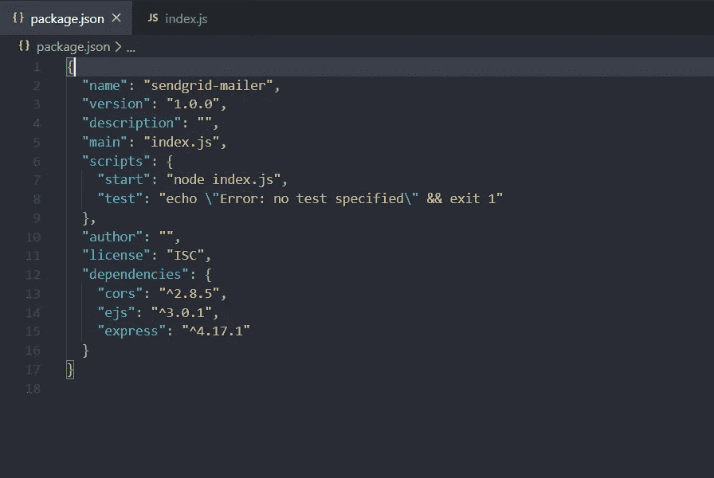
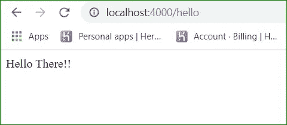
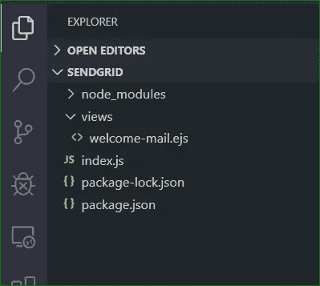
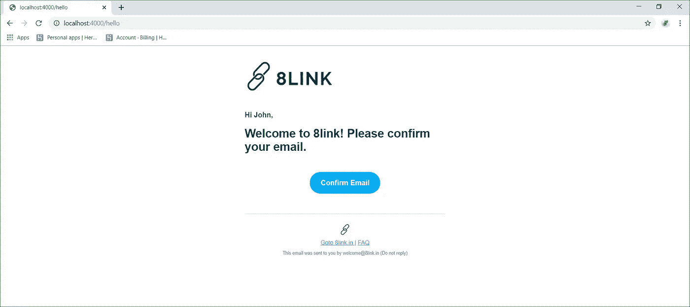
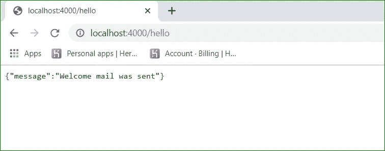

# 使用 EJS 的电子邮件模板(Node + Express + SendGrid)

> 原文：<https://medium.com/geekculture/email-templating-with-ejs-node-sendgrid-8f98dacef572?source=collection_archive---------0----------------------->


Photo by [Mockaroon](https://unsplash.com/@mockaroon?utm_source=unsplash&utm_medium=referral&utm_content=creditCopyText) on [Unsplash](https://unsplash.com/s/photos/template?utm_source=unsplash&utm_medium=referral&utm_content=creditCopyText)

我一直在建立一个社交链接网站 [8link](https://www.8link.in/?ref=medium) ，这需要我与不同层次的用户互动。因此，我将与我的用户进行电子邮件交互的类型缩小到以下几类电子邮件:

1.  欢迎电子邮件(带验证链接)
2.  密码重置链接
3.  对用户查询的自动响应
4.  对用户查询的实际响应
5.  不定期的促销或时事通讯

我一直在使用 Node.js +Express 后端，我想用同样的框架来实现它。所以我开始使用 SendGrid [电子邮件 API](https://sendgrid.com/solutions/email-api/) 来实现这个目标。

> SendGrid 已经有了一个模板服务，如果你有兴趣可以在这里查看[。](https://sendgrid.com/docs/ui/sending-email/how-to-send-an-email-with-dynamic-transactional-templates/)

回到 EJS 模板，在这篇文章中，我们将看到如何用 EJS 创建可重用的 HTML 模板，然后用 SendGrid 交付它们。

我们将首先创建一个简单的节点项目:

```
npm init sendgrid-mailer
```

安装下列依赖项，

```
npm i --save express cors ejs 
```

我们的 Package.json 应该是这样的:



package.json file

让我们创建一个简单的端点来服务我们的电子邮件“/hello”

```
Notice //set express view engine to ejs
app.set(“view engine”, “ejs”);
```

它应该会给我们以下响应:



/hello on localhost

我们已经完成了一半，现在在项目根目录的 views (Template)文件夹中创建一个 *welcome-mail.ejs* 文件。



现在在这里添加一些 HTML 代码，它将作为我们欢迎邮件的底层模板:

您将在这个 HTML 中看到以下语法，它用于在呈现数据之前接收数据。我们使用以下变量来处理数据:

```
//these are EJS expressions to dynamically receive and display data while rendering an HTML<%= user_firstname %>
<%= confirm_link %>
```

现在，我们需要对“/hello”端点进行更改

我们需要将以下内容导入到 index.js 文件中:

```
//imports
const path = require(“path”);
const ejs = require(“ejs”);
```

我们的“/hello”应用程序路线功能将变为:

```
app.get(“/hello”, (*req*, *res*, *next*) => {
let emailTemplate;
let capitalizedFirstName = “John”;
let userEmail = “John@example.com”;ejs
.renderFile(path.join(__dirname, “views/welcome-mail.ejs”), 
{
  user_firstname: capitalizedFirstName,
  confirm_link: “http://www.8link.in/confirm=" + userEmail
})
.then(*result* => {
  emailTemplate = result;
  res.send(emailTemplate);
})
.catch(*err* => {
  res.status(400).json({
      message: “Error Rendering emailTemplate”,
      error: err
     });
  });});
```

在这里， **ejs.renderFile()** 取。ejs 文件路径并指定值为***user _ first name***和 ***confirm_link***

现在，如果我们点击“/hello ”,就会得到:



**呜呜..我们现在有了欢迎模板，现在只需通过电子邮件发送即可。**

## 现在让我们集成 SendGrid:

> 首先注册 SendGrid 邮件 API，点击[这里](https://sendgrid.com/docs/API_Reference/api_v3.html)并获得 API -KEY

现在从 npm 获取@sendgrid/mail 包。

```
npm i --save @sendgrid/mail
```

将以下内容导入 **index.js**

```
const SGmail = require(“@sendgrid/mail”);
```

现在，在我们的代码中，首先注册 SendGrid API 密钥

```
SGmail.setApiKey(process.env.SendGrid_Key);//Note: store SendGrid_Key in your projects' config file
```

并替换**RES . send(email template)；**用以下代码:

```
const message = {
  to: userEmail,
  from: { email: “welcome@8link.in”, name: “8link” },
  subject: “Welcome link”,
  html: emailTemplate
};return SGmail.send(message).then(*sent* => {// Awesome Logic to check if mail was sent res.status(200).json({
      message: “Welcome mail was sent” });}).catch(*err* => { console.log(“Error sending mail”, err);
      res.status(400).json({
          message: “Welcome mail was not sent”,
          error: err
      });});
```

我们最终的代码应该是这样的:

如果我再次点击“/hello”端点，我应该会看到邮件发送成功:



> Github 上的完整代码:
> [https://github.com/far11ven/SendGrid-Mailer](https://github.com/far11ven/SendGrid-Mailer)

*原载于 2019 年 12 月 26 日【https://kushalbhalaik.xyz/blog】[](https://kushalbhalaik.xyz/blog/email-templating-with-ejs-node-express-sendgrid/)**。***