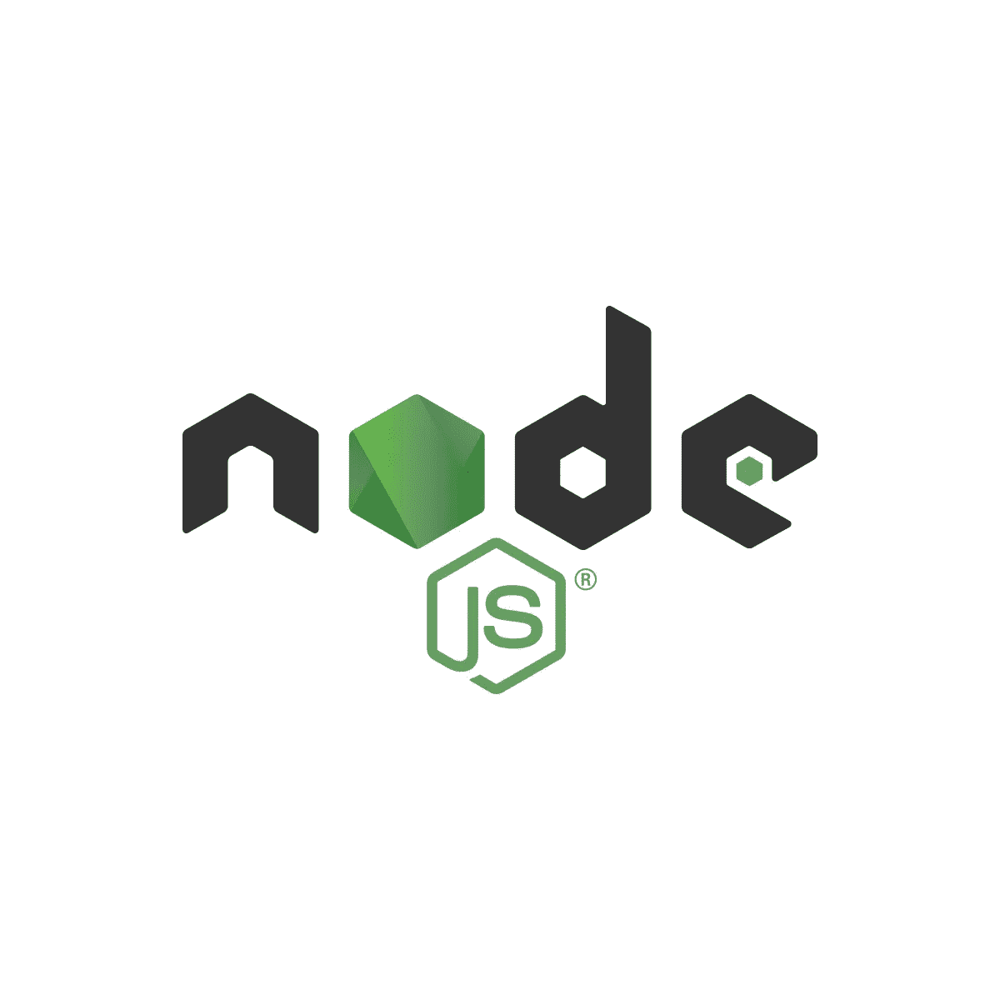
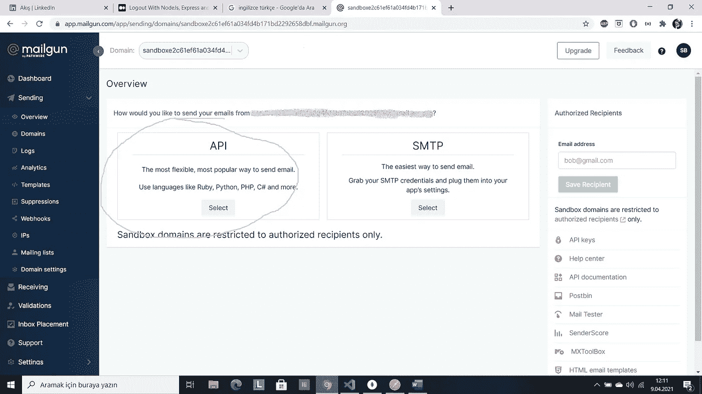

# NodeJs 电子邮件验证(第 3 部分)

> 原文：<https://medium.com/geekculture/email-verification-with-nodejs-part-3-e004787391e3?source=collection_archive---------13----------------------->

在本文中，我写了如何在注册应用程序中验证电子邮件。为此，我使用了我的旧代码，邮递员，当然还有 MongoDB 指南针。如果你想了解如何编写旧代码，可以访问以下链接:

第一部分:[https://serapbaysal . medium . com/sign up-log in-application-with-nodejs-express-and-MongoDB-658498 e 580 cf](https://serapbaysal.medium.com/signup-login-application-with-nodejs-express-and-mongodb-658498e580cf)

第二部分:[https://serapbaysal . medium . com/logout-with-nodejs-express-and-MongoDB-9b 73 E8 b 01137](https://serapbaysal.medium.com/logout-with-nodejs-express-and-mongodb-9b73e8b01137)

现在，如果你准备好了，我们可以开始了！

首先，我们需要 mailgun。我们去 mailgun 网站并添加一个帐户。注册申请是免费的，所以你可以免费使用。之后，我们将在终端中编写 npm install mailgun-js 并安装包。我们将转到 controllers/auth.js 文件，将 mailgun-js 作为 mailgun 导入并删除其中的 register 方法，我们将重新编写它。

现在，我们就去 https://app.mailgun.com/app/dashboard[和](https://app.mailgun.com/app/dashboard)发送/概述，复制链接没有？，将其粘贴到域变量中。

然后我们将创建另一个变量:

*const mg = mailgun({ API key:process . env . mailgun _ API key，DOMAIN:DOMAIN })；*

我们需要 MAILGUN_APIKEY，所以我们将去。env 文件并创建 MAILGUN_APIKEY 变量。为此，在 mailgun 站点中，我们将单击 API part 并选择 Node.Js。我们将复制 API 密钥并将其粘贴到 MAILGUN_APIKEY 中。所以我们准备编码！

在注册方法中，我们将编写{名称，电子邮件，密码} = req.body

然后创建一个 token_activate，等于 *jwt.sign({name，email，password}，process.env.JWT_ACC_ACTIVATE，{ expi resin:' 20m ' })；*

在这方面，我们还没有 JWT_ACC_ACTIVATE，所以在。env 文件，我们将创建这个变量并使它等于任何单词。

然后复制

*常量数据= {*

*来自:‘激动的用户<me@samples.mailgun.org>’，*

*致:'bar@example.com，你@你的域名’，*

*主题:“你好”，*

*正文:“测试一些神枪手！”*

*}；*

*mg.messages()。发送(数据，函数(错误，正文){*

*console.log(正文)；*

*})；*

在此，发件人部分将是您将使用的电子邮件地址。收件人将发送不带“”的电子邮件。我们将删除文本部分，并写入:

*html:`*

*< h2 >请点击给定链接激活您的账户< /h2 >*

*
$ { process . env . client _ URL }/authentic ation/activate/$ { activate _ token }
*

*`*

在此，我们还没有 CLIENT_URL，所以在。env 我们会写 [http://localhost:5000](http://localhost:5000) 。

*mg.messages()。发送(数据，函数(错误，正文){*

*如果(错误){*

*return res.json({*

*信息:错误信息*

*})*

*}*

*return res.json({message:'邮件已发送' })*

*}*

至此，我们完成了注册方法。因此，如果我们向 Postman 发送一个注册请求(POST[http://localhost:5000/sign up](http://localhost:5000/signup)，在我们的电子邮件中将会看到一封电子邮件。

所以我们来验证一下邮件。为此，我们将编写一个名为 activateAccount 的函数。在这里，我们将编写以下代码:

*const { token } = req . body；*

*如果(令牌){*

*jwt.verify(token，process.env.JWT_ACC_ACTIVATE，exports.function = async (err，decodedtoken) = > {*

*if(err) {*

*返回 res.status(400)。JSON({错误:“链接不正确”})*

*}*

*const {姓名，邮箱，密码} = decodedtoken*

*const user = await user . create({*

*名称，*

*邮件，*

*密码*

*})*

*const id = user . getid()；*

*sendTokenResponse(用户，200，res，id)；*

*})*

*}*

在这段代码中，首先我们将创建令牌，并控制它是否存在。如果存在，我们将使用 token，process.env.JWT_ACC_ACTIVATE，exports.function = async (err，decodedtoken)进行验证

之后，我们将创建一个解码令牌，创建一个用户并发送令牌。然后在 routes/auth.js 文件中，添加以下代码。

router . post('/电子邮件激活'，激活帐户)

就是这样！我们完成了代码部分。

现在，我们去邮差那里注册一个账户。然后，我们将回到邮件地址，并在激活 word 后复制，这是令牌。在 Postman 中，我们将使用[http://localhost:5000/email-activate](http://localhost:5000/email-activate)创建一个 Post 请求，在正文部分，我们将发送名为 token 的 JSON 数据，并粘贴我们复制的 token。然后发送数据。

如果你看 MongoDB 指南针，注册后，你会看到什么，因为电子邮件不验证。验证后，你会看到数据库中的用户。

这篇文章写完了，希望你对验证邮件有所了解。感谢阅读。