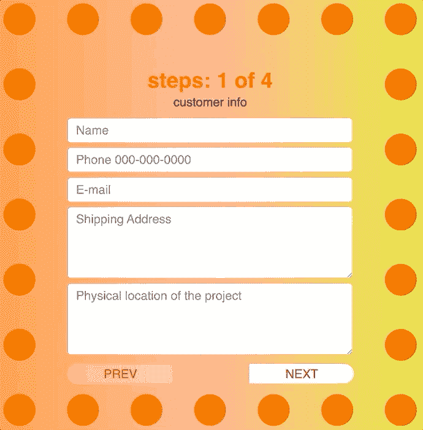
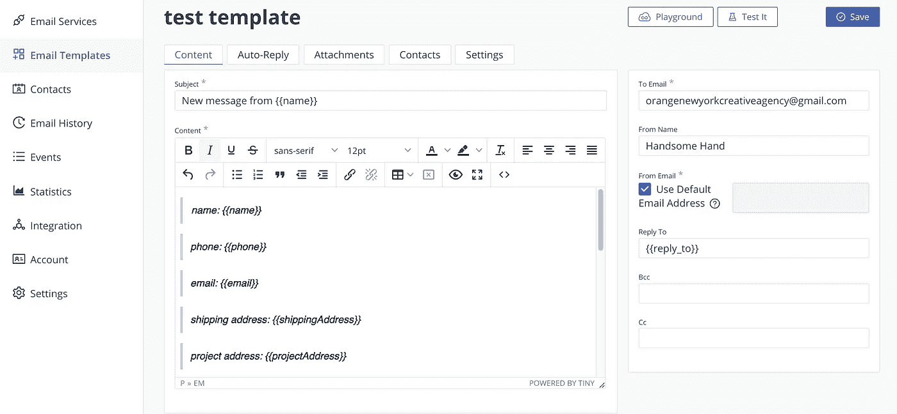
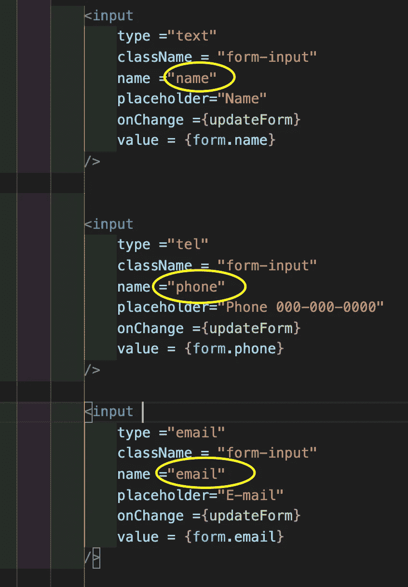
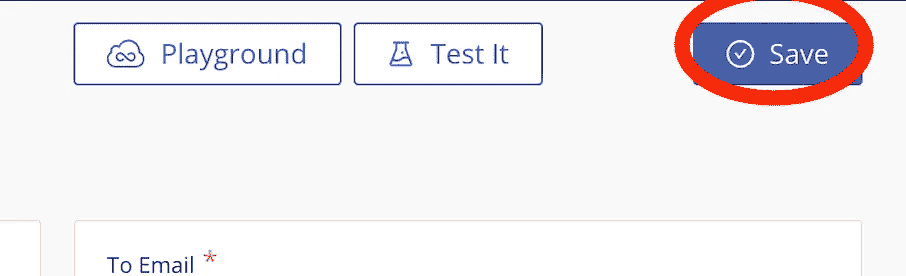
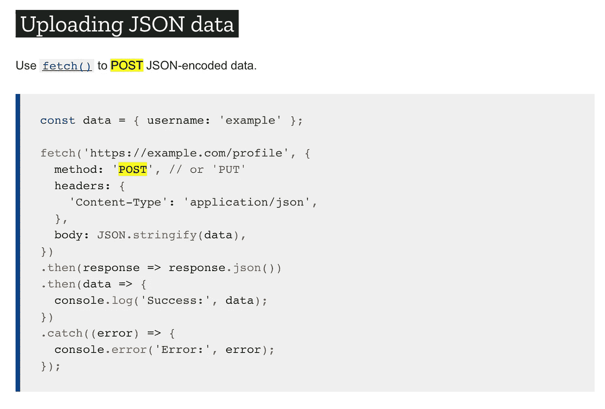

# EmailJS:如何将 React 表单连接到 EmailJS？

> 原文：<https://medium.com/geekculture/emailjs-how-to-connect-a-multiple-step-react-form-to-emailjs-a183699e7d3d?source=collection_archive---------8----------------------->



# 什么是 EmailJS？

EmailJS 是一个不可思议的工具，它将提交的联系表单从客户端 javascript 代码发送到电子邮件收件箱，而无需后端服务器。

# **如何使用电子邮件？**

很容易开始。在 EmailJS 上创建一个帐户，将该帐户连接到您的电子邮件，然后将 React REST API 代码复制到您的 JS 代码中。每月提交 200 封邮件是免费的。以下是我一步一步跟进的一些资源。

[Travis Prol](https://medium.com/u/d266c82a1b70?source=post_page-----a183699e7d3d--------------------------------) (我通过[编代码的艺术家](https://medium.com/u/c51f7f8b1c0c?source=post_page-----a183699e7d3d--------------------------------)认识的一个程序员)的博客
[https://Travis Prol . medium . com/sending-emails-via-form-submit-in-react-8d 87 e 55 ECA 3a](https://travisprol.medium.com/sending-emails-via-form-submit-in-react-8d87e55eca3a)

[https://medium . com/kirsten-Werner/using-a-react-form-to-send-information-directly-to-your-email-2c 9666 f 0d 63 a](/kirsten-werner/using-a-react-form-to-send-information-directly-to-your-email-2c9666f0d63a)

这些资源包括简单的单页表格。它本应该对我的状态也起作用，但它就是不起作用。我创建了 EmailJS 帐户，将其连接到我的电子邮件，粘贴了 react 代码。所以在多次尝试和错误之后，我发现了这些资料没有详细介绍的更多细节。我分解了更多的细节，所以没有人会浪费他们宝贵的时间。

# **解决多输入问题**

如何将“输入的名称”连接到电子邮件模板？这对一些人来说可能是显而易见的，但对我来说不是。当您[创建模板时，](https://dashboard.emailjs.com/admin/templates)会有默认文本。您必须将文本更改为您自己的“输入名称”。



email template

您的电子邮件模板正文需要有输入 的 ***名称，用两个花括号括起来，如下所示。***

```
{{name}}
{{phone}}
{{email}}
{{shippingAddress}}
{{projectAddress}}
.
.
.
.
```

如果您不知道在哪里可以找到“输入的名称”,请看看下面的图片。这些输入名称来自您的 React JSX 代码。



input name from react JSX

确保点击保存按钮，因为它不会自动保存。如果不保存模板并测试它，它只会使用旧代码。所以保存它直到 EmailJS 更新他们的客户端。



make sure to save the template

恭喜你。现在所有的输入都应该发送到你的邮箱了！

# 但是只发送最后一页的输入。:-(

我的联系人表单有多个输入和页面，所以这些教程视频和博客建议的常规 react 示例`sendEmail` [功能无法工作。](https://www.emailjs.com/docs/examples/reactjs/)

# 解决多页问题

我是怎么解决这个问题的？首先，我用他们的联系方式给`EmailJS`发了邮件。他们第二天给了我回复，让我澄清这个问题，之后就没有给我回复了。我想他们优先考虑的是付费客户。

所以我在[栈上问了我的问题](https://stackoverflow.com/questions/67041238/emailjs-for-multiple-step-react-form/67053770#67053770)。正如你们中的许多人所知，堆栈溢出社区是令人难以置信的。仅仅几个小时后， [Amila Senadheera](https://stackoverflow.com/users/8510405/amila-senadheera) 给了我一些建议供我考虑。

# 阿米拉的建议 1。发送“`form”`而不是“`e.target"`

```
const sendEmail = (e) => {
        e.preventDefault();

        emailjs.sendForm(
            'service_z3p8h0m', 
            'template_svmf3nm', 
             form,  //e.target,    <---- change here
            'user_7Pf1rN0FgZQwrrMpFSw55'
        )
          .then((result) => {
              console.log(result.text);
          }, (error) => {
              console.log(error.text);
          });
         e.target.reset();
    }
```

所以我把`e.target`改成了`form`，但是还是不行。是因为 e.target 是 HTML DOM 而`form`是 JSON 数据结构。

`e.target`

```
<form class = "emailjs-success"> <div className = "field4"> <label> more info </label> <input type ="text" className = "form-input" name ="designText" placeholder="Text in the design" value ="hello world" /> </form>
```

`form`

```
{name: "john doe", phone: "", email: "", shippingAddress: "", projectAddress: "", …}
```

所以我对堆栈溢出进行了评论，提到它不起作用，但多亏了 Amila，它开始让我明白问题出在哪里。

# 解决方案 1。REST API:`send”`函数代替了`sendEmail”`函数。

Amila 提到了使用`send`功能，但我没有完全理解。所以我问了我的编码教练 Jack Hilscher，并向他解释了我的问题。我给他看了电子邮件网站。https://www.emailjs.com/docs/rest-api/send/和他指导我，增强我的信心，使用这份文件将解决我的问题。文档是 jQuery 格式的，但是 Jack 说这是正确的，并告诉我可以在 5 分钟内解决。(此时我太激动了)


reference to REST API EMAILJS in jQuery

所以我把这个 jQuery 代码改成了 vanila JS 用于 react 文件。我调出了 mozilla [JSON POST fetch 文档](https://developer.mozilla.org/en-US/docs/Web/API/Fetch_API/Using_Fetch)来参考。



reference to POST FETCH

然后经过多次试验和错误，我终于找到了工作代码。在这次审判中，我发送了大约 100 封电子邮件…

solution! multiple step form to emailJS

# 电子邮件的多个步骤不起作用的原因

堆栈溢出的 Amila 正确地指出了它。我使用的多步骤逻辑是 React HOOK，用于表单和步骤页面计数。有 count 和 setCount 来更新页面步长计数。因此，如果点击了下一个按钮，计数加 1，如果点击了上一个按钮，计数减 1。如果计数为 1，则显示第一步页面，如果计数为 2，则显示第二页。否则为 null，这将在提交时从 DOM 中删除所有以前的输入。

```
//conditional logic(count === current_step? (show fields): null)
```

# 解决方案 2。使用 css 隐藏其他步骤，`visibility`

[](https://stackoverflow.com/a/67053770/14798135) [## 多步反应表单的电子邮件

### 我有一个多步骤的 React 表格，当我发送电子邮件时，只有表格的最后一步被发送到电子邮件。我…

stackoverflow.com](https://stackoverflow.com/a/67053770/14798135) 

这里我们有两个可行的解决方案。

恭喜你。！！终于真的管用了！