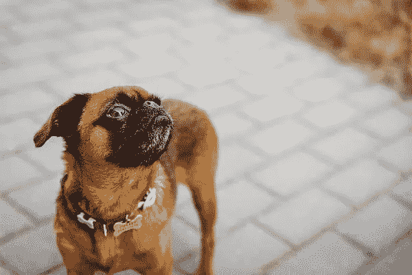
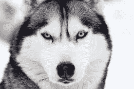

# Embark Veterinary，狗 DNA 测试的制造商，价值 7 亿美元

> 原文：<https://medium.com/geekculture/embark-veterinary-maker-of-dog-dna-tests-valued-at-700-million-87871e017e7?source=collection_archive---------49----------------------->

Image credit: [Piqsels](https://www.piqsels.com/en/public-domain-photo-zktry)

Embark Veterinary 是一家为狗生产 DNA 检测试剂盒的公司，现在价值 7 亿美元。这一新的估值是在 7 月底 7500 万美元的 B 轮融资之后进行的。Embark 的目标是延长狗的寿命。它还希望通过早期检测基因问题来帮助他们过上更健康的生活。

由软银愿景基金 2 牵头，这是迄今为止宠物创业公司最大的 B 轮融资。其他参与 7500 万美元 B 轮投资的投资者包括 SV Angel、Slow Ventures、F-Prime Capital、Freestyle Capital 和 Third Kind Venture Capital。

## Embark 成立于 2015 年

Embark 是瑞安·鲍伊科在哥哥亚当·鲍伊科的帮助下于 2015 年创立的。瑞安·鲍伊科是一个狂热的爱狗人士，他想让狗的健康测试规模化。这家初创公司成立于德克萨斯州奥斯汀，现在总部位于波士顿。马特·萨尔茨伯格是送餐服务“蓝色围裙”的创始人和前首席执行官。他是该公司的联合创始人之一。

Image credit: [Piqsels](https://www.piqsels.com/en/public-domain-photo-fvkwr)

在构思 Embark 的 DNA 测试套件背后的想法时，鲍伊科描述了他的部分思考过程。“我开始思考健康问题，老实说，在利用基因改善健康方面，狗比人类更好。你可以培育它们，所以基因在改善质量和生活的同时，也有能力引发健康问题。”

## 人类引领了方向

家庭基因检测试剂盒的概念已经在人类中流行起来。AncestryDNA 和 23andMe 是直接面向消费者的基因检测市场中最大的两家公司。23andMe 报告 2021 年第一季度收入为 5900 万美元。它还表示，它有一个大约 1160 万基因分型客户的客户数据库。AncestryDNA 声称拥有超过 1800 万客户的 DNA 数据库。

23andMe 的首席执行官和联合创始人安妮·沃西基说:“我们相信基因信息是个性化医疗的未来。”事实上，该公司已经试图将这种个性化扩展到人类之外。23andMe 最近发布了一份关于猫狗过敏的健康报告。

## 成为狗 DNA 检测试剂盒的领导者

尽管如此，Embark Veterinary 是公认的狗 DNA 检测试剂盒市场的领先公司之一。其他竞争对手包括 Wisdom Health、OptiGen、Paw Print Genetics 和 DNA My Dog。虽然其中一些产品稍微更经济，但 Embark 已经获得了许多来源的认可，成为市场上最好的犬基因检测试剂盒之一。

狗的 DNA 检测试剂盒很贵，甚至比人类的 DNA 检测试剂盒还要贵。Embark 的狗狗 DNA 检测套装售价 199 美元。这种产品被称为“Embark Breed + Health Kit ”,只需要简单的脸颊拭子就可以揭示狗狗的品种、血统和健康状况。Embark 能够测试 350 多个品种和 200 种遗传健康风险。

例如，一种常见的基因测试是 HUU，或高尿酸血症。高尿酸尿症导致尿液中尿酸的过量排泄，这可导致在膀胱或肾脏中形成肾结石。通过早期检测这种疾病的遗传倾向，可以改变狗的饮食以减少狗出现高尿酸血症的可能性。

## 职业教育和培训学校的研究伙伴

Embark 是康奈尔大学兽医学院的官方研究伙伴，以美国最好的兽医项目而闻名。瑞安·鲍伊科和亚当·鲍伊科本身都有科研背景。在与康奈尔大学的合作中，他们希望减少狗的可预防疾病。

在新冠肺炎疫情期间，随着美国人寻找犬类伴侣，养狗人数激增。据估计，在疫情期间，超过 1200 万美国家庭获得了新宠物，其中很大一部分是狗。2020 年，美国在宠物上的支出达到 1000 亿美元。

随着宠物拥有量的增加，风险资本对宠物行业投资的兴趣也在增长。自 2017 年以来，风险资本家和其他创业投资者已经向专注于宠物的创业公司投入了超过 20 亿美元。这些专注于宠物的初创公司经常希望为宠物市场带来更好的医疗保健服务、更实惠的护理选择和技术进步。

## 广泛的增长潜力

软银投资顾问公司(SoftBank Investment Advisers)合伙人莉迪亚杰特(Lydia Jett)看到了 Embark 的巨大增长潜力。“这家公司是变革的驱动力。我们是世界上最大的消费者投资者，Embark 非常符合我们在我们的投资组合中看到的情况，即消费者正在重新考虑优先事项和选择。这是一个大趋势，但仍处于宠物个性化周期的早期，”她说。

Embark 在 2019 年至 2020 年间增长了 235%。此外，销售额在过去两年中增长了五倍。自 2019 年 1000 万美元的 A 轮融资以来，这家犬类基因公司已经走过了漫长的道路。鲍伊科和他的团队希望利用最近筹集的资金来扩大其基因数据库，并在 2021 年至 2022 年间雇佣 100 多名新员工。