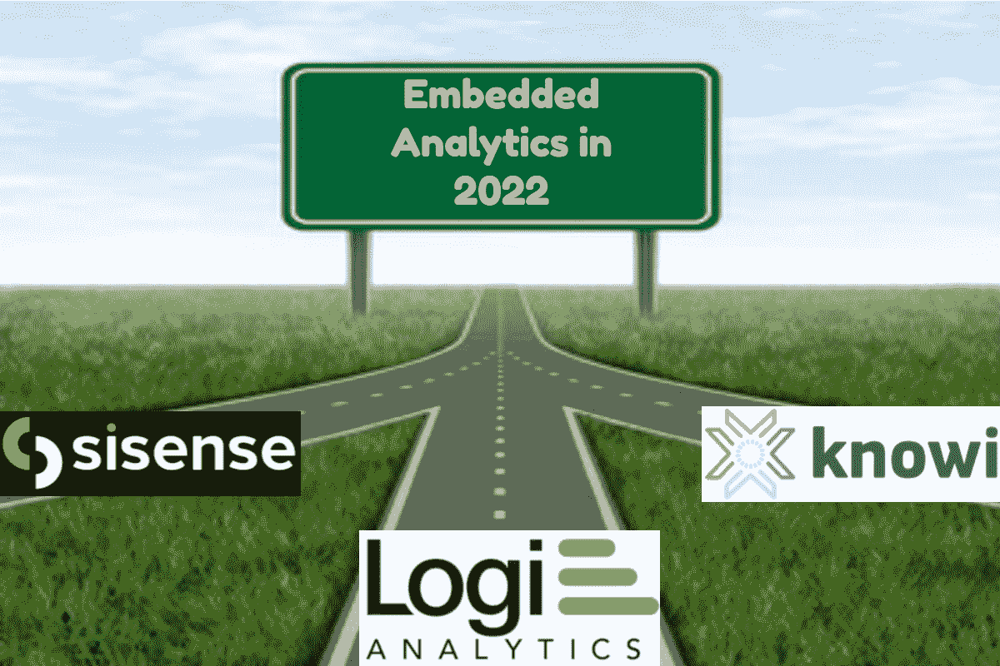
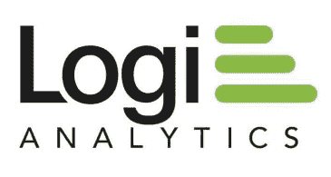
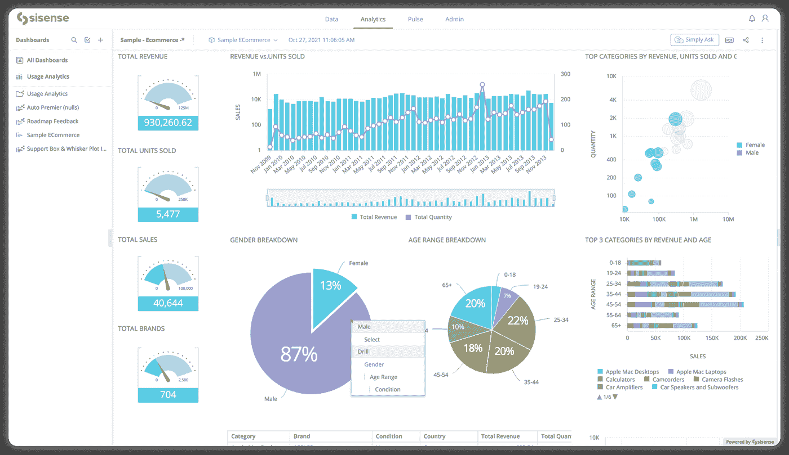
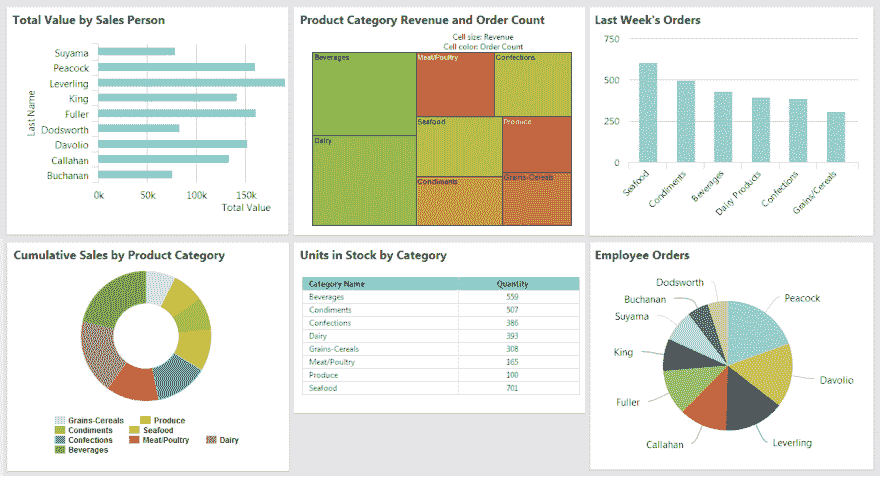
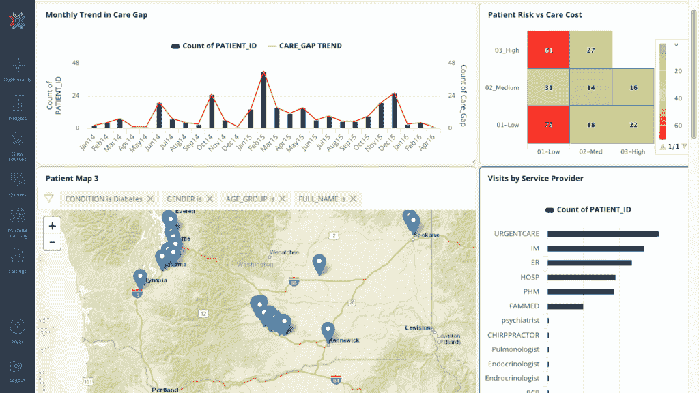
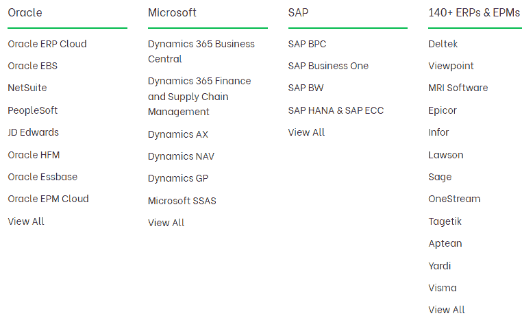
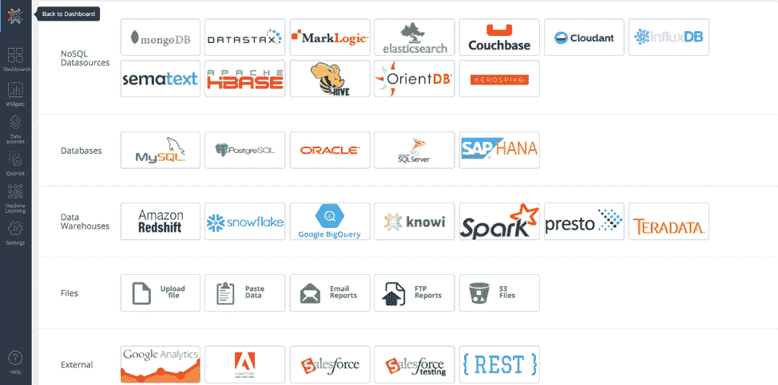

# 2022 年的嵌入式分析:SiSense vs Logi Analytics vs Knowi

> 原文：<https://medium.com/geekculture/embedded-analytics-in-2022-sisense-vs-logi-analytics-vs-knowi-6389dc99170c?source=collection_archive---------14----------------------->

三方比较，了解嵌入式分析的最佳 BI 工具。

**目录:**

*   [简介 ](#9f88)
*   [**SiSense**](#f062)
*   [**逻辑分析**](#4ade)
*   [**Knowi**](#7659)
*   [**2022 年嵌入式分析:si sense vs Logi Analytics vs Knowi**](#3db0)
*   [**嵌入式仪表盘和可视化**](#efd1)
*   [**内置提醒**](#38bf)
*   [**行/列级安全和用户过滤**](#f7b0)
*   [**集成**](#ea14)
*   [**大数据集成**](#ffa6)
*   [**多源联接**](#1660)
*   [**2022 年嵌入式分析:si sense vs Logi Analytics vs Knowi-Final thinks**](#038e)

# 介绍

Image by Author

每天大约产生 2.5 万亿字节的数据。组织应该利用这些数据来提供更好的服务，构建更好的产品，并创造新的收入来源。尽管 62%的企业承认自助商业智能是必不可少的，但大多数组织只分析 12%的数据。

嵌入式分析在民主化数据访问和指导商业智能团队以外的数据分析采用方面发挥着重要作用。嵌入式分析还可以缩短从数据中提取价值所需的时间，因为它允许数据团队协同工作，更快地构建更好的应用程序。

全球嵌入式分析市场预计将从 2021 年的 484.4 亿美元增长到 2022 年的 562.7 亿美元。全球嵌入式分析市场预计将在 2026 年达到[957.8 亿美元](https://www.globenewswire.com/news-release/2022/06/06/2456707/0/en/Embedded-Analytics-Global-Market-Report-2022.html#:~:text=The%20global%20embedded%20analytics%20market,at%20a%20CAGR%20of%2014.2%25)，复合年增长率(CAGR)为 14.2%。

Sisense vs Logi Analytics vs Knowi 是一些最受欢迎的嵌入式分析软件。在本文中，我们将对这三种 EA 工具进行三方面的比较，以了解它们彼此的情况。但首先，让我们简要概述一下这些工具。

# 西森斯

SiSense Logo

[SiSense](https://www.sisense.com/) 是一款 BI 工具，它超越了传统的商业智能，为组织提供了一种随处注入分析的方式。借助 SiSense，公司可以在面向员工的工作流和面向客户的应用程序中注入分析。Sisense 用户可以超越仪表盘，通过 Sisense Fusion 打破分析应用的限制，si sense Fusion 是一个由人工智能驱动的可定制云平台，可以在需要的时候随时随地注入智能。

# 逻辑分析

Logi Analytics Logo

[Logi Analytics](https://insightsoftware.com/logi-analytics/) 为全球软件开发人员提供直观的开发人员级嵌入式分析解决方案。它利用您现有的技术体系来帮助您快速构建、部署和管理您的应用程序。因为 Logi 支持无限制的白标和定制，所以您能够使应用程序成为您自己的独特应用程序。

Logi Info 是 Logi Analytics 平台的核心，专注于创建用户可以嵌入商业应用程序的分析。Logi Analytics 还配备了报告和自助服务功能，可在应用程序中实施，为最终用户提供即席导航功能。

# Knowi

Knowi Logo

[Knowi](https://www.knowi.com/) 是一个端到端的分析平台，可以更轻松地将分析和可视化嵌入到业务和云应用中。借助 Knowi 的嵌入式分析功能，组织可以快速部署白标数据驱动型产品。

Knowi 提供了一个基于 JavaScript 的 API，允许单点登录嵌入模式，以及一个基于模板的仅查看仪表板模式，让用户和管理员能够更好地控制嵌入式可视化的外观。

Knowi 的数据工程层包括一个可重用的数据集即服务概念，允许它跨 NoSQL 和 SQL 数据库连接，并转换它以创建业务用户友好的数据集。

Knowi 不仅允许嵌入仪表板和可视化，还提供了基于搜索的分析概念，允许用户用简单的英语提问，并从他们的数据中获得答案。搜索栏也可以嵌入到应用程序中。

# 2022 年的嵌入式分析:SiSense vs Logi Analytics vs Knowi

接下来，我们将讨论这三种工具在嵌入式分析方面的相互比较。将考虑以下特征:

*   嵌入式仪表板和可视化
*   内置警报
*   行/列级安全性和用户过滤
*   集成
*   大数据集成
*   多源连接

# 嵌入式仪表板和可视化

在比较 2022 年的嵌入式分析时，嵌入式仪表盘和可视化是一个需要考虑的重要功能:SiSense vs Logi Analytics vs Knowi，因为它们使数据分析变得更简单。SiSense vs Logi Analytics vs Knowi 这三个工具提供了数据可视化和嵌入功能。

借助 SiSense，您可以在易于理解的报告中摄取、分析和呈现数据，这些报告又可以嵌入到外部应用程序中。SiSense 还提供不同的图表选项，帮助您以合适的方式直观地展示数据。

A SiSense Dashboard (Source-www.sisense.com)

您还可以自定义仪表板，以获得您想要的外观和感觉。可以向可视化添加图像、文本、视频和链接，以获得可操作的见解。SiSense 还支持预测分析。

Logi Analytics 对描述性分析也有很强的支持。它附带了各种视觉样式，您可以使用这些样式来可视化您的数据，包括弧形标尺、箱线图、条形图、圆环图、KPI 图表、热图、折线图、饼图、地图、散点图、树状图、表格和文字云。

A Logi Analytics Dashboard (Source-devnet.logianalytics.com)

Logi Analytics 还允许您以多种方式定制您的仪表板。您还可以制作这些视觉样式的变体。它还支持预测分析，即从数据中提取的洞察力用于进行预测。

Knowi 为描述性分析提供了非常强大的支持。它提供了 30 多种数据可视化功能，您可以使用这些功能直观地展示您的数据，并将其嵌入到外部应用程序中。

A Knowi Dasboard (Source-www.knowi.com)

Knowi 用户还可以用 JavaScript 创建定制的可视化，以满足他们的特定需求。Knowi 的仪表盘和可视化是可定制的。其基于搜索的分析功能允许用户以英语等自然语言查询数据，甚至以表格和图表的形式获得响应。Knowi 也在 Slack 和微软团队中引入了这个功能。它与机器学习相集成，以支持预测分析。

# 内置警报

重要信息可用时，警报会通知用户。

Sisense 允许其用户将警报集成到他们的工作流中，并为他们的数据设置自定义警报。例如，您可以设置在达到某个 KPI 时得到通知的警报。用户可以通过电子邮件或嵌入式应用程序接收警报。

Logi Analytics 还附带了一个警报功能，当某个指标达到特定阈值时会通知您，该功能由 Logi Composer 提供。通知通过电子邮件发送，其配置通过 Composer API 端点完成。

Knowi 的嵌入式分析功能还具有提醒功能，可以通知您数据的重要变化。当在您的数据中检测到某些条件、阈值或异常时，会实时发送警报以通知您。也可以在特定的小部件上设置警报。警报通过 webhook、电子邮件或 slack 发送。

# 行/列级安全性和用户过滤

行/列级安全性和用户过滤是确保用户只能查看或修改他们应该查看或修改的数据的功能。

作为 SiSense 管理员，您可以挑选用户或用户组，并将他们分配到特定的过滤器或数据钻取，帮助您向他们显示他们应该看到的内容以及他们不应该看到的内容。这意味着用户能够获得他们需要的精确数据的精简版本。这对生产力和安全性都有好处。

Logi Analytics 具有行/列级别的安全功能，允许您控制不同用户在列和行级别访问的数据类型。行级安全性允许管理员定义向特定用户显示的记录，而列级安全性帮助您定义向任何特定用户显示的报告列。它还具有单点登录(SSO)功能，允许用户只登录主应用一次，安全凭证将被传递到嵌入平台。

Knowi 允许其用户生成一个安全的 URL，该 URL 使用参数来确保用户只看到他们应该看到的数据。这些参数也被加密以防止被篡改。Knowi 还使用个性化过滤器来帮助用户查看他们感兴趣的数据。它还提供了单点登录 API，便于系统中的用户进行令牌交换，以将用户权限映射到 Knowi。

# 集成

与各种数据源的集成是 2022 年比较嵌入式分析时需要考虑的另一个重要因素:SiSense vs Logi Analytics vs Knowi。原因是大多数数据来自不同的数据源，如 SQL 数据库、NoSQL 数据库和平面文件(如 CSV)。您需要一种方法来提取数据、分析数据、创建可视化效果，并将它们嵌入到您的应用程序中。

SiSense 提供了许多 SQL 数据库、NoSQL 数据库和 web 应用程序的本机连接器。该工具还提供了与各种数据源建立实时连接的选项。

SiSense Data Connectors (Source- [www.sisense.com)](http://www.sisense.com))

对于没有连接器的数据源，您可以利用 SiSense 的通用框架，如 ODBC 驱动程序、JDBC 驱动程序、自定义 REST 框架、JDBC 联邦器和新的连接器框架来提取数据。

Logi Analytics 支持与 Oracle(如 Netsuite、Oracle EPM 云、Oracle EBS 等)、Microsoft(如 Dynamics GP、Microsoft SSAS、Dynamics 365 Business Central 等)和 SAP(如 SAP BPC、SAP BW、SAP Business One 等)的产品集成。它还可以与 140 多个 ERP 和 EPM 集成。Logi Analytics 还可以从云数据仓库、关系数据源、数据湖等中提取数据。

Logi Analytics Data Connectors (Source-insightsoftware.com)

Knowi 支持与超过 36 个结构化和非结构化数据源的集成，如 MongoDB、Apache Cassandra、ElasticSearch 等。Knowi 自带了到 NoSQL 数据源的本地连接器，因此不需要安装第三方驱动程序，并且完全是本地的，不需要“关系化”数据。因此，与 SiSense 和 Logi Analytics 不同，Knowi 允许您从任何数据源提取数据，而不依赖于第三方连接器。

Knowi Data Connectors (Source-www.knowi.com)

Knowi 还有一个强大的 REST API 集成，允许您连接到 API，并跨其他数据源转换和连接结果。

# 大数据集成

大数据是指无法存储在简单数据库中的海量数据。在某些情况下，嵌入式应用必须处理大数据。Logi Analytics 对大数据处理的支持没有 SiSense 那么强大。两个 BI 工具，即 SiSense 和 Logi Analytics，对非结构化数据不太适用。

Knowi 处理所有类型的数据，结构化、非结构化、小型和大型数据。它的数据虚拟化层使得 Knowi 能够处理任何数据，而无需考虑底层数据结构。Knowi 用户还可以在结构化和非结构化数据库之间执行连接操作。

# 多源连接

在嵌入式分析中，将来自多个来源的数据合并为一个真实的来源非常重要。

SiSense 使非技术用户可以轻松地将来自多个来源的大型数据集加入到一个集中的存储库中，并构建漂亮的仪表板和可视化效果，而无需依赖 it 人员的帮助。这不需要编码。这种可视化可以反过来嵌入到移动应用程序和门户网站中。

Logi 的数据融合工具允许您使用一个或多个公共键来组合来自多个数据源的数据。但是，根据您选择的连接类型，在 Logi Analytics 中连接数据可能会占用大量资源。连接是在内存中执行的。它还具有跨源过滤功能，允许您对不同数据源创建的视觉效果应用通用过滤器。

Knowi 允许您跨多个数据源执行连接操作，以混合和存储组合的数据。连接操作也是基于数据源之间的公共字段来执行的。BI 工具支持内部连接、左外部连接、完全外部连接、右外部连接和循环连接。内部联接被用作联接操作的默认类型。

Knowi Join Operation (Source-www.medium.com)

Knowi 旨在支持跨多个数据源的数百万条记录的大规模连接操作。还可以优化连接操作以加快处理速度。

# 2022 年的嵌入式分析:si sense vs Logi Analytics vs Knowi-最终想法

从上面的讨论中，你可以看出 SiSense vs Logi Analytics vs Knowi 都支持嵌入式分析。

[SiSense](https://www.sisense.com/) 和 [Logi Analytics](https://insightsoftware.com/logi-analytics/) 适用于需要从有限数量的数据源中提取数据并处理少量或不处理非结构化数据的企业。此类企业还可以利用这些 BI 工具创建各种各样的数据可视化，以嵌入到外部应用程序中。

[另一方面，Knowi](https://www.knowi.com/) 适合需要从任何数据源提取数据并需要处理任何类型数据(无论是结构化还是非结构化数据)的企业。Knowi 用户还可以享受基于搜索的分析和机器学习功能。