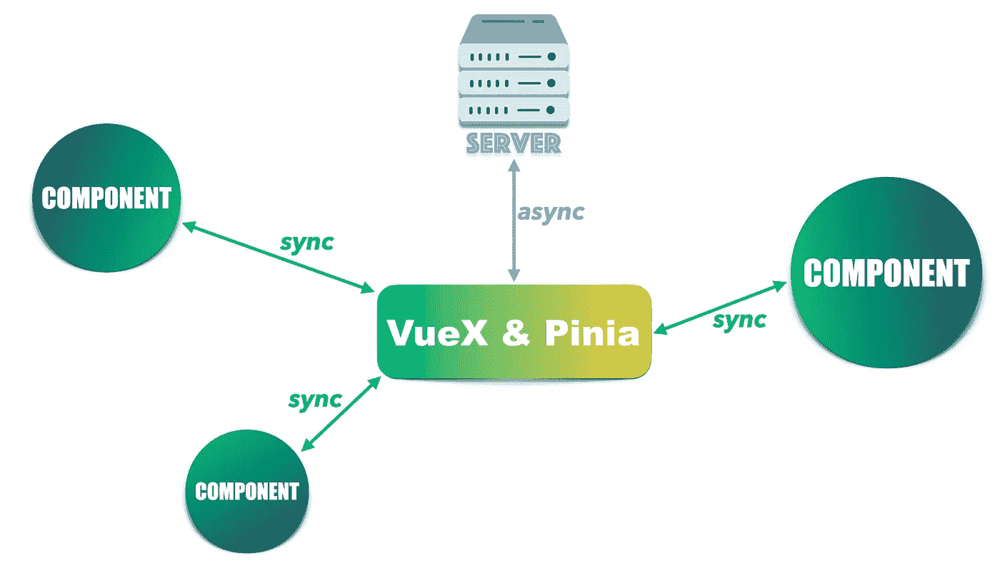

# 快速完整 Pinia 课程

> 原文：<https://medium.com/geekculture/emergency-pinia-course-7a80b8ed0b04?source=collection_archive---------0----------------------->

VueX 现在处于维护模式，这意味着它仍然被维护，但不会获得新功能。被它的继任者——皮尼亚彻底取代只是时间问题。

Pinia 做的工作与 VueX 相同——通过 Ajax 从后端 api 检索数据，并向所有组件提供相同的数据。所有组件读取和写入同一组数据。操作同一组数据保证了数据的一致性。

Pinia & VueX