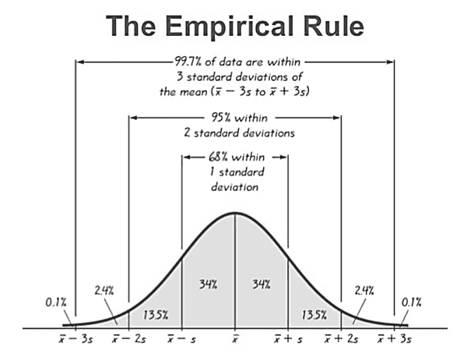
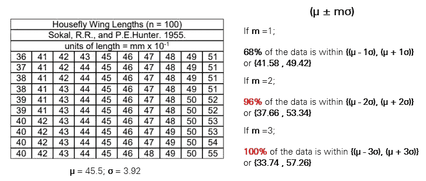
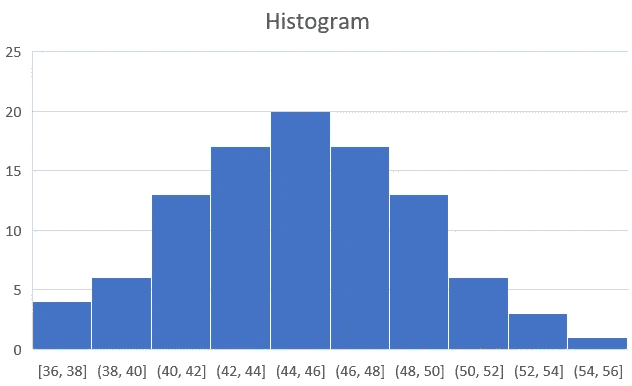
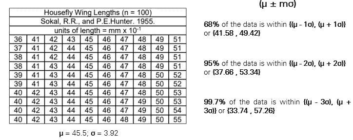
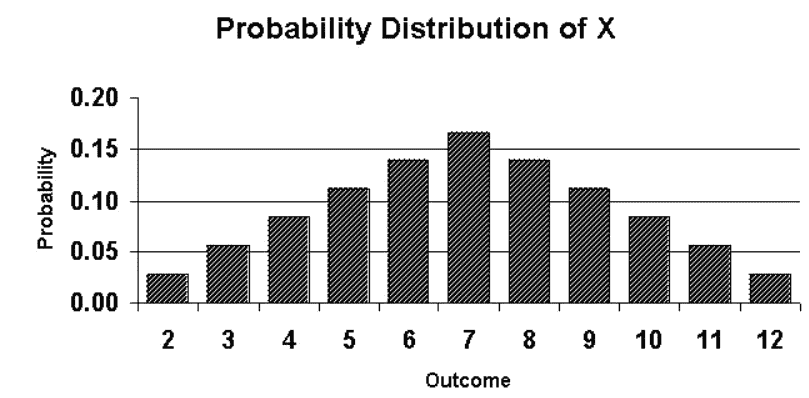
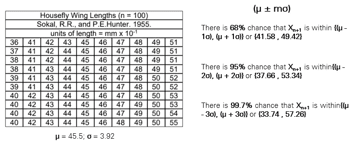

# 经验法则—统计学

> 原文：<https://medium.com/geekculture/empirical-rule-statistics-811b004d58b8?source=collection_archive---------2----------------------->

这是什么**68–95–99.7**？

> **“经验的”意指基于、关于或可由观察或经验而非理论或纯逻辑证实的。—牛津**

****68–95–99.7**最早是由**亚伯拉罕·德莫佛**在 **1733** 通过他的**投掷 100 枚公平硬币的实验创造并发现的。**正态分布模型推出已经超过 75 年了。**

# **公式**

****mσ** 其中=均值/平均值； **σ** =标准差；并且 **m** =乘数。( **1** ，得到 **68%的数据**； **2** ，获取 **95%的数据**； **3** ，得到 **99.7%的数据****

# **限制**

****经验法则**或**68–95–99.7**只适用于**正态统计分布**，因此，它只能适用于**对称**和**单峰的分布。****

# ****图形解释****

**通过下图可以很容易地解释**经验法则**:**

****

**Normal Statistical Distribution**

**如果乘数( **m** )等于 **1** ，则( **- mσ)** 、 **( +mσ)** 的数据范围为整个数据的 **68%** ，其中( **- 1σ** ) 至为的 **34%** 到( **+ 1σ** )也一样，因为分布是对称的。**

**如果乘数( **m** )等于 **2** ，其中( **- 2σ** ) 到为**44，(**-mσ)****(+mσ)**的数据范围为整个数据的 **95%** 到( **+ 2σ** )也是一样，因为分布是对称的。****

**如果乘数( **m** )等于 **3** ，则从( **- mσ)** 到 **( +mσ)** 的数据范围为整个数据的 **99.7%** ，其中( **- 3σ** ) 到为**49.85%**(2.35%+**同**到( **+ 3σ** )既然分布对称。**

# ****识别一组数据是否具有正态统计分布****

**经验规则可用于识别一组数据是否具有正态统计分布。下面是一个数据示例，这些数据是用 **mm x10^(-1)** 记录的家蝇翅膀长度。**

****

**计算平均值和标准偏差，结果分别为 45.5 和 3.92。为了获得数据范围，我们使用了公式 **mσ。在第一个标准差中，它覆盖了 68%的数据。与第二标准偏差的 95%不同，它产生了 96%的数据，而第三标准偏差产生了 100%的数据。这可能表明数据的分布不是完全正态的。****

****

**Housefly Wing Length**

**得到数据的直方图，图形的端点显示不对称。**

# **假设正态分布的快速估计**

**在假定的正态分布数据集中，我们可以直接使用 68–95–99.7，而不是手动计算。我们通过经验法则的定义来估计数据的范围。**

****

**将它与我们所做的实际计算进行比较，可能会有 0.3%到 1%之间的误差，这表明是一个很好的估计。**

# **快速假设新数据的最可能输入**

**直方图也表明变量 X 在一组数据中的概率。**

****

**使用经验法则，我们可以估计新数据在特定范围内的百分比，如下所示:**

****

# **摘要**

1.  ****经验法则**也被称为**68–95–99.7****
2.  ****经验法则**仅适用于**对称**和**单峰(正态)分布。****
3.  ****经验法则**是由**亚伯拉罕·德莫佛**于 **1733 年发现并创造的。****
4.  ****经验法则**的公式为 **mσ。****

# **视频讨论**