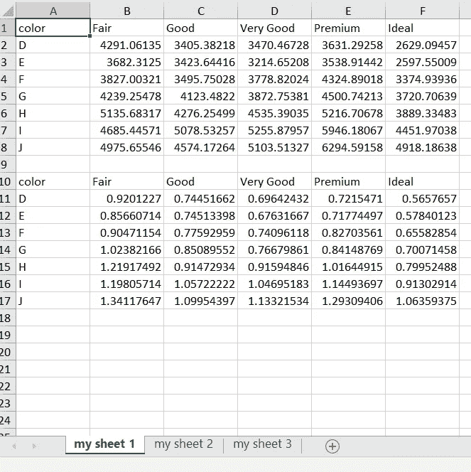
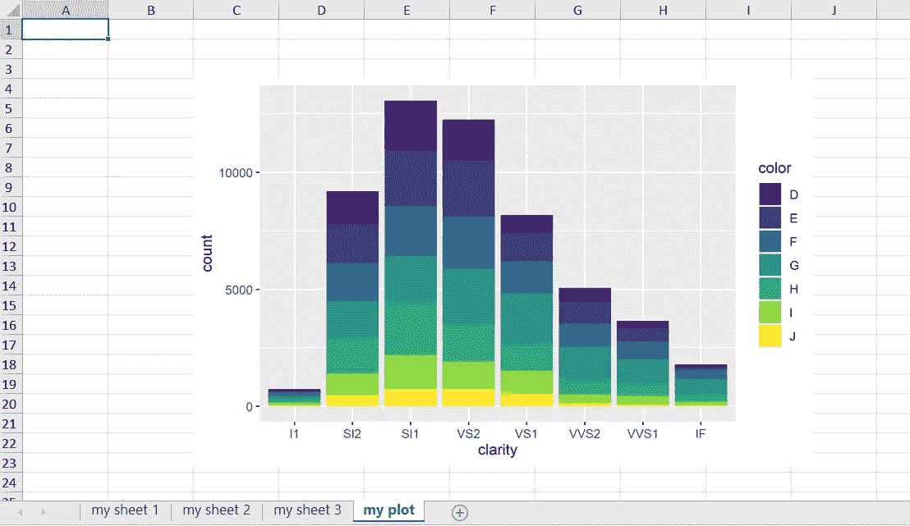

# 使用 R 服务 Excel 电子表格:数据透视表生成、多工作表创建和图形插入

> 原文：<https://medium.com/geekculture/employing-r-to-serve-excel-spreadsheet-pivot-table-generation-multiple-worksheets-creation-and-6a01751dd767?source=collection_archive---------12----------------------->


r 用户仍在使用 Excel，尤其是在与只依赖 Excel 的人一起工作时。在许多组织中，将 R 生成的分析结果共享到 Excel 是一项常见的任务。因此，非常需要在 R 和 Excel 之间建立一个方便、通用的通道。下面是如何建立这样一个通道。

尽管 R 允许将结果导出为 Excel 可以打开的 csv 格式，但仍然存在几个主要挑战。首先，您只能在 csv 文件中插入一张工作表，不能更多。第二，所有非标准字符(例如中文或日文)都不能正确显示，因为 csv 文件不能处理 Unicode/UTF-8。第三，图形不能导出为 csv 文件。

一些 R 包允许导出到 Excel 文件，但是它们需要安装 Java，这造成了额外的障碍。我亲眼目睹有人在他的系统上安装 Java 失败，结果他不得不更换电脑。

感谢 openxlsx 的开发者，对于在 R 和 Excel 之间工作的人来说，上面提到的三个挑战现在都没有了。Java 也不需要。下面我使用 ggplot2 包中提供的著名的免费钻石数据来说明我在标题中承诺的内容:数据透视表生成、多个工作表创建和图形插入。

对于那些不熟悉钻石数据的人来说:该数据集存储了超过 5 万颗钻石的信息，包括三个分类变量格式的特征，切割、净度和颜色，以及两个数字部分，克拉和价格。

我们可以选择任意两个分类特征，比如切割和净度，来创建一个数据透视表，显示切割和净度组合下的平均价格或宝石大小。这项工作是不容易的 Excel 作为 VBA 是必需的。但是在 R 中，借助管道操作(%>%)分两行完成。

```
**require**(ggplot2)
**require**(dplyr)
diamonds %>% group_by(cut,color) %>% summarize(mean.value=mean(price)) %>% spread(cut,mean.value)
```

对于所选的汇总统计数据，均值函数可以替换为其他函数，即中值函数、总和函数、计数函数和标准差函数。

以下是截色平均价格的结果。我们创建了一个漂亮的表格，总结了每种切割和颜色组合的平均价格。我想将这样的表格导出为电子表格。

```
## # A tibble: 7 x 6
##   color  Fair  Good `Very Good` Premium Ideal
##   <ord> <dbl> <dbl>       <dbl>   <dbl> <dbl>
## 1 D     4291\. 3405\.       3470\.   3631\. 2629.
## 2 E     3682\. 3424\.       3215\.   3539\. 2598.
## 3 F     3827\. 3496\.       3779\.   4325\. 3375.
## 4 G     4239\. 4123\.       3873\.   4501\. 3721.
## 5 H     5136\. 4276\.       4535\.   5217\. 3889.
## 6 I     4685\. 5079\.       5256\.   5946\. 4452.
## 7 J     4976\. 4574\.       5104\.   6295\. 4918.
```

要导出结果，您必须先保存结果。你需要把它赋给一个数据帧；称之为表 1。

```
table1= diamonds %>% group_by(cut,color) %>% summarize(mean.value=mean(price)) %>% spread(cut,mean.value)
```

要创建更多类似上面的表格，我们可以使用不同的菱形功能重复该命令。

```
table2= diamonds %>% group_by(clarity,cut) %>% summarize(mean.value=mean(carat)) %>% spread(clarity,mean.value)
```

但是考虑到表创建的重复性，让我们编写一个函数来完成这项工作；称之为 excel.func。

```
excel.func=function(x,y,z){
diamonds %>% group_by({{x}},{{y}}) %>% summarize(mean.value=mean({{z}})) %>% spread({{x}},mean.value)
}
```

请注意，要引用函数参数，应该使用{{x}}。我可能会在以后的另一篇文章中解释这一点。

现在，我们应用 excel.func 函数为不同的切割、颜色和净度组合创建三个不同的表格，其中包含价格或克拉的平均值。

```
table1=excel.func(cut,color,price)
table2=excel.func(clarity,cut,carat)
table3=excel.func(color,clarity,price)
```

接下来，我们使用 openxlsx 包将它们导出到电子表格中。

第一个常见的场景是创建一个新的电子表格文件，将每个表写入一个单独的表中。步骤如下。

使用 createWorkbook 在 R 中创建一个 Workbook 对象，命名为 *diamond.wb* ，并使用 addWorksheet 向其添加三个工作表。这三个表分别叫做我的表 1 到表 3(你想怎么叫都行)。

```
**require**(openxlsx)
diamond.wb <- createWorkbook()
addWorksheet(diamond.wb,"my sheet 1")
addWorksheet(diamond.wb,"my sheet 2")
addWorksheet(diamond.wb,"my sheet 3")
```

下一步是使用 writeData 将 data.frames(表 1 到表 3)分别挂钩到 *diamond.wb、*中的三个表。

```
writeData(diamond.wb,"my sheet 1",table1)
writeData(diamond.wb,"my sheet 2",table2)
writeData(diamond.wb,"my sheet 3",table3)
```

使用 sapply 可以简化上述重复性工作。那将是一个不同的话题。

这三个表现在被保存到 r 中的工作簿 *diamond.wb* 中。最后一步很简单:将 *diamond.wb* 导出到您计算机上的 Excel 文件中(为了快速验证，我将其放在了 F 驱动器下)。

```
saveWorkbook(diamond.wb, file = "F:/diamonds_summary.xlsx", overwrite = TRUE)
```

结果如下:


另一种常见的情况是向现有的电子表格中添加新的表格，而不进行覆盖。

让我们创建另一个切割色平均克拉表，将其命名为 table4，并将其保存到“我的工作表 1 ”,其中我们已经存储了表 1 的切割色平均价格信息。

```
table4=excel.func(cut,color,carat)
writeData(diamond.wb,"my sheet 1",table4,startCol = 1,startRow =11)
```

请注意，在 writeData 函数中，我将 table4 的位置指定在工作表 1 的第 11 行第 1 列，因此它不会覆盖那里的现有信息。

最后一步是保存到同一个电子表格文件。但是在继续之前，请确保您已经关闭了打开以供查看的 Excel 文件。否则，保存将不起作用，也不会有错误消息提醒您。当然，您可以通过更改下面的 file 参数，将所有四个表格保存到一个新的 Excel 文件中。

```
saveWorkbook(diamond.wb, file = "F:/diamonds_summary.xlsx", overwrite = TRUE)
```

结果如下:



openxlsx 包还允许您将 R 中创建的图(例如，由 ggplot2 创建的图)导出到电子表格中。如下图所示，我使用 inserPlot 来完成这项工作。请注意，inserPlot 将仅插入 R 中显示的最新绘图(可通过 print 函数加载)。

```
addWorksheet(diamond.wb,"my plot")plot1=ggplot(diamonds)+geom_bar(aes(x=clarity,fill=color))
print(plot1)insertPlot(diamond.wb,"my plot",startCol = 3,startRow =4, width = 16, height = 10, fileType = "png", units = "cm")saveWorkbook(diamond.wb, file = "F:/diamonds_summary.xlsx", overwrite = TRUE)
```

结果如下:



您可以通过查看 addWorkshee 和 writeData 的帮助来获得关于此包的更多帮助，以自定义您的 R->excel 操作。

感谢阅读。

*本文是我的第一篇帖子。我正在分享我的商业分析学生遇到的一些常见问题的解决方案。我希望你也会发现它们是有帮助的。*

领英:[https://www.linkedin.com/in/martin-qiu-46a583b/](https://www.linkedin.com/in/martin-qiu-46a583b/)