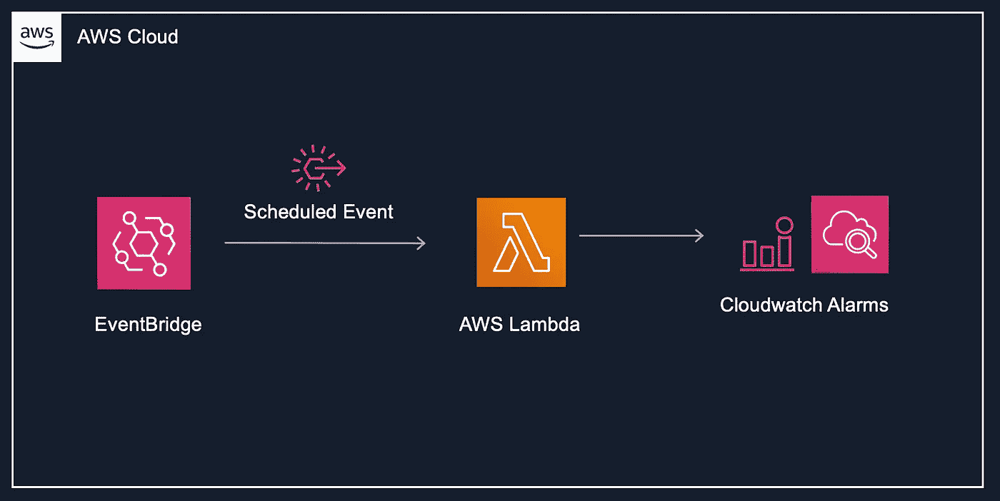

# 以给定的时间间隔启用或禁用 AWS 警报

> 原文：<https://medium.com/geekculture/enable-or-disable-aws-alarms-at-given-intervals-d2f867aa9aa4?source=collection_archive---------8----------------------->

您是否遇到过需要同时启用或禁用多个 AWS CloudWatch 警报的情况？这可能是在计划的维护窗口期间或者在重构某些组件时发生的。

在本指南中，让我们讨论如何使用 Events Bridge 和 Lambda 函数来安排 AWS 警报的启用或禁用。