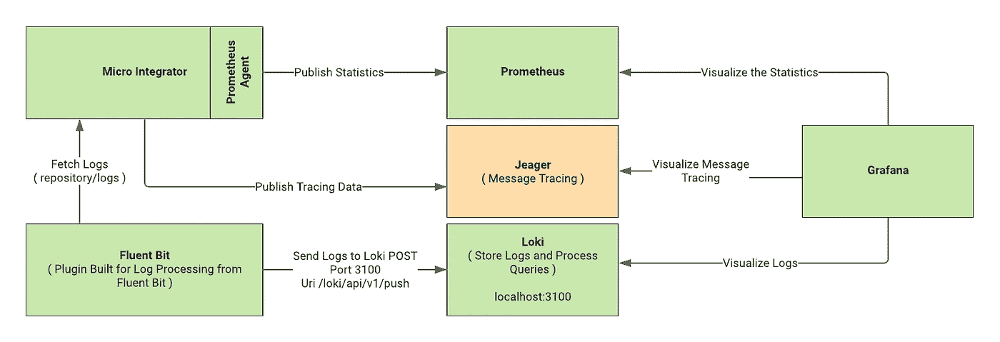
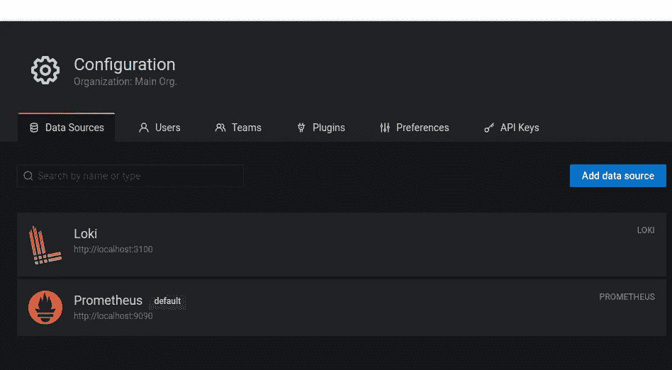
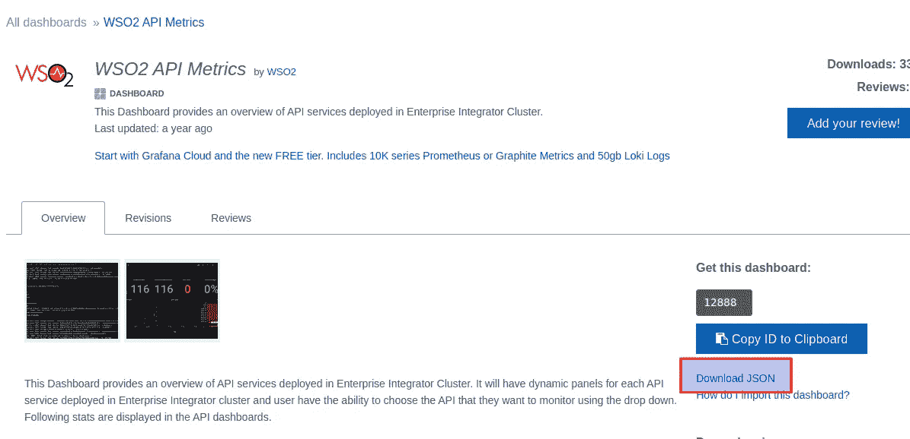
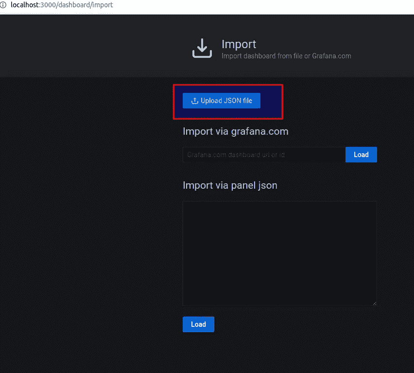
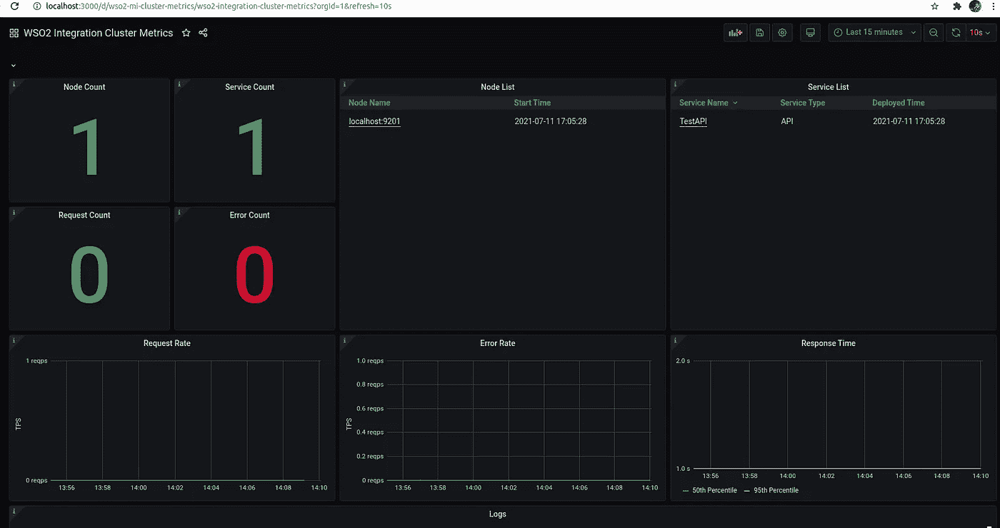
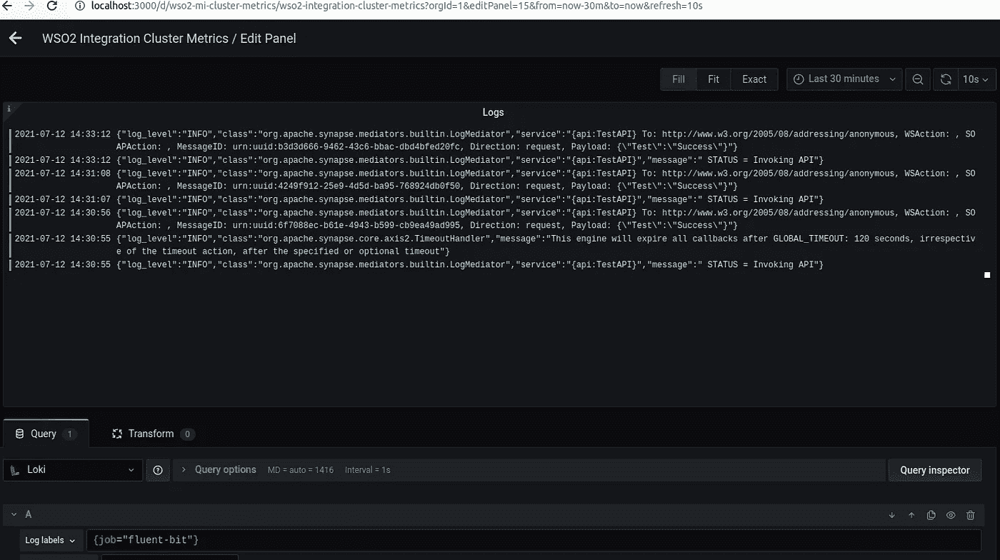

# 日志和服务器指标监控- WSO2 Micro Integrator 7.1.0

> 原文：<https://medium.com/geekculture/enabling-log-and-server-metrics-monitoring-to-wso2-micro-integrator-7-1-0-8f71bd9a55e0?source=collection_archive---------9----------------------->

监控是部署的一个重要部分，它使支持和开发团队能够在运行时轻松地找到 bug 或问题。一个高效的日志记录和监控系统不仅应该支持发现问题，还必须不影响系统的性能。

WSO2 早些时候针对此用例推出了 WSO2 EI Analytics，存在的问题是日志监控，尽管我们有监控 API 请求计数、代理服务请求计数等的工具。但是我们没有能力进行日志消息监控和跟踪。尽管围绕 EI Analytics 实现了一些插件，但是它们对 WSO2 微集成器有一些性能影响。

由于这些原因，推荐的处理方法是使用 Prometheus、Fluent Bit、Loki、Jaeger 和 Grafana 的组合。这些使用情形分别描述如下:

**普罗米修斯:**这是用于服务器指标监控的

**Fluent Bit:** 代理监听 wso2 日志并将它们发布到 Loki。

**Loki:** 存储日志，并在 Grafana 需要时进行处理。

**Jaeger:** 用于启用消息追踪。有助于跟踪中介之间的微集成器流中的消息。

Grafana: 连接洛基，普罗米修斯和耶格，并在可视化模式下显示统计数据。

***注意:在本文中我们不打算整合 Jaeger 将在我的下一篇博客中考虑这个概念。此外，设置是在 Ubuntu 20.04.2 LTS 上完成的，只需要最少的设置配置。***

下图突出显示了我们将要设置的内容以及它们之间的相互联系。

## 1.设置普罗米修斯

去 https://prometheus.io/download/[下载普罗米修斯版本。在这里我下载了 prometheus-2.28.1.linux-amd64。](https://prometheus.io/download/)

打开 prometheus.yml 并更新以下内容:

这里:**localhost:9090**—Prometheus 运行主机， **localhost:9201** 是微集成器主机和端口。

执行以下命令启动 Prometheus 服务器。

。/普罗米修斯

## 2.设置洛基

一旦完成，我们需要设置配置文件。创建一个名为 loki-local-config.yaml 的文件，并插入以下内容。

要启动 Loki 服务器，请执行以下操作:

成功启动后，您可以看到如下日志:

## 3.设置流畅位

有两个选项来设置它。

*   我们可以使用链接[https://docs.fluentbit.io/manual/installation/linux/ubuntu](https://docs.fluentbit.io/manual/installation/linux/ubuntu)为 Ubuntu 安装一个包，这将是 td-agent-bit，所以命令可以不同。
*   对于我这里的用例，我使用的是来自 https://fluentbit.io/releases/1.7/fluent-bit-1.7.4.tar.gz[的源代码分发版](https://fluentbit.io/releases/1.7/fluent-bit-1.7.4.tar.gz)，推荐它基于链接[https://docs . fluent bit . io/manual/installation/sources/download-Source-Code](https://docs.fluentbit.io/manual/installation/sources/download-source-code)获取源代码
*   注意，如果您使用 sudo snap install fluent-bit，那么在执行配置文件时可能会遇到权限问题，就像我遇到的那样。请记下这个。

解压缩后，转到主目录并执行以下命令。一些依赖关系也需要如下。

## 4.设置 Grafana

前往[https://grafana.com/grafana/download/7.1.1](https://grafana.com/grafana/download/7.1.1)下载产品。

把它提取到一个地方。

转到 bin 目录，使用。/grafana-server。成功启动后，您可以看到如下日志:

## 5.设置数据源和仪表板以进行可视化

转到 [http://localhost:3000/](http://localhost:3000/)

现在我们需要设置数据源，我们的主要来源是洛基和普罗米修斯。

转到配置->数据源并配置 Loki 和 Prometheus。

现在我们完成了数据源，我们需要上传 WSO2 仪表板。

转到[https://grafana.com/orgs/wso2/dashboards](https://grafana.com/orgs/wso2/dashboards)，这里我只加载高亮显示的三个。

选择具体的 JSON 文件后下载。

像 wise 一样下载其他的。

现在转到 Grafana 并加载 JSON 文件。

上面是其中一个控制面板，您可以看到日志部分仍然是空的。

还要注意，我们需要如下启动微集成器来体验上面的仪表板。

将以下内容添加到 deployment.toml

sh 微积分器. sh -DenablePrometheusApi=true

## 6.启用日志监控

要启用日志监控，需要将日志数据发送到 Loki，因此 Fluent Bit 客户端将完成这一部分。

要为 Loki 设置 Fluent Bit 客户端，我们首先需要构建插件。去…

[https://github.com/grafana/loki.git](https://github.com/grafana/loki.git)并克隆存储库。这里我用的是 v1.6.1，如果你用的是最新版本，文件夹结构可能会不匹配，因为它已经在最新版本中更新了。

转到 loki 主文件夹并执行:

制作流畅位插件

生成的插件将命名为 out_loki.so。

现在我们需要创建一个配置文件来提取日志，并使用 Fluent Bit 将其推送到 Loki。

创建一个名为 parsers.conf 的文件

*注意:这里 Time_Offset 很重要，否则将数据从 API 发布到 Loki 时会出错。*

创建名为 fluent-bit.conf 的文件

现在，从我们在**设置 Fluent Bit** 步骤构建 Fluent Bit 的位置，使用下面的命令运行 Fluent Bit 代理。

成功启动后:

## 7.验证日志监控

发送 API 请求并查看仪表板日志部分。

在 Loki 中，您可以看到如下日志:

在仪表板中:

## 8.参考

[1][https://ei . docs . WSO 2 . com/en/latest/micro-integrator/setup/observability/setting-up-minimum-basic-observability-deployment/# setting-up-Prometheus](https://ei.docs.wso2.com/en/latest/micro-integrator/setup/observability/setting-up-minimum-basic-observability-deployment/#setting-up-prometheus)

[2][https://ei . docs . WSO 2 . com/en/latest/micro-integrator/administer-and-observe/cloud-native-observability-dashboards/](https://ei.docs.wso2.com/en/latest/micro-integrator/administer-and-observe/cloud-native-observability-dashboards/)