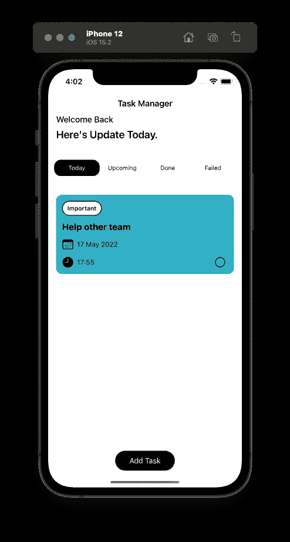
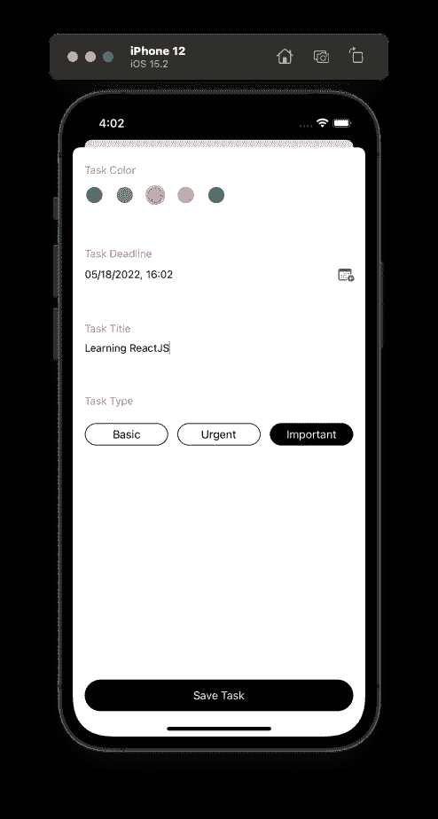

# 在您的 iOS 应用程序中封装框架实现

> 原文：<https://medium.com/geekculture/encapsulate-framework-implementation-in-your-ios-application-74f73c5156a0?source=collection_archive---------7----------------------->

对您的特性隐藏任何框架实现。


Photo by [Dollar Gill](https://unsplash.com/es/@dollargill?utm_source=medium&utm_medium=referral) on [Unsplash](https://unsplash.com?utm_source=medium&utm_medium=referral)

## 概观

当我们构建一个应用程序时，有时我们需要使用框架或库来帮助我们开发特性。这是一个有效的方法，因为我们没有太多的时间自己写所有的代码。例如，当我们的应用程序需要离线功能时，我们可以使用许多框架选项，如核心数据、领域、NSCache 等。或者您可能需要使用 StoreKit 来实现应用内购买。也许你还需要在社区中使用开源库，比如构建 UI 的 Texture。

事实上，我们紧密依赖于任何框架。但问题是，我们如何使我们的应用程序中的特性与任何框架实现解耦？也许目前你在你的应用程序中离线使用 Realm，但是你的团队决定在将来使用核心数据，或者也许你想在你的应用程序中实现单元测试，但是你不知道如何测试一个实现 StoreKit、Vision 或其他功能的特性。

让你的应用与任何框架实现分离有很多好处。您可以在不破坏功能实现的情况下切换框架，使您的应用程序能够容忍变化，而不需要付出巨大的努力，并且可能使您的应用程序可测试，这样您就可以加快功能开发迭代。你的产品经理会非常高兴的:】。

因此，在本文中，我将尝试向您展示如何封装框架实现，并使其与您的功能分离。我有一个简单的应用程序，用户可以管理他们的日常任务。它使用核心数据来持久化数据，通过这个设计系统，您可以在将来更改本地存储框架的实现。

## 示例项目

看看这个项目存储库，并随意克隆它。

[](https://github.com/tifoaudii/TaskManager) [## GitHub - tifoaudii/TaskManager:一款 iOS 应用，可以用来管理日常任务

### 此时您不能执行该操作。您已使用另一个标签页或窗口登录。您已在另一个选项卡中注销，或者…

github.com](https://github.com/tifoaudii/TaskManager) 

这是一个简单的应用程序，允许我们创建一个有截止日期的任务。您可以在截止日期之前完成任务，并且可以根据选项卡菜单筛选显示的任务。每当您创建一个任务时，它将通过使用后台核心数据来保存。

为了便于解释，假设我们在这个应用程序中有两个功能，分别是**任务列表**和**添加任务**。这两个特性都有表示层来管理表示逻辑。表示层需要从数据基础设施层获取任务数据。因为在这个使用核心数据作为数据源的应用程序中，这是基础架构层的代码:

这只是简单的自定义核心数据设置，您可以通过配置 isMemory 中的值来定义存储类型。如果 isMemory 的值为 false，则使用默认类型的存储，即在后台使用 SQLite，否则使用 NSInMemoryStoreType 进行单元测试。

这是核心数据端的任务实体，即 NSManagedObject。它由我们已经定义的任务的属性组成。

此时，我们的核心数据基础设施已经可以使用了。但是我们也需要考虑，如果我们在应用程序端使用这个实体，它肯定是紧耦合的。
想象一下，如果您将这个实体直接用于您的应用程序，而在未来您的团队决定使用 Realm 来更改数据层基础架构，那么迁移将会非常困难。因为可能在 Realm 或者任何其他框架中，他们也有某种基类来创建实体，比如核心数据中的 NSManagedObject。

解决这个问题的简单方法是，我们可以创建一个新的模型，作为接口模型存在于应用程序端。所以任何框架中的具体实体都可以转换成这个模型。

使用这种方法，我们的应用程序不需要知道具体的实体实现。它具有不关心幕后发生什么的灵活性。让我们使任务实体符合 TaskModelConvertible 协议。

那很简单但是很优雅，对吧？:]

然后我们可以移动到表示层。这两种功能的演示者都需要与核心数据基础设施对话，与数据进行交互，对吗？为了使表示器与核心数据基础设施分离，您需要使用协议作为它们之间的契约来定义抽象。

合同完成了。您的演示者只需要与具有这些功能的核心数据基础架构进行交互。然后我们可以在 presenter 实现中实现依赖注入:

此时，您的演示者已准备好接受观众的观点。但是我们还没有具体的实现，对吗？那么我们如何初始化这个演示者呢？

别担心，我们已经有了核心数据基础架构，对吗？我们可以从核心数据基础设施创建一个扩展，并使其符合 TaskViewDataStore 协议。

```
**Pro tips:** If your app is modular, this extension should live on the composition root module, commonly in Main application module.
```

万岁，我们有了 TaskViewDataStore 协议的具体实现，最后我们可以将我们的对象组合在一起:】。

厉害！，也许只是简单的 app，但我们像专业的软件工程师一样创建:】。如果你的老板要求你改变框架实现，你不必再担心，你的特性仍然是好的。

使用这种设计系统，也很容易实现单元测试。可以为 TaskViewDataStore 协议创建一个 spy 对象。

最后，您可以像这样将间谍注入到您的测试用例中:

最终完成了，尽管我还没有在项目中创建所有的单元测试:】。

## 结论

如今，作为一名软件工程师，我们经常需要框架来帮助我们的工作。知道如何创建一个设计系统，让你的应用从框架实现中松耦合是很重要的。这篇文章中有许多高级主题，如果您感到困惑，请不要担心，继续练习。从依赖注入和依赖倒置原则这样的基础开始。这将极大地帮助您构建一个可扩展的系统。我也有一篇关于我们如何编写单元测试来测试核心数据[的文章。感谢您阅读本文，如果您有任何反馈或问题，请告诉我。另文再见！](/swlh/implement-unit-testing-for-core-data-in-ios-2b914767f7e3)