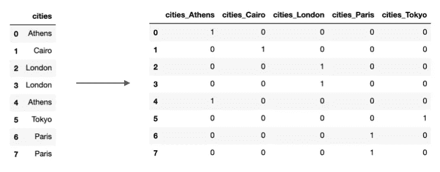
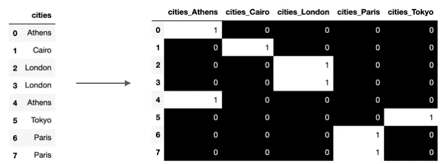
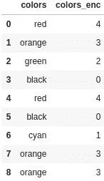
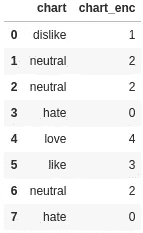
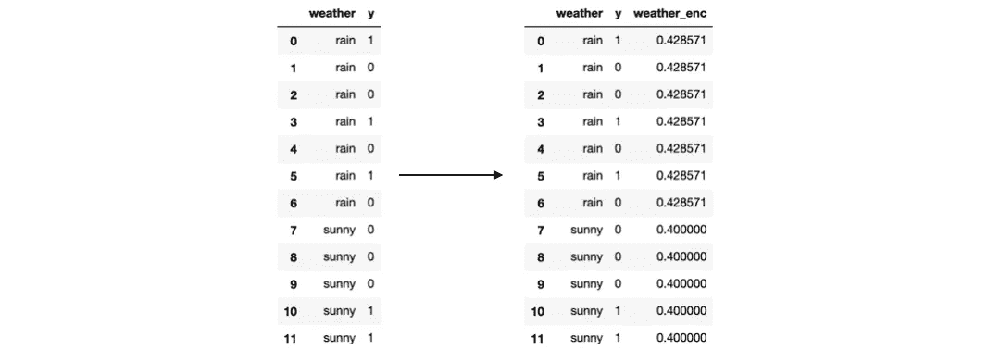
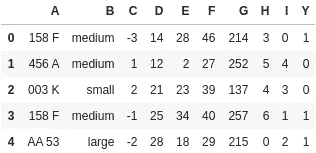
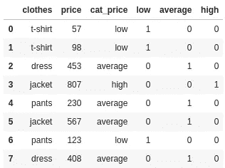

# 编码分类变量

> 原文：<https://medium.com/geekculture/encoding-categorical-variables-bae06a354cad?source=collection_archive---------23----------------------->

## 我们应该对他们做些什么？


Photo by [krakenimages](https://unsplash.com/@krakenimages?utm_source=medium&utm_medium=referral) on [Unsplash](https://unsplash.com?utm_source=medium&utm_medium=referral)

等等什么？😱什么叫机器学习算法不理解分类变量？他们不是应该很聪明吗？

我不想成为情绪杀手，但是…他们不想。所以，静观其变，让我们找出如何让这个问题消失，并尽可能利用这些分类变量。

**目录**

*   [简介](#58c9)
*   [一热编码](#88c2)
*   [标签编码](#71ae)
*   [目标编码](#fecf)
*   [实体嵌入](#2977)
*   [相似性编码](#1fc8)
*   [奖金](#6597)

## 介绍

最常见的情况是数据集包含分类变量。一组离散的项目，如职业或成分名称。然而，大多数机器学习算法不接受这样的值作为输入(例外:CatBoost & LightGBM)，而只接受数字值。这就是编码介入的地方。

不管编码方法如何，它们都旨在用固定长度的向量替换分类变量的实例。在进入下一节之前，重要的是要知道有两种类型的分类变量:

1.  名义→雅典、开罗、巴黎、东京、新德里等
2.  序数→高中文凭、理学学士、理学硕士、哲学博士

它们之间的区别在于，第一种没有特定的顺序/方向，而另一种有。

## 一个热编码

这种方法将分类值编码成二进制向量；1 表示存在，0 表示不存在。下面是一个前后示例:



从上面可以看出，每个城市都是生成的矢量中的一个要素。但是你看到什么奇怪的东西了吗？也许如果我加入一些颜色，它会变得明显…



太黑了，对吧？从机器学习的角度来看，出于各种原因，这不是对我们的分类变量进行编码的最佳方式:

1.  它增加了不必要的维度。随着类别数量的增加，这种方法就失效了。
2.  信息丢失。任何两个向量的点积都为零。例如，如果我们使用预先训练的 word2vec，那么像伦敦和巴黎这样的城市将比伦敦和东京更近。
3.  它引入了多重共线性。这意味着自变量之间存在依赖关系。事实是，我们可以通过使用其余的变量来轻松预测上述任何一个变量。当我们谈论假设不存在多重共线性的线性或逻辑回归时，这是个坏消息。

一般来说，一个热编码不是编码变量的最佳方法，但也不是最差的。如果你有少量的类别，那应该没问题，如果你担心多重共线性存在，那么你可以在这个[博客](https://www.analyticsvidhya.com/blog/2020/03/one-hot-encoding-vs-label-encoding-using-scikit-learn/)上了解如何避免多重共线性。

## 标签编码

也称为序号编码，这种编码类型为每个值分配一个整数。



如您所见，我们通过按字母顺序给每个值分配一个整数来编码列颜色。然而，这毫无意义。为什么`black`应该是 0 而`red`应该是 4？这将被算法误解为颜色具有某种层次/顺序，但事实并非如此。因此，如果值没有特定的顺序，必须避免标签编码。有各种可供选择的方法；一个热编码，目标编码。然而，如果你有像`hate, dislike, neutral, like, love`这样的价值观，你可以做以下事情:

```
import category_encoders as ce
import pandas as pddf = pd.DataFrame({'chart': ['dislike', 
                             'neutral', 
                             'neutral', 
                             'hate', 
                             'love', 
                             'like', 
                             'neutral', 
                             'hate']})encoder= ce.OrdinalEncoder(cols=['chart'],
                           return_df=True,
                           mapping=[{'col':'chart',
                                     'mapping':{'hate':0,
                                                'dislike':1,
                                                'neutral':2,
                                                'like':3,
                                                'love':4}}])
df['chart_enc']=encoder.fit_transform(df)
```



尽管标签编码看起来很简单，但顺序并不总是那么明显，用户必须非常小心。

## 目标编码

无可否认，这是对你的分类变量进行编码的最强有力的方法之一——许多 Kagglers 都采用这种方法。这个想法很简单；假设您有一个分类变量`weather`和一个目标变量`y`，它可以是连续的，也可以是二元的。目标编码将用`y`中相应值的平均值替换每个天气类别。

```
import pandas as pd
df = pd.DataFrame({
    'weather': ['rain'] * 7 + ['sunny'] * 5,
    'y': [1, 0, 0, 1, 0, 1, 0, 0, 0, 0, 1, 1]
})weather_means **=** df**.**groupby('weather')['y']**.**mean()
df['weather_enc'] **=** df['weather']**.**map(weather_means)
```



这种转换产生单一特征；不会增加数据集的维度。此外，最终表示保留了原始分类变量的大部分预测能力。

这种技术的主要问题是过度拟合。想一分钟。我们用目标的平均值代替了分类值。如果我们只有 3 个这样的值，或者 2 个，甚至 1 个！当数据集中出现的值的数量非常少时，过度拟合的可能性非常高。

补救的一个方法是使用交叉验证并计算每个折叠外数据集中的平均值。另一种更复杂的技术是*加法平滑*，它通过包含所有样本的平均值来“平滑”平均值。换句话说，如果一个分类值的观察值很少，那么我们更依赖于目标变量的全局平均值。你可以在这里看一下实现[。](https://maxhalford.github.io/blog/target-encoding/)

## 实体嵌入

有时，我们希望在对类别进行编码时，捕捉到类别背后的**含义**。在这种情况下，实体嵌入是必由之路。这里，映射由神经网络在标准的监督训练过程中学习。最后，我们在嵌入空间中映射彼此接近的相似值，这保持了原始分类值的内在性质。

在下面的例子中，我们将看到如何轻松地生成实体嵌入。假设我们有下面的数据集`df`。有 2 个分类变量和 7 个连续变量。目标是二进制。根据经验，输出嵌入的总维数由以下公式给出:`min(unique_values//2, 50)`



```
from sklearn.model_selection import train_test_split
from keras.layers import Dense, Dropout, Embedding, Input, Reshape, Concatenate
from keras.models import Modeltrain_cols = list(df.columns)
train_cols.remove('Y')X_train, X_val, y_train, y_val = train_test_split(df[train_cols], 
                                                  df['Y'],
                                                  test_size=0.2, 
                                                  random_state=42, 
                                                  stratify=df['Y'])# Add Categorical
categorical_variables = ['A', 'B']
continuous_variables = ['C', 'D', 'E', 'F', 'G', 'H', 'I']inp_layers = []
out_layers = []
for categorical in categorical_variables:
    num_uniq = df[categorical].nunique()
    out_dim = min(num_uniq//2, 50)
    x = Input((1,))
    inp_layers.append(x)
    x = Embedding(input_dim=num_uniq, 
                  output_dim=out_dim, 
                  input_length=1)(x)
    x = Reshape(target_shape=(out_dim,))(x)
    out_layers.append(x)# Add Numerical
cont_vars = Input((len(continuous_variables),))
inp_layers.append(cont_vars)
out_layers.append(cont_vars)x = Concatenate()(out_layers)
x = Dense(128, activation='relu')(x)
out = Dense(1, activation='sigmoid')(x)model = Model(inputs=inp_layers, outputs=out)model.compile(loss='binary_crossentropy',
              optimizer='adam',
              metrics=['accuracy'])es = EarlyStopping(monitor='val_loss', mode='min', patience=10)
model.fit(X_train, y_train, epochs=200, 
          validation_data=(X_val, y_val), 
          verbose=2, callbacks=[es])
```

这种方法有很多优点。当您有高基数特性时，建议使用这种方法，因为其他方法可能会过度适应。你还应该期待你的机器学习模型有更好的性能。最后，您可以根据相应的嵌入来测量分类值的距离。这意味着您可以将它们可视化，甚至将它们用于聚类目的。

## 相似嵌入

如果分类变量的值之间存在层次关系(*国家-州-城市*或*主要-高级-初级*)会怎样？然后我们可能想要使用 python 包 [dirty_cat](https://github.com/dirty-cat/dirty_cat) ，它以下面的方式计算字符串相似性:

1.  使用以下矢量器，将一系列项目(分类值)转换为一组嵌入向量空间的 3-gram:`vectorizer = CountVectorizer(analyzer='char', ngram_range=(3,3))`
    作者声称 3-gram 是高效近似匹配的好选择。
2.  测量每个类别( *K* )和每个样本( *N* )之间的相似度；通过使用 Dice 系数作为相似性度量来产生相似性矩阵 *NxK* 。例如，3-grams(Paris) = {Par，ari，ris}和 3-grams(Paris an)= { Par，ari，ris，isi，sia，ian}有三个 3-grams 的共同点，它们的相似性是 sim{3-grams(Paris，Paris an)} = 3/6。

## 奖金

仅仅因为给了你一个数据集和一个预测任务，并不意味着你**必须**使用所有的特性。因此，您也可以考虑删除分类变量。

另一个需要考虑的重要步骤是将连续变量转换为分类变量。是的，你没看错。虽然这听起来不正统，但它可能是完成这个谜题的最后一块。这种特征工程技术被称为*宁滨*，它是这样工作的:

1.  将这些值分成 N 个箱。可以通过生成直方图或者基于特定标准来选择容器范围。例如，如果我们有一个关于价格的变量，我们可以根据范围`10-200, 201-800, 801-1000`将它们归类为`low, average, high`
2.  使用一次性编码生成新要素。当然，我们可以使用我们认为更合适的任何其他类型的编码

```
import pandas as pddf=pd.DataFrame({'clothes': ['t-shirt', 't-shirt', 'dress',
                             'jacket', 'pants', 'jacket',
                             'pants', 'dress'],
                 'price': [57, 98, 453, 807, 230, 567, 123, 408]})cut_points = [0, 200, 800, 1000]
labels = ['low', 'average', 'high']
df["cat_price"] = pd.cut(df["price"], cut_points, labels=labels)
df = pd.concat([df, pd.get_dummies(df['cat_price'])], axis=1)
```



## 遗言…

还有许多其他编码分类变量的技术。我提到了我觉得有趣和相当受欢迎的几个。这些方法中的每一种都有自己的优点和缺点。没有一种方法被认为是最好的；这完全取决于您的数据集和任务。但是，有一些准则需要遵循:

*   如果一个变量有很多类别(高基数)，那么一次性编码就不合适了，因为它会给数据集带来稀疏性和维数
*   除非分类值遵循顺序，否则对标签编码说“不”
*   实体嵌入看起来不错，但并不总是开箱即用

我希望上面的文章对你有用😊